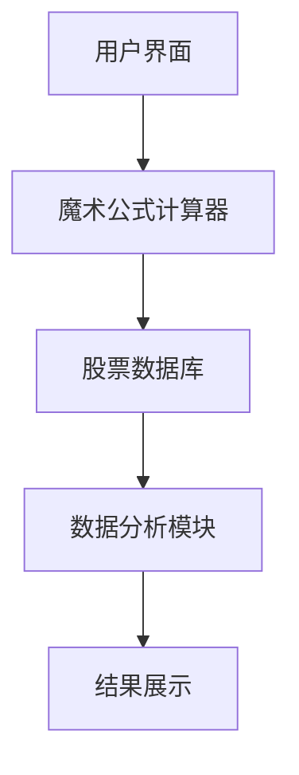

                 


# 乔尔·格林布拉特的魔术公式：简化版的价值投资策略

## 关键词
- 乔尔·格林布拉特
- 魔术公式
- 价值投资
- 股票筛选
- 安全边际

## 摘要
乔尔·格林布拉特的魔术公式是一种简化版的价值投资策略，帮助投资者快速识别被低估的好公司。本文将详细解析魔术公式的背景、原理、数学模型，并通过实际案例和代码实现，指导读者如何应用这一策略。内容涵盖系统设计、项目实战以及最佳实践，帮助投资者在复杂的市场中做出明智决策。

---

# 目录

## 第1章：价值投资的基本概念

### 1.1 价值投资的定义与核心理念
- 1.1.1 价值投资的起源与发展
- 1.1.2 价值投资的核心理念
- 1.1.3 价值投资与成长投资的区别

### 1.2 乔尔·格林布拉特及其投资哲学
- 1.2.1 乔尔·格林布拉特的背景介绍
- 1.2.2 乔尔的投资哲学与方法
- 1.2.3 乔尔的魔术公式的核心思想

## 第2章：魔术公式的基本原理

### 2.1 魔术公式的定义与公式
- 2.1.1 魔术公式的数学表达式
- 2.1.2 公式的组成部分
- 2.1.3 公式的计算步骤

### 2.2 魔术公式的四个关键指标
- 2.2.1 指标一：企业价值
- 2.2.2 指标二：营业收益
- 2.2.3 指标三：ROE（净资产收益率）
- 2.2.4 指标四：安全边际

## 第3章：魔术公式的数学模型与公式

### 3.1 企业价值的计算公式
$$ \text{企业价值} = \text{EV} = \text{EBIT} \times (8.5 + 债务成本) $$

### 3.2 营业收益与ROE的关系
- 3.2.1 营业收益的定义
- 3.2.2 ROE的计算公式
$$ \text{ROE} = \frac{\text{净利润}}{\text{股东权益}} $$

### 3.3 安全边际的计算公式
- 3.3.1 安全边际的定义
- 3.3.2 安全边际的计算公式
$$ \text{安全边际} = \text{内在价值} - \text{市场价格} $$

## 第4章：系统分析与架构设计方案

### 4.1 系统功能设计
- 4.1.1 魔术公式计算器的设计
- 4.1.2 股票筛选工具的设计
- 4.1.3 数据分析模块的设计

### 4.2 系统架构设计


### 4.3 系统接口设计
- 4.3.1 API接口的设计
- 4.3.2 数据输入与输出的接口

## 第5章：项目实战

### 5.1 环境安装
- 5.1.1 安装Python
- 5.1.2 安装必要的库（如pandas、numpy）

### 5.2 核心实现源代码
```python
def calculate_ev(EBIT, debt_cost):
    return EBIT * (8.5 + debt_cost)

def calculate_roe(net_profit, equity):
    return net_profit / equity

def magic_formula(screening_stock):
    EV = calculate_ev(screening_stock['EBIT'], screening_stock['debt_cost'])
    ROE = calculate_roe(screening_stock['net_profit'], screening_stock['equity'])
    return (EV + ROE) / 2
```

### 5.3 实际案例分析
- 5.3.1 案例一：XYZ公司的分析
- 5.3.2 案例二：ABC公司的分析
- 5.3.3 案例三：DEF公司的分析

## 第6章：最佳实践、小结、注意事项和拓展阅读

### 6.1 最佳实践
- 6.1.1 定期更新股票数据
- 6.1.2 结合市场环境调整策略
- 6.1.3 分散投资降低风险

### 6.2 小结
总结魔术公式的应用和价值投资的核心思想，强调长期持有的重要性。

### 6.3 注意事项
- 避免过度简化模型
- 考虑宏观经济因素
- 定期复盘和调整

### 6.4 拓展阅读
推荐相关书籍和资源，帮助读者深入学习价值投资。

---

通过以上目录，读者可以系统地学习乔尔·格林布拉特的魔术公式，从理论到实践，逐步掌握这一简化版的价值投资策略，从而在实际投资中做出明智决策。

