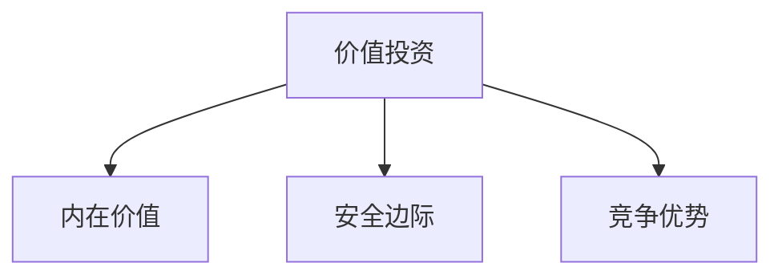
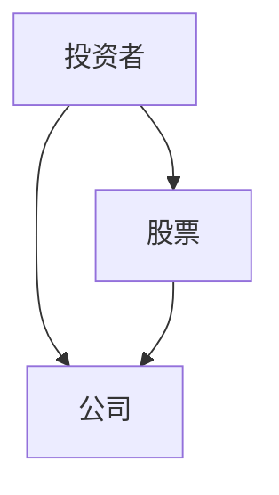
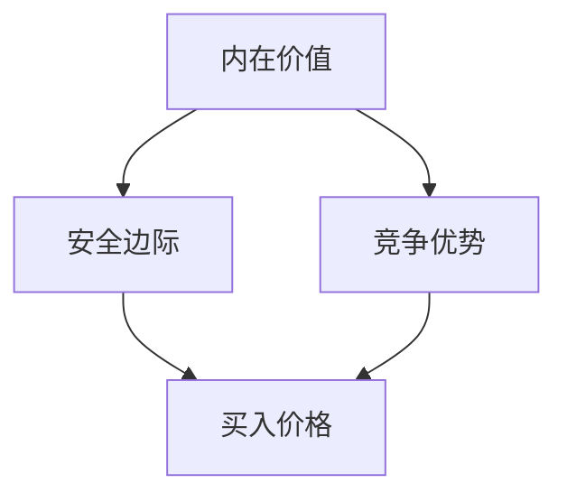
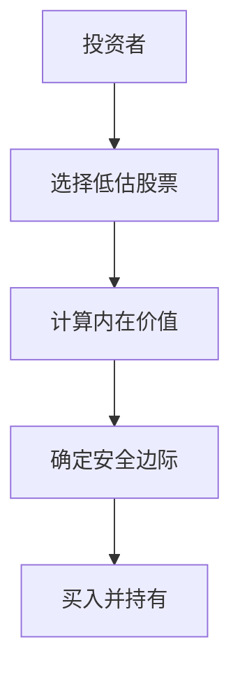
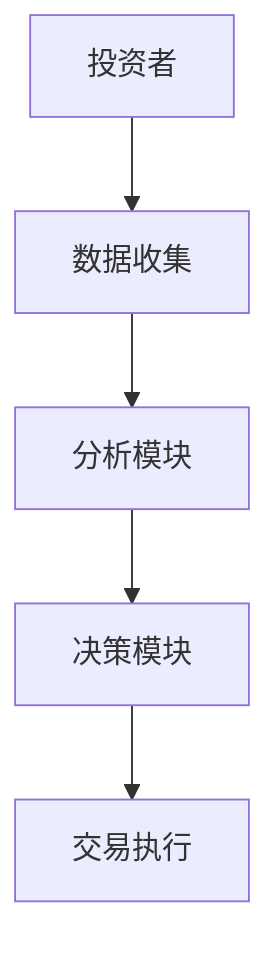
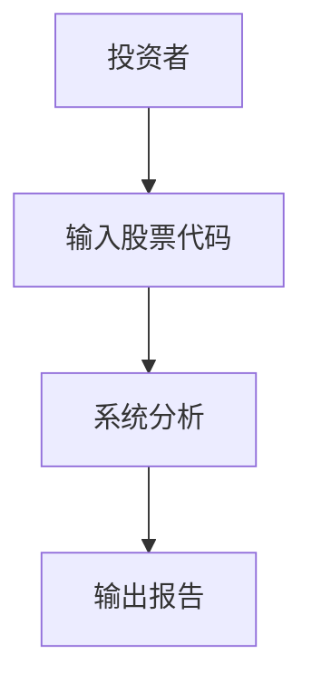

                 


# 《乔尔·格林布拉特的价值投资教育》

## 关键词：价值投资，乔尔·格林布拉特，投资策略，投资理念，投资分析

## 摘要：本文深入探讨了乔尔·格林布拉特的价值投资教育，从其背景、核心理念到实际应用，详细分析了价值投资的定义、原理、系统架构及实战案例，帮助读者全面理解并掌握价值投资的方法。

---

## 正文

### 第1章: 价值投资的背景与概述

#### 1.1 价值投资的定义与背景

##### 1.1.1 价值投资的起源与演变
价值投资是一种长期投资策略，起源于20世纪初，由本杰明·格雷厄姆和戴维·多德提出。它强调以低于内在价值的价格买入优质股票，长期持有，等待市场重新认识到其真实价值。格林布拉特继承并发展了这一理念，提出了"安全边际"的概念，即在价格远低于内在价值时买入，以降低风险并提高收益。

##### 1.1.2 价值投资的核心理念
价值投资的核心在于寻找市场低估的股票，这些股票通常具有强大的基本面、竞争优势和可持续的盈利能力。格林布拉特强调，投资者应关注企业的内在价值，而不是市场的短期波动。他提出了"三圈投资法"，即寻找价格低于内在价值、竞争优势明显且管理层质量高的公司。

##### 1.1.3 价值投资与其它投资策略的对比
与成长投资相比，价值投资更注重安全性和稳定性；与趋势投资相比，价值投资更注重基本面分析；与套利投资相比，价值投资更注重长期价值而非短期套利机会。

---

#### 1.2 乔尔·格林布拉特的生平与成就

##### 1.2.1 乔尔·格林布拉特的背景介绍
乔尔·格林布拉特（Joel Greenblatt）是美国著名投资家，出生于1958年，毕业于雪城大学。他在1986年创立了绿光资本（Greenlight Capital），并以其卓越的投资业绩闻名。他的投资理念和方法被广泛传播，尤其是其《股票投资的十一天课程》一书，深刻影响了无数投资者。

##### 1.2.2 乔尔·格林布拉特的投资理念
格林布拉特的投资理念基于以下几点：
1. **安全边际**：买入价格远低于内在价值的股票。
2. **竞争优势**：选择具有强大护城河的企业。
3. **管理层质量**：关注管理层的诚信和能力。

##### 1.2.3 乔尔·格林布拉特的成功案例
格林布拉特在绿光资本的领导下，取得了显著的超额回报。例如，他在1999年投资的亚马逊和谷歌等公司，这些公司在互联网泡沫期间被低估，后来却成为行业巨头。

---

#### 1.3 价值投资的哲学与实践

##### 1.3.1 价值投资的哲学基础
价值投资是一种逆向投资策略，强调在市场恐慌时寻找机会，在市场狂热时保持冷静。格林布拉特认为，市场先生（Mr. Market）是价值投资者的朋友，而不是敌人。

##### 1.3.2 价值投资的实践方法
格林布拉特的实践方法包括：
1. **基本面分析**：计算公司的内在价值。
2. **寻找安全边际**：确保买入价格远低于内在价值。
3. **分散投资**：避免过度集中，降低风险。

##### 1.3.3 价值投资的边界与外延
价值投资的边界在于市场的有效性和信息的透明度。在外延方面，格林布拉特将价值投资方法扩展到多个领域，如债券、房地产等。

---

### 第2章: 价值投资的核心概念与联系

#### 2.1 价值投资的原理

##### 2.1.1 价值投资的原理
价值投资的原理基于市场有效性的不足。市场并非总是理性定价，尤其是短期波动中，价格可能远低于或高于内在价值。格林布拉特利用这一点，寻找市场低估的股票。

##### 2.1.2 价值投资的核心要素
价值投资的核心要素包括：
1. **内在价值**：企业的未来现金流的现值。
2. **安全边际**：买入价格与内在价值的折扣。
3. **竞争优势**：企业的市场地位和护城河。

##### 2.1.3 价值投资的概念结构
价值投资的概念结构可以用以下层次图表示：



---

#### 2.2 核心概念的对比分析

##### 2.2.1 价值投资与成长投资的对比
| 属性 | 价值投资 | 成长投资 |
|------|-----------|----------|
| 核心目标 | 寻找低估股票 | 寻找高增长股票 |
| 风险承受 | 较低 | 较高 |
| 估值方法 | 基于内在价值 | 基于未来增长 |

##### 2.2.2 价值投资与趋势投资的对比
| 属性 | 价值投资 | 趋势投资 |
|------|-----------|----------|
| 核心目标 | 寻找低估股票 | 随趋势交易 |
| 风险承受 | 较低 | 较高 |
| 估值方法 | 基于基本面 | 基于技术分析 |

##### 2.2.3 价值投资与套利投资的对比
| 属性 | 价值投资 | 套利投资 |
|------|-----------|----------|
| 核心目标 | 寻找低估股票 | 利用价差套利 |
| 风险承受 | 较低 | 中高 |
| 估值方法 | 基于内在价值 | 基于市场价差 |

---

#### 2.3 实体关系图

##### 2.3.1 价值投资的ER实体关系图


##### 2.3.2 价值投资的核心要素关系图


##### 2.3.3 价值投资的流程关系图


---

### 第3章: 价值投资的系统分析与架构设计

#### 3.1 价值投资的系统架构

##### 3.1.1 价值投资的系统架构图


##### 3.1.2 价值投资的系统模块划分
- 数据收集模块：收集公司财务数据、行业信息等。
- 分析模块：计算内在价值、评估竞争优势。
- 决策模块：基于安全边际和竞争优势做出投资决策。
- 交易执行模块：下单购买或卖出股票。

##### 3.1.3 价值投资的系统功能设计
- 数据分析功能：计算公司内在价值。
- 决策支持功能：提供安全边际和竞争优势的评估结果。
- 交易执行功能：根据决策模块的建议执行交易。

---

#### 3.2 价值投资的系统接口设计

##### 3.2.1 价值投资的数据接口设计
- 输入接口：公司财务报表、市场数据。
- 输出接口：内在价值、安全边际、竞争优势评估结果。

##### 3.2.2 价值投资的交互接口设计
- 用户输入：股票代码、时间段。
- 系统输出：分析报告、投资建议。

##### 3.2.3 价值投资的系统调用接口设计
- 数据库接口：调用财务数据。
- 计算接口：调用内在价值计算模块。

---

#### 3.3 价值投资的交互设计

##### 3.3.1 价值投资的交互流程图


---

### 第4章: 价值投资的项目实战

#### 4.1 项目实战

##### 4.1.1 环境安装
- 安装Python、Pandas、NumPy等工具。
- 数据来源：Yahoo Finance API。

##### 4.1.2 核心代码实现
```python
import pandas as pd
import numpy as np

def calculate_intrinsic_value(financial_data):
    # 计算自由现金流
    free_cash_flow = financial_data['free_cash_flow']
    # 计算加权平均资本成本
    wacc = financial_data['wacc']
    # 计算内在价值
    intrinsic_value = free_cash_flow / (wacc - growth_rate)
    return intrinsic_value

# 示例数据
financial_data = {
    'free_cash_flow': 100,
    'wacc': 0.1,
    'growth_rate': 0.05
}

iv = calculate_intrinsic_value(financial_data)
print(f"内在价值: {iv}")
```

##### 4.1.3 代码应用解读
代码示例展示了如何计算公司的内在价值，包括自由现金流、加权平均资本成本和增长率的计算。投资者可以根据这些数据确定安全边际。

##### 4.1.4 实际案例分析
以亚马逊为例，计算其内在价值，确定其是否低于当前股价。如果低于，则建议买入。

---

### 第5章: 总结与展望

#### 5.1 总结
本文详细介绍了乔尔·格林布拉特的价值投资教育，从其背景、核心理念到实际应用，帮助读者全面理解并掌握价值投资的方法。

#### 5.2 展望
未来，价值投资将继续在投资领域发挥重要作用。随着技术的进步，投资者可以通过大数据和人工智能进一步优化价值投资策略。

---

### 最佳实践 tips

- **小结**：价值投资需要长期学习和实践，建议投资者从基础开始，逐步深入。
- **注意事项**：投资有风险，需谨慎评估自身风险承受能力。
- **拓展阅读**：推荐阅读《股票投资的十一天课程》和《投资最重要的事情》。

---

通过以上结构，读者可以系统地学习乔尔·格林布拉特的价值投资教育，从理论到实践，全面掌握这一投资策略。

