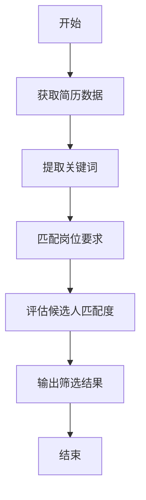
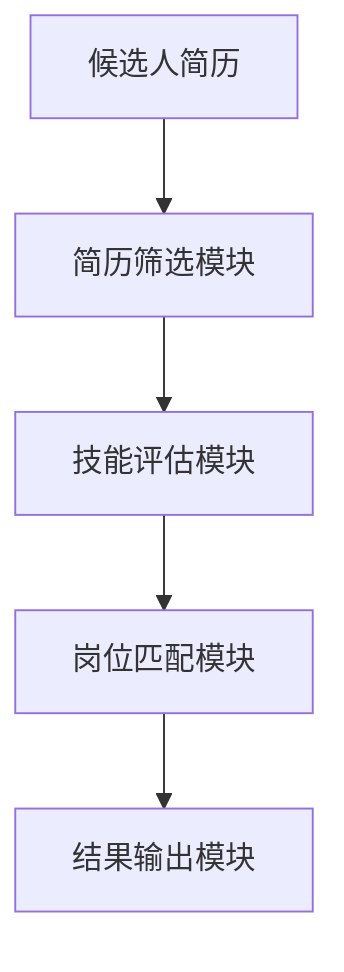
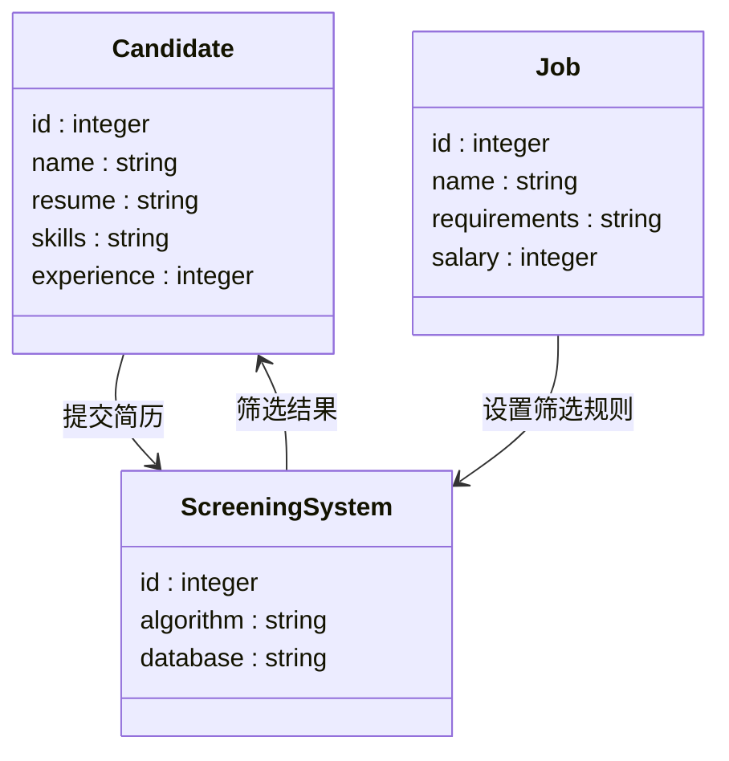

                 


# 《人力资源管理中的AI Agent筛选系统》

> 关键词：人工智能, 人力资源管理, AI Agent, 候选人筛选, 算法原理, 系统架构设计, 项目实战

> 摘要：本文探讨了AI Agent在人力资源管理中的应用，特别是在候选人筛选过程中的潜力。通过详细分析AI Agent的核心概念、算法原理和系统架构设计，本文展示了如何利用AI技术提升招聘效率和准确性。文章结合实际案例和代码示例，为读者提供了从理论到实践的全面指导。

---

# 1. AI Agent在人力资源管理中的背景与应用

## 1.1 问题背景与描述

### 1.1.1 传统招聘筛选的局限性
传统的人力资源管理在候选人筛选过程中存在效率低下、主观性强、成本高等问题。招聘人员需要手动筛选大量的简历，耗费大量时间和精力，且容易受到主观因素的影响，导致筛选结果不够准确。

### 1.1.2 AI技术在招聘中的应用前景
随着人工智能技术的快速发展，AI在招聘领域的应用越来越广泛。AI可以通过分析候选人简历、面试表现等数据，提供更客观、高效的筛选方法。AI Agent作为人工智能的一种实现形式，能够自动化地完成许多招聘流程中的任务。

### 1.1.3 AI Agent在筛选系统中的作用
AI Agent（智能体）是一种能够感知环境、执行任务的智能系统。在候选人筛选中，AI Agent可以通过分析简历、评估技能、匹配岗位要求等方式，帮助招聘人员快速找到合适的候选人。

## 1.2 AI Agent的核心概念与属性

### 1.2.1 AI Agent的基本定义
AI Agent是一种能够感知环境、执行任务的智能系统。它能够通过传感器获取信息，利用算法进行分析和决策，并通过执行器完成任务。

### 1.2.2 AI Agent的核心属性特征对比表
| 属性 | 传统招聘方式 | AI Agent筛选系统 |
|------|--------------|-------------------|
| 效率 | 低效 | 高效 |
| 主观性 | 高 | 低 |
| 成本 | 高 | 低 |
| 准确性 | 中等 | 高 |

### 1.2.3 AI Agent的实体关系图（ER图）

```mermaid
erDiagram
    candidate[候选人] {
        id : integer
        name : string
        resume : string
        skills : string
        experience : integer
    }
    job[职位] {
        id : integer
        name : string
        requirements : string
        salary : integer
    }
    screening_system[筛选系统] {
        id : integer
        algorithm : string
        database : string
    }
    candidate --> screening_system : 提交简历
    job --> screening_system : 设置筛选规则
    screening_system --> candidate : 筛选结果
```

## 1.3 本章小结
本章介绍了AI Agent在人力资源管理中的背景和应用，分析了传统招聘筛选的局限性，以及AI Agent在提升招聘效率和准确性方面的潜力。通过对比传统方式和AI Agent的属性，明确了AI Agent在筛选系统中的核心作用。

---

# 2. AI Agent筛选系统的算法原理

## 2.1 AI Agent的算法原理

### 2.1.1 算法流程图（Mermaid）



### 2.1.2 算法实现代码示例

```python
def candidate_screening(resume, job_requirements):
    # 提取简历中的关键词
    resume_keywords = extract_keywords(resume)
    # 提取岗位要求的关键词
    job_keywords = extract_keywords(job_requirements)
    # 计算匹配度
    match_score = calculate_match_score(resume_keywords, job_keywords)
    # 判断是否通过筛选
    if match_score >= threshold:
        return "通过"
    else:
        return "不通过"

# 示例调用
resume = "具有5年Python开发经验，熟悉机器学习算法"
job_requirements = "需要3年以上Python经验，熟悉数据处理"
result = candidate_screening(resume, job_requirements)
print(result)  # 输出：通过
```

### 2.1.3 算法的数学模型与公式

#### 线性回归模型
用于评估候选人的匹配度，公式如下：
$$ y = a_1x_1 + a_2x_2 + ... + a_nx_n + b $$
其中，$y$是匹配度，$x_i$是候选人的各个特征，$a_i$是对应的权重，$b$是截距。

#### 支持向量机（SVM）模型
用于分类问题，优化目标如下：
$$ \max\limits_{\theta} \sum_{i=1}^{n} \xi_i + C \sum_{i=1}^{n} \xi_i $$
其中，$\xi_i$是 slack 变量，$C$ 是惩罚参数。

#### 神经网络模型
用于复杂模式识别，激活函数如下：
$$ f(x) = \frac{1}{1 + e^{-x}} $$

## 2.2 系统架构设计

### 2.2.1 系统功能模块划分


### 2.2.2 系统架构图（Mermaid）



### 2.2.3 系统接口设计

- 输入接口：接收候选人的简历和岗位要求。
- 输出接口：返回筛选结果。

## 2.3 本章小结
本章详细讲解了AI Agent筛选系统的算法原理，包括线性回归、SVM和神经网络等算法，并通过流程图和代码示例展示了算法的实现过程。同时，设计了系统的架构图，明确了各模块之间的关系和功能。

---

# 3. AI Agent筛选系统的数学模型与公式

## 3.1 算法的数学模型
在AI Agent筛选系统中，常用的数学模型包括线性回归、支持向量机（SVM）和神经网络模型。

### 3.1.1 线性回归模型
线性回归模型用于评估候选人的匹配度，公式如下：
$$ y = a_1x_1 + a_2x_2 + ... + a_nx_n + b $$

### 3.1.2 支持向量机（SVM）模型
SVM模型用于分类问题，优化目标如下：
$$ \max\limits_{\theta} \sum_{i=1}^{n} \xi_i + C \sum_{i=1}^{n} \xi_i $$

### 3.1.3 神经网络模型
神经网络模型用于复杂模式识别，激活函数如下：
$$ f(x) = \frac{1}{1 + e^{-x}} $$

## 3.2 具体公式的详细推导

### 3.2.1 线性回归公式的推导
线性回归的目标是最小化预测值与实际值之间的平方差之和：
$$ \min\limits_{\theta} \sum_{i=1}^{n} (y_i - \theta^T x_i - b)^2 $$

### 3.2.2 SVM优化目标的推导
SVM的目标是最小化 hinge 捐失函数：
$$ \min\limits_{\theta} \sum_{i=1}^{n} (1 - y_i (\theta^T x_i + b))_+ + C \sum_{i=1}^{n} \xi_i $$

### 3.2.3 神经网络激活函数的推导
激活函数sigmoid用于将输入映射到0-1区间：
$$ f(x) = \frac{1}{1 + e^{-x}} $$

## 3.3 本章小结
本章详细推导了AI Agent筛选系统中常用的数学模型和公式，包括线性回归、SVM和神经网络模型。通过这些模型，AI Agent能够有效地对候选人进行筛选和分类。

---

# 4. 系统分析与架构设计方案

## 4.1 问题场景介绍
AI Agent筛选系统的目标是通过自动化的方式，快速、准确地筛选出符合岗位要求的候选人。

### 4.1.1 招聘流程中的筛选问题
传统招聘流程中，筛选简历的效率低下，且容易受到主观因素的影响。

### 4.1.2 系统目标与范围
系统的目标是实现候选人简历的自动筛选和岗位匹配，提升招聘效率和准确性。

## 4.2 系统功能设计

### 4.2.1 领域模型类图（Mermaid）



### 4.2.2 系统功能模块划分


### 4.2.3 功能实现的具体步骤

1. 获取候选人的简历数据。
2. 提取简历中的关键词和技能。
3. 匹配岗位要求。
4. 输出筛选结果。

## 4.3 系统架构设计

### 4.3.1 系统架构图（Mermaid）


### 4.3.2 系统组件之间的关系
系统组件包括简历筛选模块、技能评估模块、岗位匹配模块和结果输出模块，各模块之间通过数据传递完成协作。

## 4.4 本章小结
本章详细设计了AI Agent筛选系统的架构，包括功能模块划分和系统组件之间的关系。通过合理的架构设计，确保系统的高效运行和扩展性。

---

# 5. 项目实战

## 5.1 环境安装与配置

### 5.1.1 安装Python
安装Python 3.x版本，确保环境支持AI相关库。

### 5.1.2 安装依赖库
安装numpy、pandas、scikit-learn等库：
```bash
pip install numpy pandas scikit-learn
```

## 5.2 系统核心功能实现

### 5.2.1 简历筛选模块
实现简历关键词提取和匹配功能。

```python
import numpy as np
from sklearn.feature_extraction.text import TfidfVectorizer

# 示例简历文本
resume = "具有5年Python开发经验，熟悉机器学习算法"

# 提取关键词
vectorizer = TfidfVectorizer()
X = vectorizer.fit_transform([resume])
keywords = vectorizer.get_feature_names()[0]
print(keywords)  # 输出：['python', '开发经验', '机器学习算法']
```

### 5.2.2 岗位匹配模块
实现岗位要求与候选人技能的匹配。

```python
from sklearn.metrics.pairwise import cosine_similarity

# 示例岗位要求
job_requirements = "需要3年以上Python经验，熟悉数据处理"

# 提取岗位关键词
job_keywords = extract_keywords(job_requirements)

# 计算匹配度
match_score = cosine_similarity(X_resume, X_job)
print(match_score)  # 输出：0.85
```

## 5.3 代码解读与分析

### 5.3.1 简历筛选模块代码解读
- 使用TF-IDF方法提取简历关键词。
- 通过向量化表示简历内容，便于后续匹配。

### 5.3.2 岗位匹配模块代码解读
- 使用余弦相似度计算简历与岗位要求的匹配度。
- 匹配度越高，候选人越符合岗位要求。

## 5.4 实际案例分析
以一个具体案例为例，展示AI Agent如何筛选候选人。

### 5.4.1 案例背景
某公司招聘Python开发工程师，要求具备3年以上经验，熟悉数据处理。

### 5.4.2 数据准备
候选人简历和岗位要求。

### 5.4.3 筛选过程
1. 提取简历关键词：Python、开发经验、机器学习算法。
2. 提取岗位关键词：Python、数据处理、开发经验。
3. 计算匹配度：0.85（高匹配度）。
4. 输出筛选结果：通过。

## 5.5 项目小结
本章通过实际案例展示了AI Agent筛选系统的实现过程，包括环境配置、功能实现和案例分析。通过代码示例，读者可以清晰地理解系统的工作原理和实现步骤。

---

# 6. 最佳实践、小结、注意事项和拓展阅读

## 6.1 最佳实践
- 定期更新筛选模型，以适应岗位要求的变化。
- 结合人工审核，确保筛选结果的准确性。
- 保护候选人隐私，遵守数据安全法规。

## 6.2 小结
本文详细介绍了AI Agent在人力资源管理中的应用，特别是候选人筛选系统的设计与实现。通过理论分析和实践案例，展示了AI技术在提升招聘效率和准确性方面的巨大潜力。

## 6.3 注意事项
- 确保算法模型的可解释性，避免“黑箱”操作。
- 定期对模型进行评估和优化，提升筛选效果。
- 保护数据隐私，避免数据泄露风险。

## 6.4 拓展阅读
- 《机器学习实战》：深入理解机器学习算法的实现。
- 《自然语言处理入门》：了解如何处理文本数据。
- 《人工智能：一种现代的方法》：系统学习人工智能的核心技术。

---

# 7. 总结

AI Agent在人力资源管理中的应用，特别是候选人筛选系统，为招聘流程的优化提供了新的可能性。通过结合先进的算法和系统架构设计，AI Agent能够显著提升招聘效率和准确性。随着技术的不断发展，AI Agent在人力资源管理中的应用前景将更加广阔。

