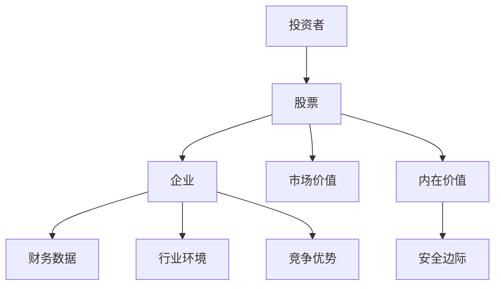
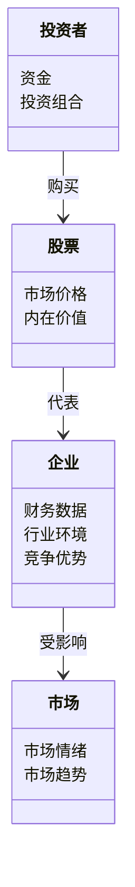
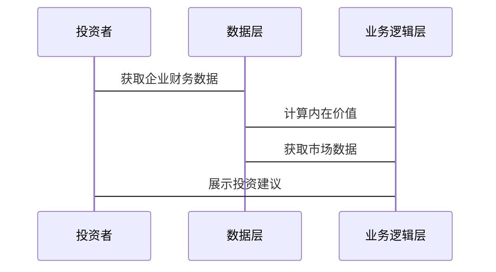

                 


# 从格雷厄姆到巴菲特：价值投资在现代金融市场的演变

## 关键词：价值投资，格雷厄姆，巴菲特，内在价值，安全边际，企业护城河

## 摘要：价值投资是一种以基本面分析为基础，通过寻找被市场低估的优质股票进行长期投资的策略。本文将探讨价值投资从格雷厄姆的经典理论到巴菲特的实践创新，再到现代金融市场的演变过程。通过分析内在价值、安全边际、企业护城河等核心概念，结合数学模型和系统架构设计，深入探讨价值投资的理论基础和实际应用。最后，通过具体案例分析和项目实战，帮助读者理解价值投资在现代金融市场中的演变和应用。

## 第1章: 价值投资的起源与核心理念

### 1.1 价值投资的定义与背景
- 1.1.1 价值投资的定义
  - 价值投资是一种以低于内在价值的价格购买优质股票的投资策略。
  - 核心在于识别市场的非理性定价，并从中获利。
- 1.1.2 价值投资的核心理念
  - 市场先生理论：市场的短期波动是不可预测的，但长期趋势是理性的。
  - 安全边际：以低于内在价值的价格购买股票，以降低风险。
- 1.1.3 价值投资与投机的区分
  - 投机：基于市场情绪和短期价格波动进行交易。
  - 价值投资：基于对企业内在价值的深入分析进行投资。

### 1.2 格雷厄姆的价值投资理论
- 1.2.1 格雷厄姆的生平与贡献
  - 本杰明·格雷厄姆：20世纪的投资先驱，被誉为“价值投资之父”。
  - 著名书籍：《证券分析》和《聪明的投资者》。
- 1.2.2 格雷厄姆的投资策略
  - 购买具有安全边际的股票：即市场价格远低于内在价值。
  - 重视企业的财务状况，特别是流动资产和债务情况。
- 1.2.3 格雷厄姆的“安全边际”概念
  - 安全边际 = 内在价值 - 市场价格。
  - 通过安全边际来降低投资风险，确保即使市场波动，也能获得正收益。

### 1.3 巴菲特的价值投资实践
- 1.3.1 巴菲特的生平与投资哲学
  - 沃伦·巴菲特：格雷厄姆的学生，价值投资的实践者和创新者。
  - 投资理念：长期持有优质股票，获得复利增长。
- 1.3.2 巴菲特的“企业护城河”理论
  - 企业护城河：企业竞争优势的持久性，决定其长期盈利能力。
  - 投资标准：寻找具有宽护城河、良好管理和稳定行业的企业。
- 1.3.3 巴菲特的长期投资策略
  - 长期持有优质股票，避免频繁交易。
  - 重视企业的ROE（净资产收益率）和管理质量。

## 第2章: 价值投资的核心概念与联系

### 2.1 核心概念原理
- 2.1.1 内在价值的计算方法
  - 格雷厄姆的内在价值公式：
    $$ V = \frac{E}{4.41} \times (1 + g) $$
    其中，E是企业的盈利价值，g是增长率。
  - 巴菲特的扩展模型：
    $$ V = \frac{E}{WACC} \times (1 + g) $$
    其中，WACC是加权平均资本成本。
- 2.1.2 市场价值与内在价值的关系
  - 市场价值短期波动，内在价值长期稳定。
  - 投资者应关注内在价值，而非短期市场波动。
- 2.1.3 安全边际的数学模型
  - 安全边际 = 内在价值 - 市场价格。
  - 格雷厄姆建议的安全边际比例为25%以上。

### 2.2 核心概念属性特征对比表格
| 概念       | 格雷厄姆的定义 | 巴菲特的扩展 | 现代演变 |
|------------|---------------|--------------|----------|
| 内在价值   | 股票的真正价值 | 包括护城河因素 | 数字化评估 |
| 安全边际   | 购买价格低于内在价值 | 考虑市场情绪 | 大数据分析 |
| 企业护城河 | 企业竞争优势 | 可持续竞争优势 | 数字化竞争优势 |

### 2.3 ER实体关系图（Mermaid）


## 第3章: 价值投资的数学模型与算法原理

### 3.1 内在价值计算模型
- 3.1.1 格雷厄姆的内在价值公式
  $$ V = \frac{E}{4.41} \times (1 + g) $$
  其中，E是企业的盈利价值，g是增长率。
- 3.1.2 巴菲特的内在价值扩展模型
  $$ V = \frac{E}{WACC} \times (1 + g) $$
  其中，WACC是加权平均资本成本。

### 3.2 安全边际的计算
- 安全边际 = 内在价值 - 市场价格
  $$ \text{安全边际} = V - P $$
  其中，V是内在价值，P是市场价格。

### 3.3 企业护城河的评估
- 企业护城河的宽度决定企业的竞争优势和长期盈利能力。
- 评估指标：
  - 品牌影响力
  - 成本优势
  - 技术创新
  - 市场占有率

### 3.4 投资决策模型
- 投资决策流程：
  1. 评估企业的内在价值
  2. 计算安全边际
  3. 评估企业的护城河
  4. 结合市场环境做出投资决策

## 第4章: 价值投资的系统分析与架构设计

### 4.1 系统功能设计
- 领域模型（Mermaid类图）


### 4.2 系统架构设计
- 三层架构：
  - 数据层：收集和存储企业财务数据和市场数据。
  - 业务逻辑层：计算内在价值、安全边际和护城河。
  - 用户界面层：展示分析结果和投资建议。

### 4.3 系统接口设计
- 接口1：获取企业财务数据
- 接口2：计算内在价值
- 接口3：评估护城河
- 接口4：展示投资建议

### 4.4 系统交互流程图（Mermaid序列图）


## 第5章: 项目实战

### 5.1 环境安装
- 安装Python和相关库（如pandas、numpy、scipy）

### 5.2 核心实现源代码
```python
import pandas as pd
import numpy as np

def calculate_intrinsic_value(enterprise_value, revenue_growth):
    return enterprise_value / 4.41 * (1 + revenue_growth)

def calculate_margin_of_safety(intrinsic_value, market_price):
    return intrinsic_value - market_price

# 示例数据
enterprise_value = 100000000
revenue_growth = 0.05
market_price = 50

# 计算内在价值
intrinsic_value = calculate_intrinsic_value(enterprise_value, revenue_growth)
print(f"内在价值: ${intrinsic_value:.2f}")

# 计算安全边际
margin_of_safety = calculate_margin_of_safety(intrinsic_value, market_price)
print(f"安全边际: ${margin_of_safety:.2f}")
```

### 5.3 案例分析
- 案例：分析一家虚构的公司XYZ
  - 财务数据：企业价值1亿美元，年收入增长5%，市场价格50美元。
  - 计算内在价值：100000000 / 4.41 * 1.05 ≈ 226,760,767.61美元
  - 计算安全边际：226,760,767.61 - 50 = 226,710,767.61美元
  - 结论：具有较高的安全边际，适合投资。

### 5.4 投资组合构建
- 选择具有宽护城河和高ROE的企业。
- 分散投资，降低风险。

### 5.5 风险管理
- 定期评估投资组合的内在价值和安全边际。
- 风险控制：设定止损点，避免重大损失。

## 第6章: 总结与展望

### 6.1 总结
- 价值投资从格雷厄姆的安全边际理论到巴菲特的企业护城河理论，再到现代的数字化分析，不断演变和发展。
- 核心理念：寻找被低估的优质股票，长期持有，获得复利收益。

### 6.2 展望
- 随着大数据和人工智能的发展，价值投资将更加依赖量化分析和模型预测。
- 未来趋势：结合基本面分析和量化分析，提高投资决策的科学性和准确性。

### 6.3 最佳实践
- 小结：价值投资需要耐心和纪律，避免情绪化决策。
- 注意事项：定期复评估投资组合，适应市场变化。
- 拓展阅读：推荐书籍《证券分析》、《聪明的投资者》、《巴菲特传》。

---

通过以上目录大纲，读者可以系统地了解价值投资从理论到实践的演变过程，掌握核心概念和实际应用方法，为在现代金融市场中进行价值投资提供理论和实践指导。

