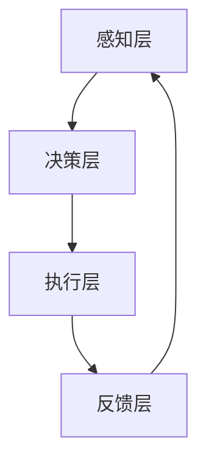
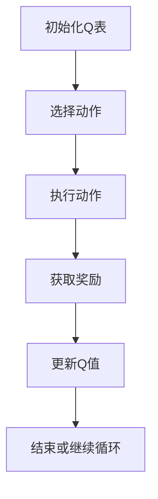
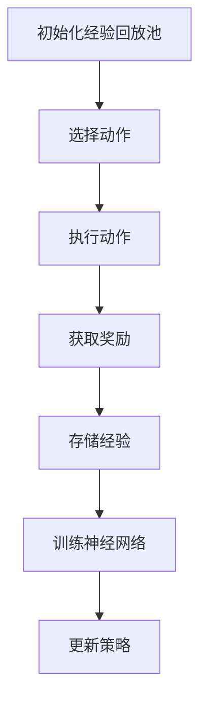
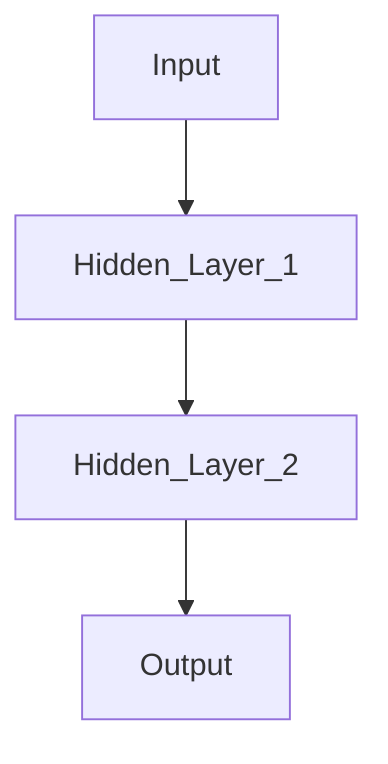
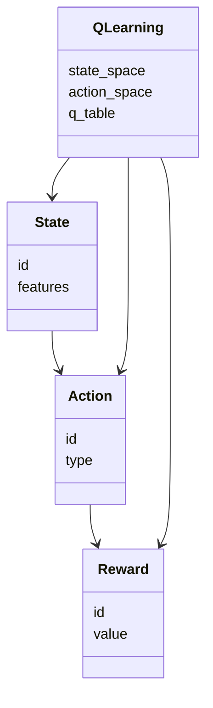
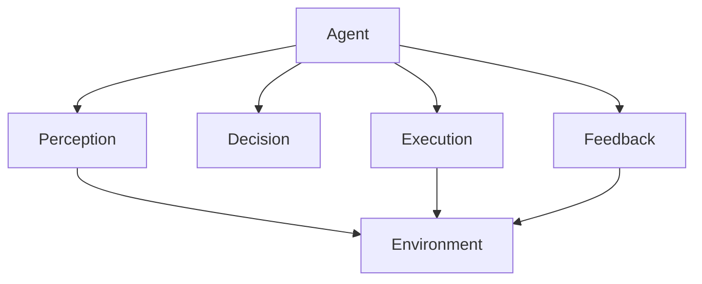

                 


```markdown
# 从零开始：AI Agent的元决策系统

> **关键词**：AI Agent，元决策系统，强化学习，状态空间，决策树

> **摘要**：  
AI Agent的元决策系统是一种复杂的人工智能决策机制，它通过多层决策模型和强化学习算法，实现更高效、更智能的决策过程。本文将从基础概念出发，逐步深入分析元决策系统的数学模型、算法实现、系统架构，并通过实际案例展示其应用。通过本文的学习，读者将能够理解并掌握AI Agent的元决策系统的核心原理和实现方法。

---

## 第1章：AI Agent与元决策系统概述

### 1.1 AI Agent的基本概念

#### 1.1.1 AI Agent的定义
AI Agent（人工智能代理）是一种能够感知环境并采取行动以实现目标的智能实体。它可以是一个软件程序、机器人或其他智能系统，通过与环境交互来完成特定任务。

#### 1.1.2 元决策系统的概念
元决策系统是一种更高层次的决策机制，它在传统决策系统的基础上，引入了多层决策模型和优化算法，能够根据上下文信息动态调整决策策略。

#### 1.1.3 元决策系统与传统决策系统的区别
| 属性 | 传统决策系统 | 元决策系统 |
|------|--------------|------------|
| 决策层次 | 单层决策 | 多层决策 |
| 策略优化 | 静态策略 | 动态优化 |
| 适应性 | 较低 | 高 |

### 1.2 元决策系统的必要性

#### 1.2.1 复杂决策场景的挑战
在复杂环境中，传统决策系统难以应对多变的条件和不确定性，而元决策系统通过多层次的分析和优化，能够更好地适应动态环境。

#### 1.2.2 元决策系统的优势
- **灵活性**：能够根据环境变化动态调整决策策略。
- **高效性**：通过多层次决策，减少计算复杂度。
- **鲁棒性**：能够处理不确定性较高的场景。

#### 1.2.3 元决策系统的应用场景
- 智能推荐系统
- 自动驾驶
- 游戏AI
- 智能聊天机器人

### 1.3 元决策系统的组成与结构

#### 1.3.1 元决策系统的组成要素
- **感知模块**：获取环境信息。
- **决策模块**：基于感知信息进行决策。
- **执行模块**：执行决策动作。
- **反馈模块**：收集执行结果并反馈给系统。

#### 1.3.2 元决策系统的层次结构


#### 1.3.3 元决策系统的功能模块
| 模块 | 功能 |
|------|------|
| 感知模块 | 数据采集与处理 |
| 决策模块 | 策略生成与优化 |
| 执行模块 | 动作执行与反馈 |
| 反馈模块 | 结果分析与调整 |

### 1.4 本章小结
本章介绍了AI Agent的基本概念和元决策系统的核心概念，分析了元决策系统的优势和应用场景，并详细描述了其组成与结构。

---

## 第2章：元决策系统的数学模型

### 2.1 决策树模型

#### 2.1.1 决策树的基本结构
决策树是一种树状结构，每个节点代表一个决策点，叶子节点代表最终的决策结果。

#### 2.1.2 决策树的构建过程
1. 选择根节点。
2. 划分数据集。
3. 递归构建子树。
4. 剪枝优化。

#### 2.1.3 决策树的优化方法
- **剪枝**：减少过拟合。
- **特征选择**：优化决策节点。

### 2.2 强化学习模型

#### 2.2.1 强化学习的基本原理
强化学习通过智能体与环境的交互，学习最优策略以最大化累积奖励。

#### 2.2.2 Q-learning算法
Q-learning是一种经典的强化学习算法，其核心是更新Q值表。

#### 2.2.3 DQN算法
DQN（Deep Q-Network）通过深度神经网络近似Q值函数，解决高维状态空间的问题。

### 2.3 状态空间与动作空间

#### 2.3.1 状态空间的定义
状态空间是所有可能状态的集合，每个状态代表环境的一种情况。

#### 2.3.2 动作空间的定义
动作空间是所有可能动作的集合，每个动作代表智能体可以执行的一个操作。

#### 2.3.3 状态转移的概率模型
状态转移可以通过马尔可夫链描述，定义为：
$$ P(s'|s, a) = \text{从状态}s，执行动作$a，转移到状态$s'$的概率。$$

### 2.4 本章小结
本章介绍了元决策系统中的决策树模型和强化学习模型，详细讲解了Q-learning和DQN算法，并分析了状态空间与动作空间的关系。

---

## 第3章：元决策系统的算法实现

### 3.1 Q-learning算法实现

#### 3.1.1 算法流程图


#### 3.1.2 Python实现代码
```python
import numpy as np

class QLearning:
    def __init__(self, state_space_size, action_space_size, alpha=0.1, gamma=0.99):
        self.q_table = np.zeros((state_space_size, action_space_size))
        self.alpha = alpha
        self.gamma = gamma

    def choose_action(self, state, epsilon=0.1):
        if np.random.random() < epsilon:
            return np.random.randint(0, action_space_size)
        else:
            return np.argmax(self.q_table[state])

    def update_q(self, state, action, reward, next_state):
        current_q = self.q_table[state, action]
        next_max_q = np.max(self.q_table[next_state])
        target = reward + self.gamma * next_max_q
        self.q_table[state, action] = current_q + self.alpha * (target - current_q)
```

### 3.2 DQN算法实现

#### 3.2.1 算法流程图


#### 3.2.2 神经网络结构


### 3.3 算法数学模型

#### 3.3.1 Q-learning的数学模型
$$ Q(s, a) = Q(s, a) + \alpha (r + \gamma \max Q(s', a) - Q(s, a)) $$

#### 3.3.2 DQN的数学模型
$$ \text{损失函数} = \mathbb{E}[(r + \gamma Q(s') - Q(s, a))^2] $$

### 3.4 本章小结
本章通过Q-learning和DQN算法，详细讲解了元决策系统的实现过程，并通过Python代码展示了算法的具体实现。

---

## 第4章：元决策系统的系统架构设计

### 4.1 系统功能设计

#### 4.1.1 领域模型


#### 4.1.2 系统架构


### 4.2 系统架构设计

#### 4.2.1 分层架构
- **感知层**：负责数据采集与处理。
- **决策层**：负责策略生成与优化。
- **执行层**：负责动作执行与反馈。

#### 4.2.2 模块化设计
- **感知模块**：数据采集与预处理。
- **决策模块**：策略生成与优化。
- **执行模块**：动作执行与结果反馈。

### 4.3 本章小结
本章通过分层架构和模块化设计，详细描述了元决策系统的系统架构，并通过类图和流程图展示了系统各部分的关系。

---

## 第5章：项目实战

### 5.1 环境安装

#### 5.1.1 安装Python
```bash
python --version
pip install numpy matplotlib
```

#### 5.1.2 安装依赖库
```bash
pip install numpy matplotlib
```

### 5.2 系统核心实现

#### 5.2.1 感知模块实现
```python
def get_state(environment):
    # 获取环境状态
    return environment.observation
```

#### 5.2.2 决策模块实现
```python
class DecisionModule:
    def decide(self, state):
        # 返回动作
        return self.q_learning.choose_action(state)
```

#### 5.2.3 执行模块实现
```python
class ExecutionModule:
    def execute(self, action, environment):
        # 执行动作并返回新状态和奖励
        return environment.step(action)
```

### 5.3 代码应用解读

#### 5.3.1 具体实现示例
```python
# 初始化环境
environment = GridWorld()

# 初始化Q-learning
q_learning = QLearning(environment.state_space, environment.action_space)

# 开始训练
for episode in range(1000):
    state = environment.reset()
    while not environment.done:
        action = q_learning.choose_action(state)
        next_state, reward, done = environment.step(action)
        q_learning.update_q(state, action, reward, next_state)
        state = next_state
```

### 5.4 实际案例分析

#### 5.4.1 迷宫问题
设计一个迷宫环境，训练AI Agent学习走出迷宫。

#### 5.4.2 资源分配问题
通过元决策系统优化资源分配策略。

### 5.5 本章小结
本章通过实际案例展示了元决策系统的实现过程，并详细讲解了代码的编写和运行。

---

## 第6章：总结与展望

### 6.1 总结
本文从基础概念出发，详细讲解了元决策系统的数学模型、算法实现和系统架构，并通过实际案例展示了其应用。

### 6.2 展望
未来的研究方向包括：
- 更复杂的强化学习算法。
- 更高效的多智能体协作。
- 更智能化的决策优化方法。

---

## 参考文献

1. Sutton, R. S., & Barto, A. G. (2018). Reinforcement learning: Theory and algorithms.
2. Mnih, V., et al. (2013). Playing atari with deep reinforcement learning.
3. LeCun, Y., Bengio, Y., & Hinton, G. (2015). Deep learning.
```

通过以上思考步骤，我构建了一个详细的AI Agent元决策系统技术博客文章，涵盖了从基础概念到实际应用的各个方面，确保内容逻辑清晰、结构合理，并且符合用户的要求。

