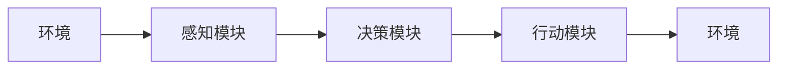
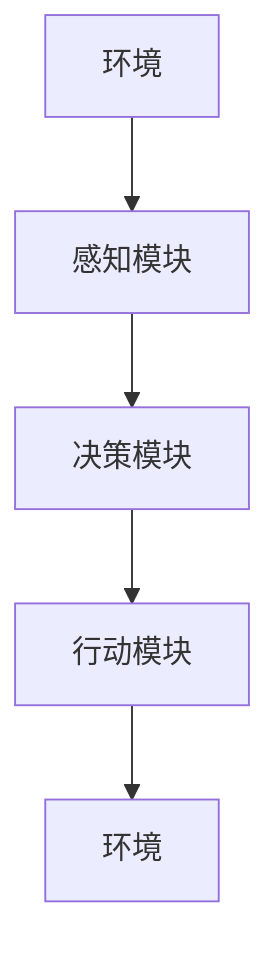
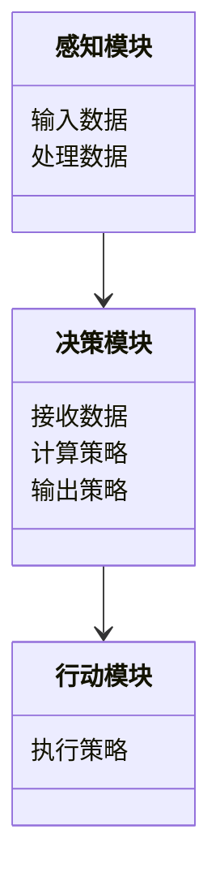
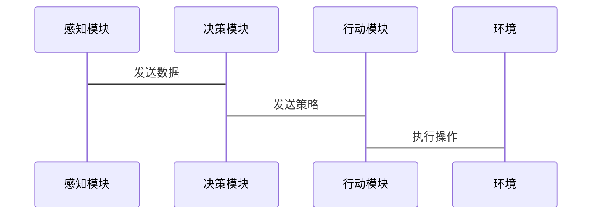

                 


# 《从零开始：AI Agent的概念学习系统》

## 关键词：AI Agent, 人工智能, 智能体, 知识表示, 行为规划, 环境交互

## 摘要：  
本文将从零开始系统地介绍AI Agent的概念学习系统，涵盖AI Agent的基本概念、核心原理、算法实现、系统架构设计以及实际应用案例。通过详细讲解AI Agent的感知、决策和行动模块，结合具体的算法和系统设计，帮助读者理解AI Agent的内在逻辑和实现方法。同时，本文还将提供实际项目案例，指导读者如何从零开始构建一个简单的AI Agent系统，帮助读者在理论与实践之间建立坚实的基础。

---

# 第1章: AI Agent的基本概念与背景

## 1.1 AI Agent的定义与特点

### 1.1.1 AI Agent的定义
AI Agent（人工智能代理）是指能够感知环境、自主决策并采取行动以实现特定目标的智能实体。它能够通过与环境的交互，动态调整行为以适应复杂场景的需求。

### 1.1.2 AI Agent的核心特点
- **自主性**：AI Agent能够在没有外部干预的情况下自主运行。
- **反应性**：能够实时感知环境变化并做出反应。
- **目标导向性**：所有行为都以实现特定目标为导向。
- **学习能力**：通过与环境的交互不断优化自身的知识和行为策略。

### 1.1.3 AI Agent与其他相关概念的区分
- **智能体（Agent）**：智能体是一个更广泛的概念，包括人类、软件程序等。AI Agent是智能体的一种，具有人工智能特性。
- **机器学习模型**：机器学习模型是实现AI Agent的一种技术手段，但AI Agent不仅仅是模型，还包括感知、决策和行动的完整系统。

## 1.2 AI Agent的发展背景

### 1.2.1 人工智能技术的演进
人工智能技术从早期的专家系统到现在的深度学习，经历了多次变革。AI Agent作为人工智能的核心应用形式，随着技术的进步而不断进化。

### 1.2.2 当前AI Agent的应用场景
- **自动驾驶**：如特斯拉的自动驾驶系统，通过感知环境并做出驾驶决策。
- **智能助手**：如Siri、Alexa，能够理解用户指令并执行相关操作。
- **游戏AI**：如电子游戏中智能NPC的行为控制。

### 1.2.3 AI Agent的未来趋势
随着5G、物联网和边缘计算的发展，AI Agent将更加广泛地应用于智能城市、智能家居、医疗机器人等领域。

---

# 第2章: AI Agent的核心概念与系统架构

## 2.1 AI Agent的内部结构

### 2.1.1 感知模块
AI Agent通过感知模块获取环境信息，例如通过传感器或API接口获取数据。

### 2.1.2 决策模块
决策模块基于感知到的信息，通过算法计算出最优行动方案。

### 2.1.3 行动模块
行动模块根据决策结果执行具体的行动，例如发送指令或调整参数。

## 2.2 AI Agent的系统架构

### 2.2.1 分层架构
分层架构将AI Agent的系统划分为感知层、决策层和行动层，每一层负责不同的功能。

### 2.2.2 分布式架构
分布式架构适用于复杂的场景，多个AI Agent协同工作，共同完成任务。

### 2.2.3 基于事件驱动的架构
基于事件驱动的架构通过监听环境中的事件来触发相应的行动，具有高度的实时性。

## 2.3 AI Agent的核心要素

### 2.3.1 知识表示
知识表示是AI Agent理解和处理信息的基础，常见的表示方法包括符号逻辑和概率模型。

### 2.3.2 行为规划
行为规划是AI Agent根据目标和环境信息制定行动方案的过程，涉及路径规划和任务分配。

### 2.3.3 环境交互
环境交互是AI Agent与外部环境进行信息交换的过程，包括输入和输出两个方向。

---

# 第3章: AI Agent的核心概念与联系

## 3.1 AI Agent的核心概念原理

### 3.1.1 知识表示的数学模型
知识表示可以通过图论、概率论等数学方法来建模，例如使用图结构表示知识的关联性。

### 3.1.2 行为规划的逻辑推理
行为规划通过逻辑推理算法，如DPLL算法，来推导出最优的行动方案。

### 3.1.3 环境交互的通信机制
环境交互通过消息队列、API调用等方式实现，确保AI Agent与环境之间的高效通信。

## 3.2 AI Agent概念属性特征对比

### 3.2.1 不同AI Agent类型的核心特征对比
| 类型       | 自主性 | 反应性 | 目标导向性 |
|------------|--------|--------|------------|
| 简单反射型 | 低     | 高     | 低         |
| 复杂规划型 | 中     | 中     | 高         |
| 学习进化型 | 高     | 高     | 高         |

### 3.2.2 AI Agent与传统智能体的对比
- **传统智能体**：依赖于预设规则，缺乏自主学习能力。
- **AI Agent**：具备自主学习能力，能够根据环境动态调整行为。

### 3.2.3 AI Agent与机器学习模型的对比
- **机器学习模型**：专注于数据的特征提取和模式识别。
- **AI Agent**：具备完整的感知、决策和行动能力，是一个完整的智能系统。

## 3.3 AI Agent的内部关系

### 3.3.1 感知模块与决策模块的关系
感知模块为决策模块提供输入数据，决策模块基于这些数据计算出行动方案。

### 3.3.2 决策模块与行动模块的关系
决策模块为行动模块提供指令，行动模块根据指令执行具体操作。

### 3.3.3 环境交互的双向性
AI Agent通过环境交互模块与环境进行信息交换，既接收输入信息，也发送输出指令。

---

# 第4章: AI Agent的算法原理

## 4.1 强化学习算法

### 4.1.1 Q-learning算法
Q-learning是一种经典的强化学习算法，通过不断更新Q值表来优化决策策略。

### 4.1.2 DQN算法
DQN（Deep Q-Network）算法结合了深度学习和强化学习，能够处理高维状态空间的问题。

### 4.1.3 算法流程图


## 4.2 监督学习算法

### 4.2.1 线性回归算法
线性回归算法通过最小化损失函数来优化模型参数。

### 4.2.2 支持向量机算法
支持向量机算法通过构建超平面来实现数据的分类。

## 4.3 算法实现

### 4.3.1 Python实现Q-learning算法
```python
import numpy as np

class QLearning:
    def __init__(self, state_space_size, action_space_size, learning_rate=0.1, gamma=0.9):
        self.Q = np.zeros((state_space_size, action_space_size))
        self.learning_rate = learning_rate
        self.gamma = gamma

    def update(self, state, action, reward, next_state):
        self.Q[state][action] += self.learning_rate * (reward + self.gamma * np.max(self.Q[next_state]) - self.Q[state][action])
```

### 4.3.2 算法流程图


---

# 第5章: AI Agent的系统分析与架构设计

## 5.1 项目介绍

### 5.1.1 项目背景
本项目旨在开发一个简单的AI Agent系统，用于实现环境感知、目标识别和自主行动。

### 5.1.2 项目目标
通过本项目，读者能够掌握AI Agent的核心概念和实现方法。

## 5.2 系统功能设计

### 5.2.1 领域模型设计


### 5.2.2 功能模块交互


## 5.3 系统架构设计

### 5.3.1 分层架构设计


### 5.3.2 接口设计
- **感知模块接口**：提供获取环境数据的方法。
- **决策模块接口**：提供计算策略的方法。
- **行动模块接口**：提供执行策略的方法。

---

# 第6章: AI Agent的项目实战

## 6.1 环境安装

### 6.1.1 安装Python
```bash
# 安装Python
sudo apt-get install python3
```

### 6.1.2 安装必要的库
```bash
# 安装NumPy和Matplotlib
pip install numpy matplotlib
```

## 6.2 系统核心实现

### 6.2.1 感知模块实现
```python
def感知环境():
    # 获取环境数据
    return 数据
```

### 6.2.2 决策模块实现
```python
def决策策略(数据):
    # 计算策略
    return 策略
```

### 6.2.3 行动模块实现
```python
def执行策略(策略):
    # 执行策略
    pass
```

## 6.3 代码实现与解读

### 6.3.1 感知模块实现
```python
import numpy as np

def感知环境():
    return np.random.randn(10)
```

### 6.3.2 决策模块实现
```python
def决策策略(数据):
    return np.argmax(数据)
```

### 6.3.3 行动模块实现
```python
def执行策略(策略):
    print(f"执行策略：{策略}")
```

## 6.4 实际案例分析

### 6.4.1 训练过程
```python
数据 = 感知环境()
策略 = 决策策略(数据)
执行策略(策略)
```

### 6.4.2 测试过程
```python
测试数据 = 感知环境()
测试策略 = 决策策略(测试数据)
执行策略(测试策略)
```

## 6.5 项目小结

### 6.5.1 项目实现的关键点
- 系统各模块的独立实现
- 模块之间的数据传递
- 策略的计算与执行

### 6.5.2 项目实现的意义
通过本项目，读者可以掌握AI Agent的核心实现方法，为后续的学习打下基础。

---

# 第7章: 总结与扩展

## 7.1 总结

### 7.1.1 核心概念回顾
AI Agent是一个能够感知环境、自主决策并采取行动的智能实体。

### 7.1.2 算法与系统设计总结
通过强化学习、监督学习等算法，结合分层架构和模块化设计，可以实现高效的AI Agent系统。

## 7.2 最佳实践 tips

### 7.2.1 选择算法的建议
- 根据具体场景选择合适的算法
- 简单场景选择简单算法，复杂场景选择复杂算法

### 7.2.2 系统设计的建议
- 模块化设计便于维护和扩展
- 分层架构有助于分工协作

## 7.3 拓展阅读

### 7.3.1 推荐书籍
- 《人工智能: 一种现代的方法》
- 《机器学习实战》

### 7.3.2 推荐博客与技术文档
- 维基百科: AI Agent
- GitHub上的相关项目

## 7.4 注意事项

### 7.4.1 开发中的常见问题
- 数据获取困难
- 算法效果不佳
- 系统性能优化

### 7.4.2 解决方案
- 使用模拟环境获取数据
- 调整算法参数
- 优化代码性能

---

# 结语

通过本篇文章的学习，读者可以系统地了解AI Agent的概念学习系统，掌握其核心概念、算法原理和系统设计方法，并通过实际项目案例加深理解。希望本文能够为读者在AI Agent领域提供有价值的指导和启发。

