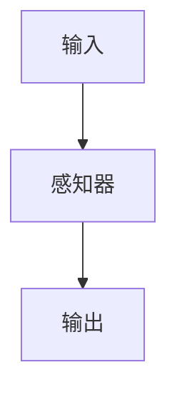
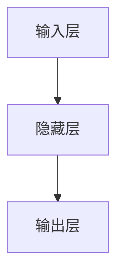
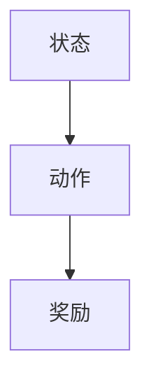
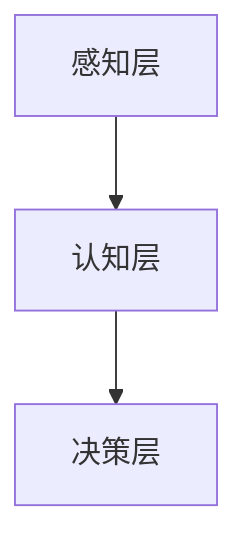
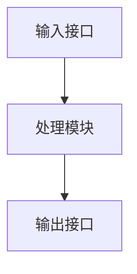

                 


# 第三章: AI Agent自我意识模拟的算法原理

## 3.1 算法原理概述
### 3.1.1 算法的基本原理
### 3.1.2 算法的核心思想
### 3.1.3 算法的实现步骤

## 3.2 感知器算法
### 3.2.1 感知器的基本原理
### 3.2.2 感知器的数学模型
### 3.2.3 感知器的实现代码
### 3.2.4 感知器的流程图

### 3.2.5 感知器的优缺点分析

## 3.3 神经网络算法
### 3.3.1 神经网络的基本原理
### 3.3.2 神经网络的数学模型
### 3.3.3 神经网络的实现代码
### 3.3.4 神经网络的流程图

### 3.3.5 神经网络的优缺点分析

## 3.4 强化学习算法
### 3.4.1 强化学习的基本原理
### 3.4.2 强化学习的数学模型
### 3.4.3 强化学习的实现代码
### 3.4.4 强化学习的流程图

### 3.4.5 强化学习的优缺点分析

## 3.5 算法的对比分析
### 3.5.1 不同算法的对比表格
### 3.5.2 算法之间的关系与依赖

## 3.6 本章小结

# 第四章: AI Agent自我意识模拟的系统分析与架构设计

## 4.1 问题场景介绍
### 4.1.1 问题场景的描述
### 4.1.2 问题场景的分析

## 4.2 系统功能设计
### 4.2.1 系统功能模块划分
### 4.2.2 每个模块的功能描述
### 4.2.3 模块之间的关系与依赖

## 4.3 系统架构设计
### 4.3.1 系统架构图

### 4.3.2 每个层次的功能描述
### 4.3.3 层级之间的关系与依赖

## 4.4 系统接口设计
### 4.4.1 系统接口的定义
### 4.4.2 接口之间的关系与依赖
### 4.4.3 接口的交互流程图


## 4.5 本章小结

# 第五章: AI Agent自我意识模拟的项目实战

## 5.1 环境安装与配置
### 5.1.1 开发环境的选择
### 5.1.2 必要软件的安装
### 5.1.3 环境的配置步骤

## 5.2 核心代码实现
### 5.2.1 感知模块的实现
### 5.2.2 认知模块的实现
### 5.2.3 决策模块的实现

## 5.3 代码实现与解读
### 5.3.1 核心代码示例
```python
# 示例代码：感知模块
def感知器(input):
    return 感知结果
```
### 5.3.2 代码功能的详细解读
### 5.3.3 代码实现的注意事项

## 5.4 案例分析与实际应用
### 5.4.1 实际案例的分析
### 5.4.2 案例的实现过程
### 5.4.3 案例的优化与改进

## 5.5 本章小结

# 第六章: 总结与展望

## 6.1 全文总结
### 6.1.1 核心内容的回顾
### 6.1.2 关键点的总结
### 6.1.3 本章的收获与体会

## 6.2 未来研究方向
### 6.2.1 当前研究的不足
### 6.2.2 未来可能的研究方向
### 6.2.3 展望的建议与思考

## 6.3 注意事项与建议
### 6.3.1 实践中的注意事项
### 6.3.2 给读者的建议
### 6.3.3 进一步学习的资源推荐

## 6.4 本章小结

# 附录: 参考资料与拓展阅读
### 附录A: 相关文献资料
### 附录B: 拓展阅读推荐
### 附录C: 工具与资源链接

# 附录D: 术语表
### 术语表1: 核心术语解释
### 术语表2: 专业术语说明
### 术语表3: 相关概念定义
```

