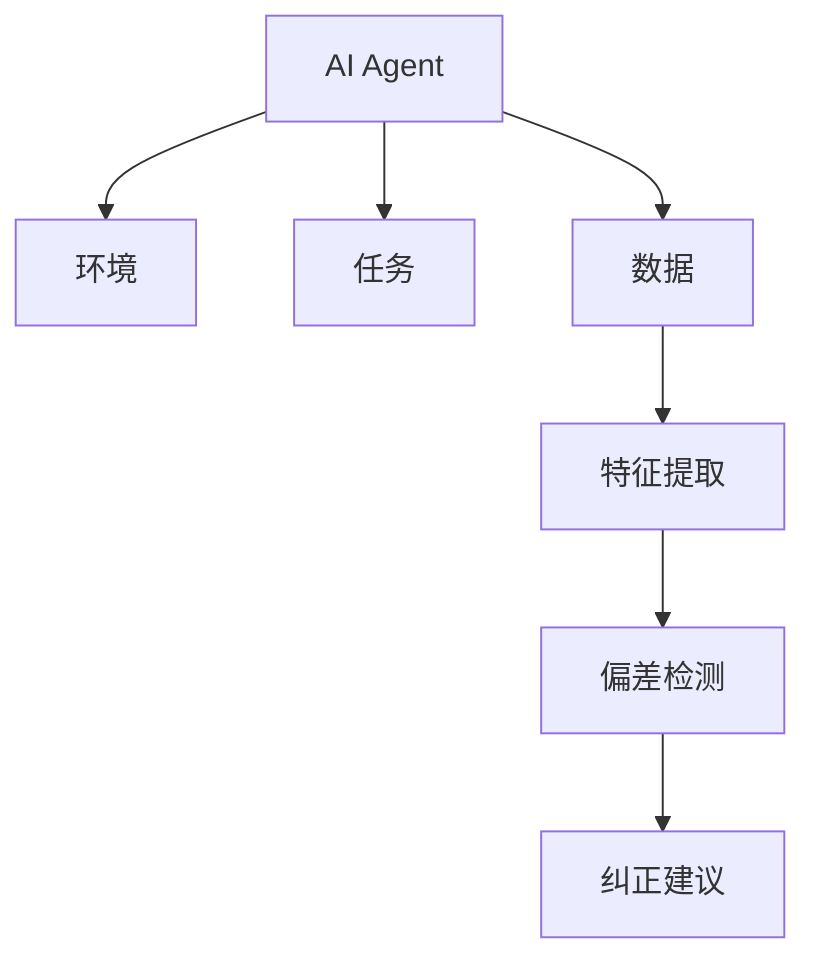
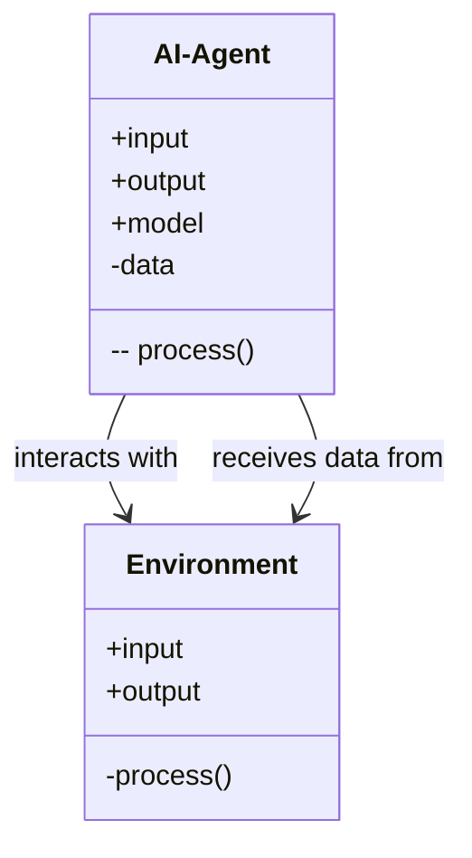
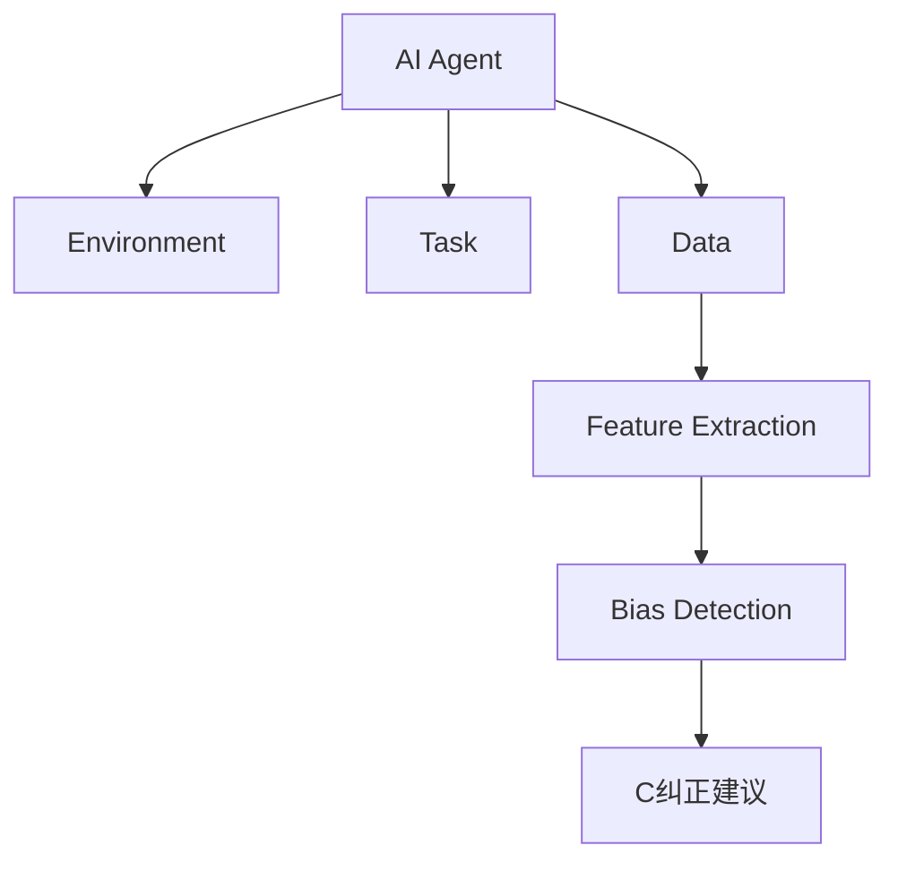
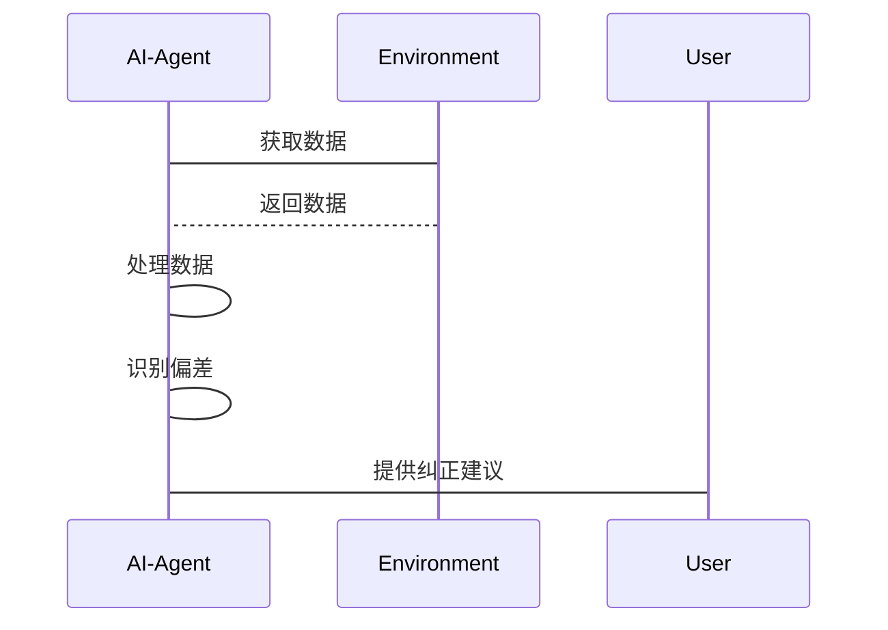

                 


# 从零开始：AI Agent的认知偏差识别

> 关键词：AI Agent，认知偏差，偏差识别，算法原理，系统架构

> 摘要：本文从AI Agent的认知偏差识别的基本概念出发，详细探讨了认知偏差的分类、识别算法的实现原理、系统架构设计以及实际项目中的应用。通过理论与实践相结合的方式，帮助读者全面理解并掌握AI Agent认知偏差识别的核心技术。

---

## 第1章 AI Agent认知偏差识别的背景与问题定义

### 1.1 认知偏差的基本概念

#### 1.1.1 认知偏差的定义
认知偏差是指人在信息处理、记忆、判断和决策过程中，由于主观因素的影响，导致偏离事实的真实性的现象。在AI Agent中，认知偏差可能表现为对输入数据的误判、决策逻辑的错误或输出结果的不准确。

#### 1.1.2 认知偏差的分类与特点
认知偏差可以分为以下几类：
- **确认偏差**：倾向于接受与自己已有观点一致的信息。
- **忽略偏差**：忽略某些重要的信息或数据。
- **代表性偏差**：根据样本的代表性来判断整体，忽视统计规律。
- **过度自信偏差**：对自身判断的准确性过于自信。

#### 1.1.3 AI Agent中的认知偏差问题
AI Agent在处理复杂任务时，由于依赖算法和数据，其认知偏差可能来源于训练数据的偏差、算法设计的缺陷或环境信息的不完整。识别和纠正这些偏差，是提升AI Agent智能水平的关键。

### 1.2 AI Agent的基本概念与工作原理

#### 1.2.1 AI Agent的定义
AI Agent是一种智能体，能够感知环境、自主决策并执行任务。它通常具备感知、推理、学习和执行能力。

#### 1.2.2 AI Agent的核心功能与特点
- **感知能力**：通过传感器或数据接口获取环境信息。
- **推理能力**：基于逻辑推理或机器学习模型进行判断。
- **学习能力**：通过训练不断优化自身的决策模型。
- **自主性**：能够在没有外部干预的情况下完成任务。

#### 1.2.3 AI Agent的决策机制与应用场景
AI Agent的决策机制通常包括感知、推理、规划和执行四个阶段。应用场景广泛，如自动驾驶、智能客服、推荐系统等。

### 1.3 认知偏差对AI Agent的影响

#### 1.3.1 认知偏差对AI Agent决策的影响
认知偏差可能导致AI Agent做出错误的判断，例如在图像识别任务中漏检关键特征，或在自然语言处理中误解语境。

#### 1.3.2 认知偏差在AI Agent中的具体表现
- 在图像识别中，AI可能忽略背景中的重要细节。
- 在自然语言处理中，AI可能误解句子的语境或情感。
- 在推荐系统中，AI可能过度推荐某一类型的内容，忽略多样性。

#### 1.3.3 认知偏差识别的必要性与挑战
识别认知偏差是提升AI Agent可靠性和智能水平的关键。然而，认知偏差的多样性和复杂性使得识别过程具有挑战性。

## 第2章 认知偏差识别的核心概念与原理

### 2.1 认知偏差识别的基本原理

#### 2.1.1 认知偏差识别的定义
认知偏差识别是指通过算法和模型，检测和分析AI Agent在决策过程中产生的偏差，并提供纠正建议的过程。

#### 2.1.2 认知偏差识别的关键步骤
1. 数据收集与预处理
2. 偏差检测算法设计
3. 偏差识别结果的验证与优化

#### 2.1.3 认知偏差识别的数学模型
认知偏差识别可以通过概率模型、统计模型或机器学习模型来实现。例如，可以使用贝叶斯网络来建模偏差的产生过程。

### 2.2 认知偏差识别的核心要素

#### 2.2.1 数据输入与特征提取
数据输入是认知偏差识别的基础。特征提取则是从数据中提取有助于偏差检测的关键特征。

#### 2.2.2 偏差检测算法与模型
常用的偏差检测算法包括基于规则的算法和基于机器学习的算法。例如，可以使用支持向量机（SVM）或随机森林（Random Forest）来分类偏差类型。

#### 2.2.3 偏差识别结果的输出与解释
偏差识别的结果需要以清晰的方式呈现，并提供相应的解释，以便用户理解和纠正。

### 2.3 认知偏差识别的系统架构

#### 2.3.1 系统输入与输出的定义
系统输入包括原始数据和特征提取结果，输出包括偏差类型和纠正建议。

#### 2.3.2 系统功能模块划分
系统功能模块通常包括数据预处理模块、偏差检测模块和结果解释模块。

#### 2.3.3 系统架构的实体关系图
以下是系统架构的实体关系图：



## 第3章 认知偏差识别的核心算法与实现

### 3.1 偏差识别的主要算法

#### 3.1.1 基于概率的偏差识别算法
基于概率的算法通过计算偏差发生的概率来检测偏差。例如，可以使用贝叶斯定理来计算条件概率。

#### 3.1.2 基于规则的偏差识别算法
基于规则的算法通过预定义的规则来检测偏差。例如，可以设定某些特征的阈值，当特征值超过阈值时触发偏差检测。

#### 3.1.3 基于机器学习的偏差识别算法
基于机器学习的算法通过训练模型来识别偏差。例如，可以使用随机森林或XGBoost模型来分类偏差类型。

### 3.2 偏差识别算法的实现步骤

#### 3.2.1 数据预处理与特征提取
数据预处理包括清洗数据和归一化数据。特征提取则是从数据中提取有助于偏差检测的关键特征。

#### 3.2.2 算法模型的训练与优化
选择合适的算法模型，进行训练和优化，例如调整超参数以提高模型的准确率。

#### 3.2.3 偏差识别结果的验证与评估
通过交叉验证和评估指标（如准确率、召回率、F1值）来验证模型的性能。

### 3.3 偏差识别算法的数学模型

#### 3.3.1 基于概率的数学模型
使用贝叶斯定理来计算条件概率：

$$ P(A|B) = \frac{P(B|A) \cdot P(A)}{P(B)} $$

#### 3.3.2 基于机器学习的数学模型
例如，使用逻辑回归模型：

$$ P(Y=1|X) = \frac{1}{1 + e^{-\beta X}} $$

### 3.4 项目实战

#### 3.4.1 环境安装
安装所需的Python库，例如numpy、pandas、scikit-learn。

#### 3.4.2 核心代码实现
以下是基于逻辑回归的偏差识别算法的代码示例：

```python
import numpy as np
from sklearn.linear_model import LogisticRegression
from sklearn.metrics import accuracy_score

# 数据预处理
X = np.array([[1, 2], [3, 4], [5, 6]])
y = np.array([0, 1, 0])

# 模型训练
model = LogisticRegression()
model.fit(X, y)

# 模型预测
predicted = model.predict(X)
print("预测结果:", predicted)
print("准确率:", accuracy_score(y, predicted))
```

#### 3.4.3 代码解读与分析
上述代码展示了如何使用逻辑回归模型进行偏差识别。数据预处理部分包括特征提取和数据归一化。模型训练部分使用了逻辑回归算法，模型预测部分输出了预测结果和准确率。

## 第4章 系统分析与架构设计方案

### 4.1 问题场景介绍
认知偏差识别系统需要解决AI Agent在决策过程中产生的偏差问题，提升系统的准确性和可靠性。

### 4.2 系统功能设计

#### 4.2.1 领域模型
以下是领域模型的Mermaid类图：



### 4.3 系统架构设计

#### 4.3.1 系统架构图
以下是系统架构的Mermaid图：



### 4.4 系统接口设计

#### 4.4.1 接口设计
系统接口包括数据输入接口、特征提取接口、偏差检测接口和纠正建议接口。

### 4.5 系统交互设计

#### 4.5.1 交互流程图
以下是系统交互的Mermaid序列图：



## 第5章 项目实战

### 5.1 实际案例分析

#### 5.1.1 案例背景
在自然语言处理任务中，AI Agent可能对某些语义理解出现偏差。

#### 5.1.2 数据准备与处理
准备训练数据，进行数据清洗和归一化处理。

#### 5.1.3 算法实现与优化
选择合适的算法，进行训练和优化，例如调整模型参数以提高准确率。

### 5.2 代码实现与解读

#### 5.2.1 代码实现
以下是偏差识别算法的代码实现：

```python
import numpy as np
from sklearn import datasets
from sklearn.linear_model import LogisticRegression
from sklearn.metrics import accuracy_score

# 加载数据集
digits = datasets.load_digits()
X = digits.data
y = digits.target

# 模型训练
model = LogisticRegression(max_iter=10000)
model.fit(X, y)

# 模型预测
predicted = model.predict(X)
print("准确率:", accuracy_score(y, predicted))
```

### 5.3 项目总结

#### 5.3.1 项目小结
通过本项目，我们掌握了认知偏差识别的核心算法和实现方法，能够有效提升AI Agent的决策准确性。

---

## 第6章 最佳实践与小结

### 6.1 小结
认知偏差识别是提升AI Agent智能水平的重要环节，通过算法优化和系统设计，能够有效减少偏差的影响。

### 6.2 注意事项
在实际应用中，需要注意数据质量和算法选择，避免过拟合和欠拟合问题。

### 6.3 拓展阅读
推荐阅读相关领域的书籍和论文，深入理解认知偏差识别的理论和应用。

---

通过以上内容，我们系统地介绍了AI Agent认知偏差识别的核心概念、算法实现和系统设计，为读者提供了从理论到实践的完整指导。

