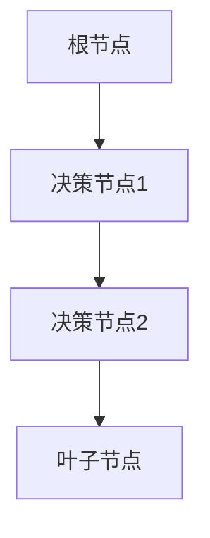
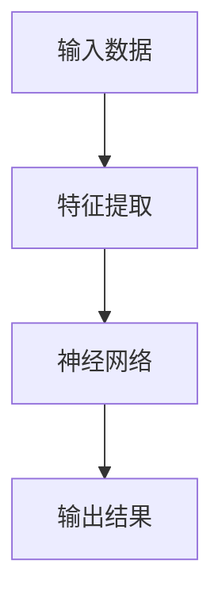
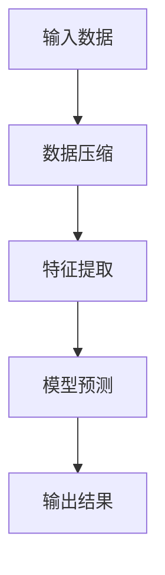
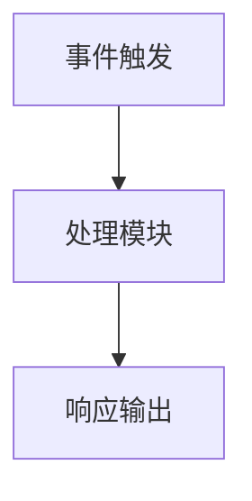
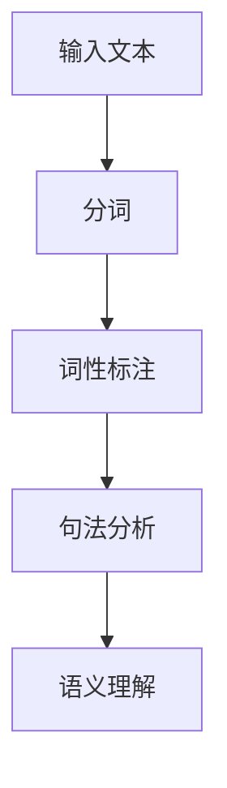
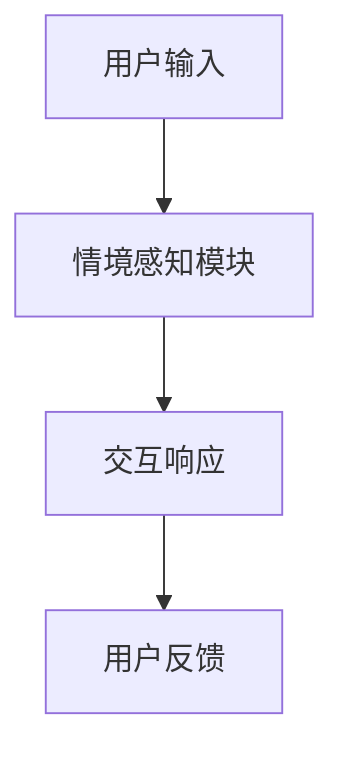
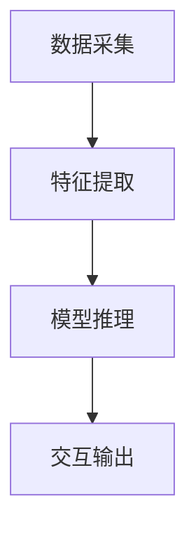
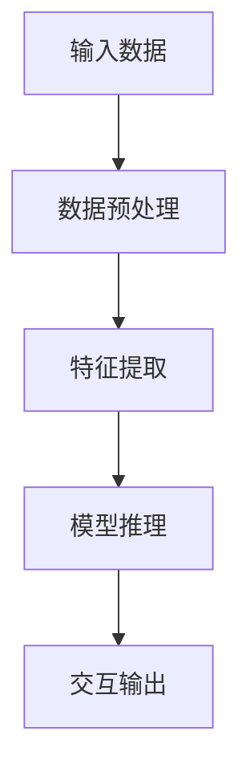
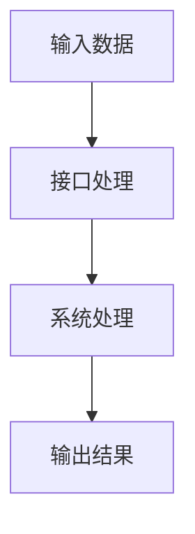
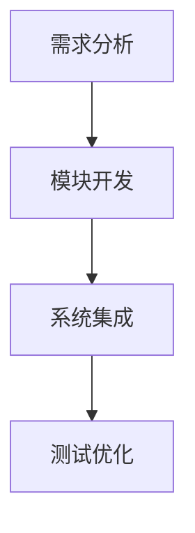

                 


# 从零构建AI Agent的情境感知系统

> 关键词：AI Agent，情境感知，多模态数据，实时处理，人机交互，系统架构

> 摘要：本篇文章将详细介绍从零开始构建AI Agent的情境感知系统的全过程。文章首先从AI Agent和情境感知的基本概念入手，逐步深入探讨情境感知系统的数学模型、多模态数据融合算法、实时数据处理算法、人机交互设计、系统架构设计，以及项目实战。通过本篇文章，读者将能够全面理解并掌握AI Agent情境感知系统的核心技术与实现方法。

---

# 第一部分: AI Agent与情境感知系统基础

## 第1章: AI Agent与情境感知系统概述

### 1.1 AI Agent的基本概念

#### 1.1.1 什么是AI Agent
AI Agent（人工智能代理）是指能够感知环境、自主决策并执行任务的智能实体。它可以是一个软件程序、机器人或其他智能设备。AI Agent的核心目标是通过与环境的交互，完成特定的任务，例如信息处理、决策优化、自动化操作等。

#### 1.1.2 AI Agent的核心特征
- **自主性**：AI Agent能够自主决策，无需外部干预。
- **反应性**：能够实时感知环境变化并做出响应。
- **目标导向**：基于目标进行决策和行动。
- **学习能力**：通过数据和经验不断优化自身性能。

#### 1.1.3 情境感知系统的基本概念
情境感知系统是AI Agent的重要组成部分，负责理解和分析当前环境的状态。它通过多模态数据的融合，提供关于环境的上下文信息，帮助AI Agent做出更智能的决策。

### 1.2 情境感知系统的重要性

#### 1.2.1 情境感知的定义与特点
- **定义**：情境感知是指系统能够理解当前环境中的各种信息，并根据这些信息做出相应的反应。
- **特点**：
  - 多模态性：能够处理多种类型的数据（如视觉、听觉、文本等）。
  - 实时性：能够在动态环境中快速感知和响应。
  - 上下文理解：能够理解数据之间的关联关系。

#### 1.2.2 情境感知在AI Agent中的作用
情境感知系统为AI Agent提供了环境信息的上下文理解能力，使其能够更好地完成任务。例如，在智能助手中，情境感知系统能够根据用户的位置、时间、当前任务等信息，提供更个性化的服务。

#### 1.2.3 情境感知系统的应用场景
- 智能助手：根据用户的上下文提供个性化服务。
- 智能机器人：根据环境信息做出决策。
- 自动驾驶：通过环境感知实现安全驾驶。

### 1.3 本章小结

#### 1.3.1 AI Agent的核心概念回顾
AI Agent是一种能够自主决策并执行任务的智能实体，其核心特征包括自主性、反应性、目标导向和学习能力。

#### 1.3.2 情境感知系统的关键特征总结
情境感知系统能够理解环境信息并提供上下文理解能力，具有多模态性、实时性和上下文理解的特点。

---

# 第二部分: 情境感知系统的数学模型与算法原理

## 第2章: 情境感知系统的数学模型

### 2.1 情境感知的基本数学模型

#### 2.1.1 概率论基础
概率论是情境感知系统中常用的数学工具之一。例如，贝叶斯定理常用于计算条件概率。

- **贝叶斯定理**：$$ P(A|B) = \frac{P(B|A)P(A)}{P(B)} $$

#### 2.1.2 统计学习基础
统计学习方法（如聚类、分类）广泛应用于情境感知系统中。例如，K-means算法是一种常用的聚类算法。

- **K-means算法**：将数据分成K个簇，使得簇内数据点的相似性最大化。

#### 2.1.3 情境感知的数学表达式
情境感知系统可以通过概率模型或统计模型来表达环境信息。例如，可以使用马尔可夫链模型来描述状态转移过程。

- **马尔可夫链模型**：$$ P(X_{n+1} | X_n) = \theta $$

### 2.2 情境感知的特征提取与表示

#### 2.2.1 特征提取方法
特征提取是情境感知系统的重要步骤。常用的方法包括：
- 基于统计的方法：如均值、方差等。
- 基于深度学习的方法：如卷积神经网络（CNN）。

#### 2.2.2 情境表示模型
情境表示模型可以采用向量或图结构来表示环境信息。例如，使用图结构表示实体之间的关系。

#### 2.2.3 模型的数学推导
以概率模型为例，假设我们有N个特征，每个特征的概率为P(x_i)，则整体概率为：

$$ P(x_1, x_2, ..., x_N) = \prod_{i=1}^N P(x_i) $$

### 2.3 情境感知的决策模型

#### 2.3.1 决策树模型
决策树是一种常用的决策模型。以下是决策树的构建流程：



#### 2.3.2 马尔可夫决策过程
马尔可夫决策过程（MDP）是一种常用的决策模型，适用于动态环境中的决策问题。

- **状态**：环境中的当前情况。
- **动作**：系统可以执行的操作。
- **转移概率**：从一个状态转移到另一个状态的概率。

#### 2.3.3 决策模型的数学公式
以Q-learning算法为例，其目标是最优化Q值：

$$ Q(s, a) = r + \gamma \max_{a'} Q(s', a') $$

其中：
- $s$：当前状态
- $a$：当前动作
- $r$：奖励
- $\gamma$：折扣因子
- $s'$：下一个状态

---

## 第3章: 多模态数据融合算法

### 3.1 多模态数据的定义与特点

#### 3.1.1 多模态数据的来源
多模态数据可以来自多个传感器或数据源，例如：
- 视觉数据：图像、视频。
- 听觉数据：语音、音乐。
- 文本数据：文本、日志。

#### 3.1.2 多模态数据的特征
- 多样性：数据类型多样。
- 互补性：不同数据源可以互补信息。
- 复杂性：数据融合过程复杂。

#### 3.1.3 多模态数据融合的意义
通过融合多模态数据，可以提高系统的感知能力，例如在自动驾驶中，融合视觉和雷达数据可以提高环境感知的准确性。

### 3.2 多模态数据融合的算法原理

#### 3.2.1 基于概率的融合方法
基于概率的融合方法通过计算各个数据源的概率分布，进行融合。

- **概率融合公式**：
  $$ P(x) = \prod_{i=1}^N P_i(x) $$

#### 3.2.2 基于规则的融合方法
基于规则的融合方法通过预定义的规则进行数据融合。

- **规则示例**：如果视觉数据检测到障碍物，且雷达数据也检测到障碍物，则系统采取制动。

#### 3.2.3 基于深度学习的融合方法
基于深度学习的融合方法通过神经网络自动学习数据的特征。

- **融合流程图**：



### 3.3 数据融合的数学模型

#### 3.3.1 融合模型的构建
以多模态数据融合为例，可以使用注意力机制进行融合。

- **注意力机制公式**：
  $$ \alpha_i = \frac{e^{score(x_i)}}{\sum_{j} e^{score(x_j)}} $$

其中，$score(x_i)$是数据源i的得分。

#### 3.3.2 模型的训练与优化
使用反向传播算法训练融合模型，目标是最小化预测误差。

- **损失函数**：
  $$ L = \frac{1}{N}\sum_{i=1}^N (y_i - \hat{y}_i)^2 $$

#### 3.3.3 模型的评估与验证
模型的评估可以通过准确率、召回率等指标进行。

---

## 第4章: 情境感知中的实时处理算法

### 4.1 实时数据处理的基本原理

#### 4.1.1 数据流处理机制
实时数据处理需要高效的流数据处理机制，例如滑动窗口技术。

- **滑动窗口公式**：
  $$ window\_size = \text{当前时间} - \text{窗口起始时间} $$

#### 4.1.2 数据压缩与降噪
为了提高处理效率，可以对数据进行压缩和降噪处理。

- **数据降噪方法**：使用中位数滤波器去除噪声。

#### 4.1.3 数据处理流程图



### 4.2 实时感知与响应的算法实现

#### 4.2.1 基于事件驱动的处理方法
事件驱动是一种高效的实时处理方法。

- **事件驱动流程图**：



#### 4.2.2 基于时间戳的处理方法
基于时间戳的方法可以确保数据的实时性。

- **时间戳处理公式**：
  $$ timestamp = \text{当前时间} $$

#### 4.2.3 实时处理的数学模型
实时处理模型通常基于动态时间 warping（DTW）或支持向量机（SVM）等算法。

---

## 第5章: 情境感知与人机交互

### 5.1 人机交互的基本概念

#### 5.1.1 人机交互的定义
人机交互是指用户与系统之间的信息交换过程。

#### 5.1.2 情境感知在人机交互中的作用
情境感知可以提高交互的智能化和个性化。

### 5.2 情境感知与自然语言处理

#### 5.2.1 自然语言处理的基本原理
自然语言处理（NLP）是情境感知的重要组成部分。

- **NLP处理流程图**：



#### 5.2.2 情境感知对NLP的增强作用
情境感知可以提高NLP的准确性，例如在对话系统中，可以根据上下文理解用户的意图。

### 5.3 人机交互中的情境感知实现

#### 5.3.1 情境感知驱动的交互设计
情境感知可以用于个性化推荐、智能问答等场景。

#### 5.3.2 情境感知的交互流程图



---

## 第6章: 情境感知系统的架构设计与实现

### 6.1 系统架构设计

#### 6.1.1 系统功能模块划分
情境感知系统通常包括数据采集、特征提取、模型推理和交互输出四个模块。

- **功能模块划分图**：



#### 6.1.2 系统架构设计图



### 6.2 系统接口设计

#### 6.2.1 系统接口定义
系统接口通常包括输入接口和输出接口。

- **输入接口**：接收多模态数据。
- **输出接口**：输出感知结果。

#### 6.2.2 接口交互流程图



### 6.3 系统实现与优化

#### 6.3.1 系统实现流程
情境感知系统的实现流程包括需求分析、模块开发、系统集成和测试优化。

- **系统实现流程图**：



#### 6.3.2 系统优化策略
系统优化可以从算法优化和架构优化两个方面入手。

---

## 第7章: 项目实战——构建一个简单的AI Agent情境感知系统

### 7.1 项目背景与目标

#### 7.1.1 项目背景
本项目旨在通过实际案例，展示从零开始构建一个简单的AI Agent情境感知系统的过程。

#### 7.1.2 项目目标
实现一个能够感知环境并做出简单决策的AI Agent。

### 7.2 项目环境搭建

#### 7.2.1 系统需求
- 操作系统：Linux/Windows/MacOS
- 开发工具：Python、TensorFlow、Keras
- 数据集：公开可用的数据集

#### 7.2.2 环境配置
安装必要的库和工具，例如：

```bash
pip install numpy
pip install tensorflow
pip install keras
```

### 7.3 系统核心实现

#### 7.3.1 数据采集与预处理
编写代码采集并预处理数据。

```python
import numpy as np

def preprocess_data(data):
    # 数据归一化
    normalized_data = (data - np.mean(data)) / np.std(data)
    return normalized_data

# 示例数据
data = np.random.randn(100)
preprocessed_data = preprocess_data(data)
print(preprocessed_data)
```

#### 7.3.2 特征提取与模型训练
使用深度学习模型进行特征提取和训练。

```python
from tensorflow.keras import layers

def create_model(input_shape):
    model = tf.keras.Sequential()
    model.add(layers.Conv2D(32, (3,3), activation='relu', input_shape=input_shape))
    model.add(layers.MaxPooling2D((2,2)))
    model.add(layers.Flatten())
    model.add(layers.Dense(64, activation='relu'))
    model.add(layers.Dense(1, activation='sigmoid'))
    return model

model = create_model((64, 64, 3))
model.compile(optimizer='adam', loss='binary_crossentropy', metrics=['accuracy'])
```

#### 7.3.3 模型推理与交互实现
编写代码实现模型推理和交互。

```python
import numpy as np
import tensorflow as tf

def inference(model, input_data):
    prediction = model.predict(input_data)
    return prediction

# 示例输入
input_data = np.random.randn(1, 64, 64, 3)
result = inference(model, input_data)
print(result)
```

### 7.4 项目总结与优化

#### 7.4.1 项目总结
通过本项目，我们实现了从数据采集、特征提取到模型训练和推理的全过程。

#### 7.4.2 系统优化建议
- 优化算法：使用更高效的算法。
- 优化架构：使用分布式架构提高性能。

---

## 第8章: 总结与展望

### 8.1 全文总结

#### 8.1.1 AI Agent与情境感知系统的核心概念
AI Agent是一种能够自主决策的智能实体，情境感知系统是其重要组成部分，负责环境信息的感知与理解。

#### 8.1.2 情境感知系统的实现过程
情境感知系统的实现涉及多模态数据融合、实时处理、人机交互等多个环节。

### 8.2 未来展望

#### 8.2.1 情境感知技术的发展方向
- 更高效的算法：如图神经网络、强化学习等。
- 更广泛的应用：如智能城市、智能医疗等。

#### 8.2.2 AI Agent的未来趋势
随着技术的进步，AI Agent将更加智能化和个性化，能够更好地服务于人类社会。

---

通过本文的详细讲解，读者可以系统地了解并掌握从零构建AI Agent情境感知系统的核心技术与实现方法。

