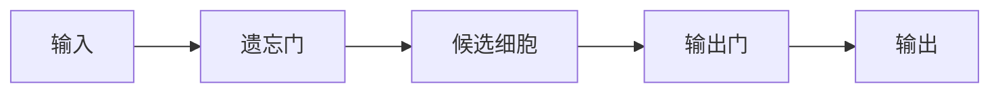
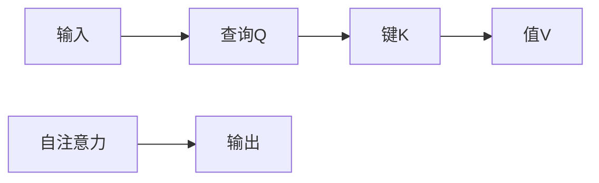
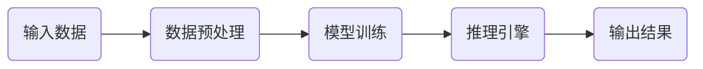
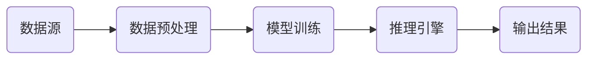
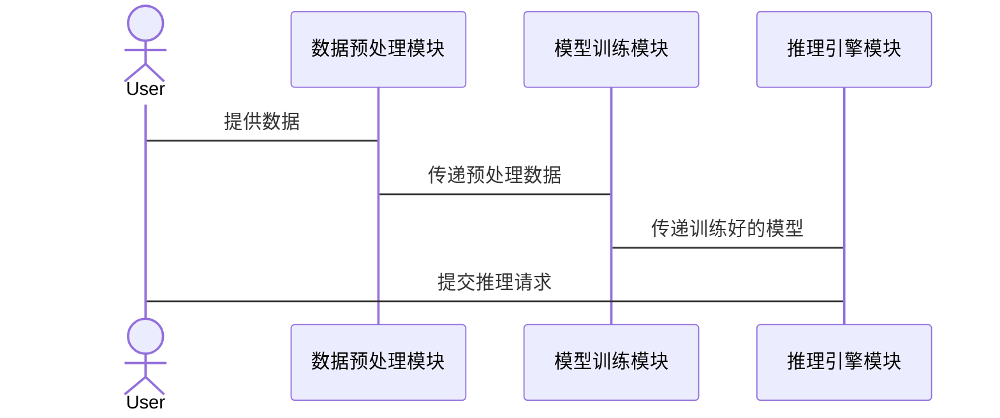

                 


# 从零构建AI Agent的时间推理能力

> 关键词：AI Agent, 时间推理, 机器学习, 深度学习, 自然语言处理

> 摘要：本文将从零开始构建AI Agent的时间推理能力，涵盖背景、理论、算法、系统设计和实战。时间推理是AI Agent的核心能力之一，涉及机器学习、深度学习和自然语言处理等技术。通过本文，读者将掌握从理论到实践的时间推理构建方法。

---

# 第一部分: AI Agent时间推理能力的背景与核心概念

# 第1章: AI Agent与时间推理概述

## 1.1 AI Agent的基本概念

### 1.1.1 什么是AI Agent
AI Agent（人工智能代理）是能够感知环境、执行任务并做出决策的智能实体。它通过传感器获取信息，利用计算模型进行推理，并通过执行器与环境交互。

### 1.1.2 AI Agent的核心特征
- **自主性**：无需外部干预，自主决策。
- **反应性**：能实时感知环境并做出反应。
- **目标导向**：具备明确的目标，驱动行为。
- **学习能力**：通过经验改进性能。

### 1.1.3 时间推理在AI Agent中的重要性
时间推理是AI Agent理解时间关系、预测未来事件、处理时间序列数据的关键能力，广泛应用于调度、预测和规划领域。

## 1.2 时间推理的背景与问题背景

### 1.2.1 时间推理的基本概念
时间推理是基于时间序列数据的推理，涉及时间点、时间段和时间关系的分析。

### 1.2.2 时间推理在AI Agent中的应用领域
- **调度优化**：资源分配和任务调度。
- **预测分析**：预测股票价格、天气变化。
- **自然语言处理**：时间相关实体识别。

### 1.2.3 时间推理面临的挑战与边界
- **复杂性**：处理多时间尺度和复杂事件关系。
- **不确定性**：面对模糊和不完整数据。

## 1.3 本章小结
本章介绍了AI Agent的基本概念和时间推理的重要性，明确了时间推理的应用场景和挑战。

---

# 第二部分: 时间推理的核心概念与算法原理

# 第2章: 时间推理的核心概念与联系

## 2.1 时间推理的原理与方法

### 2.1.1 时间推理的原理
时间推理通过分析时间序列数据，利用模型识别模式和趋势，进行预测和推理。

### 2.1.2 时间推理的主要方法
- **基于规则的方法**：使用预定义规则。
- **基于统计的方法**：利用统计模型。
- **基于机器学习的方法**：深度学习模型。

## 2.2 时间推理的核心概念对比

### 2.2.1 时间序列模型对比

| 模型 | 特点 | 优点 | 缺点 |
|------|------|------|------|
| ARIMA | 基于线性回归 | 简单，适合线性数据 | 不适合复杂模式 |
| LSTM | 长短期记忆网络 | 处理长序列，捕捉长期依赖 | 复杂性高 |
| Transformer | 自注意力机制 | 并行计算，捕捉全局关系 | 计算资源需求大 |

### 2.2.2 时间推理的ER实体关系图

```mermaid
er
actor(Agent, -id, name)
agent(
  id: string,
  name: string
)
action(
  id: string,
  time: timestamp,
  type: string
)
```

## 2.3 本章小结
本章分析了时间推理的方法和模型，对比了不同模型的优缺点，并通过ER图展示了核心实体关系。

# 第3章: 时间推理的算法原理

## 3.1 时间序列模型的原理

### 3.1.1 LSTM模型的原理



公式：
$$
\text{遗忘门} = \sigma(W_f x + U_f h_{prev})
$$

### 3.1.2 Transformer模型的原理



公式：
$$
\text{自注意力机制} = \text{softmax}\left(\frac{QK^T}{\sqrt{d_k}}\right)V
$$

## 3.2 时间推理算法的数学模型

### 3.2.1 LSTM的数学公式

$$
f_t = \sigma(W_f x_t + U_f h_{t-1})
$$

$$
g_t = \tanh(W_c x_t + U_c h_{t-1})
$$

$$
h_t = f_t \cdot g_t
$$

### 3.2.2 Transformer的数学公式

$$
\text{查询} = Q = W_q x
$$

$$
\text{键} = K = W_k x
$$

$$
\text{值} = V = W_v x
$$

## 3.3 算法实现的代码示例

### 3.3.1 LSTM模型的Python代码

```python
import torch
class LSTM(nn.Module):
    def __init__(self, input_size, hidden_size):
        super(LSTM, self).__init__()
        self.input_size = input_size
        self.hidden_size = hidden_size
        self.W_f = nn.Linear(input_size + hidden_size, hidden_size)
        self.W_i = nn.Linear(input_size + hidden_size, hidden_size)
        self.W_c = nn.Linear(input_size + hidden_size, hidden_size)
        self.W_o = nn.Linear(input_size + hidden_size, hidden_size)
    
    def forward(self, x, h_prev, c_prev):
        input_concat = torch.cat((x, h_prev), dim=-1)
        f = torch.sigmoid(self.W_f(input_concat))
        i = torch.sigmoid(self.W_i(input_concat))
        c_tilda = torch.tanh(self.W_c(input_concat))
        c = f * c_prev + i * c_tilda
        o = torch.sigmoid(self.W_o(input_concat))
        h = o * torch.tanh(c)
        return h, c
```

## 3.4 本章小结
本章详细讲解了LSTM和Transformer模型的原理和数学公式，并提供了Python代码示例。

---

# 第三部分: 时间推理的系统架构设计

# 第4章: 时间推理系统的架构设计

## 4.1 系统功能设计

### 4.1.1 系统模块划分
- **数据预处理模块**：清洗和转换数据。
- **模型训练模块**：训练时间推理模型。
- **推理引擎模块**：处理推理请求。

### 4.1.2 系统功能流程



## 4.2 系统架构设计

### 4.2.1 系统架构图



## 4.3 系统接口设计

### 4.3.1 API接口设计
- **输入接口**：接收时间序列数据。
- **输出接口**：返回推理结果。

## 4.4 系统交互流程

### 4.4.1 交互流程图



## 4.5 本章小结
本章设计了时间推理系统的架构，明确了各模块的功能和交互流程。

---

# 第四部分: 项目实战

# 第5章: 时间推理项目的实战

## 5.1 环境安装与配置

### 5.1.1 安装Python环境
安装Python 3.8及以上版本。

### 5.1.2 安装依赖包
使用以下命令安装所需包：
```bash
pip install numpy pandas torch matplotlib
```

## 5.2 项目核心代码实现

### 5.2.1 数据预处理代码

```python
import pandas as pd
import numpy as np

def preprocess_data(data_path):
    data = pd.read_csv(data_path)
    # 数据清洗和转换
    data = data.dropna()
    data['date'] = pd.to_datetime(data['date'])
    return data
```

### 5.2.2 模型训练代码

```python
import torch
import torch.nn as nn

class TimeRNN(nn.Module):
    def __init__(self, input_size, hidden_size, output_size):
        super(TimeRNN, self).__init__()
        self.lstm = LSTM(input_size, hidden_size)
        self.fc = nn.Linear(hidden_size, output_size)
    
    def forward(self, x, h_prev, c_prev):
        h, c = self.lstm(x, h_prev, c_prev)
        output = self.fc(h)
        return output, h, c
```

### 5.2.3 推理引擎代码

```python
def main():
    # 初始化模型
    model = TimeRNN(input_size=1, hidden_size=64, output_size=1)
    # 训练模型
    for epoch in range(100):
        for x, y in dataloader:
            outputs, h, c = model(x, None, None)
            loss = criterion(outputs, y)
            optimizer.zero_grad()
            loss.backward()
            optimizer.step()
    # 推理阶段
    with torch.no_grad():
        input_seq = torch.randn(1, 1, 1)
        output, _, _ = model(input_seq, None, None)
        print(output.item())
```

## 5.3 项目实战案例分析

### 5.3.1 案例介绍
以股票价格预测为例，展示时间推理模型的训练和推理过程。

### 5.3.2 数据分析与预处理
使用历史股票数据，进行数据清洗和归一化处理。

### 5.3.3 模型训练与评估
训练LSTM模型，评估模型的预测准确率。

### 5.3.4 模型推理与结果展示
使用训练好的模型进行股票价格预测，并展示预测结果。

## 5.4 本章小结
本章通过实战项目详细讲解了时间推理模型的训练和推理过程，展示了如何将理论应用于实际场景。

---

# 第五部分: 最佳实践与总结

# 第6章: 时间推理项目的最佳实践

## 6.1 最佳实践

### 6.1.1 数据预处理
确保数据的完整性和准确性，选择合适的时间序列模型。

### 6.1.2 模型选择
根据具体任务选择合适的模型，如LSTM适合时间依赖性强的任务。

### 6.1.3 超参数调优
通过网格搜索或随机搜索优化模型性能。

### 6.1.4 模型部署
将模型部署到生产环境中，提供API接口供其他系统调用。

## 6.2 小结与注意事项

### 6.2.1 小结
时间推理是构建AI Agent的重要能力，需要结合理论和实践。

### 6.2.2 注意事项
- **数据质量**：确保数据准确性和完整性。
- **模型选择**：根据任务需求选择合适的模型。
- **计算资源**：深度学习模型需要高性能计算资源。

## 6.3 拓展阅读

### 6.3.1 推荐书籍
- 《Deep Learning》
- 《Time Series Analysis and Its Applications》

### 6.3.2 推荐博客与资源
- [Awesome Time Series](https://github.com/gabime/awesome-tensorflow)
- [Kaggle时间序列比赛](https://www.kaggle.com/competitions/time-series)

---

# 总结

通过本文的详细讲解，读者可以系统地掌握从零构建AI Agent时间推理能力的方法。从理论学习到实战项目，再到最佳实践，每一步都进行了深入的分析和具体的实现。时间推理能力是构建智能系统的重要基石，未来将有更广泛的应用场景和更深入的研究方向。

