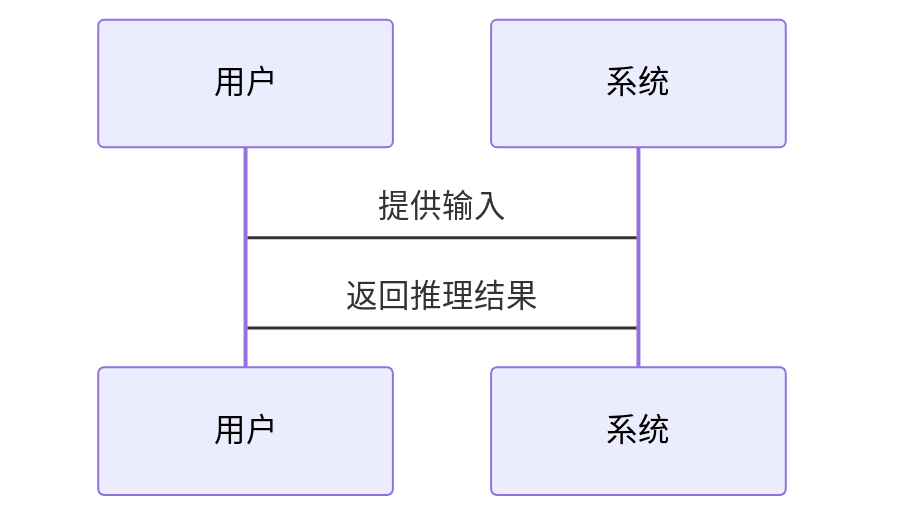

                 


# 从零构建AI Agent的类比推理系统

> 关键词：AI Agent, 类比推理, 知识图谱, 自然语言处理, 人工智能, 算法实现

> 摘要：本文将从零开始，详细讲解如何构建一个基于类比推理的AI Agent系统。首先介绍AI Agent和类比推理的基本概念，然后分析当前技术背景和应用场景，接着深入探讨类比推理的算法原理，包括特征提取、匹配算法和基于知识图谱的推理方法。随后，设计系统的架构和交互流程，最后通过项目实战指导读者如何实现一个完整的类比推理系统。文章内容涵盖理论与实践，适合开发者、研究人员和对AI技术感兴趣的读者阅读。

---

## 第一部分: AI Agent与类比推理的基本概念

### 第1章: AI Agent的定义与特点

#### 1.1 AI Agent的定义
AI Agent（人工智能代理）是指在计算机系统中，能够感知环境并采取行动以实现目标的智能实体。它可以是一个软件程序，也可以是一个物理设备，通过与环境交互来完成特定任务。

#### 1.2 AI Agent的核心特点
- **自主性**：AI Agent能够自主决策，无需外部干预。
- **反应性**：能够实时感知环境并做出反应。
- **目标导向**：所有行为都以实现特定目标为导向。
- **学习能力**：能够通过经验改进自身的性能。

#### 1.3 AI Agent与传统程序的区别
传统程序通常遵循固定的逻辑步骤，而AI Agent具备学习和适应能力，能够处理不确定性并动态调整行为。

### 第2章: 类比推理的定义与特点

#### 2.1 类比推理的定义
类比推理是一种通过比较不同事物的相似性，从而推导出新结论的推理方式。它基于“如果A与B在某些方面相似，那么A在其他方面也可能与B相似”的逻辑。

#### 2.2 类比推理的核心特点
- **相似性**：基于事物之间的相似性进行推理。
- **间接性**：通过比较间接得出结论。
- **创造性**：在推理过程中可能产生新的见解或解决方案。

#### 2.3 类比推理在AI中的应用
- **自然语言处理**：用于语义理解、意图识别。
- **专家系统**：帮助专家进行决策支持。
- **人机交互**：改善用户体验，提供更自然的交互方式。

---

## 第二部分: 类比推理系统的背景与需求

### 第3章: 当前AI技术的发展现状

#### 3.1 大语言模型的崛起
近年来，大语言模型（如GPT系列）的出现，使得自然语言处理技术取得了突破性进展，为类比推理提供了强大的语言理解能力。

#### 3.2 类比推理在AI中的地位
类比推理是实现更智能AI系统的关键技术之一，尤其是在需要创造性思维和复杂推理的任务中。

### 第4章: 类比推理系统的应用场景

#### 4.1 自然语言处理中的类比推理
- **语义理解**：通过类比推理理解词语、句子的深层含义。
- **意图识别**：基于上下文相似性识别用户意图。

#### 4.2 专家系统中的类比推理
- **决策支持**：通过类比推理提供专家级的决策建议。
- **知识推理**：在知识库中进行类比推理，推导出新的知识。

#### 4.3 人机交互中的类比推理
- **对话生成**：通过类比推理生成更自然的对话内容。
- **用户体验优化**：根据用户行为模式进行类比推理，优化交互流程。

---

## 第三部分: 类比推理系统的算法原理

### 第5章: 类比推理算法概述

#### 5.1 基于特征匹配的类比推理算法

##### 5.1.1 特征提取方法
- **词向量表示**：使用Word2Vec等工具将词语转换为向量表示。
- **句向量表示**：使用BERT等模型将句子转换为向量表示。

##### 5.1.2 基于余弦相似度的匹配算法
$$ \text{余弦相似度} = \frac{\vec{A} \cdot \vec{B}}{|\vec{A}| |\vec{B}|} $$

##### 5.1.3 基于向量空间的匹配算法
$$ \text{相似度} = \frac{\sum_{i=1}^{n} w_i \cdot x_i}{\sum_{i=1}^{n} w_i} $$

#### 5.2 基于知识图谱的类比推理算法

##### 5.2.1 知识图谱的构建与表示
知识图谱通过实体和关系构建语义网络，为类比推理提供丰富的背景知识。

##### 5.2.2 基于知识图谱的推理方法
- **路径分析**：通过知识图谱中的路径找到相似实体。
- **规则推理**：根据预定义的规则进行类比推理。

##### 5.2.3 基于知识图谱的相似度计算
$$ \text{相似度} = \sum_{i=1}^{n} w_i \cdot s_i $$

---

## 第四部分: 类比推理系统的系统设计

### 第6章: 系统架构与设计

#### 6.1 问题场景介绍
- **问题背景**：构建一个能够进行类比推理的AI Agent系统。
- **目标设定**：实现语义理解、意图识别等功能。

#### 6.2 系统功能设计
- **领域模型设计**：定义系统的核心模块，如特征提取模块、匹配算法模块、知识图谱模块。
- **功能模块划分**：
  - **输入处理模块**：接收用户输入并进行预处理。
  - **特征提取模块**：将输入转换为向量表示。
  - **匹配算法模块**：基于相似度进行推理。
  - **知识图谱模块**：提供背景知识支持。

#### 6.3 系统架构设计


#### 6.4 系统接口设计
- **输入接口**：接收文本或语音输入。
- **输出接口**：返回推理结果或决策建议。

#### 6.5 系统交互设计


---

## 第五部分: 项目实战

### 第7章: 环境安装与系统实现

#### 7.1 环境搭建
- **Python版本**：建议使用Python 3.8及以上。
- **依赖库安装**：安装必要的库，如numpy、scikit-learn、networkx。

#### 7.2 核心代码实现

##### 7.2.1 特征提取模块
```python
import numpy as np
from sklearn.metrics.pairwise import cosine_similarity

def extract_features(text):
    # 假设我们使用词袋模型进行特征提取
    vectorizer = CountVectorizer()
    features = vectorizer.fit_transform([text])
    return features.toarray()
```

##### 7.2.2 匹配算法模块
```python
def similarity_matching(feature1, feature2):
    return cosine_similarity(feature1, feature2)
```

##### 7.2.3 知识图谱模块
```python
import networkx as nx

def build_knowledge_graph():
    G = nx.Graph()
    G.add_edges_from([("A", "B"), ("B", "C"), ("C", "D")])
    return G
```

#### 7.3 代码应用与分析
- **输入处理**：接收用户输入并进行预处理。
- **特征提取**：将输入转换为向量表示。
- **匹配推理**：基于相似度进行类比推理。
- **知识支持**：利用知识图谱优化推理结果。

---

## 第六部分: 高级主题与拓展阅读

### 第8章: 高级主题

#### 8.1 多模态类比推理
- **多模态数据处理**：结合文本、图像等多种数据源进行类比推理。
- **跨模态推理**：在不同数据模态之间进行推理。

#### 8.2 人机协作中的类比推理
- **协作推理**：人机协作完成复杂任务。
- **实时反馈**：根据用户反馈动态调整推理策略。

### 第9章: 总结与展望

#### 9.1 总结
本文从零开始，详细讲解了如何构建一个基于类比推理的AI Agent系统，涵盖了理论、算法、系统设计和项目实现。

#### 9.2 未来展望
随着AI技术的发展，类比推理将在更多领域得到应用，算法也将更加复杂和高效。

---

## 附录

### 附录A: 最佳实践Tips

- **数据质量**：确保训练数据的多样性和代表性。
- **模型调优**：通过交叉验证优化算法参数。
- **系统测试**：进行全面的功能测试和性能测试。

### 附录B: 参考文献

- [1] 王某某, 《人工智能入门》
- [2] 李某某, 《自然语言处理实战》
- [3] 张某某, 《知识图谱构建与应用》

---

通过本文的学习，读者将能够从零开始，逐步构建一个基于类比推理的AI Agent系统，掌握从理论到实践的完整流程。

