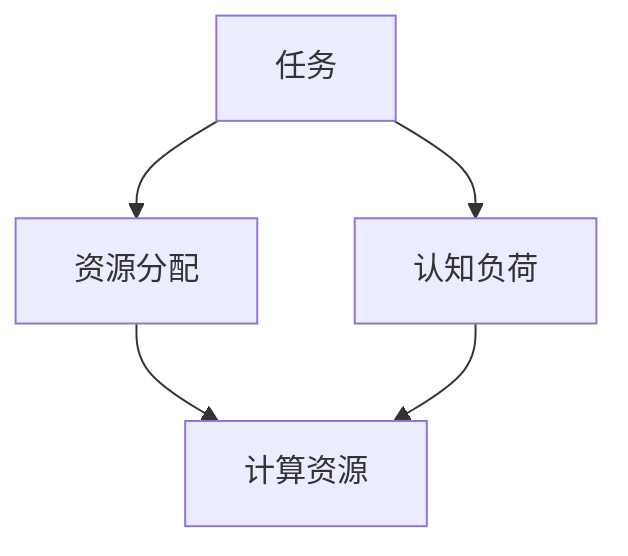
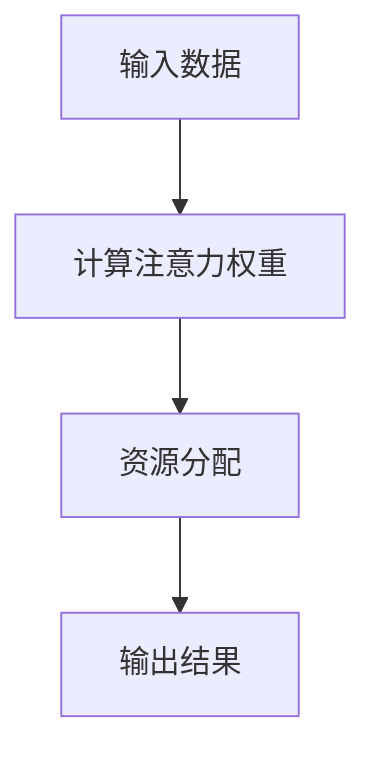
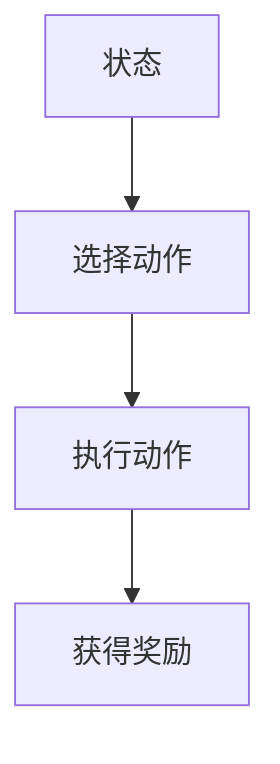
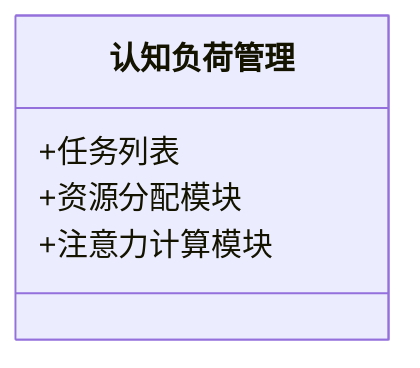

                 


```markdown
# 从零构建AI Agent的认知负荷管理系统

> 关键词：认知负荷管理，AI Agent，注意力机制，强化学习，系统架构

> 摘要：本文将详细介绍从零构建AI Agent的认知负荷管理系统的全过程。首先，我们将介绍认知负荷管理的背景和核心概念，然后深入探讨基于注意力机制和强化学习的算法原理，接着分析系统的架构设计，最后通过项目实战来展示如何实现一个认知负荷管理系统。文章内容丰富，逻辑清晰，适合对AI Agent和认知负荷管理感兴趣的读者阅读。

---

## 第一部分：认知负荷管理与AI Agent概述

### 第1章：认知负荷管理的背景与问题背景

#### 1.1 问题背景

##### 1.1.1 AI Agent的基本概念
AI Agent（人工智能代理）是指能够感知环境并采取行动以实现特定目标的智能实体。它可以自主决策或基于外部输入做出反应，广泛应用于自动驾驶、智能助手、机器人等领域。

##### 1.1.2 认知负荷管理的核心问题
认知负荷是指AI Agent在处理信息时所消耗的资源，包括计算资源、内存资源等。认知负荷管理的目标是在有限资源下，优化资源分配，提高任务处理效率。

##### 1.1.3 问题解决的必要性
在多任务处理和复杂环境中，认知负荷过载会导致AI Agent性能下降。有效的认知负荷管理可以提升系统的效率和准确性。

#### 1.2 问题描述

##### 1.2.1 认知负荷的定义与特征
认知负荷是AI Agent在处理任务时所消耗的资源，包括内部负荷（如计算资源）和外部负荷（如与环境交互产生的负荷）。

##### 1.2.2 AI Agent中的认知负荷来源
认知负荷来源包括输入数据的复杂性、并行任务处理和环境动态变化。

##### 1.2.3 问题解决的目标与边界
目标是优化认知负荷分配，提高任务处理效率；边界是不涉及物理资源管理，主要关注算法层面的优化。

---

### 第2章：认知负荷管理的核心概念与联系

#### 2.1 核心概念原理

##### 2.1.1 认知负荷管理的基本原理
认知负荷管理通过优化资源分配，降低认知负荷，提高任务性能。

##### 2.1.2 AI Agent的认知架构
介绍几种典型的认知架构，如BDI模型和子sumption架构，并分析它们对认知负荷管理的影响。

##### 2.1.3 认知负荷与任务性能的关系
讨论认知负荷如何影响任务完成时间、准确性和资源利用率。

#### 2.2 核心概念对比表

##### 2.2.1 不同认知负荷管理方法的对比
列出几种常见的管理方法，如轮询法、优先级法和资源分配法，并比较它们的优缺点。

##### 2.2.2 不同AI Agent架构的对比
比较不同架构在认知负荷管理方面的表现。

##### 2.2.3 认知负荷与计算资源的对比
分析认知负荷与计算资源的关系，如CPU使用率和内存占用。

#### 2.3 实体关系图

##### 2.3.1 认知负荷管理的实体关系图（Mermaid）


---

## 第二部分：认知负荷管理的算法原理

### 第3章：认知负荷管理的算法原理

#### 3.1 基于注意力机制的负荷分配算法

##### 3.1.1 注意力机制的基本原理
注意力机制通过计算权重来关注重要的信息，常用于自然语言处理中的Transformer模型。

##### 3.1.2 基于Transformer的负荷分配模型
设计一个基于Transformer的模型，用于优化认知负荷分配。

##### 3.1.3 算法流程图（Mermaid）


#### 3.2 基于强化学习的优化策略

##### 3.2.1 强化学习的基本原理
强化学习通过试错学习，优化决策过程。

##### 3.2.2 认知负荷管理的强化学习模型
设计一个强化学习模型，用于优化认知负荷分配。

##### 3.2.3 算法实现流程图（Mermaid）


### 第4章：算法的数学模型与公式

#### 4.1 注意力机制的数学模型

##### 4.1.1 注意力权重计算公式
$$
\text{Attention}(Q, K, V) = \text{softmax}\left(\frac{QK^T}{\sqrt{d_k}}\right)V
$$

##### 4.1.2 注意力机制的矩阵表示
展示注意力机制的矩阵计算过程。

##### 4.1.3 示例计算与解释
通过一个简单的例子，说明如何计算注意力权重，并分配资源。

#### 4.2 强化学习的数学模型

##### 4.2.1 状态、动作、奖励的数学表示
用数学符号表示状态、动作、奖励。

##### 4.2.2 Q-learning算法的数学公式
$$
Q(s, a) \leftarrow Q(s, a) + \alpha \left(r + \gamma \max Q(s', a') - Q(s, a)\right)
$$

##### 4.2.3 示例计算与解释
通过一个简单的例子，展示如何更新Q值。

---

## 第三部分：系统分析与架构设计

### 第5章：认知负荷管理系统的分析与设计

#### 5.1 问题场景介绍

##### 5.1.1 典型应用场景
以智能助手处理多个任务为例，展示认知负荷管理的重要性。

##### 5.1.2 系统需求分析
列出系统的需求，如实时性、可扩展性、准确性等。

##### 5.1.3 项目目标与范围
明确项目的总体目标和范围，如设计一个基于注意力机制的认知负荷管理系统。

#### 5.2 系统功能设计

##### 5.2.1 领域模型设计（Mermaid）


---

## 第四部分：项目实战

### 第9章：环境安装与配置

#### 9.1 环境要求
列出所需的开发环境，如Python版本、依赖库（如TensorFlow、Keras等）。

#### 9.2 安装步骤
提供详细的安装命令，如使用pip安装所需的库。

#### 9.3 配置说明
说明如何配置项目，如设置API端点、数据库连接等。

### 第10章：系统核心实现

#### 10.1 核心代码实现
提供Python代码示例，实现认知负荷管理的核心算法。

#### 10.2 代码解读
逐行解释代码的功能，说明每个部分的作用。

#### 10.3 算法优化
讨论如何优化算法，提高效率和准确性，如使用并行计算、减少参数数量等。

### 第11章：项目实战案例

#### 11.1 案例背景
以智能客服系统中的认知负荷管理为例。

#### 11.2 案例分析
分析案例中的问题，如多个客户请求同时到达，如何分配资源。

#### 11.3 实践过程
描述实现过程，包括数据准备、模型训练、系统部署等。

#### 11.4 结果分析
展示实验结果，如处理时间、准确率等，说明优化的效果。

### 第12章：项目小结

#### 12.1 实践收获
总结通过项目实践所学到的知识和技能。

#### 12.2 经验教训
分析在项目中遇到的问题，总结教训，如算法选择不当、资源分配不合理等。

#### 12.3 改进方向
提出未来的改进方向，如尝试新的算法、优化系统架构等。

---

## 第五部分：总结与展望

### 第13章：总结与展望

#### 13.1 总结
回顾全文，总结认知负荷管理的核心概念、算法原理和系统架构设计。

#### 13.2 问题与挑战
讨论当前存在的问题和挑战，如如何处理动态变化的环境、如何实现高效的资源分配等。

#### 13.3 未来展望
展望认知负荷管理的未来发展方向，如结合边缘计算、区块链等新技术，提升系统的智能化水平。

### 第14章：最佳实践与注意事项

#### 14.1 最佳实践
提供一些实用的建议，如选择合适的算法、合理分配资源、定期优化系统等。

#### 14.2 小结
简要总结全文，强调认知负荷管理的重要性。

#### 14.3 注意事项
提醒读者在实际应用中需要注意的问题，如数据安全、系统兼容性等。

### 第15章：拓展阅读与参考文献

#### 15.1 拓展阅读
推荐一些相关的书籍、论文和技术博客，供读者深入学习。

#### 15.2 参考文献
列出文章中引用的主要文献和资料，按照学术格式进行标注。

---

## 第六部分：附录

### 附录A：术语表
列出文章中出现的专业术语，提供简明的解释。

### 附录B：工具与资源
列出开发过程中使用的工具和资源，如开发环境、库、框架等。

### 附录C：代码片段
提供全文中出现的代码片段，方便读者查找和参考。

---

通过以上步骤，我们可以从零构建一个完整的AI Agent认知负荷管理系统，涵盖理论、算法、系统设计和项目实战。希望这篇文章能为读者提供有价值的技术指导和启发。
```

