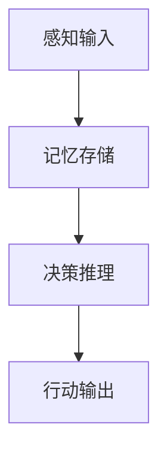
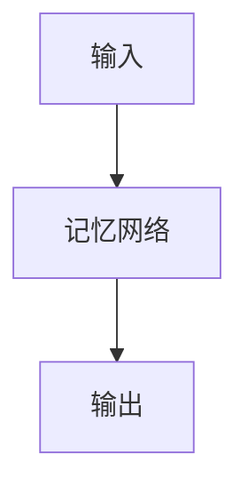
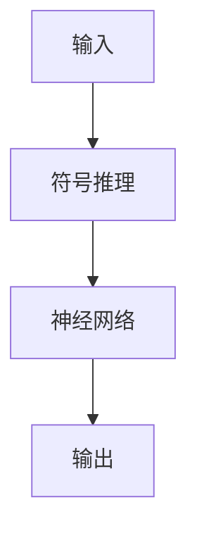
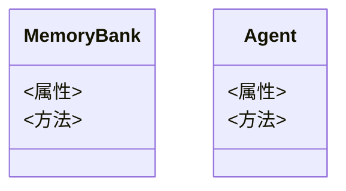
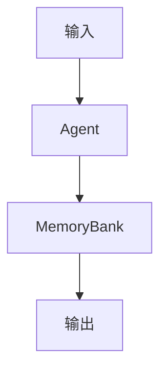
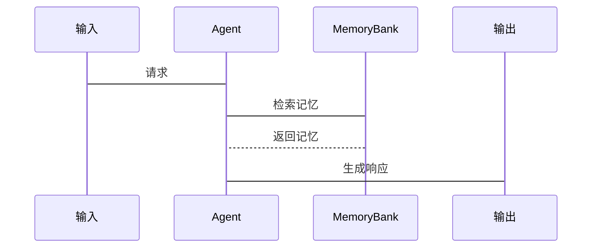

                 


# 从零构建AI Agent的长期记忆机制

## 关键词：AI Agent, 长期记忆机制, 记忆网络, 神经符号网络, 人工智能

## 摘要：AI Agent的长期记忆机制是实现智能体持续学习和自适应能力的核心技术。本文将从基础概念出发，逐步分析长期记忆机制的算法原理、系统架构设计，并通过实际案例展示如何构建一个具备长期记忆能力的AI Agent。文章内容涵盖长期记忆机制的背景、核心概念、数学模型、系统设计、项目实战及总结，为读者提供全面的技术指导。

---

# 第1章: AI Agent长期记忆机制的背景与概念

## 1.1 什么是AI Agent的长期记忆机制
### 1.1.1 AI Agent的基本概念
AI Agent（智能体）是具有感知环境、做出决策并执行行动的智能系统。Agent可以分为简单反射型Agent和复杂型Agent。长期记忆机制是复杂型Agent的核心组件之一，负责存储和检索长期知识，以支持持续的学习和推理。

### 1.1.2 长期记忆机制的定义与作用
长期记忆机制是指AI Agent能够存储、组织和检索长期信息的能力。它通过将新信息与已有知识关联，形成记忆结构，帮助Agent在复杂环境中做出更智能的决策。

### 1.1.3 长期记忆机制与短期记忆机制的区别
| 特性       | 长期记忆机制          | 短期记忆机制          |
|------------|-----------------------|-----------------------|
| 存储时间   | 长期（分钟到 years）   | 短期（秒到分钟）       |
| 内容类型   | 知识、经验、策略       | 当前任务相关信息       |
| 记忆方式   | 结构化、关联性         | 易变性、无结构化       |
| 访问方式   | 基于内容或关联检索     | 基于优先级或先进先出   |

### 1.1.4 长期记忆机制的核心要素
1. **记忆存储**：存储结构化或非结构化的信息。
2. **记忆检索**：根据当前任务或上下文检索相关记忆。
3. **记忆更新**：动态更新记忆内容，以适应新信息和环境变化。

## 1.2 长期记忆机制的背景与应用
### 1.2.1 AI Agent在现实场景中的应用需求
AI Agent广泛应用于聊天机器人、推荐系统、自动驾驶等领域。例如，智能客服需要记住用户的历史对话，以提供更个性化的服务。

### 1.2.2 长期记忆机制在AI Agent中的重要性
长期记忆机制是AI Agent实现持续学习和自适应能力的关键。它帮助Agent在复杂环境中保持一致性、连贯性和高效性。

### 1.2.3 当前技术的挑战与未来发展方向
1. **挑战**：
   - 记忆存储的效率与容量问题。
   - 记忆检索的准确性和实时性问题。
   - 动态环境中的记忆更新策略问题。
2. **未来发展方向**：
   - 结合符号推理和神经网络的混合记忆模型。
   - 基于强化学习的自适应记忆机制。

## 1.3 长期记忆机制的核心概念与联系
### 1.3.1 记忆模型的类型与特点对比
| 记忆模型      | 描述                                                                 |
|---------------|----------------------------------------------------------------------|
| 显式记忆模型   | Agent显式地存储和检索信息，如知识图谱或数据库。                   |
| 隐式记忆模型   | Agent通过隐式学习，将记忆嵌入到神经网络参数中，如Transformer模型。   |
| 基于内容的检索 | 根据内容相似性检索记忆。                                             |
| 基于关联的检索 | 根据上下文关联性检索记忆。                                           |

### 1.3.2 记忆机制与AI Agent行为的关系


---

# 第2章: 长期记忆机制的数学模型与算法原理

## 2.1 记忆检索的数学模型
### 2.1.1 基于概率的检索模型
$$ P(retrieve\ memory) = \frac{e^{score}}{sum\ of\ exponentials} $$
其中，$score$是记忆项与查询的相似度得分。

### 2.1.2 基于向量的检索模型
$$ score = \text{similarity}(v_q, v_m) $$
其中，$v_q$是查询向量，$v_m$是记忆向量，$\text{similarity}$可以是余弦相似度或欧氏距离。

## 2.2 常见的记忆机制算法
### 2.2.1 基于记忆网络的算法


### 2.2.2 基于神经符号网络的算法


### 2.2.3 记忆网络的工作流程
1. **编码输入**：将输入转换为向量形式。
2. **生成查询向量**：基于当前任务生成查询向量。
3. **检索记忆**：根据查询向量检索最相关的记忆项。
4. **生成输出**：结合检索结果生成最终输出。

## 2.3 算法实现的Python代码示例
```python
def retrieve_memory(memory_bank, query):
    scores = [score(query, m) for m in memory_bank]
    return memory_bank[np.argmax(scores)]
```

---

# 第3章: 系统分析与架构设计方案

## 3.1 系统功能设计
### 3.1.1 领域模型设计


### 3.1.2 系统架构设计


## 3.2 接口设计与交互流程
### 3.2.1 系统接口设计


---

# 第4章: 项目实战——构建AI Agent的长期记忆机制

## 4.1 环境安装与配置
1. **安装Python环境**：使用Anaconda或虚拟环境。
2. **安装依赖库**：如numpy、pandas、scikit-learn、transformers等。

## 4.2 系统核心实现
### 4.2.1 记忆存储模块
```python
class MemoryBank:
    def __init__(self):
        self.memories = []
    
    def store(self, memory):
        self.memories.append(memory)
    
    def retrieve(self, query):
        scores = [self.score(query, m) for m in self.memories]
        return self.memories[np.argmax(scores)]
    
    def score(self, query, memory):
        return np.dot(query, memory)
```

### 4.2.2 Agent实现
```python
class Agent:
    def __init__(self, memory_bank):
        self.memory_bank = memory_bank
    
    def act(self, input):
        query = self.generate_query(input)
        memory = self.memory_bank.retrieve(query)
        return self.generate_output(memory)
```

## 4.3 案例分析与代码解读
### 4.3.1 案例背景
构建一个简单的对话AI Agent，能够根据用户的历史对话生成回复。

### 4.3.2 代码实现
```python
# 初始化记忆银行
memory_bank = MemoryBank()
memory_bank.store("用户问候")
memory_bank.store("客服回应")

# 初始化Agent
agent = Agent(memory_bank)

# 用户输入
input = "你好"
# Agent行动
response = agent.act(input)
print(response)
```

### 4.3.3 实际案例分析
通过逐步分析代码，理解长期记忆机制在实际应用中的实现细节。

---

# 第5章: 总结与展望

## 5.1 总结
本文从AI Agent的长期记忆机制的背景、概念、算法原理、系统设计和项目实战等多个方面进行了详细分析。通过理论与实践的结合，帮助读者理解如何构建具备长期记忆能力的AI Agent。

## 5.2 展望
未来，随着AI技术的发展，长期记忆机制将更加智能化和多样化。结合符号推理和神经网络的混合模型，以及基于强化学习的自适应记忆机制，将是研究的重要方向。

---

# 结语
长期记忆机制是AI Agent实现智能交互和持续学习的核心技术。通过本文的详细讲解，读者可以掌握从零构建AI Agent长期记忆机制的完整流程，为未来的AI开发奠定坚实基础。

--- 

希望这篇文章能够为读者提供清晰的思路和实用的技术指导，帮助他们在构建AI Agent的长期记忆机制时少走弯路，快速实现目标。

