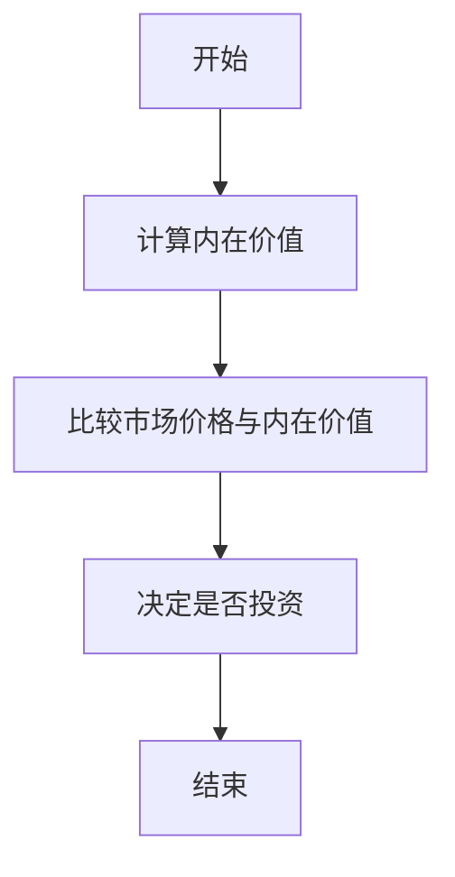
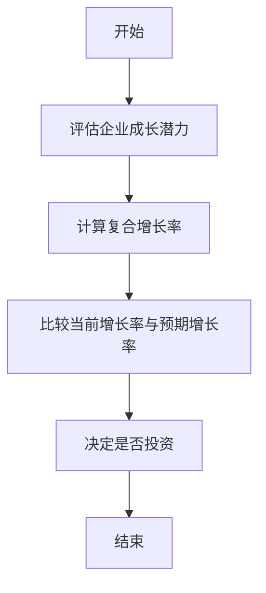
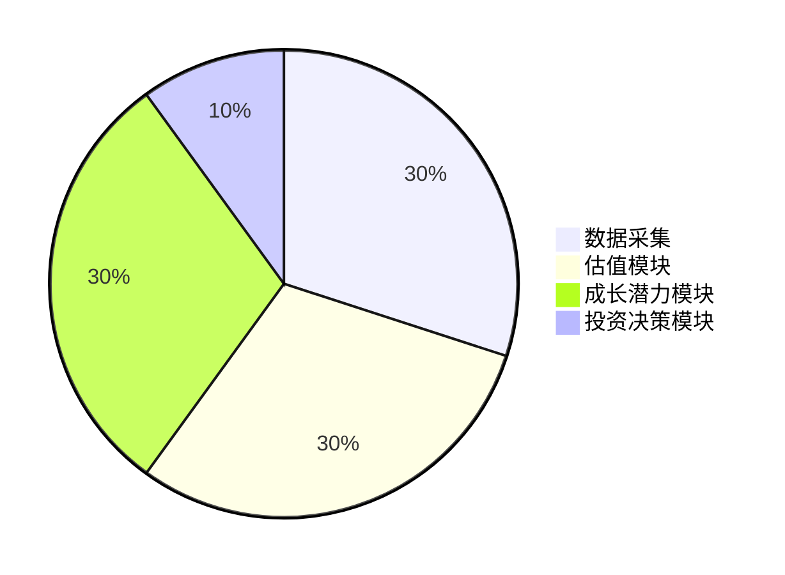
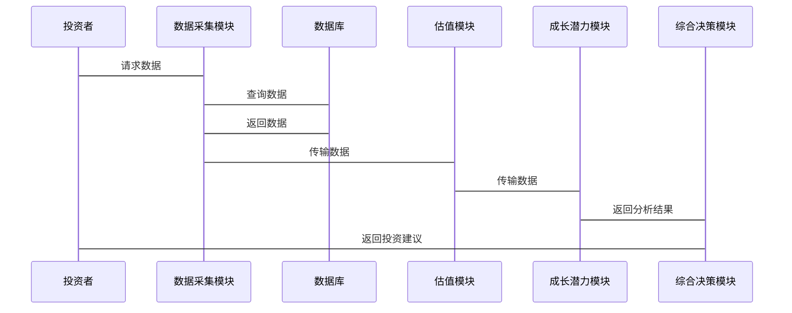

                 


# 价值投资vs成长投资：格雷厄姆与费雪的对比

> 关键词：价值投资，成长投资，格雷厄姆，费雪，投资策略，投资模型，投资决策

> 摘要：本文系统地对比了价值投资与成长投资的核心理念、数学模型和投资策略，通过格雷厄姆与费雪的经典理论分析，结合实际案例，探讨了两种投资方法在不同市场环境下的优劣与适用场景。

---

# 第1章: 价值投资与成长投资的背景与核心理念

## 1.1 价值投资的起源与发展

### 1.1.1 价值投资的起源
价值投资是一种以分析企业内在价值为基础的投资策略，起源于20世纪30年代，由本杰明·格雷厄姆（Benjamin Graham）系统化地提出。格雷厄姆是哥伦比亚大学的教授，被誉为“价值投资之父”。他主张以低于企业内在价值的价格买入股票，从而在市场下跌时获得安全边际。

### 1.1.2 格雷厄姆的投资理念
格雷厄姆的价值投资理念可以总结为以下几点：
1. **安全边际**：买入价格远低于企业内在价值的股票，以降低投资风险。
2. **市场情绪**：市场先生是疯狂的，价格波动是机会而非风险。
3. **长期视角**：关注企业的基本面，而非短期市场波动。

### 1.1.3 价值投资的核心原则
- 以合理价格买入优质企业。
- 避免情绪化投资，坚持基本面分析。
- 长期持有优质资产，耐心等待价值回归。

---

## 1.2 成长投资的起源与发展

### 1.2.1 成长投资的起源
成长投资起源于20世纪50年代，由菲利普·费雪（Philip Fisher）提出。费雪认为，投资的最终收益取决于企业的成长潜力，而非单纯的价格波动。他强调选择那些具有强大成长潜力的企业，并长期持有。

### 1.2.2 费雪的投资理念
费雪的成长投资理念可以总结为以下几点：
1. **关注企业成长性**：选择那些具有持续增长潜力的企业。
2. **竞争优势**：投资具有强大护城河的企业，能够长期保持竞争优势。
3. **长期持有**：耐心等待企业的成长兑现。

### 1.2.3 成长投资的核心原则
- 买入具有强大成长潜力的企业。
- 关注企业的竞争优势和长期增长能力。
- 长期持有优质成长股，享受复利效应。

---

## 1.3 价值投资与成长投资的对比

### 1.3.1 核心理念的对比
| 对比维度 | 价值投资 | 成长投资 |
|----------|----------|----------|
| 核心目标 | 以低于内在价值的价格买入资产 | 买入具有成长潜力的企业 |
| 关注点   | 价格、估值 | 成长性、竞争优势 |
| 风险控制 | 以安全边际降低风险 | 以成长潜力降低风险 |

### 1.3.2 投资策略的差异
- 价值投资倾向于逆向投资，寻找市场忽视的低估资产。
- 成长投资倾向于前瞻性投资，寻找未来有潜力的企业。

### 1.3.3 投资目标的异同
- 相同点：长期投资，追求超额收益。
- 不同点：价值投资关注短期估值，成长投资关注长期增长。

---

# 第2章: 价值投资与成长投资的核心概念对比

## 2.1 核心概念的对比分析

### 2.1.1 投资策略的对比
- 价值投资：**买入低估资产**，关注市场情绪和估值。
- 成长投资：**买入高成长资产**，关注企业潜力和竞争优势。

### 2.1.2 选股标准的对比
| 标准 | 价值投资 | 成长投资 |
|------|----------|----------|
| 估值 | 低市盈率、低市净率 | 高成长性、高ROE |
| 行业 | 偏好低增长、低估值行业 | 偏好高增长行业 |
| 财务指标 | 低PE、低PB | 高ROE、高净利润增长率 |

### 2.1.3 风险控制的对比
- 价值投资：通过安全边际控制风险。
- 成长投资：通过选择优质成长股降低风险。

---

## 2.2 核心概念的联系与整合

### 2.2.1 价值与成长的动态平衡
- 在市场低迷时，价值投资占优。
- 在市场高增长时，成长投资占优。

### 2.2.2 不同市场环境下的策略选择
| 市场环境 | 价值投资适用性 | 成长投资适用性 |
|----------|----------------|----------------|
| 牛市     | 较低            | 较高            |
| 熊市     | 较高            | 较低            |
| 震荡市   | 中等            | 中等            |

### 2.2.3 投资组合的优化配置
- 价值投资者可以通过配置成长股来增强收益。
- 成长投资者可以通过配置价值股来降低风险。

---

# 第3章: 价值投资与成长投资的数学模型与算法原理

## 3.1 价值投资的数学模型

### 3.1.1 格雷厄姆的内在价值公式
$$ V = \frac{E}{(1 + r)^n} $$
其中：
- \( V \) 为内在价值
- \( E \) 为未来现金流
- \( r \) 为折现率
- \( n \) 为时间跨度

### 3.1.2 股息贴现模型（DDM）
$$ P = \frac{D}{k - g} $$
其中：
- \( P \) 为股票价格
- \( D \) 为股息
- \( k \) 为折现率
- \( g \) 为股息增长率

---

## 3.2 成长投资的数学模型

### 3.2.1 费雪的复合增长率公式
$$ G = \sqrt[n]{\frac{P_n}{P_0}} - 1 $$
其中：
- \( G \) 为复合增长率
- \( P_n \) 为n年后的股价
- \( P_0 \) 为初始股价

### 3.2.2 动态市盈率模型
$$ DDM = \frac{E}{E/P} $$
其中：
- \( DDM \) 为动态市盈率
- \( E \) 为企业盈利
- \( P \) 为股价

---

## 3.3 价值与成长投资的算法对比

### 3.3.1 价值投资的算法流程图


### 3.3.2 成长投资的算法流程图


---

# 第4章: 价值投资与成长投资的系统分析与架构设计

## 4.1 投资决策系统的总体架构

### 4.1.1 系统功能模块划分
- 数据采集模块：收集市场数据
- 估值模块：计算内在价值和动态市盈率
- 成长潜力模块：评估企业成长潜力
- 投资决策模块：基于模型输出投资建议

### 4.1.2 系统架构设计


---

## 4.2 投资决策系统的功能设计

### 4.2.1 价值投资模块
- 输入：股票价格、财务数据
- 输出：内在价值、安全边际

### 4.2.2 成长投资模块
- 输入：股票价格、财务数据
- 输出：复合增长率、动态市盈率

### 4.2.3 综合决策模块
- 输入：价值投资和成长投资结果
- 输出：综合投资建议

---

## 4.3 系统交互与流程

### 4.3.1 系统交互序列图


---

# 第5章: 价值投资与成长投资的项目实战

## 5.1 虚拟投资案例

### 5.1.1 价值投资案例
假设某股票当前价格为$50，其内在价值为$60。根据价值投资策略，买入该股票。

### 5.1.2 成长投资案例
假设某股票当前价格为$50，其复合年增长率为20%，远高于行业平均水平。根据成长投资策略，买入该股票。

---

## 5.2 代码实现与解读

### 5.2.1 价值投资代码
```python
def calculate_intrinsic_value(enterprise_value, free_cash_flow, discount_rate, years):
    return enterprise_value / (1 + discount_rate) ** years
```

### 5.2.2 成长投资代码
```python
def calculate_growth_rate(revenue, years):
    return (revenue[-1] / revenue[0]) ** (1 / years) - 1
```

---

## 5.3 案例分析与解读

### 5.3.1 价值投资案例分析
- 输入：企业价值$100M，自由现金流$20M，折现率5%，年数5年
- 输出：内在价值$142.05M，当前股价$100M，建议买入。

### 5.3.2 成长投资案例分析
- 输入：企业营收从$10M增长到$160M，5年
- 输出：复合增长率80%，建议买入。

---

# 第6章: 价值投资与成长投资的最佳实践

## 6.1 最佳实践 tips

### 6.1.1 价值投资
- 确保安全边际
- 避免情绪化交易
- 长期持有优质资产

### 6.1.2 成长投资
- 选择具有强大竞争优势的企业
- 关注长期增长潜力
- 保持投资组合的分散化

---

## 6.2 小结

- 价值投资与成长投资各有优劣，适合不同的市场环境。
- 通过合理配置两种策略，可以优化投资组合的风险收益比。

---

## 6.3 注意事项

- 避免盲目跟风，结合市场环境选择策略。
- 定期审视投资组合，及时调整。
- 保持耐心，长期投资才能获得复利收益。

---

## 6.4 拓展阅读

- 《The Intelligent Investor》 - 本杰明·格雷厄姆
- 《Common Stocks and Uncommon Profits》 - 菲利普·费雪

---

# 结语

通过对比格雷厄姆的价值投资与费雪的成长投资，我们可以看到两种策略在理念、模型和实践中的异同。投资者可以根据市场环境和个人风险偏好，灵活运用这两种策略，实现长期稳健的投资收益。

