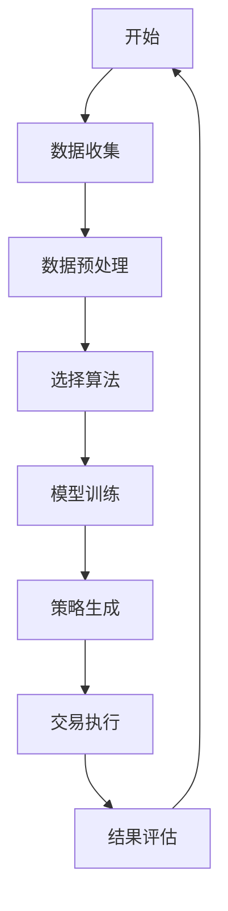

                 


# 价值投资vs量化投资：传统与现代的碰撞

## 关键词
- 价值投资
- 量化投资
- 传统投资
- 现代投资
- 投资策略
- 股票交易
- 数学模型

## 摘要
价值投资和量化投资是两种截然不同的投资策略。价值投资强调基本面分析和长期持有，而量化投资依赖数学模型和算法进行高频交易。本文深入分析两者的优缺点、应用场景，并探讨它们的融合与未来发展，为投资者提供多维度的视角和策略选择。

## 正文

### 第1章 价值投资与量化投资的背景与概念

#### 1.1 价值投资的起源与发展

##### 1.1.1 价值投资的定义与核心思想
价值投资是一种基于公司基本面分析的投资策略，由本杰明·格雷厄姆和戴维·多德提出。其核心思想是购买低于内在价值的股票，长期持有，等待其价值回归。

##### 1.1.2 价值投资的起源与历史发展
价值投资起源于20世纪30年代，格雷厄姆的学生彼得·林奇将其发扬光大，巴菲特也是其忠实追随者。价值投资在历史上多次证明了其盈利能力。

##### 1.1.3 价值投资的现状与应用领域
当前，价值投资在机构和个人投资者中广泛应用，尤其是在寻找低估股票时。然而，随着市场的变化，其挑战也在增加，如信息不对称和流动性问题。

#### 1.2 量化投资的定义与特点

##### 1.2.1 量化投资的定义
量化投资利用数学模型和算法，通过大量数据分析来寻找投资机会，强调纪律性和系统性。

##### 1.2.2 量化投资的核心特征
量化投资依赖技术分析、统计套利和高频交易，强调速度和规模，通过算法优化投资组合。

##### 1.2.3 量化投资与传统投资的区别
价值投资注重长期基本面，而量化投资注重短期数据和技术分析；价值投资依赖人类判断，量化投资依赖算法和数据。

#### 1.3 价值投资与量化投资的对比

##### 1.3.1 两者的异同点对比
- 异同点：价值投资关注长期价值，量化投资关注短期数据；两者都追求超额收益。
- 优缺点对比：价值投资风险较低，回报周期长；量化投资风险较高，回报周期短。

##### 1.3.2 传统投资与现代投资的碰撞
传统投资依赖经验和判断，现代投资依赖数据和算法，两者在效率和准确性上各有优劣。

##### 1.3.3 价值投资与量化投资的融合趋势
越来越多的投资者尝试将两者结合，利用基本面和技术分析，制定综合投资策略。

### 第2章 价值投资的理论与实践

#### 2.1 价值投资的理论基础

##### 2.1.1 投资学的基本原理
投资学包括资产定价、投资组合管理和风险管理等基本理论。

##### 2.1.2 价值投资的核心理论
- 内在价值理论：股票的真正价值是其未来现金流的现值。
- 市场先生理论：市场波动反映短期情绪，而非长期价值。

##### 2.1.3 价值投资的哲学基础
价值投资强调安全边际、独立思考和长期视角，倡导逆向投资。

#### 2.2 价值投资的实践策略

##### 2.2.1 基本面分析的方法
- 财务报表分析：评估公司盈利能力、成长性和财务健康。
- 行业分析：研究行业前景和竞争格局。
- 公司治理：考察管理层和治理结构。

##### 2.2.2 价值投资的选股方法
- 寻找低估股票：市盈率、市净率低于行业平均水平。
- 质优股：行业龙头，财务健康，竞争优势明显。

##### 2.2.3 价值投资的风险控制
- 分散投资：避免过度集中。
- 安全边际：买入价格低于内在价值。
- 耐心持有：长期持有优质股，避免频繁交易。

#### 2.3 价值投资的成功案例

##### 2.3.1 需求导向型投资案例
如巴菲特投资 Coca-Cola，看重其品牌价值和稳定现金流。

##### 2.3.2 价值回归型投资案例
如在互联网泡沫后投资亚马逊，因其低估而逐渐增值。

##### 2.3.3 长期持有型投资案例
如长期持有可口可乐，分享其长期增长收益。

### 第3章 量化投资的算法与应用

#### 3.1 量化投资的数学基础

##### 3.1.1 数据分析与统计学基础
统计套利、时间序列分析和回归分析是量化投资的核心工具。

##### 3.1.2 量化投资的核心理论
- 技术分析：利用价格和成交量数据预测未来走势。
- 统计套利：利用资产定价偏差获利。

##### 3.1.3 数学模型的构建
- 均值-方差优化：构造最优投资组合。
- 马科维茨有效前沿：最大化收益，最小化风险。

#### 3.2 量化投资的算法实现

##### 3.2.1 算法流程图


##### 3.2.2 算法实现代码
```python
import pandas as pd
import numpy as np

def compute_momentum(data, window=20):
    return data['close'].rolling(window).mean()

data = pd.read_csv('stock_data.csv')
momentum = compute_momentum(data)
print(momentum)
```

#### 3.3 量化投资的应用场景

##### 3.3.1 高频交易
利用算法在毫秒级别完成交易，捕捉短期价格波动。

##### 3.3.2 统计套利
利用资产定价偏差，通过做多低估资产、做空高估资产获利。

##### 3.3.3 算法交易
根据预先设定的规则自动执行交易，减少人为干扰。

### 第4章 对比分析与融合策略

#### 4.1 价值投资与量化投资的优缺点对比

| 特性         | 价值投资                   | 量化投资                   |
|--------------|---------------------------|---------------------------|
| 投资策略     | 长期持有，基本面分析       | 短期交易，技术分析         |
| 数据需求     | 中低频数据                 | 高频数据                   |
| 风险控制     | 低风险，长期回报           | 高风险，短期回报           |
| 适用场景     | 中小盘股，价值低估股票     | 大盘股，市场流动性好       |

#### 4.2 价值投资与量化投资的融合

##### 4.2.1 半定量投资策略
结合基本面和技术分析，制定投资决策。

##### 4.2.2 风险管理的结合
利用量化模型评估风险，结合价值投资的安全边际。

##### 4.2.3 系统性投资策略
通过量化手段筛选价值股，进行系统性投资。

### 第5章 价值投资与量化投资的未来发展

#### 5.1 技术进步对投资的影响

##### 5.1.1 人工智能的崛起
AI技术提升数据分析能力，优化投资策略。

##### 5.1.2 大数据分析的应用
通过大数据分析，发现新的投资机会，提升投资效率。

#### 5.2 市场变化与投资策略调整

##### 5.2.1 ESG投资的兴起
环境、社会和治理因素成为投资新标准。

##### 5.2.2 市场流动性的变化
市场流动性影响量化交易，价值投资更注重长期价值。

#### 5.3 未来投资策略的展望

##### 5.3.1 技术驱动的投资策略
AI和大数据将改变投资方式，推动投资策略的创新。

##### 5.3.2 可持续投资的发展
ESG投资和责任投资成为主流，推动投资策略向可持续方向发展。

### 附录

#### 附录A 价值投资与量化投资工具

##### A.1 数据分析工具
- Python：Pandas, NumPy
- 统计套利工具：Zipline, QuantLib

##### A.2 量化交易平台
- Interactive Brokers
- QuantInst

##### A.3 价值投资研究工具
- FactSet
- Thomson Reuters

#### 附录B 经典书籍与文献

##### B.1 经典书籍
- 《The Intelligent Investor》——本杰明·格雷厄姆
- 《Quantitative Equity Portfolio Management》——De Prisco & Solnik

##### B.2 相关文献
- Fama, E. (1970). Efficient Capital Markets: A Review of Theory and Practice.
- Bates, D. S. (1995). The Crash of '81: A Quantitative Test of Market Rationality.

#### 附录C 价值投资与量化投资案例分析

##### C.1 价值投资案例
- 投资苹果公司：长期持有，分享创新收益。

##### C.2 量化投资案例
- 利用算法交易捕捉短期价格波动，实现快速盈利。

### 总结

价值投资与量化投资各有优劣，投资者应根据自身目标、风险承受能力和市场环境选择合适策略。未来的投资将更加依赖技术与数据，但基本面分析和长期视角仍不可或缺。通过融合两种策略，投资者可以制定更灵活和高效的投资计划，应对市场的复杂变化。

---

以上是《价值投资vs量化投资：传统与现代的碰撞》的完整目录和文章内容。

