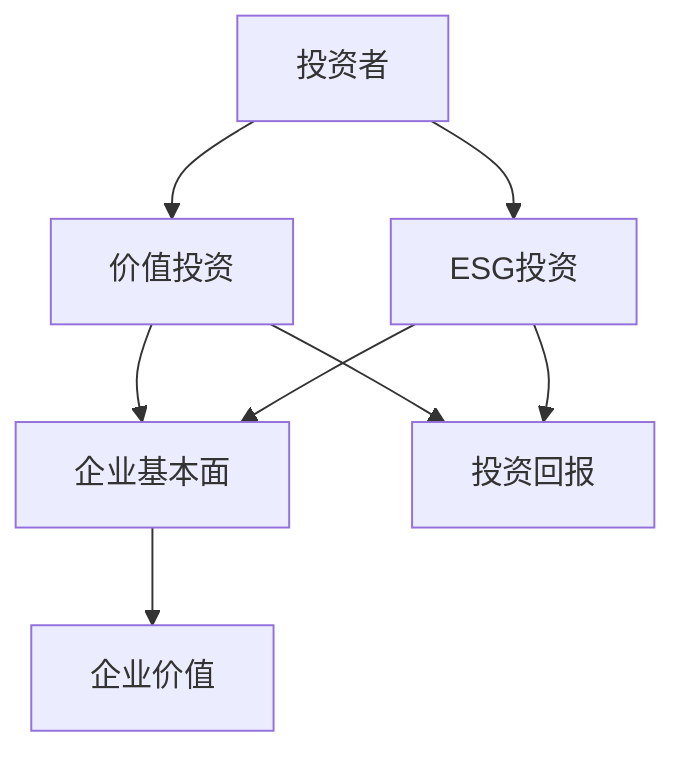
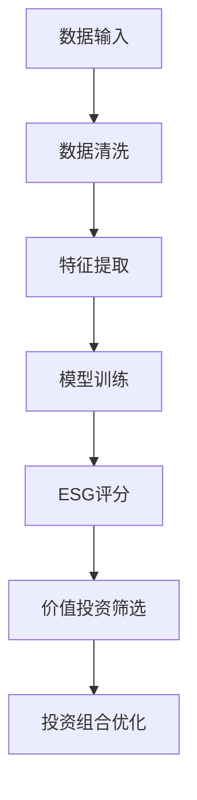

                 


# 价值投资与ESG：社会责任投资的融合

> 关键词：价值投资、ESG、社会责任投资、投资策略、风险管理、可持续发展、数据驱动

> 摘要：本文探讨了价值投资与ESG（环境、社会、治理）标准的融合，分析了其在社会责任投资中的应用，提出了数据驱动的ESG评分模型和价值投资筛选模型的融合方法，结合实际案例展示了如何通过融合提升投资收益与社会责任的双重目标。

---

# 第一部分: 价值投资与ESG的背景与概念

## 第1章: 价值投资与ESG的概述

### 1.1 价值投资的核心理念

#### 1.1.1 价值投资的定义与起源
价值投资是一种投资策略，起源于20世纪20年代，由本杰明·格雷厄姆和戴维·多德提出。其核心理念是通过分析企业的基本面，寻找市场价格低于其内在价值的股票进行投资。这种方法强调安全边际，即买入价格远低于企业真实价值的股票。

#### 1.1.2 价值投资的核心原则
价值投资的核心原则包括：
1. **安全边际**：买入价格低于内在价值。
2. **长期视角**：关注企业的长期盈利能力。
3. **逆向思维**：在市场恐慌时寻找被低估的投资标的。

#### 1.1.3 价值投资在现代投资中的地位
在现代投资理论中，价值投资与现代资产组合理论（MPT）和有效市场假说（EMH）存在一定的冲突。然而，近年来，价值投资因其在长期收益上的稳定性，仍然受到投资者的青睐。

### 1.2 ESG的概念与内涵

#### 1.2.1 ESG的定义与组成部分
ESG是环境（Environmental）、社会（Social）和治理（Governance）三个维度的缩写，是衡量企业可持续发展能力的重要标准。环境维度关注企业的环保表现，社会维度关注企业对社会的贡献，治理维度关注企业内部管理的透明度和公平性。

#### 1.2.2 ESG评级体系的发展历程
ESG评级体系起源于20世纪60年代的社会责任投资（SRI）运动。随着全球可持续发展目标的提出，ESG评级体系逐渐成为衡量企业社会责任的重要工具。

#### 1.2.3 ESG在投资中的重要性
ESG在投资中的重要性体现在以下方面：
1. **风险管理**：企业ESG表现差可能导致声誉损失和法律风险。
2. **长期收益**：高ESG表现的企业通常具有更强的可持续发展能力。
3. **合规要求**：越来越多的国家和机构要求投资机构披露ESG表现。

### 1.3 价值投资与ESG的融合背景

#### 1.3.1 社会责任投资的兴起
随着全球气候变化、社会不平等和企业治理问题的加剧，社会责任投资（SRI）逐渐兴起，成为投资者关注的焦点。

#### 1.3.2 价值投资与ESG的契合点
价值投资关注企业的基本面，而ESG关注企业的社会责任表现。两者的契合点在于，高ESG表现的企业通常具有更强的长期盈利能力，符合价值投资的内在价值理念。

#### 1.3.3 全球可持续发展趋势
全球可持续发展趋势推动了ESG投资的普及，而价值投资的长期视角与之高度契合，因此两者融合成为必然趋势。

---

## 第2章: 价值投资与ESG的核心概念对比

### 2.1 价值投资与ESG的属性特征对比

| 属性维度       | 价值投资                     | ESG                         |
|----------------|------------------------------|------------------------------|
| 投资目标         | 寻找市场价格低于内在价值的股票 | 寻找在环境、社会、治理方面表现优秀的公司 |
| 投资策略         | 基于基本面分析，注重安全边际   | 基于ESG评分，注重社会责任表现 |
| 风险管理         | 通过安全边际降低投资风险     | 通过ESG表现降低企业和社会风险 |

### 2.2 价值投资与ESG的实体关系图



---

## 第3章: 价值投资与ESG的融合机制

### 3.1 ESG评分模型的构建

#### 3.1.1 ESG评分指标体系
ESG评分指标通常包括以下方面：
1. **环境**：碳排放、能源消耗、环保合规性。
2. **社会**：员工权益、社会责任、产品安全。
3. **治理**：董事会结构、高管薪酬、股权结构。

#### 3.1.2 ESG评分算法
ESG评分算法通常基于加权平均法，具体公式如下：

$$ ESG\_score = \sum_{i=1}^{n} w_i \cdot score_i $$

其中，$w_i$是指标$i$的权重，$score_i$是指标$i$的评分（0-1分）。

#### 3.1.3 ESG评分的验证与优化
通过历史数据分析和机器学习算法（如随机森林、XGBoost）对ESG评分模型进行优化，以提高评分的准确性和一致性。

### 3.2 价值投资筛选模型的改进

#### 3.2.1 传统价值投资筛选标准
传统价值投资筛选标准包括低市盈率、低市净率、高股息率等。

#### 3.2.2 ESG因素在价值投资中的应用
在传统价值投资筛选标准的基础上，引入ESG评分作为筛选条件，优先选择ESG评分高的公司。

#### 3.2.3 融合后的投资策略优化
融合后的投资策略公式如下：

$$ ValueScore = \frac{内在价值}{市场价格} \times ESG\_score $$

---

## 第4章: 价值投资与ESG融合的算法实现

### 4.1 ESG评分算法

#### 4.1.1 数据收集与预处理
数据来源包括企业公开披露的财务数据、ESG评级机构的数据等。

#### 4.1.2 指标权重计算
指标权重可以通过主成分分析（PCA）或熵值法确定。

#### 4.1.3 综合评分计算
通过加权求和计算ESG综合评分。

### 4.2 价值投资筛选算法

#### 4.2.1 企业基本面分析
计算企业的内在价值，包括自由现金流、折现率等。

#### 4.2.2 ESG评分融合
将ESG评分作为筛选条件，优化价值投资策略。

#### 4.2.3 投资组合优化
通过马科维茨均值-方差模型优化投资组合，平衡收益与风险。

### 4.3 算法流程图



---

## 第5章: 价值投资与ESG融合的系统架构设计

### 5.1 系统功能设计

#### 5.1.1 数据采集模块
负责采集企业公开数据和ESG评级数据。

#### 5.1.2 数据处理模块
对数据进行清洗、特征提取和标准化处理。

#### 5.1.3 ESG评分模块
基于机器学习模型计算ESG综合评分。

#### 5.1.4 价值投资筛选模块
结合ESG评分和企业基本面数据，筛选出符合价值投资标准的股票。

#### 5.1.5 投资组合优化模块
优化投资组合，平衡收益与风险。

### 5.2 系统架构设计


---

## 第6章: 项目实战

### 6.1 环境安装

```bash
pip install pandas numpy scikit-learn matplotlib
```

### 6.2 核心代码实现

```python
import pandas as pd
import numpy as np
from sklearn.preprocessing import StandardScaler
from sklearn.ensemble import RandomForestRegressor

# 数据预处理
data = pd.read_csv('input.csv')
X = data.drop(columns=['target'])
y = data['target']

# 标准化
scaler = StandardScaler()
X_scaled = scaler.fit_transform(X)

# 训练ESG评分模型
model = RandomForestRegressor()
model.fit(X_scaled, y)

# 预测ESG评分
predicted_esg = model.predict(X_scaled)
```

### 6.3 实际案例分析
以某行业为例，分析融合后的投资策略在实际中的应用效果。

### 6.4 项目小结
通过实际案例分析，验证了价值投资与ESG融合策略的有效性，为投资者提供了新的思路。

---

## 第7章: 最佳实践与总结

### 7.1 小结
价值投资与ESG的融合是社会责任投资的重要趋势，能够有效提升投资收益与社会责任的双重目标。

### 7.2 注意事项
在实际应用中，需要注意数据质量、模型优化和投资策略的动态调整。

### 7.3 拓展阅读
推荐相关书籍和论文，供读者进一步学习。

---

通过以上分析，我们详细探讨了价值投资与ESG融合的背景、概念、算法实现和系统架构设计，并通过实际案例验证了其可行性。希望本文能够为投资者和社会责任投资领域提供新的思路和参考。

