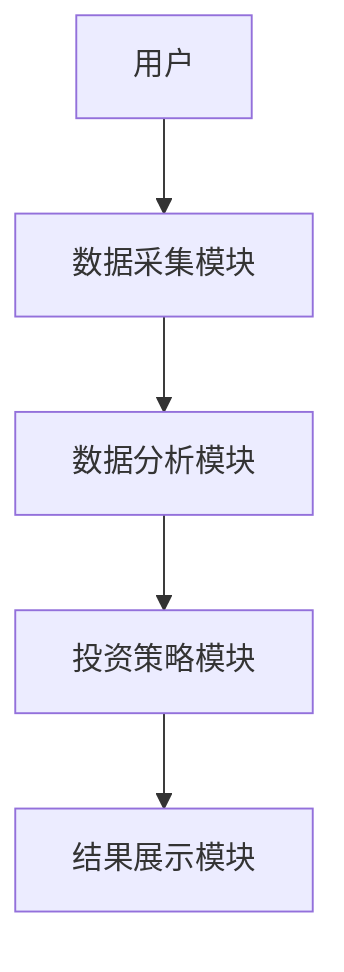
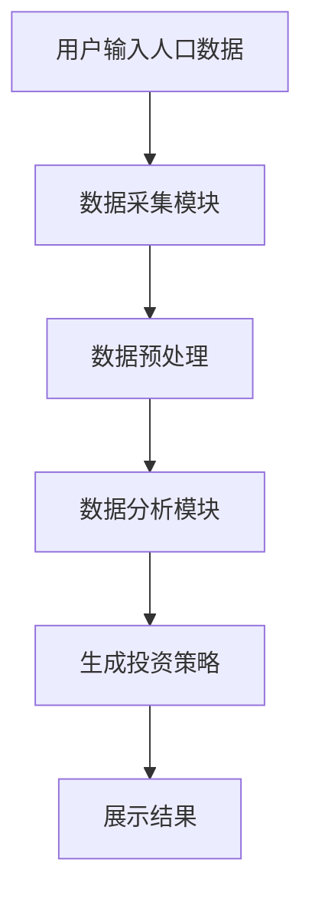

                 


# 价值投资与人口统计学：把握人口结构变化带来的机遇

## 关键词：价值投资，人口统计学，人口结构变化，投资策略，数据分析

## 摘要：本文探讨了如何将价值投资与人口统计学相结合，分析人口结构变化对投资决策的影响。通过背景介绍、核心概念、算法原理、系统架构和项目实战，详细阐述了如何利用人口统计数据进行投资分析，提供实际案例和代码实现，为投资者提供新的视角和策略。

---

# 第一部分：背景与核心概念

## 第1章：价值投资与人口统计学概述

### 1.1 价值投资的基本概念

#### 1.1.1 价值投资的定义与核心理念
价值投资是一种投资策略，强调以低于公平市场价值的价格购买具有内在价值的资产。其核心理念包括长期投资、安全边际和对公司基本面的深入分析。

#### 1.1.2 价值投资与人口统计学的结合
人口统计学研究人口结构的变化，如年龄分布、性别比例和人口迁移，这些变化直接影响消费习惯和投资行为。将价值投资与人口统计学结合，可以帮助投资者预测未来市场趋势。

#### 1.1.3 人口结构变化对投资决策的影响
人口结构变化影响劳动力市场、消费模式和资产需求，从而影响股市、债市和房地产市场的表现。投资者需关注人口变化，调整投资组合。

---

### 1.2 人口统计学的基本概念

#### 1.2.1 人口结构的定义与组成
人口结构包括年龄、性别、职业和教育水平等变量，分析这些变量有助于预测未来的经济趋势。

#### 1.2.2 不同人口阶段的特征
不同年龄段的人口具有不同的消费习惯和投资行为，例如年轻人更倾向于消费，而中老年人更倾向于储蓄和投资。

#### 1.2.3 人口统计学在投资中的应用
投资者可以通过分析人口统计数据，预测未来的市场需求和资产价格走势，从而制定更有效的投资策略。

---

# 第二部分：人口结构变化的经济学分析

## 第2章：人口结构变化的经济学分析

### 2.1 不同人口阶段的特征

#### 2.1.1 年轻人口的消费习惯
年轻人通常消费较高，对科技产品和新兴行业的需求较大，推动相关产业的增长。

#### 2.1.2 中年人口的储蓄与投资行为
中年人口更倾向于储蓄和投资，如房地产和股票，以保障未来退休生活。

#### 2.1.3 老年人口的资产配置
老年人口更关注资产保值，倾向于低风险投资，如债券和现金，影响资本市场的流动性。

### 2.2 人口结构变化对经济的影响

#### 2.2.1 劳动力市场的变化
人口结构变化影响劳动力供给，例如年轻人比例下降可能导致劳动力短缺，推高工资水平。

#### 2.2.2 消费结构的演变
人口老龄化可能导致消费结构从年轻化转向老年化，增加医疗和养老服务的需求。

#### 2.2.3 资本市场的资金流动
人口结构变化影响资本市场的资金流动，例如年轻人增加可能推动科技股上涨，而老年人增加可能推动债券价格上涨。

---

# 第三部分：人口结构对投资的影响

## 第3章：人口结构变化与投资策略

### 3.1 人口结构变化对消费的影响

#### 3.1.1 消费模式的转变
人口结构变化导致消费模式从年轻化转向老年化，影响零售、医疗和养老服务行业。

#### 3.1.2 不同年龄段的消费偏好
年轻人偏好科技产品和娱乐，而中老年人偏好健康和旅游，投资者需调整投资组合以适应这些变化。

### 3.2 人口结构变化对资产配置的影响

#### 3.2.1 不同资产类别在不同人口阶段的表现
年轻人可能更适合投资科技股和创业公司，而中老年人更适合投资债券和房地产。

#### 3.2.2 人口结构变化对房地产市场的影响
人口老龄化可能导致房地产需求下降，尤其是年轻人比例下降，影响房地产市场的供需关系。

---

## 第四部分：数据分析与模型构建

## 第4章：基于人口统计学的投资分析方法

### 4.1 数据收集与处理

#### 4.1.1 数据来源
数据来源包括政府统计数据、市场调研和企业财报。通过收集不同年龄段的消费和投资数据，分析人口结构变化。

#### 4.1.2 数据清洗与预处理
数据清洗包括去除异常值和填补缺失值，预处理包括标准化和特征选择，确保数据适合建模。

### 4.2 数据分析与建模

#### 4.2.1 数据分析方法
使用回归分析、聚类分析和时间序列分析，识别人口结构变化与投资回报之间的关系。

#### 4.2.2 数学模型构建
建立人口结构变化对投资收益影响的数学模型，例如线性回归模型：

$$ R_i = \beta_0 + \beta_1Age_{i} + \beta_2Income_{i} + \epsilon_i $$

其中，$R_i$是投资回报，$Age_i$是人口年龄结构，$Income_i$是收入水平，$\epsilon_i$是误差项。

### 4.3 模型验证与优化

#### 4.3.1 模型验证
使用历史数据验证模型准确性，计算R²值和残差分析，评估模型的拟合优度。

#### 4.3.2 模型优化
通过调整参数和引入新变量，优化模型性能，例如引入人口迁移变量。

---

## 第五部分：系统架构与实现

## 第5章：系统架构设计

### 5.1 问题场景介绍
设计一个基于人口统计学的投资分析系统，帮助投资者根据人口变化调整投资策略。

### 5.2 项目介绍
系统功能包括数据采集、数据分析、投资策略生成和结果展示。用户可以输入人口数据，获得投资建议。

### 5.3 系统功能设计

#### 5.3.1 数据采集模块
通过API接口获取政府统计数据和市场调研数据，实时更新人口结构信息。

#### 5.3.2 数据分析模块
使用Python的pandas和numpy库处理数据，应用机器学习算法进行预测。

#### 5.3.3 投资策略模块
根据分析结果生成投资策略，例如推荐科技股或债券。

#### 5.3.4 结果展示模块
以图表形式展示分析结果，帮助用户直观理解人口变化对投资的影响。

### 5.4 系统架构设计

#### 5.4.1 系统架构图
使用Mermaid绘制系统架构图，展示各模块之间的关系：



#### 5.4.2 系统交互流程
使用Mermaid绘制系统交互流程图：



---

## 第六部分：项目实战

## 第6章：项目实战与代码实现

### 6.1 环境安装

#### 6.1.1 安装Python
安装Python 3.x版本，确保环境满足项目需求。

#### 6.1.2 安装依赖库
安装pandas、numpy、scikit-learn和matplotlib库：

```bash
pip install pandas numpy scikit-learn matplotlib
```

### 6.2 数据采集与处理

#### 6.2.1 数据采集
从政府统计数据网站获取人口数据，保存为CSV格式。

#### 6.2.2 数据预处理
使用pandas库清洗数据，处理缺失值和异常值：

```python
import pandas as pd

# 读取数据
data = pd.read_csv('population.csv')

# 处理缺失值
data.dropna(inplace=True)

# 标准化数据
data['age'] = data['age'].astype(int)
```

### 6.3 数据分析与建模

#### 6.3.1 数据分析
使用pandas和numpy库进行数据分析，识别人口结构变化趋势：

```python
import numpy as np

# 计算平均年龄
average_age = np.mean(data['age'])
print(f"平均年龄：{average_age}")
```

#### 6.3.2 建立数学模型
使用线性回归模型预测投资回报：

```python
from sklearn.linear_model import LinearRegression

# 创建模型
model = LinearRegression()

# 训练模型
model.fit(data[['age', 'income']], data['return'])
```

### 6.4 投资策略生成

#### 6.4.1 预测投资回报
使用训练好的模型预测未来的人口结构变化带来的投资回报：

```python
# 预测回报
predicted_return = model.predict(new_data[['age', 'income']])
print(f"预测回报：{predicted_return}")
```

#### 6.4.2 生成投资建议
根据预测结果，生成投资建议，例如推荐科技股或债券：

```python
if predicted_return > 0.05:
    print("建议投资科技股")
else:
    print("建议投资债券")
```

### 6.5 结果展示

#### 6.5.1 可视化结果
使用matplotlib库绘制图表，展示人口结构变化与投资回报的关系：

```python
import matplotlib.pyplot as plt

# 绘制散点图
plt.scatter(data['age'], data['return'])
plt.xlabel('Age')
plt.ylabel('Return')
plt.title('人口年龄与投资回报关系')
plt.show()
```

---

## 第七部分：总结与展望

## 第7章：总结与最佳实践

### 7.1 总结
本文通过分析人口结构变化对投资的影响，结合价值投资策略，提供了基于人口统计学的投资分析方法。通过系统设计和项目实战，展示了如何利用数据科学工具进行投资决策。

### 7.2 最佳实践

#### 7.2.1 数据收集
确保数据来源可靠，数据清洗和预处理是关键步骤。

#### 7.2.2 模型选择
根据实际需求选择合适的算法，进行充分的模型验证和优化。

#### 7.2.3 投资策略
结合人口结构变化和市场趋势，制定灵活的投资策略。

### 7.3 小结
人口结构变化是影响投资决策的重要因素，投资者需密切关注人口统计数据，结合价值投资理念，制定科学的投资策略。

---

## 第八部分：注意事项与拓展阅读

## 第8章：注意事项与拓展阅读

### 8.1 注意事项

#### 8.1.1 数据准确性
确保数据来源可靠，避免因数据错误导致决策失误。

#### 8.1.2 模型局限性
认识到模型的局限性，避免过度依赖模型预测。

#### 8.1.3 市场风险
投资有风险，需做好风险管理和资产配置。

### 8.2 拓展阅读

#### 8.2.1 相关书籍
- 《价值投资实战》
- 《人口统计学与经济发展》

#### 8.2.2 网络资源
- 专业投资论坛
- 数据科学博客

---

## 附录：代码与工具

### 附录A：完整的Python代码实现

```python
import pandas as pd
import numpy as np
from sklearn.linear_model import LinearRegression
import matplotlib.pyplot as plt

# 数据采集与处理
data = pd.read_csv('population.csv')
data.dropna(inplace=True)
data['age'] = data['age'].astype(int)

# 数据分析与建模
model = LinearRegression()
model.fit(data[['age', 'income']], data['return'])

# 预测投资回报
new_data = pd.DataFrame({'age': [35, 45, 55], 'income': [50000, 60000, 70000]})
predicted_return = model.predict(new_data[['age', 'income']])
print(f"预测回报：{predicted_return}")

# 可视化结果
plt.scatter(data['age'], data['return'])
plt.xlabel('Age')
plt.ylabel('Return')
plt.title('人口年龄与投资回报关系')
plt.show()
```

### 附录B：工具与资源

- 数据采集工具：API接口、爬虫工具
- 数据分析工具：pandas、numpy、scikit-learn
- 可视化工具：matplotlib、seaborn

---

通过以上步骤，本文详细探讨了如何将价值投资与人口统计学相结合，分析人口结构变化带来的投资机遇，并通过实际案例展示了如何利用数据科学工具进行投资决策。希望读者能够通过本文，更好地理解人口结构变化对投资的影响，并在实际操作中应用这些方法。

