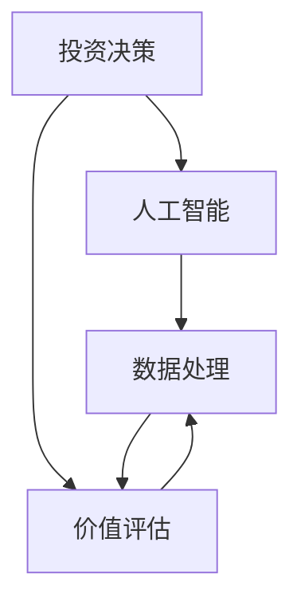
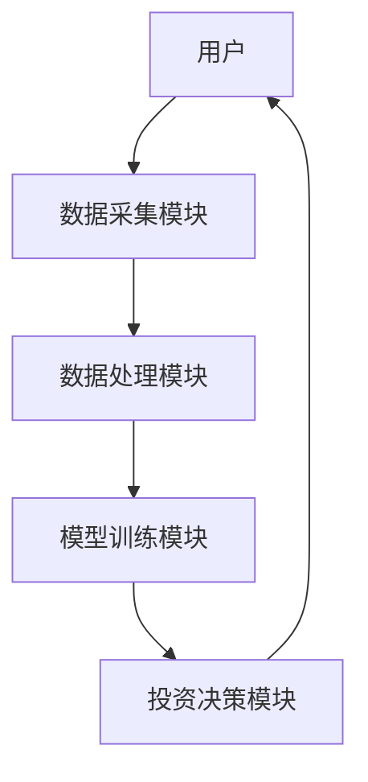
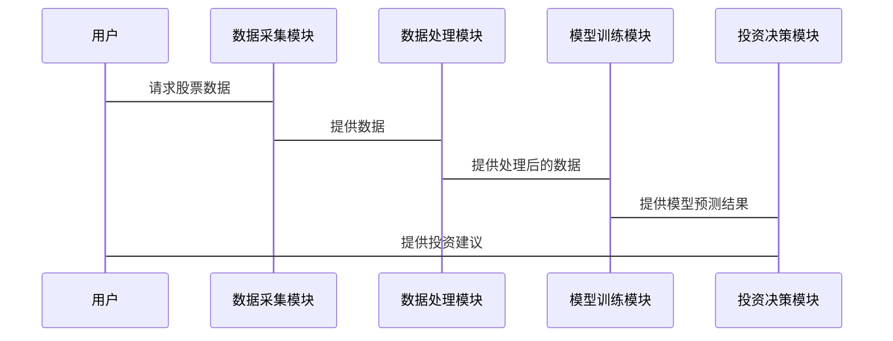

                 


# 价值投资与人工智能：AI辅助决策的潜力与局限

## 关键词：价值投资、人工智能、机器学习、深度学习、投资决策

## 摘要：价值投资是一种以企业基本面分析为基础的投资策略，而人工智能则通过数据分析和机器学习算法提供辅助决策支持。本文探讨了人工智能在价值投资中的潜力与局限，分析了两者结合的背景、核心概念、算法原理、数学模型、系统架构、项目实战以及总结与展望。

---

## 第一部分: 价值投资的理论基础

### 第1章: 价值投资的核心概念与方法

#### 1.1 价值投资的定义与历史发展

- **价值投资的起源与发展**  
  价值投资起源于20世纪30年代，由本杰明·格雷厄姆和戴维·多德共同提出。其核心理念是寻找市场价格低于其内在价值的股票，从而实现长期稳定的收益。  
  格雷厄姆的学生沃伦·巴菲特进一步发展了价值投资理论，强调长期投资、安全边际和企业基本面分析。

- **价值投资的核心理念**  
  价值投资强调企业内在价值的评估，认为市场价格波动是投资机会的来源。投资者应关注企业的财务状况、行业地位和竞争优势，而非短期市场波动。

- **价值投资在现代金融中的地位**  
  尽管现代金融学发展出多种投资策略，但价值投资因其长期稳定收益的特点，仍然是投资领域的重要流派之一。

#### 1.2 价值投资的关键要素

- **企业基本面分析**  
  价值投资者通过分析企业的财务报表、盈利能力、成长能力、现金流和行业地位等基本面指标，评估企业的内在价值。

- **股价与内在价值的评估**  
  价值投资者关注市场价格与内在价值的差异，认为这种差异最终会被市场纠正，从而带来超额收益。

- **安全边际的概念**  
  安全边际是指市场价格低于内在价值的部分，是价值投资的重要原则。通过预留安全边际，投资者降低了投资风险。

#### 1.3 价值投资的主要流派

- **格雷厄姆与多德的价值投资理论**  
  格雷厄姆和多德提出了“安全边际”和“内在价值”等核心概念，强调低市盈率、低市净率和高股息率的股票。

- **巴菲特的投资哲学**  
  巴菲特继承并发展了格雷厄姆的理论，强调企业护城河、管理团队和长期盈利能力。

- **现代价值投资的多样化发展**  
  现代价值投资不再局限于低估值股票，而是扩展到对成长性企业的投资，结合了成长与价值的双因子策略。

#### 1.4 价值投资的优缺点分析

- **价值投资的优势**  
  长期收益稳定、注重企业基本面分析、风险可控。

- **价值投资的局限性**  
  对市场短期波动的适应能力较弱、需要大量研究和分析、依赖于对内在价值的准确评估。

- **价值投资的适用场景**  
  适合长期投资者、价值发现者和注重风险管理的投资者。

### 第2章: 人工智能的基本原理与应用

#### 2.1 人工智能的定义与技术框架

- **人工智能的定义**  
  人工智能是指通过计算机模拟人类智能的技术，包括学习、推理、自我改进等能力。

- **人工智能的核心技术**  
  包括机器学习、自然语言处理、计算机视觉、知识图谱和强化学习等。

- **人工智能的应用领域**  
  金融、医疗、交通、教育、娱乐等领域均有广泛应用。

#### 2.2 机器学习与深度学习的原理

- **机器学习的定义与分类**  
  机器学习是通过数据训练模型，使其能够进行预测或分类。常见的机器学习算法包括线性回归、支持向量机（SVM）、随机森林等。

- **深度学习的原理与特点**  
  深度学习是一种基于人工神经网络的机器学习方法，通过多层网络结构提取数据特征。其特点是不需要手动特征提取，能够处理复杂的数据模式。

- **常见的机器学习算法**  
  线性回归用于回归问题，支持向量机用于分类问题，随机森林用于特征重要性分析。

#### 2.3 人工智能在金融领域的应用

- **金融数据分析与预测**  
  通过机器学习算法分析历史价格数据，预测股票价格走势。

- **风险评估与管理**  
  利用人工智能评估投资组合的风险，优化资产配置。

- **自动化交易系统**  
  通过算法交易实现快速决策，捕捉市场机会。

#### 2.4 人工智能的局限性与挑战

- **数据依赖性**  
  人工智能依赖大量数据进行训练，数据不足或质量不佳会影响模型性能。

- **黑箱问题**  
  深度学习模型的决策过程难以解释，影响投资者对模型的信任。

- **计算资源需求**  
  训练复杂的人工智能模型需要大量计算资源，可能超出个人投资者的预算。

---

## 第二部分: 价值投资与人工智能的结合

### 第3章: 价值投资与人工智能的结合背景

#### 3.1 价值投资与人工智能的契合点

- **数据驱动的决策**  
  人工智能能够处理大量数据，帮助投资者发现价值被低估的企业。

- **自动化与智能化**  
  人工智能可以自动化执行投资策略，提高投资效率。

- **风险控制与优化**  
  通过机器学习模型优化投资组合，降低风险。

#### 3.2 人工智能在价值投资中的潜力

- **提高数据分析效率**  
  人工智能能够快速分析海量数据，发现投资机会。

- **发现市场机会**  
  通过异常检测算法，识别市场中的低估企业。

- **优化投资组合**  
  利用机器学习算法优化资产配置，提高收益。

#### 3.3 人工智能在价值投资中的局限性

- **数据偏差与过拟合**  
  数据偏差可能导致模型误判，过拟合问题会影响模型的泛化能力。

- **市场的不可预测性**  
  金融市场受多种因素影响，人工智能难以完全预测市场波动。

- **人类判断的重要性**  
  价值投资需要结合市场环境和企业基本面，人工智能无法完全替代人类判断。

### 第4章: 价值投资与人工智能的核心概念与联系

#### 4.1 价值投资与人工智能的属性对比

| 属性               | 价值投资                     | 人工智能                   |
|--------------------|----------------------------|---------------------------|
| 数据依赖性         | 较低                        | 高                         |
| 决策速度           | 较慢                        | 快                         |
| 风险控制           | 强调安全边际                 | 依赖模型优化               |
| 可解释性           | 高                         | 低（尤其是深度学习模型）   |

#### 4.2 价值投资与人工智能的实体关系图



#### 4.3 价值投资与人工智能的联系

- **数据驱动的决策**  
  人工智能通过数据处理和分析，辅助价值投资者评估企业内在价值。

- **自动化与智能化**  
  人工智能可以自动化执行投资策略，提高投资效率。

- **优化投资组合**  
  通过机器学习模型优化资产配置，降低投资风险。

---

## 第三部分: 价值投资与人工智能的算法原理

### 第5章: 价值投资与人工智能的算法原理

#### 5.1 价值投资的算法实现

- **因子分析模型**  
  通过统计方法提取影响股票价格的关键因子，如市盈率、市净率、股息率等。

- **多因子模型**  
  结合多个因子构建投资组合，优化收益与风险比。

#### 5.2 人工智能算法的实现

- **机器学习算法**  
  使用随机森林或支持向量机（SVM）对股票进行分类，预测其是否为低估股票。

- **深度学习模型**  
  使用LSTM网络分析时间序列数据，预测股票价格走势。

#### 5.3 算法实现的代码示例

```python
# 示例：使用随机森林进行股票分类
from sklearn.ensemble import RandomForestClassifier
from sklearn.model_selection import train_test_split
import pandas as pd

# 加载数据
data = pd.read_csv('stock_data.csv')

# 分割特征与目标变量
X = data[['市盈率', '市净率', '股息率']]
y = data['是否低估']

# 数据分割
X_train, X_test, y_train, y_test = train_test_split(X, y, test_size=0.2, random_state=42)

# 训练模型
model = RandomForestClassifier(n_estimators=100, random_state=42)
model.fit(X_train, y_train)

# 预测
y_pred = model.predict(X_test)
```

---

## 第四部分: 系统分析与架构设计

### 第6章: 价值投资与人工智能的系统架构

#### 6.1 系统功能设计

- **数据采集模块**  
  从股票数据库中获取历史数据，包括价格、财务指标等。

- **数据处理模块**  
  对数据进行清洗、特征提取和标准化处理。

- **模型训练模块**  
  使用机器学习算法训练模型，评估其性能。

- **投资决策模块**  
  根据模型预测结果，生成投资建议。

#### 6.2 系统架构设计



#### 6.3 系统接口设计

- **数据接口**  
  提供API接口，从数据库获取股票数据。

- **模型接口**  
  提供预测接口，返回股票评级和投资建议。

#### 6.4 系统交互流程图



---

## 第五部分: 项目实战

### 第7章: 价值投资与人工智能的项目实战

#### 7.1 环境安装

- **Python环境**  
  安装Python 3.8及以上版本，安装Jupyter Notebook。

- **库的安装**  
  使用pip安装以下库：pandas、numpy、scikit-learn、keras、tensorflow。

#### 7.2 核心代码实现

```python
# 示例：使用LSTM预测股票价格
from tensorflow.keras.models import Sequential
from tensorflow.keras.layers import LSTM, Dense
import numpy as np

# 数据准备
data = np.random.rand(1000, 1)
X = data[:-1]
y = data[1:]

# 数据分割
X_train = X[:700]
y_train = y[:700]
X_test = X[700:]
y_test = y[700:]

# 模型构建
model = Sequential()
model.add(LSTM(50, input_shape=(1, 1)))
model.add(Dense(1))
model.compile(loss='mean_squared_error', optimizer='adam')

# 训练模型
model.fit(X_train.reshape(X_train.shape + (1,)), y_train, epochs=50, batch_size=32)

# 预测
y_pred = model.predict(X_test.reshape(X_test.shape + (1,)))
```

#### 7.3 案例分析与结果解读

- **案例分析**  
  使用历史数据训练模型，预测某股票的价格走势。

- **结果解读**  
  模型预测结果与实际价格进行对比，评估模型的准确性。

#### 7.4 项目小结

- **项目总结**  
  通过项目实战，验证了人工智能在价值投资中的潜力，但也发现了模型的局限性。

---

## 第六部分: 总结与展望

### 第8章: 总结与展望

#### 8.1 价值投资与人工智能的结合总结

- **总结**  
  人工智能为价值投资提供了强大的数据分析工具，提高了投资效率和准确性。

- **局限性**  
  人工智能无法完全替代人类判断，市场波动的不可预测性仍是一个挑战。

#### 8.2 未来展望

- **技术进步**  
  随着人工智能技术的发展，模型的解释性和计算效率将得到提升。

- **应用场景扩展**  
  人工智能将在更多领域与价值投资结合，提供更加个性化的投资服务。

#### 8.3 价值投资与人工智能的未来发展

- **技术融合**  
  结合区块链、大数据等技术，构建更加智能的投资生态系统。

- **智能化投资顾问**  
  提供个性化的投资建议，满足投资者多样化的需求。

---

## 附录

### 附录A: 最佳实践 tips

- **数据处理**  
  确保数据的完整性和准确性，避免数据偏差。

- **模型选择**  
  根据具体问题选择合适的算法，避免盲目使用复杂模型。

- **风险控制**  
  结合人工智能模型和人工判断，制定合理的风险管理策略。

### 附录B: 拓展阅读

- **推荐书籍**  
  《价值投资实战策略》、《机器学习实战》。

- **推荐文章**  
  《人工智能在金融领域的应用》、《价值投资的未来发展趋势》。

---

通过以上分析，我们深入探讨了价值投资与人工智能的结合，揭示了人工智能在投资决策中的潜力与局限。未来，随着技术的进步和理论的发展，人工智能将为价值投资带来更多的可能性，但也需要我们保持谨慎和理性，充分利用技术的优势，克服其局限性，实现投资收益的最大化。

