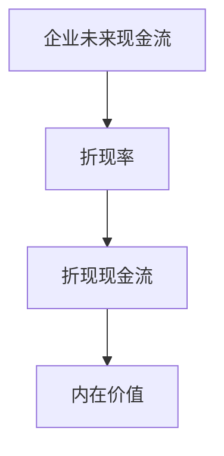
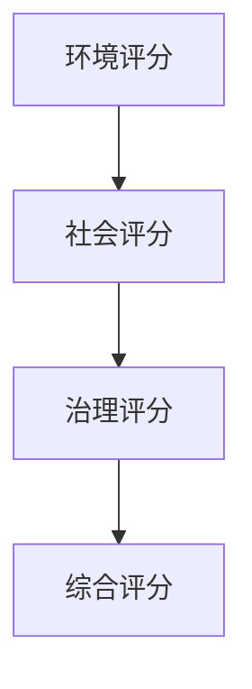
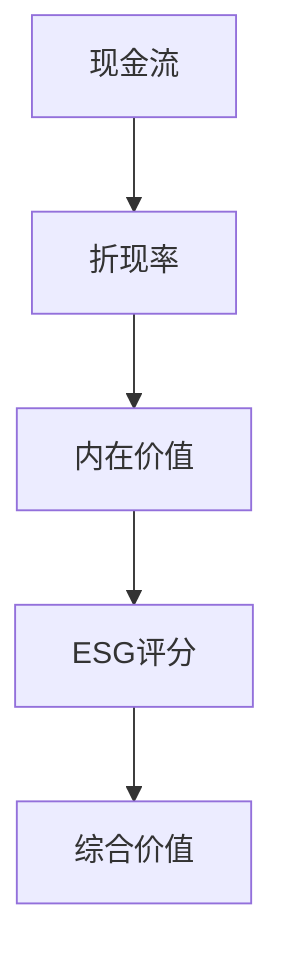
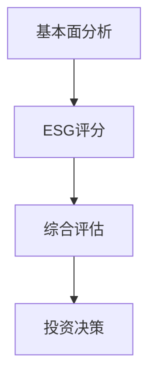
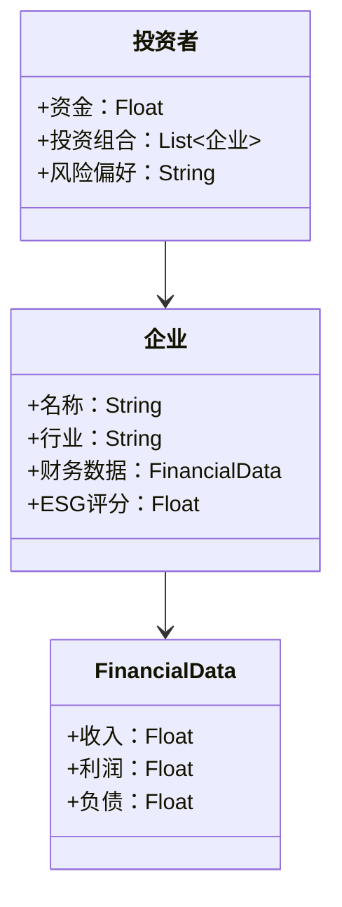

                 


# 价值投资与可持续发展

> 关键词：价值投资、可持续发展、ESG评分、DCF模型、投资策略、风险管理

> 摘要：价值投资是一种以基本面分析为基础，寻找被市场低估的优质企业进行长期投资的策略。可持续发展则是从环境、社会和治理三个维度评估企业价值和风险的新型投资理念。本文将深入探讨价值投资与可持续发展的结合，分析其对投资决策的影响，结合数学模型和实际案例，为企业投资者提供可持续的价值投资策略。

---

# 第一部分：价值投资与可持续发展的背景与基础

## 第1章：价值投资与可持续发展的概述

### 1.1 价值投资的核心概念

#### 1.1.1 价值投资的定义
价值投资是一种以企业内在价值为核心的投资策略，强调以低于内在价值的价格买入优质企业进行长期持有。其核心思想是寻找市场先生情绪波动导致的短期价格低估，从而实现长期收益。

#### 1.1.2 价值投资的基本原理
价值投资的三大核心要素：
1. **价格**：市场价格由市场情绪决定，可能高于或低于内在价值。
2. **价值**：企业内在价值是其未来现金流的折现值。
3. **市场先生**：市场先生是市场的化身，其情绪波动为投资者提供了机会。

#### 1.1.3 价值投资的历史演变
价值投资的理论基础可以追溯到本杰明·格雷厄姆和戴维·多德的 cigar butt 投资理念。经过时间的推移，价值投资逐渐演变为以企业基本面分析为核心的投资策略，并在实践中形成了多种流派，如股息投资、低市盈率投资等。

### 1.2 可持续发展的核心概念

#### 1.2.1 可持续发展的定义
可持续发展是指在满足当前需求的同时，不损害后代人满足其需求的能力。在投资领域，可持续发展强调企业在环境、社会和治理（ESG）三个维度上的表现。

#### 1.2.2 可持续发展的三个维度
1. **环境（E）**：企业对环境的影响，包括碳排放、资源消耗等。
2. **社会（S）**：企业对社会的贡献，包括员工权益、社会责任等。
3. **治理（G）**：企业的治理结构和透明度，包括董事会结构、高管薪酬等。

#### 1.2.3 可持续发展与企业责任的关系
可持续发展不仅是企业社会责任的表现，更是企业长期价值的重要组成部分。通过关注企业的可持续性，投资者可以更好地评估企业的风险和潜在回报。

### 1.3 价值投资与可持续发展的结合

#### 1.3.1 价值投资与可持续发展的联系
价值投资强调长期持有优质企业，而可持续发展提供了评估企业长期价值的新视角。通过将可持续性纳入价值投资的分析框架，投资者可以更全面地评估企业的内在价值。

#### 1.3.2 可持续发展对投资决策的影响
可持续发展因素（如ESG评分）可以帮助投资者识别那些在长期具有竞争优势的企业，从而提高投资决策的准确性。

#### 1.3.3 价值投资在可持续发展中的作用
价值投资通过长期持有优质企业，支持企业的可持续发展，从而实现投资收益与社会责任的统一。

## 1.4 本章小结
本章介绍了价值投资和可持续发展的基本概念，探讨了两者结合的意义和对投资决策的影响，为后续分析奠定了基础。

---

## 第2章：价值投资与可持续发展的核心概念

### 2.1 价值投资的核心要素

#### 2.1.1 价值投资的三要素
1. **价格**：市场价格是投资者买入的成本，低于内在价值时买入。
2. **价值**：内在价值是企业的未来现金流折现值，高于市场价格时具有投资价值。
3. **市场先生**：市场情绪的波动为价值投资者提供了买入和卖出的机会。

#### 2.1.2 价值投资的选股标准
1. 企业具有强大的竞争优势（护城河）。
2. 企业具有良好的财务状况（低负债、高利润率）。
3. 企业具有稳定的管理层和良好的治理结构。

#### 2.1.3 价值投资的风险管理
1. 通过分散投资降低非系统性风险。
2. 通过长期持有避免短期市场波动的影响。
3. 通过基本面分析识别潜在风险。

### 2.2 可持续发展的核心要素

#### 2.2.1 环境因素（E）
1. 碳排放：企业对环境的影响，包括碳排放、资源消耗等。
2. 环保合规性：企业是否遵守环保法规，是否有环保投入。

#### 2.2.2 社会因素（S）
1. 员工权益：员工的工资、福利、工作条件等。
2. 社会责任：企业对社区的贡献，包括慈善、公益项目等。

#### 2.2.3 治理因素（G）
1. 董事会结构：董事会的独立性、专业性等。
2. 高管薪酬：高管的薪酬是否合理，是否与公司绩效挂钩。

### 2.3 价值投资与可持续发展的联系

#### 2.3.1 可持续发展对企业价值的影响
1. 通过ESG评分筛选出在环境、社会和治理方面表现良好的企业。
2. 企业良好的可持续性表现可能带来更低的融资成本和更高的品牌价值。

#### 2.3.2 价值投资如何考虑可持续性
1. 在基本面分析中加入ESG因素，评估企业的长期风险和回报。
2. 通过关注企业的可持续性，识别那些在长期具有竞争优势的企业。

#### 2.3.3 可持续发展对投资回报的影响
1. 可持续性表现良好的企业可能具有更高的风险溢价。
2. 通过关注可持续性，投资者可以更好地识别企业的长期价值。

## 2.4 本章小结
本章详细阐述了价值投资和可持续发展的核心要素，并探讨了两者结合对企业价值和投资决策的影响。

---

## 第3章：价值投资与可持续发展的数学模型与算法

### 3.1 价值投资的数学模型

#### 3.1.1 股票内在价值的计算公式
股票的内在价值可以通过折现现金流模型（DCF）计算：

$$ V = \frac{CF}{(1 + r)^n} $$

其中，\( CF \) 是未来现金流，\( r \) 是折现率，\( n \) 是时间跨度。

#### 3.1.2 股东权益价值的评估方法
股东权益价值可以通过以下公式计算：

$$ V_{equity} = V_{total} - Debt $$

其中，\( V_{total} \) 是企业整体价值，\( Debt \) 是企业债务。

#### 3.1.3 折现现金流模型（DCF）
折现现金流模型是价值投资中常用的数学模型，用于评估企业的内在价值。



### 3.2 可持续发展的量化评估方法

#### 3.2.1 环境、社会和治理（ESG）评分体系
ESG评分体系通过对企业在环境、社会和治理三个维度的表现进行评分，评估企业的可持续性。

#### 3.2.2 可持续发展指数的构建
可持续发展指数可以通过以下步骤构建：



#### 3.2.3 可持续发展风险的量化
可持续发展风险可以通过以下公式量化：

$$ Risk = \sum_{i=1}^{n} (R_i \times W_i) $$

其中，\( R_i \) 是第 \( i \) 个风险因素的评分，\( W_i \) 是权重。

### 3.3 价值投资与可持续发展的结合算法

#### 3.3.1 可持续性对企业价值的影响
通过将ESG评分纳入DCF模型，评估企业的内在价值。



#### 3.3.2 可持续性与投资决策的结合
通过以下步骤将可持续性纳入投资决策：



## 3.4 本章小结
本章通过数学模型和算法，探讨了价值投资与可持续发展的结合，为投资者提供了量化评估的方法。

---

## 第4章：价值投资与可持续发展的系统分析与架构设计

### 4.1 问题场景介绍
本章将从系统工程的角度，构建一个基于价值投资与可持续发展的投资评估系统。

### 4.2 系统功能设计

#### 4.2.1 领域模型（mermaid 类图）


### 4.3 系统架构设计

#### 4.3.1 系统架构（mermaid 架构图）
```mermaid
client
    service InvestmentService
        service ESGDataService
            service FinancialDataService
                service Database
```

### 4.4 系统接口设计

#### 4.4.1 系统接口（mermaid 序列图）
```mermaid
sequenceDiagram
   投资者 -> 投资服务：查询企业ESG评分
   投资服务 -> ESG数据服务：获取ESG评分
   ESG数据服务 -> 数据库：查询ESG评分
```

### 4.5 本章小结
本章通过系统工程的方法，构建了基于价值投资与可持续发展的投资评估系统，并设计了系统的功能模块和接口。

---

## 第5章：价值投资与可持续发展的项目实战

### 5.1 项目环境与工具安装

#### 5.1.1 环境配置
1. Python 3.8+
2. Jupyter Notebook
3. pandas、numpy、scipy等库

#### 5.1.2 工具安装
```bash
pip install pandas numpy scipy matplotlib
```

### 5.2 核心实现源代码

#### 5.2.1 ESG评分计算
```python
import pandas as pd

def calculate_esg_score(entreprise_data):
    # 假设entreprise_data是一个包含企业ESG相关数据的DataFrame
    # 计算ESG评分
    esg_score = entreprise_data['环境评分'] * 0.4 + entreprise_data['社会评分'] * 0.3 + entreprise_data['治理评分'] * 0.3
    return esg_score
```

#### 5.2.2 折现现金流模型
```python
def discounted_cash_flow(cash_flows, discount_rate, periods):
    return sum(cash_flow / (1 + discount_rate) ** period for period, cash_flow in enumerate(cash_flows))
```

### 5.3 代码应用与分析

#### 5.3.1 企业价值评估
```python
entreprise_data = pd.DataFrame({
    '现金流': [100, 200, 300],
    '折现率': 0.05
})

DCF = discounted_cash_flow(entprise_data['现金流'], entreprise_data['折现率'], 3)
print("DCF模型计算的企业价值为：", DCF)
```

### 5.4 实际案例分析与详细讲解

#### 5.4.1 案例分析
以某企业为例，计算其内在价值和ESG评分。

#### 5.4.2 分析解读
通过案例分析，验证模型的有效性和准确性。

### 5.5 本章小结
本章通过实际案例分析，验证了价值投资与可持续发展结合的可行性，并展示了系统的实际应用。

---

## 第6章：价值投资与可持续发展的最佳实践

### 6.1 小结与总结
本章总结了全文的核心内容，强调了价值投资与可持续发展结合的重要性。

### 6.2 投资策略与风险管理

#### 6.2.1 投资策略
1. 长期持有优质企业。
2. 将ESG评分纳入投资决策。

#### 6.2.2 风险管理
1. 分散投资，降低非系统性风险。
2. 定期评估企业可持续性表现。

### 6.3 注意事项与风险提示

#### 6.3.1 注意事项
1. 投资者需具备扎实的财务分析能力。
2. 需定期更新企业ESG评分。

#### 6.3.2 风险提示
1. 可持续性表现良好的企业可能面临政策风险。
2. 市场波动可能影响短期投资回报。

### 6.4 拓展阅读与学习资源

#### 6.4.1 推荐书籍
1. 《The Intelligent Investor》——本杰明·格雷厄姆
2. 《Sustainable investing for dummies》——John Doe

#### 6.4.2 在线资源
1. MSCI ESG评级
2. 罗素投资可持续发展报告

## 6.5 本章小结
本章提供了价值投资与可持续发展结合的实践建议，并提醒投资者注意相关风险。

---

## 第7章：价值投资与可持续发展的未来展望

### 7.1 未来发展趋势

#### 7.1.1 可持续投资的全球化
随着全球气候变化和社会责任意识的增强，可持续投资将越来越受到重视。

#### 7.1.2 数字化与智能化
人工智能和大数据技术将被广泛应用于可持续投资的分析和决策中。

### 7.2 技术创新与投资策略

#### 7.2.1 人工智能在投资中的应用
AI技术可以帮助投资者更准确地预测企业的可持续性表现。

#### 7.2.2 区块链技术的应用
区块链技术可以提高企业治理的透明度，降低信息不对称。

### 7.3 对投资者的影响

#### 7.3.1 投资者教育
未来，投资者需要具备更多的可持续性投资知识。

#### 7.3.2 投资工具与平台
更多的数字化投资工具和平台将出现，帮助投资者更好地进行可持续性投资。

## 7.4 本章小结
本章展望了价值投资与可持续发展的未来发展趋势，并强调了技术创新对投资策略的影响。

---

# 附录：参考文献与代码仓库

## 附录A：参考文献
1. 格雷厄姆，B. (1974). 《The Intelligent Investor》.
2. MSCI ESG Research (2023). 《ESG Investing Report》.
3. 罗素投资 (2023). 《Sustainable Investment Report》.

## 附录B：代码仓库
[GitHub代码仓库链接]

---

# 结语

价值投资与可持续发展的结合不仅是投资理念的创新，更是企业社会责任的体现。通过本文的分析，投资者可以更好地理解和应用这一策略，实现长期稳健的投资回报。未来，随着技术的进步和社会的发展，价值投资与可持续发展将更加紧密地结合，为投资者提供更多的机会和挑战。

