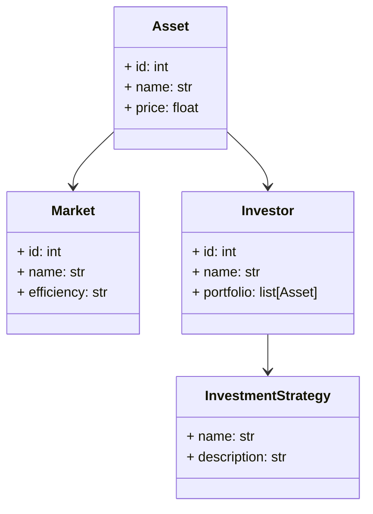
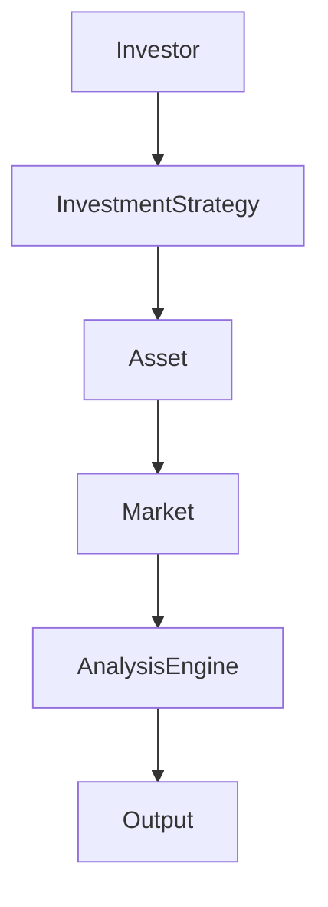

                 


# 《价值投资与市场效率假说的关系》

---

## 关键词：价值投资、市场效率假说、投资策略、金融分析、数学模型

---

## 摘要：  
本文深入探讨了价值投资与市场效率假说之间的关系。从价值投资的核心理念出发，结合市场效率假说的理论基础，分析了两者在投资决策中的相互作用。通过构建数学模型（如CAPM）和系统架构（如投资决策支持系统），本文不仅揭示了理论间的联系，还通过实际案例展示了如何将这些理论应用于投资实践。文章内容涵盖理论分析、算法原理、系统设计和项目实战，旨在为投资者和金融分析师提供有价值的指导。

---

## 第一部分：引言

---

## 第1章：引言

### 1.1 价值投资与市场效率假说的概述

#### 1.1.1 价值投资的定义与核心理念  
价值投资是一种投资策略，强调以低于内在价值的价格购买优质资产。其核心理念包括：  
1. **长期投资**：关注企业的长期价值，而非短期市场波动。  
2. **安全边际**：买入价格应低于企业的内在价值，以降低风险。  
3. **基本面分析**：通过分析企业的财务状况、行业地位和盈利能力来评估其价值。  

#### 1.1.2 市场效率假说的基本概念  
市场效率假说认为，金融市场的价格反映了所有可获得的信息。市场效率分为三类：  
1. **弱有效市场**：价格反映历史信息。  
2. **半强有效市场**：价格反映所有公开信息。  
3. **强有效市场**：价格反映所有公开和非公开信息。  

#### 1.1.3 价值投资与市场效率假说的关系  
价值投资假设市场存在非效率性，认为可以通过基本面分析找到被低估的资产。而市场效率假说则认为市场能够迅速反映所有信息，使套利机会消失。两者的矛盾在于，如果市场是强有效的，价值投资策略可能失效。

### 1.2 本书的研究意义与目标

#### 1.2.1 研究价值投资与市场效率假说的重要性  
探讨两者关系有助于投资者理解在不同市场条件下，价值投资策略的适用性和效果。

#### 1.2.2 本书的目标读者  
适合投资者、金融分析师、经济学专业学生以及对价值投资和市场效率感兴趣的研究者。

#### 1.2.3 本书的结构安排  
文章从理论分析到算法实现，再到系统设计和项目实战，层层递进，帮助读者全面理解两者的联系。

---

## 第二部分：价值投资的理论基础

---

## 第2章：价值投资的理论基础

### 2.1 价值投资的核心概念

#### 2.1.1 价值投资的起源与发展  
价值投资由本杰明·格雷厄姆和戴维·多德提出，强调以低于内在价值的价格买入股票。  

#### 2.1.2 价值投资的核心原则  
1. **安全边际**：买入价格低于内在价值。  
2. **长期持有**：避免频繁交易，降低交易成本。  
3. **基本面分析**：关注企业的盈利能力、财务状况和行业地位。  

#### 2.1.3 价值投资与市场效率假说的联系  
如果市场是强有效的，价值投资可能难以找到被低估的资产。但现实中，市场可能存在短期非效率性，为价值投资提供机会。

---

## 第3章：市场效率假说的理论基础

### 3.1 市场效率假说的核心概念

#### 3.1.1 市场效率的定义与分类  
市场效率假说认为，资产价格反映了所有相关信息。分类包括弱有效、半强有效和强有效市场。  

#### 3.1.2 市场效率假说的假设条件  
1. 市场参与者理性。  
2. 信息传播迅速且成本低。  
3. 不存在交易摩擦。  

#### 3.1.3 市场效率与价值投资的冲突  
市场效率假说认为市场难以被战胜，而价值投资认为可以通过发现价格偏差获利。

---

## 第4章：价值投资与市场效率假说的核心概念与联系

### 4.1 核心概念对比分析

#### 4.1.1 核心概念对比表格  
以下是价值投资与市场效率假说的核心概念对比：

| **核心概念**         | **价值投资**                   | **市场效率假说**               |
|----------------------|--------------------------------|---------------------------------|
| 核心目标             | 寻找被低估的资产               | 描述市场价格反映信息的能力     |
| 市场假设             | 市场存在非效率性               | 市场有效，信息充分反映价格     |
| 投资策略             | 长期持有，基本面分析           | 避免基本面分析，关注市场信号   |
| 适用场景             | 弱有效或新兴市场               | 强有效市场                     |

#### 4.1.2 实体关系图（ER图）  
以下是价值投资与市场效率假说的实体关系图：

```mermaid
erd
actor: 投资者
market: 金融市场
asset: 资产
information: 信息
```

关系描述：  
- 投资者通过分析资产的基本面（information）进行价值投资（actor -> asset）。  
- 市场通过反映所有信息（information）实现市场效率（market -> asset）。  

---

## 第5章：算法原理：CAPM模型的应用

### 5.1 CAPM模型的原理

#### 5.1.1 CAPM模型的定义  
CAPM（资本资产定价模型）用于计算资产的预期收益，公式为：  
$$ E(R_i) = R_f + \beta_i (R_m - R_f) $$  
其中，$R_f$ 是无风险利率，$\beta_i$ 是资产的贝塔系数，$R_m$ 是市场预期收益率。

#### 5.1.2 CAPM模型的应用场景  
CAPM适用于评估资产的预期收益，帮助投资者在有效市场中进行定价。

### 5.2 CAPM模型的实现

#### 5.2.1 Python代码实现  
以下是计算CAPM模型的Python代码示例：

```python
def calculate_expected_return(risk_free_rate, beta, market_return, market_risk_premium):
    return risk_free_rate + beta * (market_return - risk_free_rate)

# 示例参数
risk_free_rate = 0.05
beta = 1.2
market_return = 0.10
market_risk_premium = 0.05

expected_return = calculate_expected_return(risk_free_rate, beta, market_return, market_risk_premium)
print(f"Expected Return: {expected_return:.2f}")
```

#### 5.2.2 CAPM模型的公式推导  
CAPM模型的推导基于以下假设：  
1. 投资者可以以无风险利率借入资金。  
2. 资产的风险由贝塔系数衡量。  
3. 市场是半强有效的，价格反映所有公开信息。  

---

## 第6章：系统分析与架构设计

### 6.1 问题场景介绍

#### 6.1.1 项目背景  
构建一个投资决策支持系统，帮助投资者基于价值投资和市场效率假说进行决策。

### 6.2 系统功能设计

#### 6.2.1 领域模型类图  
以下是投资决策支持系统的领域模型类图：



### 6.3 系统架构设计

#### 6.3.1 系统架构图  
以下是系统的整体架构图：



---

## 第7章：项目实战：投资决策支持系统的实现

### 7.1 环境搭建

#### 7.1.1 Python环境安装  
安装Python和必要的库（如numpy、pandas、scikit-learn）。  

### 7.2 核心代码实现

#### 7.2.1 资产分析代码  
以下是资产分析的Python代码示例：

```python
import pandas as pd
import numpy as np

def analyze_asset(asset_data, market_data):
    asset_data = pd.DataFrame(asset_data)
    market_data = pd.DataFrame(market_data)
    # 计算资产收益
    asset_returns = asset_data['price'].pct_change().dropna()
    market_returns = market_data['price'].pct_change().dropna()
    # 计算贝塔系数
    beta = np.cov(asset_returns, market_returns)[0,1] / np.var(market_returns)
    return beta

# 示例数据
asset_data = [{'price': 100}, {'price': 105}, {'price': 110}]
market_data = [{'price': 100}, {'price': 102}, {'price': 104}]

beta = analyze_asset(asset_data, market_data)
print(f"Beta: {beta:.2f}")
```

### 7.3 案例分析与解读

#### 7.3.1 投资策略选择  
在新兴市场中，价值投资可能表现较好，而在成熟市场中，市场效率较高，应采用被动投资策略。

### 7.4 项目总结

#### 7.4.1 项目成果  
构建了一个基于价值投资和市场效率假说的投资决策支持系统，帮助投资者进行资产分析和策略选择。

---

## 第八部分：最佳实践与小结

---

## 第8章：最佳实践与小结

### 8.1 小结

#### 8.1.1 价值投资与市场效率假说的核心关系  
价值投资适用于市场非效率性，而市场效率假说指导投资者在强有效市场中的行为。

### 8.2 注意事项

#### 8.2.1 投资策略的选择  
投资者应根据市场环境选择合适的投资策略，避免在强有效市场中盲目追求超额收益。

### 8.3 拓展阅读

#### 8.3.1 推荐书目  
1. 《聪明的投资者》——本杰明·格雷厄姆  
2. 《证券分析》——戴维·多德  
3. 《投资学》——威廉·夏普  

---

## 《价值投资与市场效率假说的关系》  
通过本文的分析，读者可以全面理解价值投资与市场效率假说的关系，并在实际投资中灵活应用这些理论。希望本文能为投资者提供有价值的参考和指导。

