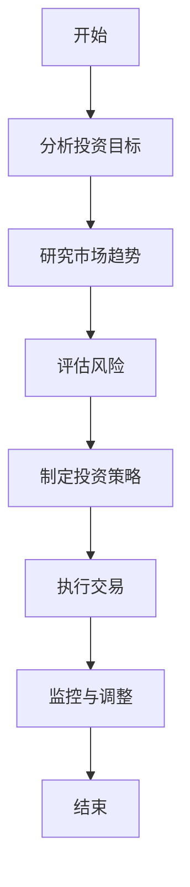

                 

# 价值投资与行为金融学

> 关键词：价值投资，行为金融学，投资策略，心理偏差，风险管理

> 摘要：本文将探讨价值投资与行为金融学的核心理念、理论基础、实际应用以及两者结合的实践意义。通过分析价值投资的内在价值评估和行为金融学中的认知偏差，揭示投资者在决策过程中的心理与行为特征，从而提供更科学、更人性化的投资策略。

---

## 第一部分：价值投资与行为金融学基础

### 第1章：价值投资的核心理念

#### 1.1 价值投资的定义与起源
- 价值投资是由本杰明·格雷厄姆和菲利普·费雪提出的投资策略，强调以低于内在价值的价格买入优质股票。
- 起源于20世纪30年代的美国经济危机时期，格雷厄姆通过分析市场的非理性波动，提出“市场先生”的概念，认为市场情绪会影响股票价格，但长期来看，价格会回归其内在价值。

#### 1.2 价值投资的基本原则
- **安全边际**：买入价格低于内在价值，以降低投资风险。
- **长期视角**：关注企业的长期盈利能力，而非短期市场波动。
- **逆向思维**：在市场恐慌时寻找机会，避免追涨杀跌。

#### 1.3 价值投资与基本面分析的关系
- 基本面分析是价值投资的核心方法，通过分析企业的财务报表、行业地位、竞争优势等因素，评估其内在价值。
- 市场价格与内在价值的偏离是投资机会的来源。

### 第2章：行为金融学的基本概念

#### 2.1 行为金融学的定义与研究范围
- 行为金融学是研究投资者心理与行为的学科，强调认知偏差、情绪波动和非理性决策对市场的影响。
- 研究范围包括个体投资者和机构投资者的行为，以及市场参与者的互动。

#### 2.2 行为金融学与传统金融学的区别
- **传统金融学**：假设市场是理性的，价格反映所有信息，投资者是理性的。
- **行为金融学**：承认市场的非理性，关注投资者的心理偏差和行为模式。

#### 2.3 行为金融学的核心理论与模型
- ** prospect theory**：投资者对收益和损失的感知是非对称的，损失厌恶会导致过度风险厌恶。
- **认知偏差**：例如确认偏差、乐观偏差、从众心理等，影响投资者的决策。

---

## 第二部分：价值投资与行为金融学的结合

### 第3章：价值投资中的行为偏差

#### 3.1 投资者的心理偏差
- **贪婪与恐惧**：市场上涨时贪婪，下跌时恐惧。
- **过度自信**：投资者往往高估自己的判断能力，忽视不确定性。
- **确认偏差**：选择性接受信息，忽视与自己观点不符的证据。

#### 3.2 行为偏差对投资决策的影响
- 过度交易：投资者频繁买卖，试图通过短期波动获利，增加交易成本。
- 拒绝卖出亏损股票：避免承认损失，导致更大的损失。

#### 3.3 如何克服行为偏差
- 建立严格的交易纪律，避免情绪化决策。
- 定期复盘和反思，识别和纠正偏差。

### 第4章：行为金融学对价值投资的启示

#### 4.1 认识市场的非理性
- 市场价格的波动性与内在价值的稳定性之间的矛盾，为价值投资者提供了机会。
- 市场恐慌时的非理性定价，为价值投资提供了买入机会。

#### 4.2 利用行为偏差进行投资
- 通过识别市场的非理性波动，寻找低估或高估的资产。
- 基于行为金融学的理论，预测市场参与者的决策模式。

#### 4.3 综合运用两种理论
- 将价值投资的基本面分析与行为金融学的心理分析相结合，制定更科学的投资策略。

---

## 第三部分：价值投资与行为金融学的实际应用

### 第5章：价值投资的长期策略

#### 5.1 长期投资的优势
- 避免短期波动的干扰，降低交易成本。
- 通过复利效应实现财富增长。

#### 5.2 价值投资的选股标准
- 低市盈率、低市净率、高股息率等指标。
- 关注企业的竞争优势、财务健康和管理团队。

#### 5.3 风险管理的重要性
- 设置止损点，控制最大损失。
- 分散投资，降低特定资产的风险。

### 第6章：行为金融学在投资中的应用

#### 6.1 投资者心理的分析与应对
- 识别自己的心理偏差，避免非理性决策。
- 培养耐心和纪律性，避免贪婪与恐惧的影响。

#### 6.2 市场情绪的监测与利用
- 通过技术分析和情绪指标，判断市场的过度波动。
- 在市场底部买入，在市场顶部卖出。

#### 6.3 行为金融学的案例分析
- 2008年金融危机：投资者的恐慌情绪导致市场的过度下跌，为价值投资者提供了买入机会。
- 科技股泡沫：投资者的乐观偏差导致股价虚高，最终回归内在价值。

---

## 第四部分：总结与展望

### 第7章：价值投资与行为金融学的未来

#### 7.1 两者的融合与发展
- 随着行为金融学的深入研究，价值投资将更加注重心理因素的作用。
- 数据驱动的投资决策：结合大数据分析，量化心理偏差对市场的影响。

#### 7.2 对投资者的启示
- 投资者需要不断学习和反思，避免行为偏差的影响。
- 在实践中，将价值投资与行为金融学相结合，制定更灵活的投资策略。

#### 7.3 未来的研究方向
- 研究认知偏差对投资行为的具体影响。
- 探索行为金融学在量化投资中的应用。

---

## 附录

### 附录A：价值投资的数学模型

#### 1. 内在价值计算公式
$$ \text{内在价值} = \sum_{t=1}^{\infty} \frac{\text{现金流}_t}{(1+r)^t} $$
其中，r是折现率，现金流_t是第t年的现金流。

#### 2. 市盈率计算公式
$$ \text{市盈率} = \frac{\text{股价}}{\text{每股收益}} $$

### 附录B：行为金融学中的常见偏差

| 偏差类型       | 描述                                   |
|----------------|--------------------------------------|
| 确认偏差       | 过度关注支持自己观点的信息             |
| 乐观偏差       | 高估有利结果的概率                   |
| 损失厌恶       | 更加关注损失，而非同等的收益           |

### 附录C：投资决策的流程图（Mermaid）

---

通过本文的分析，我们可以看到，价值投资与行为金融学的结合为投资者提供了更全面的投资视角。未来，随着行为金融学的深入研究，投资决策将更加科学和人性化。

