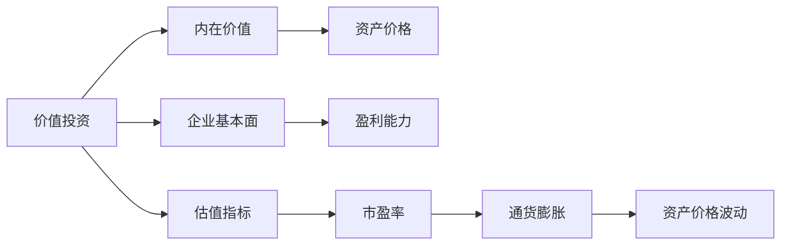
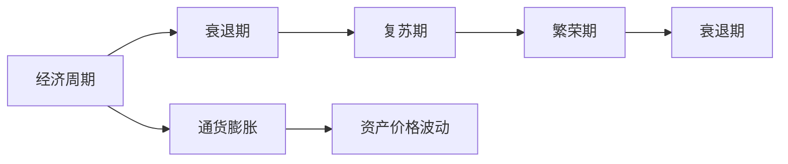

                 

# 价值投资与通货膨胀的关系

## 关键词：价值投资、通货膨胀、经济周期、资产配置、投资策略

## 摘要：价值投资是一种以企业基本面分析为基础的投资策略，旨在通过购买被市场低估的资产来实现长期收益。然而，通货膨胀作为经济周期中的一个重要因素，对价值投资的决策和效果有着深远的影响。本文将从经济周期的角度，分析通货膨胀对价值投资的影响，探讨在通货膨胀环境下如何优化价值投资策略，包括资产配置、行业选择和风险管理等方面。通过结合数学模型和实际案例，本文旨在为投资者提供实用的指导和启示。

---

## 第一部分：价值投资与通货膨胀的基础理论

### 第1章：价值投资的核心概念与特征

#### 1.1 价值投资的定义与特征
- **定义**：价值投资是一种投资策略，强调以低于公允价值的价格购买具有内在价值的资产，通常关注企业的基本面指标，如盈利能力、成长性和财务状况。
- **特征**：
  - 长期导向：注重长期价值，而非短期价格波动。
  - 低市盈率：寻找市盈率、市净率等估值指标低于行业平均水平的资产。
  - 高股息率：倾向于投资高股息收益率的股票，提供稳定的现金流。

#### 1.2 通货膨胀的定义与特征
- **定义**：通货膨胀是指物价总水平在一段时间内持续上涨，货币购买力下降的经济现象。
- **特征**：
  - 货币贬值：货币的实际购买力下降。
  - 资产价格上涨：通常伴随着房地产、股票等资产价格的上涨。
  - 利率上升：央行可能通过加息来控制通胀，增加债务成本。

#### 1.3 价值投资与通货膨胀的关系
- **相互影响**：
  - 通货膨胀会增加企业的成本，影响其盈利能力，从而影响其股票的内在价值。
  - 通货膨胀可能导致市场对高收益资产的需求增加，推高资产价格，掩盖其真实价值。

#### 1.4 核心概念对比与联系
| 特性         | 价值投资                   | 通货膨胀                   |
|--------------|----------------------------|----------------------------|
| 定义         | 基于内在价值的投资策略     | 货币购买力下降的经济现象     |
| 影响因素     | 企业基本面、估值指标       | 利率、货币政策、物价水平     |
| 目标         | 实现长期超额收益           | 稳定物价、控制经济过热       |
| 相互关系     | 通货膨胀影响资产价格，价值投资需调整策略 |

#### 1.5 图形化分析

---

### 第2章：通货膨胀对经济周期的影响

#### 2.1 经济周期的定义与阶段
- **定义**：经济周期是指经济活动在增长、衰退、复苏和繁荣之间交替进行的周期性变化。
- **阶段**：
  - 衰退期：经济增长放缓，企业利润下降。
  - 复苏期：经济开始恢复，企业利润逐步回升。
  - 繁荣期：经济增长强劲，企业利润达到高峰。
  - 衰退期：经济出现负增长，企业利润下降。

#### 2.2 通货膨胀与经济周期的关系
- **通货膨胀在经济周期中的表现**：
  - 在繁荣期，通货膨胀可能加速，企业提高产品价格以应对成本上升。
  - 在衰退期，通货膨胀可能放缓，甚至出现通货紧缩。

#### 2.3 通货膨胀对资产价格的影响
- **股票市场**：通货膨胀可能导致股票市场出现波动，尤其是高通胀可能导致央行加息，增加企业的融资成本，影响股票估值。
- **房地产市场**：通货膨胀通常会导致房地产价格上涨，因为货币供应增加推高资产价格。
- **债券市场**：通货膨胀会侵蚀债券的固定收益，导致债券价格下跌。

#### 2.4 图形化分析

---

### 第3章：通货膨胀对价值投资的影响

#### 3.1 通货膨胀对价值投资策略的影响
- **估值指标的变化**：通货膨胀可能导致市盈率和市净率等估值指标失真，因为物价上涨会影响企业的收入和利润。
- **资产配置的调整**：在高通胀环境下，价值投资者可能需要增加对具有抗通胀能力的资产（如房地产、黄金）的配置。

#### 3.2 通货膨胀周期中的投资策略
- **防御性投资**：在高通胀环境下，投资于具有较强定价能力的企业，以确保企业利润不会被通胀侵蚀。
- **周期性行业**：在衰退期，周期性行业可能表现不佳，而在复苏期，周期性行业可能迎来反弹。

#### 3.3 数学模型与分析
- **模型假设**：
  - 假设通货膨胀率为\( \pi \)，企业的净利润增长率为\( g \)。
  - 价值投资的核心是寻找被低估的股票，其内在价值可以通过 discounted cash flow (DCF) 模型计算。

- **DCF模型**：
  $$ V = \frac{CF}{(1 + r)^n} $$
  其中，\( V \) 是内在价值，\( CF \) 是未来现金流，\( r \) 是折现率，\( n \) 是时间周期。

  - 通货膨胀会影响现金流的预测，因为实际现金流需要考虑物价上涨的影响。

---

### 第4章：通货膨胀下的价值投资策略优化

#### 4.1 资产配置策略
- **多元化配置**：在通货膨胀环境下，投资者应分散投资于不同资产类别，以降低风险。
- **抗通胀资产**：增加对房地产、黄金等抗通胀资产的配置。

#### 4.2 行业选择策略
- **防守性行业**：选择那些在通胀环境下表现稳定的行业，如公用事业、消费品等行业。
- **周期性行业**：在通胀初期，周期性行业可能表现较好，但在通胀后期，这些行业可能面临成本上升的压力。

#### 4.3 风险管理策略
- **动态调整**：定期评估投资组合的表现，根据通胀变化进行调整。
- **对冲策略**：使用金融衍生品对冲通胀风险。

---

### 第5章：案例分析与实战应用

#### 5.1 案例分析：2008年全球金融危机后的通货膨胀与价值投资
- **背景**：2008年金融危机后，全球央行实施量化宽松政策，导致通货膨胀压力上升。
- **价值投资策略**：投资者选择投资于那些基本面稳定、估值合理的公司，如苹果、谷歌等科技巨头。

#### 5.2 数学模型的实际应用
- **CPI指数与股票收益的相关性分析**：
  $$ \text{相关系数} = \frac{\sum (x_i - \bar{x})(y_i - \bar{y})}{\sqrt{\sum (x_i - \bar{x})^2 \sum (y_i - \bar{y})^2}} $$
  其中，\( x \) 是CPI指数，\( y \) 是股票收益。

---

### 第6章：总结与展望

#### 6.1 本章总结
- 通货膨胀是价值投资中不可忽视的因素，投资者需要根据经济周期和通胀环境调整投资策略。
- 通过多元化配置、行业选择和风险管理，可以在通货膨胀环境下优化价值投资效果。

#### 6.2 展望
- 随着全球经济一体化和金融市场的复杂化，价值投资与通货膨胀的关系将更加紧密。
- 未来的研究可以进一步探讨通货膨胀对不同类型资产的影响，以及在不同经济体制下的投资策略。

---

## 参考文献
1. 格雷厄姆, B. F. (1974). 《价值投资》.
2. 约翰逊, P. (2010). 《通货膨胀与经济周期》.
3. 罗斯, S. (2018). 《价值投资与风险管理》.

---

**全文完**。

