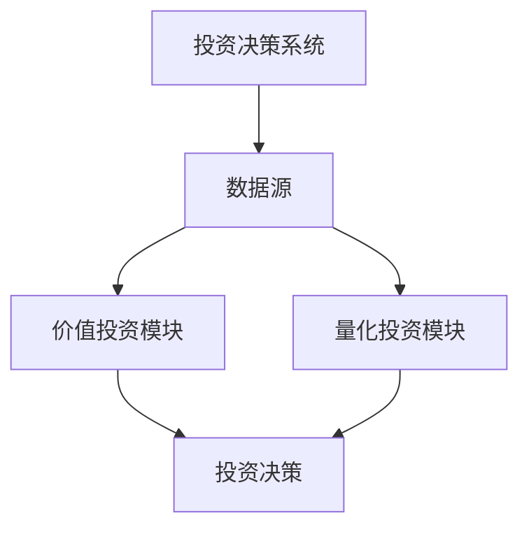
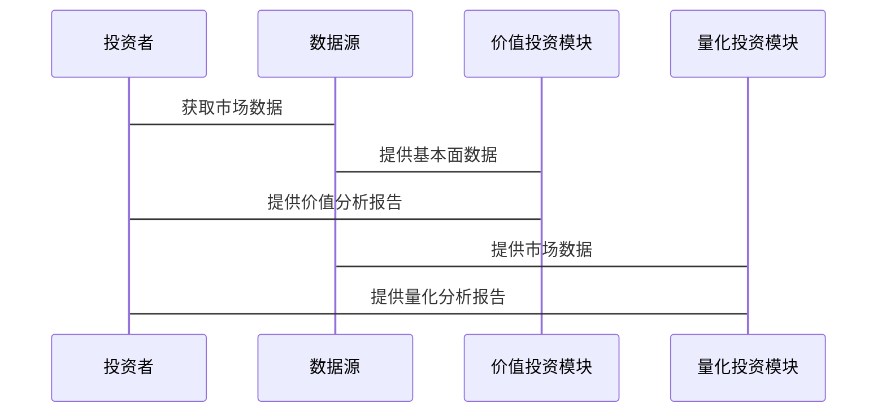

                 


# 价值投资与量化投资的对比

## 关键词：
- 价值投资
- 量化投资
- 投资策略
- 数学模型
- 金融分析

## 摘要：
本文详细对比了价值投资和量化投资的理论基础、策略类型和适用场景，分析了它们的优缺点。通过数学模型和实际案例，探讨了两种投资方法的异同，并提出了结合两者的潜在优势。

---

## 第一章：投资的基本概念

### 1.1 投资的定义与分类

#### 1.1.1 投资的定义
投资是将资金投入到资产中，以期获得未来收益的行为。它包括股票、债券、房地产等多种形式。

#### 1.1.2 投资的分类
投资可以分为传统投资和现代投资。传统投资侧重于基本面分析和长期持有，而现代投资则利用数据和算法进行高频交易和量化分析。

#### 1.1.3 投资的基本原理
投资的基本原理包括风险与收益的平衡、市场的有效性和无效性，以及时间价值的概念。

### 1.2 传统投资与现代投资的区别

#### 1.2.1 传统投资的特点
传统投资依赖于对公司的基本面分析，注重长期价值，强调安全边际。

#### 1.2.2 现代投资的演变
现代投资引入了量化方法和技术分析，利用数据和算法进行高频交易和因子投资。

#### 1.2.3 传统与现代投资的对比
传统投资注重长期价值，而现代投资更注重数据驱动的决策。两者在风险控制和收益目标上有所不同。

---

## 第二章：价值投资的理论与实践

### 2.1 价值投资的定义

#### 2.1.1 价值投资的核心理念
价值投资强调购买低于内在价值的资产，长期持有，等待市场回归。

#### 2.1.2 价值投资的三要素
- 价格：资产的市场价格。
- 价值：资产的内在价值。
- 安全边际：市场价格与内在价值的差距。

#### 2.1.3 价值投资的适用场景
适用于市场无效或低估资产的情况，尤其在经济低迷时期。

### 2.2 价值投资的策略与工具

#### 2.2.1 基本面分析
基本面分析包括对公司财务状况、行业地位和管理团队的分析。

#### 2.2.2 股价与内在价值的对比
通过DCF模型计算内在价值，与市场价格进行对比。

#### 2.2.3 安全边际的概念
安全边际提供了在市场价格波动时的保护，减少了投资风险。

---

## 第三章：量化投资的理论与实践

### 3.1 量化投资的定义

#### 3.1.1 量化投资的核心理念
量化投资依赖于数学模型和算法，通过数据驱动的方式进行投资决策。

#### 3.1.2 数据驱动的投资决策
利用大数据和机器学习模型预测市场走势和资产回报。

#### 3.1.3 量化投资的适用场景
适用于市场有效或高频交易的环境，利用算法捕捉短期机会。

### 3.2 量化投资的策略与工具

#### 3.2.1 因子分析
因子分析通过筛选多个因子（如市值、波动率）来构建投资组合。

#### 3.2.2 算法交易
算法交易利用程序自动执行交易指令，捕捉市场套利机会。

#### 3.2.3 量化模型的构建
使用回归分析和聚类分析等统计方法构建投资模型。

---

## 第四章：价值投资与量化投资的对比分析

### 4.1 理论基础的对比

#### 4.1.1 价值投资的理论基础
基于有效市场假说的弱有效性，强调市场定价的错误。

#### 4.1.2 量化投资的理论基础
基于有效市场假说的强有效性，利用数据和算法进行投资。

#### 4.1.3 两者理论基础的对比
价值投资依赖于市场无效性，而量化投资依赖于市场有效性。

### 4.2 策略类型的对比

#### 4.2.1 价值投资的策略类型
- 股票筛选：基于基本面分析。
- 安全边际：寻找低估资产。

#### 4.2.2 量化投资的策略类型
- 因子投资：基于统计因子。
- 算法交易：高频交易和套利。

#### 4.2.3 两者策略类型的对比
价值投资注重长期，量化投资注重短期。

### 4.3 适用场景的对比

#### 4.3.1 价值投资的适用场景
市场无效或经济低迷时。

#### 4.3.2 量化投资的适用场景
市场有效或高频交易环境下。

#### 4.3.3 两者适用场景的对比
价值投资适用于寻找低估资产，量化投资适用于捕捉短期机会。

---

## 第五章：数学模型与算法

### 5.1 价值投资的数学模型

#### 5.1.1 DCF模型
$$DCF = \frac{CF}{(r - g)}$$
其中，CF为自由现金流，r为折现率，g为增长率。

#### 5.1.2 安全边际计算
$$安全边际 = 市场价格 - 内在价值$$

### 5.2 量化投资的数学模型

#### 5.2.1 因子模型
$$R_i = \beta_0 + \beta_1F_1 + \beta_2F_2 + \cdots + \beta_nF_n + \epsilon$$
其中，$F_i$为因子，$\beta_i$为因子的权重。

#### 5.2.2 回归分析
$$y = \alpha + \beta x + \epsilon$$
其中，$y$为因变量，$x$为自变量，$\alpha$为截距，$\beta$为回归系数。

### 5.3 对比分析的数学模型

#### 5.3.1 价值投资与量化投资的收益对比
$$R_{value} > R_{quant}$$ 在市场无效时。

#### 5.3.2 量化投资与价值投资的风险对比
$$\sigma_{quant} < \sigma_{value}$$ 在市场有效时。

---

## 第六章：系统分析与架构设计

### 6.1 系统功能设计

#### 6.1.1 价值投资模块
- 数据采集：收集公司财务数据。
- 模型计算：计算内在价值。
- 投资决策：基于安全边际决定投资。

#### 6.1.2 量化投资模块
- 数据处理：清洗和转换数据。
- 模型构建：因子分析和算法交易。
- 系统输出：生成交易信号。

### 6.2 系统架构设计

#### 6.2.1 系统架构图


#### 6.2.2 模块交互图


---

## 第七章：项目实战

### 7.1 价值投资案例

#### 7.1.1 实战环境配置
- 数据来源：Yahoo Finance。
- 工具：Excel或Python（Pandas库）。

#### 7.1.2 核心代码实现
```python
import pandas as pd
import yfinance as yf

# 下载数据
aapl = yf.download('AAPL', start='2020-01-01', end='2023-01-01')
DCF = aapl['Close'] * (1 + 0.05) / (0.1 - 0.03)
```

#### 7.1.3 结果分析
计算得出AAPL的内在价值高于市场价格，存在投资机会。

### 7.2 量化投资案例

#### 7.2.1 实战环境配置
- 数据来源：Alpha Vantage。
- 工具：Python（Pandas和Scikit-learn库）。

#### 7.2.2 核心代码实现
```python
from sklearn.linear_model import LinearRegression
import pandas as pd
import requests

# 下载数据
data = requests.get('https://www.alphavantage.co/query?function=TIME_SERIES_INTRADAY...')
data_json = data.json()
df = pd.DataFrame(data_json['Time Series']['data'])
model = LinearRegression()
model.fit(df[['open', 'high']], df['close'])
```

#### 7.2.3 结果分析
构建回归模型，预测股票价格，捕捉短期交易机会。

---

## 第八章：总结与展望

### 8.1 总结

价值投资与量化投资各有优劣，价值投资适合长期投资者，量化投资适合高频交易者。两者的结合可能提供更全面的投资策略。

### 8.2 展望

未来，随着技术进步，量化投资将更加普及，而价值投资的核心理念仍将持续影响市场。

---

以上是《价值投资与量化投资的对比》的完整目录和内容概述，希望对您有所帮助。

