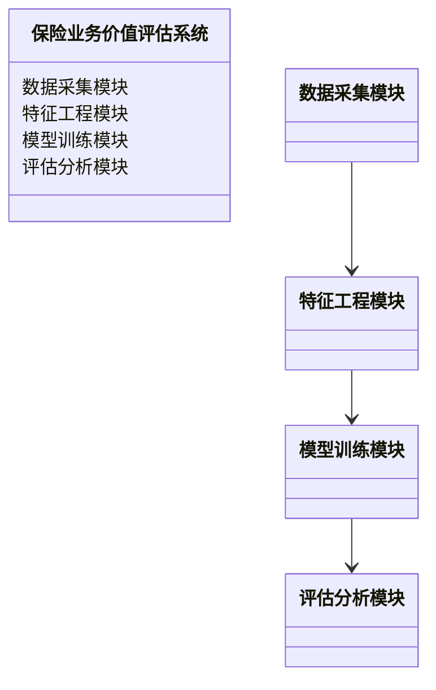
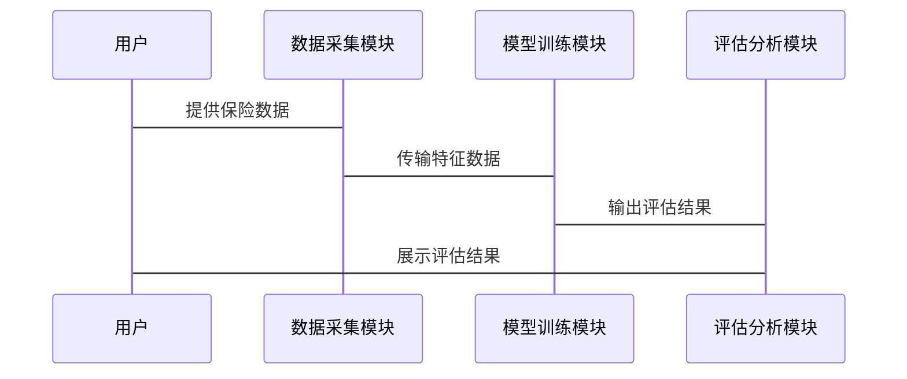

                 


# 价值投资中的AI智能体保险业务价值评估系统

> 关键词：价值投资、AI智能体、保险业务、价值评估系统、回归分析、神经网络、系统架构

> 摘要：本文探讨了在保险业务价值评估中，如何利用AI智能体技术实现价值投资的目标。通过分析保险业务价值评估的现状与挑战，结合价值投资的核心理念，提出了一种基于AI智能体的保险业务价值评估系统。系统涵盖了从数据采集到模型训练的完整流程，并通过具体的案例分析和算法实现，展示了该系统的有效性和优势。

---

# 第1章: 保险业务价值评估的现状与问题

## 1.1 保险业务价值评估的背景

### 1.1.1 保险行业的现状与发展趋势

保险行业作为金融体系的重要组成部分，近年来发展迅速。随着大数据、人工智能等技术的兴起，保险行业在产品设计、风险评估、客户服务等方面都在逐步实现数字化和智能化。保险业务的复杂性和多样性使得传统的价值评估方法逐渐暴露出不足，亟需引入更高效的技术手段。

### 1.1.2 保险业务价值评估的核心问题

保险业务价值评估的核心问题在于如何准确预测保险产品的市场价值和潜在风险。传统的评估方法依赖于经验丰富的分析师，但这种方法存在主观性强、效率低、覆盖范围有限等缺点。特别是在面对海量数据和复杂市场环境时，传统方法难以提供实时、精准的评估结果。

### 1.1.3 价值投资在保险业务中的重要性

价值投资是一种以基本面分析为基础的投资策略，强调通过深入研究企业的财务状况、行业地位等因素，寻找被市场低估的投资标的。在保险业务中，价值投资可以帮助投资者发现具有长期增长潜力的保险公司或保险产品。然而，保险业务的价值评估需要考虑的因素众多，包括市场风险、利率变化、客户行为等，这使得价值投资在保险业务中的应用更具挑战性。

## 1.2 AI技术在保险行业的应用前景

### 1.2.1 AI技术在保险行业的应用现状

目前，AI技术已经在保险行业多个领域得到应用，例如：

- **客户画像与精准营销**：通过AI分析客户的消费行为和风险偏好，实现精准营销。
- **风险评估与预测**：利用机器学习模型预测保险产品的风险，优化承保策略。
- **理赔自动化**：通过自然语言处理和图像识别技术，实现理赔流程的自动化。

### 1.2.2 AI技术对保险业务价值评估的潜在影响

AI技术的引入可以显著提升保险业务价值评估的效率和准确性。例如，通过AI算法分析海量数据，发现潜在的市场趋势和客户需求，从而为价值评估提供更全面的依据。此外，AI还可以帮助识别传统方法难以察觉的风险因素，提高评估的深度和广度。

### 1.2.3 保险业务价值评估中的数据挑战

保险业务价值评估需要处理大量结构化和非结构化的数据，包括财务数据、市场数据、客户数据等。如何高效地采集、处理和分析这些数据，是AI技术在保险行业应用中的关键挑战。此外，数据的质量和完整性也是影响评估结果的重要因素。

## 1.3 传统保险业务价值评估方法的局限性

### 1.3.1 传统保险业务价值评估方法概述

传统的保险业务价值评估方法主要包括以下几种：

1. **DCF模型（现金流贴现法）**：通过预测未来现金流并将其贴现为现值，评估企业价值。
2. **相对估值法**：通过比较可比公司的估值指标（如市盈率、市净率等）来估算目标公司的价值。
3. **资产重估法**：基于资产的市场价值进行评估。

### 1.3.2 传统方法的局限性与不足

传统保险业务价值评估方法存在以下主要问题：

1. **依赖主观判断**：传统方法往往依赖于分析师的主观判断，结果可能存在较大的偏差。
2. **数据处理能力有限**：传统方法难以处理海量、多维度的数据，导致评估结果的片面性。
3. **动态适应性差**：传统方法对市场变化的适应能力较弱，难以及时反映市场的波动。

### 1.3.3 传统方法与现代技术的对比分析

以下是传统方法与现代技术的对比分析：

| 对比维度         | 传统方法                      | 现代技术（AI智能体）         |
|------------------|-----------------------------|-----------------------------|
| 数据处理能力     | 有限，难以处理海量数据       | 强大，能够处理多维度数据     |
| 分析效率         | 较低，依赖人工分析            | 高效，自动化处理             |
| 结果准确性       | 受主观因素影响较大           | 更客观，基于数据驱动         |
| 适应性           | 较差，难以快速响应市场变化   | 较好，能够实时更新模型       |

## 1.4 保险业务价值评估的核心要素

### 1.4.1 保险业务价值的定义与构成

保险业务价值是指保险公司在未来一定时期内，通过提供保险产品和服务所创造的经济价值。其构成主要包括以下几个方面：

1. **资产价值**：保险公司的资产，包括投资资产和负债等。
2. **客户价值**：客户对公司保险产品的认可度和忠诚度。
3. **市场价值**：公司在市场上的品牌价值和竞争优势。

### 1.4.2 核心评估指标与关键因素

保险业务价值评估的核心指标包括：

- **净利润率**：反映公司的盈利能力。
- **保费增长率**：衡量公司的市场拓展能力。
- **风险资本比率**：评估公司的风险承受能力。

关键因素包括市场环境、公司战略、客户行为等。

### 1.4.3 保险业务价值评估的边界与外延

保险业务价值评估的边界是指评估的范围和限制，外延则是指评估的深度和广度。边界通常包括时间范围、评估对象的范围等，外延则包括对市场趋势、客户行为等的深入分析。

## 1.5 本章小结

本章主要介绍了保险业务价值评估的背景与现状，分析了传统方法的局限性，并提出了引入AI技术的必要性。通过对比分析，展示了AI技术在保险业务价值评估中的潜在优势。

---

# 第2章: 价值投资与AI智能体的结合

## 2.1 价值投资的核心理念

### 2.1.1 价值投资的定义与特点

价值投资是一种以基本面分析为基础的投资策略，强调通过深入研究企业的财务状况、行业地位等因素，寻找被市场低估的投资标的。其特点包括长期性、稳定性、安全性等。

### 2.1.2 价值投资的核心要素与评估指标

价值投资的核心要素包括：

1. **企业基本面**：包括财务状况、盈利能力、市场地位等。
2. **市场估值**：包括市盈率、市净率等指标。
3. **行业趋势**：包括行业的发展前景和竞争格局。

### 2.1.3 价值投资在保险业务中的应用

在保险业务中，价值投资可以帮助投资者发现具有长期增长潜力的保险公司或保险产品。例如，通过分析保险公司的保费收入、净利润率等指标，评估其市场竞争力和盈利能力。

## 2.2 AI智能体的基本原理

### 2.2.1 AI智能体的定义与分类

AI智能体是指能够感知环境并采取行动以实现目标的智能系统。根据智能体的智能水平，可以将其分为反应式智能体、基于模型的智能体、实用推理智能体等。

### 2.2.2 AI智能体的核心功能与技术

AI智能体的核心功能包括数据采集、特征提取、模型训练、决策优化等。其主要技术包括机器学习、深度学习、自然语言处理等。

### 2.2.3 AI智能体在保险业务中的应用场景

在保险业务中，AI智能体可以应用于风险评估、客户画像、保费定价、理赔自动化等领域。例如，通过AI智能体分析客户的健康状况和生活习惯，优化保险产品的设计和定价。

## 2.3 价值投资与AI智能体的结合方式

### 2.3.1 数据驱动的AI智能体

数据驱动的AI智能体通过分析海量数据，识别潜在的投资机会。例如，通过分析保险公司的财务数据和市场数据，预测其未来的表现。

### 2.3.2 智能决策支持系统

智能决策支持系统通过整合多种数据源和分析模型，为投资者提供实时的决策支持。例如，通过分析市场趋势和公司基本面，提供保险产品的投资建议。

### 2.3.3 AI智能体在保险业务价值评估中的应用模式

在保险业务价值评估中，AI智能体可以通过以下方式实现价值投资：

1. **数据采集与处理**：收集保险公司的财务数据、市场数据、客户数据等。
2. **特征提取与建模**：通过特征工程提取关键特征，并建立评估模型。
3. **实时监测与优化**：根据市场变化和公司动态，实时更新评估结果。

## 2.4 价值投资与AI智能体的核心概念对比

以下是价值投资与AI智能体的核心概念对比：

| 对比维度         | 价值投资                     | AI智能体                   |
|------------------|----------------------------|---------------------------|
| 核心目标         | 寻找被低估的投资标的         | 通过数据驱动实现目标       |
| 分析方法         | 基于基本面分析               | 基于数据挖掘和机器学习     |
| 决策依据         | 财务指标、行业趋势           | 数据特征、模型预测         |
| 优势             | 适合长期投资，风险可控       | 高效、精准，适应性强       |

## 2.5 本章小结

本章主要介绍了价值投资的核心理念和AI智能体的基本原理，并分析了两者在保险业务中的结合方式。通过对比分析，展示了AI智能体在价值投资中的潜在优势。

---

# 第3章: 保险业务价值评估的AI算法原理

## 3.1 保险业务价值评估的算法选择

### 3.1.1 传统统计方法与机器学习算法的对比

传统统计方法如回归分析、聚类分析等，适用于简单的线性关系分析。机器学习算法如支持向量机、随机森林等，则适用于复杂的数据模式识别。

### 3.1.2 常见的保险业务价值评估算法

在保险业务价值评估中，常用的算法包括：

1. **线性回归**：用于预测保险产品的保费收入。
2. **逻辑回归**：用于分类问题，如判断客户是否为高风险客户。
3. **决策树**：用于分类和回归问题，帮助识别关键特征。

### 3.1.3 算法选择的依据与原则

算法选择的依据包括数据类型、数据规模、评估目标等因素。通常需要在多个算法中进行实验对比，选择性能最优的算法。

## 3.2 基于回归分析的保险价值评估

### 3.2.1 线性回归模型的原理与实现

线性回归模型通过建立自变量和因变量之间的线性关系，预测保险产品的价值。其数学模型为：

$$ y = \beta_0 + \beta_1x_1 + \beta_2x_2 + \cdots + \beta_nx_n + \epsilon $$

其中，$y$ 是因变量，$x_i$ 是自变量，$\beta_i$ 是回归系数，$\epsilon$ 是误差项。

### 3.2.2 逻辑回归模型的应用

逻辑回归模型用于分类问题，其输出结果为概率值。例如，用于判断客户是否为高风险客户。其数学模型为：

$$ P(y=1|x) = \frac{e^{\beta_0 + \beta_1x_1 + \cdots + \beta_nx_n}}{1 + e^{\beta_0 + \beta_1x_1 + \cdots + \beta_nx_n}} $$

### 3.2.3 回归分析的数学

以下是线性回归模型的最小二乘法求解过程：

$$ \text{最小化} \sum_{i=1}^n (y_i - (\beta_0 + \beta_1x_{i1} + \cdots + \beta_kx_{ik}))^2 $$

通过求解偏导数，找到最优的回归系数。

## 3.3 本章小结

本章主要介绍了保险业务价值评估中常用的回归分析算法，并通过数学公式和流程图的形式，详细讲解了线性回归和逻辑回归模型的原理和实现。

---

# 第4章: 保险业务价值评估系统架构设计

## 4.1 系统功能设计

### 4.1.1 系统功能模块划分

保险业务价值评估系统可以划分为以下功能模块：

1. **数据采集模块**：负责采集保险公司的财务数据、市场数据等。
2. **特征工程模块**：对数据进行清洗、特征提取和特征选择。
3. **模型训练模块**：基于特征数据，训练价值评估模型。
4. **评估分析模块**：对模型的评估结果进行分析和展示。

### 4.1.2 领域模型设计

以下是领域模型的Mermaid类图：



## 4.2 系统架构设计

### 4.2.1 系统架构设计

以下是系统架构的Mermaid图：


## 4.3 系统接口设计

### 4.3.1 系统接口设计

系统接口设计包括数据输入接口、模型训练接口、结果展示接口等。

### 4.3.2 系统交互设计

以下是系统交互的Mermaid序列图：



## 4.4 本章小结

本章主要介绍了保险业务价值评估系统的架构设计，包括功能模块划分、系统架构设计和系统交互设计等内容。

---

# 第5章: 项目实战——保险业务价值评估系统的实现

## 5.1 环境安装与配置

### 5.1.1 环境要求

- 操作系统：Windows/Mac/Linux
- Python版本：3.6以上
- 需要安装的库：numpy、pandas、scikit-learn、matplotlib

### 5.1.2 安装步骤

1. 安装Python
2. 安装所需的Python库：
   ```bash
   pip install numpy pandas scikit-learn matplotlib
   ```

## 5.2 系统核心实现

### 5.2.1 数据采集与预处理

```python
import pandas as pd

# 数据采集
data = pd.read_csv('insurance_data.csv')

# 数据预处理
data = data.dropna()
data = pd.get_dummies(data)
```

### 5.2.2 模型训练与评估

```python
from sklearn.model import LinearRegression
from sklearn.metrics import mean_squared_error

# 训练线性回归模型
model = LinearRegression()
model.fit(X_train, y_train)

# 模型评估
y_pred = model.predict(X_test)
mse = mean_squared_error(y_test, y_pred)
print('均方误差:', mse)
```

### 5.2.3 结果展示与分析

```python
import matplotlib.pyplot as plt

plt.scatter(y_test, y_pred)
plt.xlabel('真实值')
plt.ylabel('预测值')
plt.show()
```

## 5.3 项目小结

本章通过具体的Python代码实现，展示了保险业务价值评估系统的搭建过程。通过数据采集、特征工程、模型训练和结果展示，帮助读者理解AI智能体在保险业务价值评估中的应用。

---

# 第6章: 最佳实践与注意事项

## 6.1 最佳实践

### 6.1.1 数据质量管理

确保数据的准确性和完整性，避免因数据质量问题影响模型的性能。

### 6.1.2 模型优化与调参

通过交叉验证等方法，优化模型的参数和结构，提高模型的泛化能力。

### 6.1.3 结果解释与验证

对模型的评估结果进行深入分析，确保结果的合理性和可解释性。

## 6.2 注意事项

### 6.2.1 数据隐私与安全

在处理客户数据时，需要注意数据的隐私和安全，避免数据泄露。

### 6.2.2 模型的可解释性

在保险业务中，模型的可解释性非常重要，尤其是在法律合规方面。

### 6.2.3 持续监控与更新

市场环境和客户需求是动态变化的，需要持续监控模型的性能，并及时更新模型。

## 6.3 拓展阅读

推荐读者阅读以下书籍和文章：

- 《机器学习实战》
- 《Python机器学习》
- 《人工智能导论》

## 6.4 本章小结

本章总结了保险业务价值评估系统实施中的最佳实践和注意事项，为读者提供了宝贵的参考。

---

# 附录: 保险业务价值评估系统的完整代码

```python
import pandas as pd
from sklearn.model import LinearRegression
from sklearn.metrics import mean_squared_error
import matplotlib.pyplot as plt

# 数据采集
data = pd.read_csv('insurance_data.csv')

# 数据预处理
data = data.dropna()
data = pd.get_dummies(data)

# 数据分割
X = data.drop('value', axis=1)
y = data['value']

from sklearn.model_selection import train_test_split
X_train, X_test, y_train, y_test = train_test_split(X, y, test_size=0.2, random_state=42)

# 训练线性回归模型
model = LinearRegression()
model.fit(X_train, y_train)

# 模型评估
y_pred = model.predict(X_test)
mse = mean_squared_error(y_test, y_pred)
print('均方误差:', mse)

# 结果展示
plt.scatter(y_test, y_pred)
plt.xlabel('真实值')
plt.ylabel('预测值')
plt.show()
```

---

# 结语

通过本文的详细讲解，读者可以深入了解保险业务价值评估中的AI智能体技术。从背景分析到算法实现，再到系统设计和项目实战，本文为读者提供了一个全面的技术框架。未来，随着AI技术的不断发展，保险业务价值评估系统将更加智能化和精准化，为价值投资提供强有力的支持。

---

