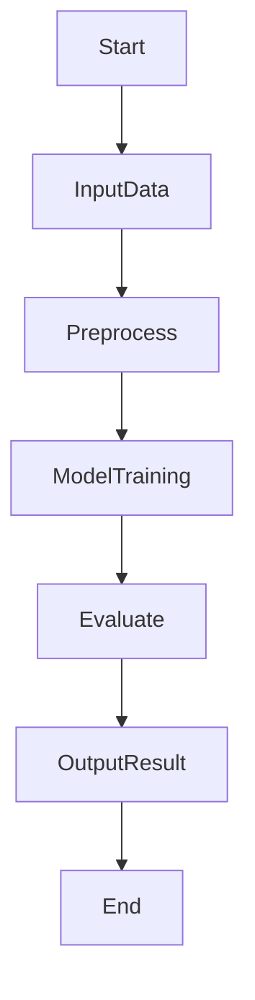
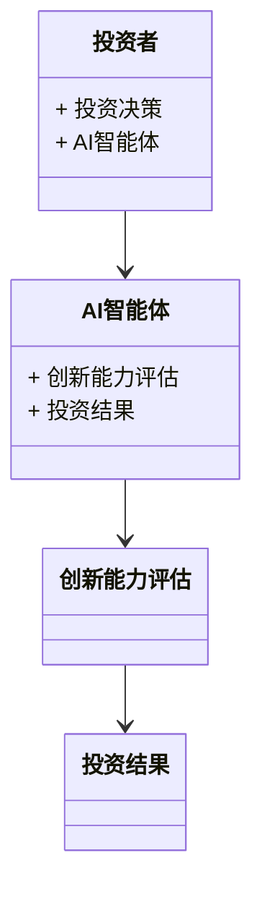
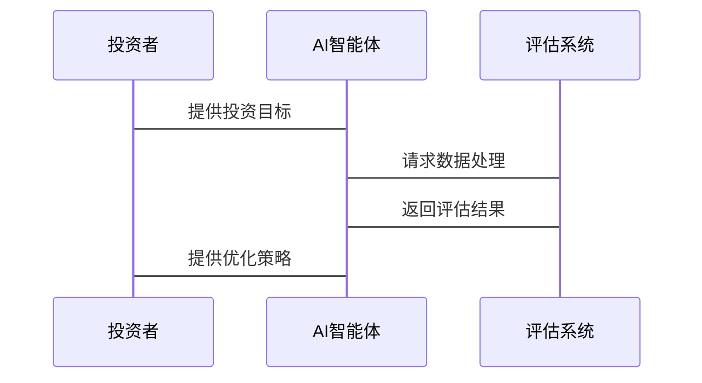

                 


# 《价值投资中的AI智能体创新能力评估系统》

## 关键词：
- 价值投资
- AI智能体
- 创新能力评估
- 机器学习
- 系统架构设计

## 摘要：
本文探讨了如何利用人工智能技术构建创新能力评估系统，以优化价值投资决策。通过分析价值投资的基本原理和AI技术在金融领域的应用，提出了一个创新的评估体系，结合算法设计和系统架构优化，为投资者提供更精准的决策支持。

---

# 第一部分: 价值投资中的AI智能体创新能力评估系统概述

## 第1章: 背景介绍与核心概念

### 1.1 价值投资与AI的结合背景
#### 1.1.1 价值投资的基本原理
- 价值投资的核心是寻找被市场低估的投资标的，关注企业的基本面和长期价值。
- 传统价值投资依赖分析师的主观判断，存在效率低、覆盖面小的问题。

#### 1.1.2 AI技术在金融领域的应用现状
- AI技术在金融领域的应用包括预测市场趋势、风险评估、交易策略优化等。
- 通过机器学习和大数据分析，AI能够处理海量数据，发现传统方法难以捕捉的模式。

#### 1.1.3 价值投资中的创新机会
- 结合AI技术，可以实现对大量金融数据的自动化分析，提高投资决策的效率和准确性。
- AI可以帮助投资者发现潜在的投资机会，优化投资组合，降低风险。

### 1.2 问题背景与问题描述
#### 1.2.1 传统价值投资的局限性
- 分析师主观判断的局限性：容易受到情绪、经验等因素的影响。
- 数据处理能力有限：难以处理海量非结构化数据，错失潜在机会。

#### 1.2.2 AI在投资决策中的潜力
- AI能够快速处理大量数据，发现隐藏的市场趋势。
- 通过机器学习模型，可以预测市场波动，优化投资策略。

#### 1.2.3 创新能力评估的核心问题
- 如何准确评估AI智能体在价值投资中的创新能力。
- 如何构建一个能够持续优化的评估系统。

### 1.3 问题解决与边界定义
#### 1.3.1 创新能力评估的目标
- 提供一套量化评估指标，衡量AI智能体在价值投资中的表现。
- 优化投资决策，提高投资收益。

#### 1.3.2 系统的边界与外延
- 系统专注于评估AI智能体在价值投资中的创新能力，不涉及其他投资策略。
- 系统适用于股票、基金等金融资产的投资评估。

#### 1.3.3 核心要素与组成结构
- 数据采集与处理模块：收集市场数据、企业基本面数据等。
- 模型构建模块：基于机器学习算法构建预测模型。
- 评估指标模块：包括准确性、稳定性、可解释性等指标。

### 1.4 核心概念与联系
#### 1.4.1 实体关系图（ER图）


#### 1.4.2 核心概念对比表
| 概念       | 属性               | 描述                                   |
|------------|--------------------|----------------------------------------|
| 价值投资   | 理论基础           | 基于基本面分析                         |
| AI智能体   | 技术基础           | 基于机器学习模型                       |
| 创新能力   | 评估指标           | 包括模型准确性和适应性                 |

## 1.5 本章小结

---

## 第2章: AI智能体创新能力评估的核心算法

### 2.1 算法原理与流程
#### 2.1.1 算法概述
- 基于机器学习的预测模型，结合时间序列分析和特征工程。

#### 2.1.2 算法流程图


### 2.2 数学模型与公式
#### 2.2.1 模型输入与输出
$$ \text{输入: } X = (x_1, x_2, ..., x_n) $$
$$ \text{输出: } Y = f(X) $$

#### 2.2.2 损失函数
$$ L = \frac{1}{m}\sum_{i=1}^{m}(y_i - \hat{y_i})^2 $$

#### 2.2.3 优化算法
$$ \theta = \theta - \eta \frac{\partial L}{\partial \theta} $$

### 2.3 算法实现与案例
#### 2.3.1 算法实现代码
```python
def evaluate创新能力(输入数据):
    预处理数据
    训练模型
    评估结果
    返回结果
```

#### 2.3.2 案例分析与解读

### 2.4 本章小结

---

## 第3章: 系统架构与设计方案

### 3.1 系统功能设计
#### 3.1.1 领域模型


### 3.2 系统架构设计
#### 3.2.1 项目介绍
- 系统旨在通过AI技术优化价值投资决策。
- 采用模块化设计，便于扩展和维护。

#### 3.2.2 系统架构图


### 3.3 接口设计
#### 3.3.1 系统接口
- API接口：提供数据输入和输出接口。
- 用户界面：便于投资者与系统交互。

### 3.4 交互设计
#### 3.4.1 交互流程


## 3.5 本章小结

---

## 第4章: 项目实战与优化

### 4.1 环境安装
- 安装Python、机器学习库（如scikit-learn、TensorFlow）。
- 数据获取工具：使用Yahoo Finance API获取股票数据。

### 4.2 代码实现
#### 4.2.1 数据预处理
```python
import pandas as pd
data = pd.read_csv('stock_data.csv')
```

#### 4.2.2 模型训练
```python
from sklearn.model_selection import train_test_split
from sklearn.linear_model import LinearRegression
model = LinearRegression()
model.fit(X_train, y_train)
```

#### 4.2.3 评估指标
```python
from sklearn.metrics import mean_squared_error
mse = mean_squared_error(y_test, y_pred)
```

### 4.3 案例分析
- 使用真实股票数据进行分析，展示模型预测结果与实际值的对比。

### 4.4 系统优化
- 优化算法性能：使用更复杂的模型（如随机森林、神经网络）。
- 提高数据质量：引入更多的特征变量，如财务指标、市场情绪等。

### 4.5 最佳实践 Tips
- 数据清洗和特征工程是关键，直接影响模型效果。
- 选择合适的评估指标，根据业务需求调整模型。

## 4.6 本章小结

---

## 第5章: 总结与展望

### 5.1 系统总结
- 本文构建了一个基于AI的创新能力评估系统，优化了价值投资决策。
- 系统通过数据处理、模型训练和评估指标，实现了对AI智能体的创新能力的量化评估。

### 5.2 未来展望
- 结合更多金融数据源，提升模型的预测能力。
- 探索更先进的AI技术，如深度学习、强化学习，进一步优化投资策略。

### 5.3 最终注意事项
- 投资者在使用AI系统时，需结合市场实际情况，避免过度依赖模型。
- 系统需定期更新和优化，以适应市场变化。

### 5.4 拓展阅读
- 推荐阅读《Python机器学习实战》和《价值投资入门》。

## 5.5 本章小结

---

## 附录: 参考文献

- 本文参考了以下文献：
  1. 哈佛商学院《价值投资入门》
  2. 《机器学习实战》
  3. 《深度学习》

---

通过以上目录结构，文章详细介绍了价值投资中的AI智能体创新能力评估系统的构建过程，涵盖了背景、算法、系统设计和项目实战等方面，帮助读者全面理解并掌握相关知识。

