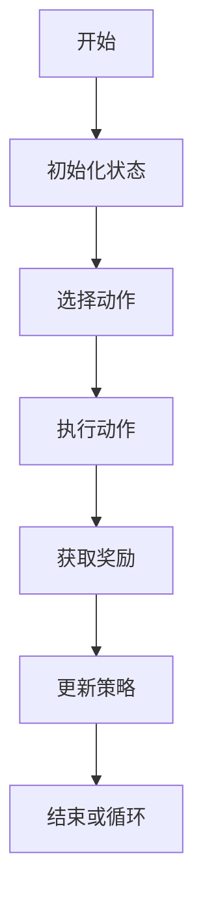
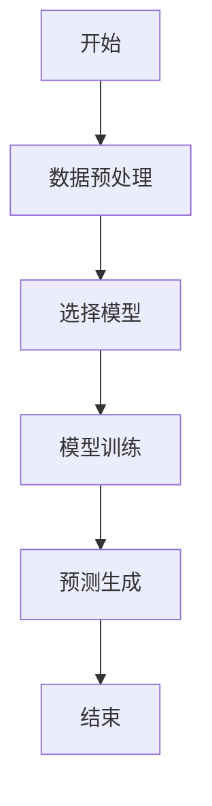
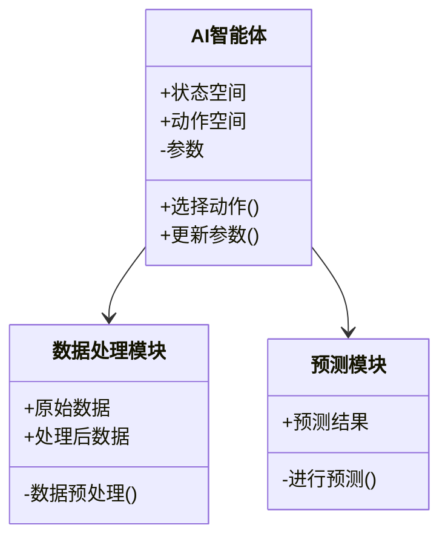
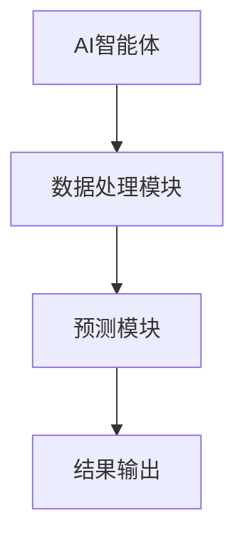
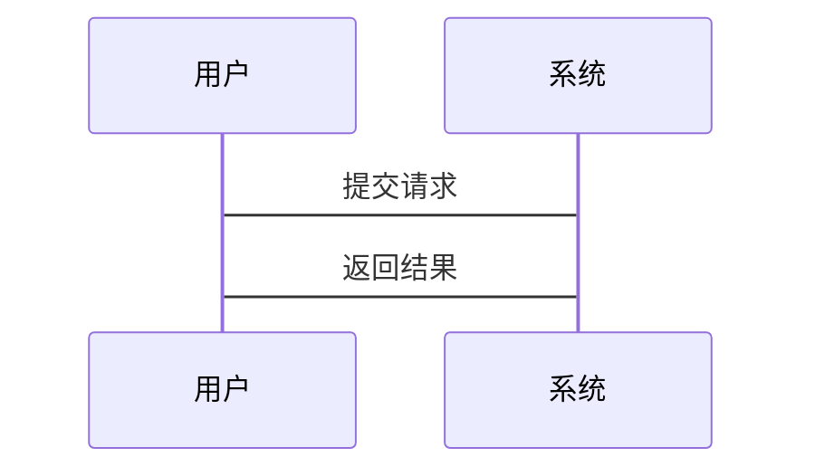

                 


# 《价值投资中的AI智能体可持续发展能力分析系统》

> 关键词：价值投资, AI智能体, 可持续发展能力, 算法原理, 系统架构, 实战案例

> 摘要：本文深入探讨了如何利用AI技术构建智能体，分析投资标的的可持续发展能力，优化价值投资策略。通过系统架构设计、算法原理讲解和实战案例分析，展示了AI在价值投资中的潜力与应用。

---

# 第一部分：背景介绍

## 第1章：价值投资与AI智能体的背景

### 1.1 价值投资的定义与核心理念

- **价值投资**：一种长期投资策略，关注于识别被市场低估的优质资产。核心理念包括安全边际、内在价值和长期视角。
- **传统投资的局限性**：依赖人工分析，存在主观性和不准确性，难以处理海量数据。

### 1.2 AI智能体的定义与技术发展

- **AI智能体**：具备感知环境、决策和执行能力的智能系统，能够通过数据驱动进行优化。
- **技术发展**：从简单规则引擎到深度学习模型，AI在投资领域的应用日益广泛。

### 1.3 价值投资与AI智能体的结合背景

- **数据驱动决策**：AI能够处理大量数据，识别复杂模式，提升投资决策的科学性。
- **高效性与准确性**：AI能够快速分析市场动态，捕捉投资机会，降低人为错误。

---

## 第2章：问题背景与描述

### 2.1 传统价值投资的局限性

- **信息处理能力有限**：人工分析难以应对海量数据，容易遗漏关键信息。
- **情绪影响**：投资者情绪波动可能导致决策失误。

### 2.2 AI智能体在投资中的潜力与挑战

- **潜力**：提升分析效率，优化决策模型。
- **挑战**：数据质量、模型过拟合、监管合规性等问题。

### 2.3 可持续发展能力分析的必要性

- **长期视角**：关注企业的可持续发展能力，确保投资的长期价值。
- **风险控制**：通过分析企业治理、社会责任等因素，降低投资风险。

---

# 第二部分：核心概念与联系

## 第3章：AI智能体在价值投资中的角色

### 3.1 AI智能体的基本属性

- **数据驱动**：依赖大量数据进行分析和决策。
- **自适应性**：能够根据市场变化动态调整策略。

### 3.2 价值投资的核心要素

- **内在价值**：企业的实际价值，而非市场价。
- **安全边际**：投资价格低于内在价值，确保安全。

### 3.3 AI智能体与价值投资的关联

- **数据处理**：AI能够高效处理大量数据，识别潜在投资机会。
- **决策优化**：通过机器学习模型，优化投资决策。

---

## 第4章：核心概念的属性特征对比

### 4.1 AI智能体的特征分析

| 特性 | 描述 |
|------|------|
| 数据驱动 | 依赖大量数据进行分析和决策 |
| 自适应性 | 能够根据环境变化动态调整策略 |

### 4.2 价值投资的特征分析

| 特性 | 描述 |
|------|------|
| 长期视角 | 关注企业的长期价值，而非短期波动 |
| 安全边际 | 投资价格低于内在价值，确保安全 |

### 4.3 对比分析与总结

- **相似性**：两者都强调长期价值和数据驱动。
- **差异性**：AI智能体注重数据处理和自动化，而价值投资更关注内在价值和安全边际。

---

# 第三部分：算法原理讲解

## 第5章：算法原理概述

### 5.1 强化学习的基本原理

- **定义**：一种通过试错机制优化决策的算法，应用于动态环境中的策略优化。
- **应用**：用于投资组合管理和风险控制。

### 5.2 时间序列分析的应用

- **定义**：通过对历史数据的分析，预测未来趋势。
- **应用**：用于股票价格预测和市场趋势分析。

### 5.3 可持续发展能力的评估方法

- **定义**：通过对企业治理、社会责任等因素的综合评估，判断企业的可持续发展能力。

---

## 第6章：算法流程图

### 6.1 强化学习流程图（Mermaid）



### 6.2 时间序列分析流程图（Mermaid）



---

## 第7章：Python源代码实现

### 7.1 强化学习代码示例

```python
import numpy as np

class AI智能体:
    def __init__(self, 状态空间, 动作空间):
        self.状态空间 = 状态空间
        self.动作空间 = 动作空间
        self.参数 = np.random.randn(4, 4)

    def 选择动作(self, 当前状态):
        return np.argmax(self.参数.dot(当前状态))

    def 更新参数(self, 奖励):
        self.参数 += 奖励 * self.参数.grad
```

### 7.2 时间序列分析代码示例

```python
from statsmodels.tsa.arima_model import ARIMA

def 预测股票价格(数据):
    model = ARIMA(数据, order=(5,1,0))
    model_fit = model.fit()
    预测结果 = model_fit.forecast(steps=5)
    return 预测结果
```

---

## 第8章：数学模型和公式

### 8.1 强化学习的数学模型

$$ Q(s, a) = Q(s, a) + \alpha (r + \max Q(s', a) - Q(s, a)) $$

### 8.2 时间序列分析的数学公式

$$ y_t = \alpha y_{t-1} + \beta \epsilon_t $$

---

# 第四部分：系统分析与架构设计

## 第9章：系统架构设计

### 9.1 系统功能设计（Mermaid类图）



### 9.2 系统架构图（Mermaid架构图）



---

## 第10章：接口设计和交互流程

### 10.1 接口设计（Mermaid序列图）



---

# 第五部分：项目实战

## 第11章：实战案例分析

### 11.1 环境安装与配置

```bash
pip install numpy pandas scikit-learn
```

### 11.2 核心代码实现

```python
def 分析可持续发展能力(企业数据):
    # 代码实现
    pass
```

### 11.3 案例分析与解读

- **案例**：分析某企业的财务数据和ESG评分，评估其可持续发展能力。
- **解读**：通过AI智能体的分析，识别出该企业的潜在风险，并调整投资策略。

---

## 第12章：项目小结

### 12.1 实战经验总结

- **成功经验**：AI智能体显著提升了投资决策的效率和准确性。
- **教训**：数据质量和模型选择对结果影响重大。

---

# 第六部分：最佳实践与小结

## 第13章：最佳实践

### 13.1 小结

- 总结文章的主要内容，强调AI在价值投资中的潜力和应用。

### 13.2 注意事项

- 数据质量、模型选择和监管合规性是实际应用中的关键因素。

### 13.3 拓展阅读

- 推荐相关书籍和论文，供读者进一步学习。

---

通过以上结构，文章详细介绍了AI智能体在价值投资中的应用，从背景、核心概念、算法原理到系统架构和实战案例，为读者提供了全面的技术分析和实践指导。

