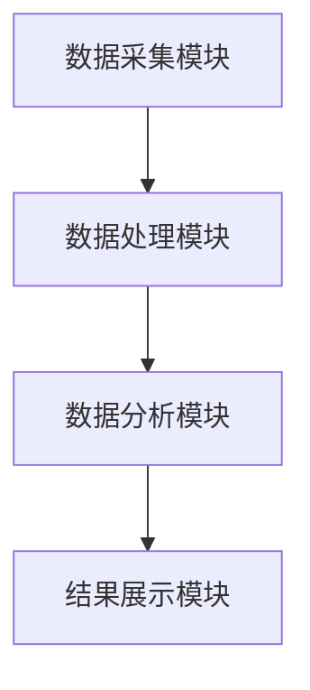

                 


# 价值投资中的AI智能体品牌权益分析系统

> 关键词：价值投资，AI智能体，品牌权益分析，算法原理，系统架构

> 摘要：本文探讨了在价值投资中，如何利用AI智能体进行品牌权益分析。通过详细分析品牌权益的核心概念、数学模型、算法原理和系统架构，展示了如何构建一个高效的AI驱动的品牌权益分析系统，帮助投资者做出更明智的决策。

---

# 第1章: 价值投资与AI智能体的结合

## 1.1 价值投资的定义与特点
### 1.1.1 价值投资的定义
- 价值投资是一种长期投资策略，旨在通过识别市场低估的优质资产进行投资。
- 强调基本面分析、安全边际和长期持有。

### 1.1.2 价值投资的特点
- 以内在价值为导向。
- 强调安全边际和风险控制。
- 长期投资，注重复利效应。

## 1.2 AI智能体在金融领域的应用
### 1.2.1 AI智能体的定义
- AI智能体是一种具有感知、决策和执行能力的智能系统。
- 在金融领域，AI智能体用于数据处理、模式识别和决策支持。

### 1.2.2 AI智能体在金融分析中的优势
- 数据处理能力强，能够快速分析大量非结构化数据。
- 可以识别复杂市场中的隐藏模式。
- 提供实时反馈和动态调整能力。

## 1.3 品牌权益分析的必要性
### 1.3.1 品牌价值的定义
- 品牌价值是品牌在市场中的认知和信任的量化表现。
- 包括品牌知名度、品牌忠诚度和品牌认知度。

### 1.3.2 品牌权益分析的重要性
- 帮助投资者识别品牌的核心竞争力。
- 评估品牌在市场中的地位和潜在价值。
- 为投资决策提供数据支持。

## 1.4 本章小结
- 价值投资与AI智能体的结合为品牌权益分析提供了新思路。
- 品牌权益分析在价值投资中具有重要的战略意义。

---

# 第2章: 品牌权益分析的核心概念

## 2.1 品牌价值的数学模型
### 2.1.1 品牌价值评估公式
$$ 品牌价值 = 品牌知名度 \times 品牌忠诚度 \times 品牌认知度 $$

### 2.1.2 品牌价值的多维模型
- 包括品牌知名度、品牌忠诚度、品牌认知度和品牌影响力等多个维度。

## 2.2 品牌权益分析的流程
### 2.2.1 数据收集
- 包括品牌历史数据、市场数据和消费者反馈。

### 2.2.2 数据处理
- 数据清洗、特征提取和数据增强。

### 2.2.3 数据分析
- 使用统计分析、机器学习和自然语言处理技术进行分析。

## 2.3 品牌权益分析的边界与外延
### 2.3.1 分析边界
- 确定品牌分析的范围和限制条件。

### 2.3.2 分析外延
- 品牌分析对其他相关领域的扩展影响。

## 2.4 本章小结
- 品牌权益分析需要综合考虑多个维度和复杂的数据处理流程。

---

# 第3章: AI智能体在品牌权益分析中的算法原理

## 3.1 自然语言处理在品牌分析中的应用
### 3.1.1 品牌情感分析
- 使用NLP技术分析消费者对品牌的看法。

### 3.1.2 品牌关键词提取
- 通过文本挖掘技术提取品牌相关关键词。

## 3.2 机器学习在品牌权益分析中的应用
### 3.2.1 品牌分类
- 使用监督学习算法对品牌进行分类。

### 3.2.2 品牌聚类
- 使用无监督学习算法对品牌进行聚类分析。

## 3.3 算法实现的数学模型
### 3.3.1 情感分析模型
$$ 情感倾向 = \text{权重} \times \text{词向量} $$

### 3.3.2 品牌分类模型
$$ P(\text{类别}|x) = \frac{P(x|\text{类别})P(\text{类别})}{P(x)} $$

## 3.4 本章小结
- AI智能体通过NLP和机器学习算法，为品牌权益分析提供了强大的技术支持。

---

# 第4章: 品牌权益分析系统的系统架构设计

## 4.1 系统功能模块设计
### 4.1.1 数据采集模块
- 负责收集品牌相关数据。

### 4.1.2 数据处理模块
- 对数据进行清洗和预处理。

### 4.1.3 数据分析模块
- 使用算法进行品牌权益分析。

### 4.1.4 结果展示模块
- 将分析结果以可视化形式展示。

## 4.2 系统架构设计
### 4.2.1 模块化设计
- 各模块之间的相互关系和数据流。

### 4.2.2 系统架构图


## 4.3 系统接口设计
### 4.3.1 输入接口
- 数据输入格式和接口定义。

### 4.3.2 输出接口
- 分析结果的输出格式和接口定义。

## 4.4 本章小结
- 系统架构设计为品牌权益分析提供了高效的实现方案。

---

# 第5章: 项目实战

## 5.1 环境安装
### 5.1.1 安装Python
- 安装Python和相关库（如TensorFlow、Scikit-learn）。

### 5.1.2 安装NLP工具
- 安装Spacy和NLTK等NLP处理工具。

## 5.2 系统核心实现
### 5.2.1 品牌情感分析代码
```python
import spacy
nlp = spacy.load("en_core_web_sm")
text = "The brand is excellent."
doc = nlp(text)
for token in doc:
    print(token.text, token.pos_, token.dep_)
```

### 5.2.2 品牌分类代码
```python
from sklearn.svm import SVC
X = [[0, 0], [1, 1]]
y = [0, 1]
clf = SVC()
clf.fit(X, y)
print(clf.predict([[2, 2]]))
```

## 5.3 案例分析
### 5.3.1 案例背景
- 选择具体品牌进行分析。

### 5.3.2 分析过程
- 使用系统进行品牌权益分析。

### 5.3.3 结果解读
- 解释分析结果对投资决策的影响。

## 5.4 本章小结
- 通过实际案例展示了系统的实用性和高效性。

---

# 第6章: 最佳实践与总结

## 6.1 最佳实践
### 6.1.1 数据质量的重要性
- 数据的准确性和完整性对分析结果的影响。

### 6.1.2 模型选择的策略
- 根据具体需求选择合适的算法和模型。

## 6.2 项目小结
- 总结项目实施的过程和成果。

## 6.3 未来展望
- 展望AI智能体在品牌权益分析中的未来发展。

## 6.4 注意事项
- 提醒读者在使用系统时需要注意的问题。

## 6.5 拓展阅读
- 推荐相关领域的书籍和资源。

---

# 参考文献
- 列出文章中引用的所有文献和资料。

---

以上是《价值投资中的AI智能体品牌权益分析系统》的目录大纲，涵盖了从背景介绍到系统实现的各个方面，确保内容详实、结构清晰。

