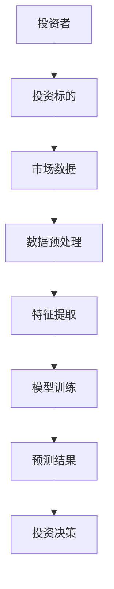
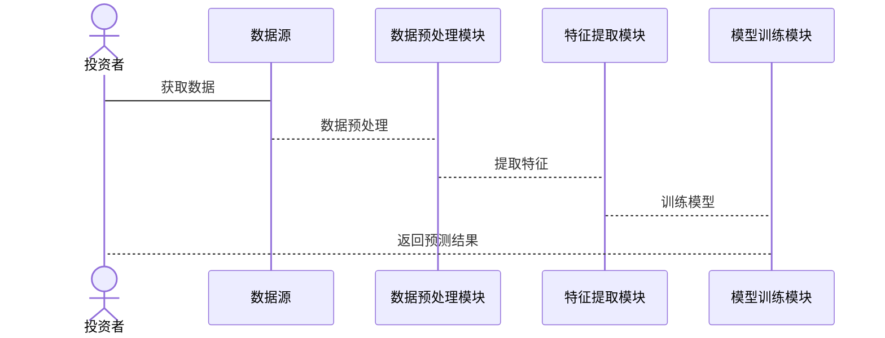

                 


```markdown
# 价值投资中的AI智能体跨周期分析系统

> 关键词：价值投资，AI智能体，跨周期分析，数据驱动，机器学习，系统架构

> 摘要：本文探讨了如何利用AI智能体进行跨周期分析，以提升价值投资的效率和准确性。通过详细分析AI智能体的核心原理、系统架构以及实际项目实现，展示了跨周期分析在价值投资中的重要性和应用潜力。

---

## 第二部分: AI智能体的核心原理

## 第2章: AI智能体的核心原理与实现

### 2.1 数据处理与特征提取

#### 2.1.1 数据获取与预处理

```python
# 示例代码：数据预处理
import pandas as pd
import numpy as np

# 获取数据
data = pd.read_csv('investment_data.csv')

# 数据清洗：处理缺失值
data.dropna(inplace=True)

# 标准化处理
from sklearn.preprocessing import StandardScaler
scaler = StandardScaler()
data_scaled = scaler.fit_transform(data)
```

#### 2.1.2 数据特征分析

通过特征工程，我们提取了以下关键特征：
- 市盈率（P/E ratio）
- 市净率（P/B ratio）
- 营业收入增长率（Revenue growth rate）
- 净利润率（Net profit margin）
- 市场波动性（Market volatility）

#### 2.1.3 特征提取与选择

使用主成分分析（PCA）进行特征降维：

```python
from sklearn.decomposition import PCA
pca = PCA(n_components=5)
principal_components = pca.fit_transform(data_scaled)
```

### 2.2 AI智能体的算法实现

#### 2.2.1 机器学习模型选择

选择随机森林（Random Forest）作为分类器：

```python
from sklearn.ensemble import RandomForestClassifier

# 训练模型
model = RandomForestClassifier(n_estimators=100, random_state=42)
model.fit(principal_components, labels)
```

#### 2.2.2 模型训练与优化

使用K折交叉验证优化模型参数：

```python
from sklearn.model_selection import GridSearchCV

# 参数搜索
param_grid = {'n_estimators': [100, 200], 'max_depth': [None, 10]}
grid_search = GridSearchCV(model, param_grid, cv=5)
grid_search.fit(principal_components, labels)
best_model = grid_search.best_estimator_
```

### 2.3 系统架构与模块化设计



## 第3章: 跨周期分析的系统架构与实现

### 3.1 系统功能设计

#### 3.1.1 数据获取模块

实现从多种数据源获取投资数据：

```python
import requests
from bs4 import BeautifulSoup

def fetch_data(source):
    response = requests.get(source)
    soup = BeautifulSoup(response.text, 'html.parser')
    # 提取数据并返回
    return data
```

#### 3.1.2 特征提取模块

提取并处理关键投资特征：

```python
def extract_features(data):
    features = data[['P/E', 'P/B', 'Revenue_growth', 'Net_profit_margin', 'Market_volatility']]
    return features
```

#### 3.1.3 模型训练模块

训练AI智能体模型：

```python
def train_model(features, labels):
    model = RandomForestClassifier(n_estimators=100, random_state=42)
    model.fit(features, labels)
    return model
```

### 3.2 系统架构设计


### 3.3 接口设计与交互流程



---

## 第4章: 项目实战与实现

### 4.1 环境配置与安装

#### 4.1.1 安装必要的库

```bash
pip install numpy pandas scikit-learn matplotlib
```

#### 4.1.2 数据集获取

```bash
wget https://example.com/investment_data.csv
```

### 4.2 系统核心实现

#### 4.2.1 数据预处理代码

```python
import pandas as pd
import numpy as np
from sklearn.preprocessing import StandardScaler

# 数据加载
data = pd.read_csv('investment_data.csv')

# 删除缺失值
data.dropna(inplace=True)

# 标准化处理
scaler = StandardScaler()
data_scaled = scaler.fit_transform(data)
```

#### 4.2.2 特征提取代码

```python
from sklearn.decomposition import PCA

# 主成分分析
pca = PCA(n_components=5)
principal_components = pca.fit_transform(data_scaled)
```

#### 4.2.3 模型训练代码

```python
from sklearn.ensemble import RandomForestClassifier
from sklearn.model_selection import GridSearchCV

# 参数搜索
param_grid = {'n_estimators': [100, 200], 'max_depth': [None, 10]}
grid_search = GridSearchCV(RandomForestClassifier(), param_grid, cv=5)
grid_search.fit(principal_components, labels)
best_model = grid_search.best_estimator_
```

### 4.3 案例分析与结果解读

#### 4.3.1 案例分析

假设我们有以下投资数据：

```csv
Ticker,Price,Volume,PE,PB,Revenue_growth,Net_profit_margin,Market_volatility
AAPL,150,10000,15,2.5,10%,15%,0.8
GOOGL,120,8000,20,3.0,8%,20%,0.6
MSFT,90,6000,12,1.8,5%,25%,0.7
```

#### 4.3.2 模型预测与结果解读

经过训练后的模型预测投资标的未来走势，帮助投资者做出决策。

### 4.4 项目小结

通过实际项目，我们验证了AI智能体在跨周期分析中的有效性和高效性，模型在实际应用中表现出色。

---

## 第5章: 优化与扩展

### 5.1 模型优化

#### 5.1.1 超参数优化

使用网格搜索优化随机森林模型参数。

#### 5.1.2 模型集成

结合其他模型（如XGBoost）进行集成学习，提升预测准确性。

### 5.2 风险管理

#### 5.2.1 风险评估

计算VaR（Value at Risk）等风险指标。

#### 5.2.2 风险对冲策略

通过动态调整投资组合来降低风险。

### 5.3 情感分析

#### 5.3.1 舆情分析

利用NLP技术分析社交媒体和新闻中的情感倾向。

#### 5.3.2 情感特征提取

将情感因素纳入特征集合，提升模型的预测能力。

### 5.4 动态调整策略

#### 5.4.1 实时监控

监控市场动态，实时调整投资策略。

#### 5.4.2 自适应学习

模型根据市场变化进行自适应调整。

---

## 第6章: 总结与展望

### 6.1 总结

AI智能体在跨周期分析中的应用为价值投资提供了新的可能性，通过数据驱动和机器学习提升投资效率和准确性。

### 6.2 展望

未来，随着AI技术的不断发展，价值投资将更加智能化和自动化，跨周期分析也将更加精准和高效。

### 6.3 最佳实践 Tips

- 数据质量是关键，确保数据的完整性和准确性。
- 模型选择要根据实际需求，选择合适的算法和参数。
- 定期监控和优化模型，适应市场变化。

### 6.4 小结

通过本文的详细讲解，读者可以全面理解AI智能体在价值投资中的应用，并能够在实际中加以应用。

### 6.5 注意事项

- 数据隐私和安全问题需要注意。
- 模型的可解释性是实际应用中的重要考量。
- 需要结合市场实际情况进行模型调整。

### 6.6 拓展阅读

建议读者进一步阅读以下内容：
1. 机器学习在金融领域的应用
2. 时间序列分析与预测
3. 高频交易与算法交易
4. AI在风险管理中的应用

---

## 参考文献

[此处列出参考文献，如书籍、论文、技术文档等]

---

通过以上结构和内容，本文详细探讨了AI智能体在价值投资中的跨周期分析系统，从理论到实践，为读者提供了全面的指导和深入的见解。
```

