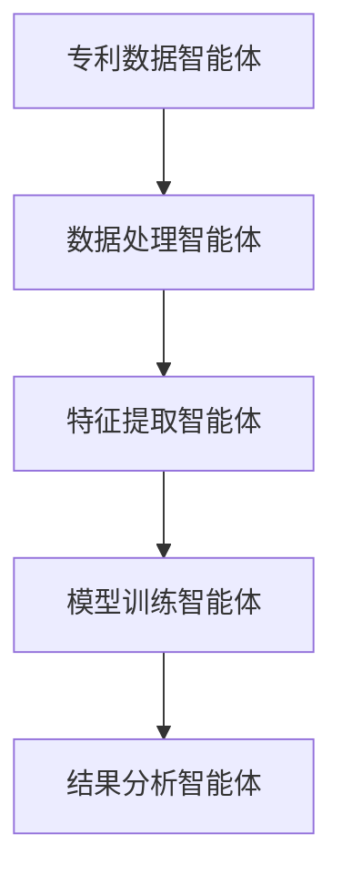
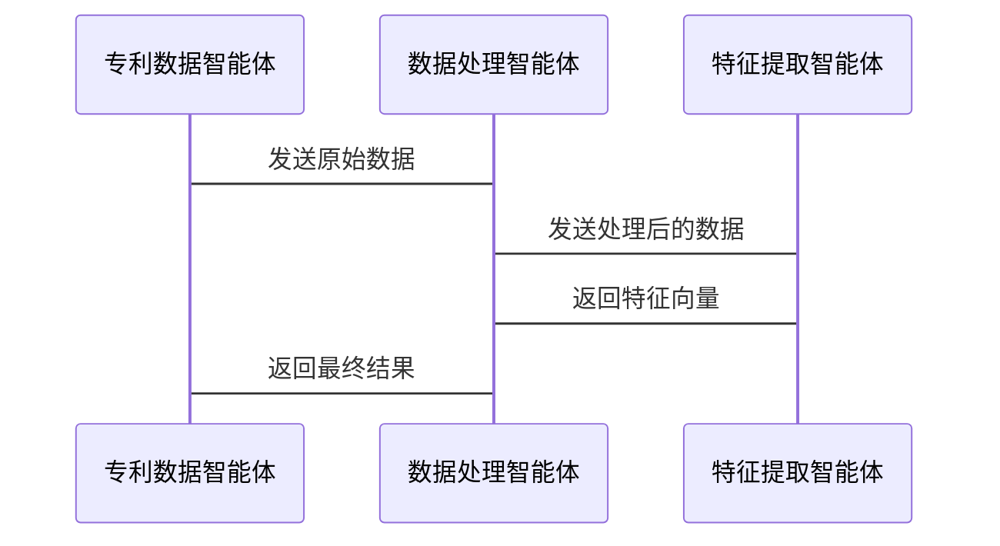
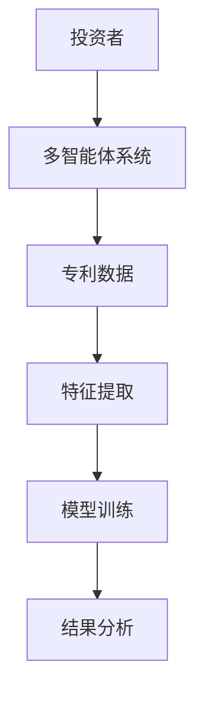
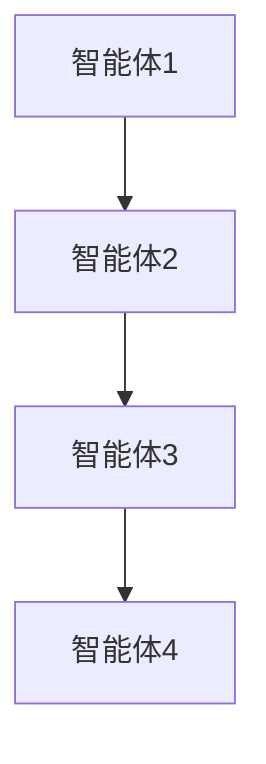
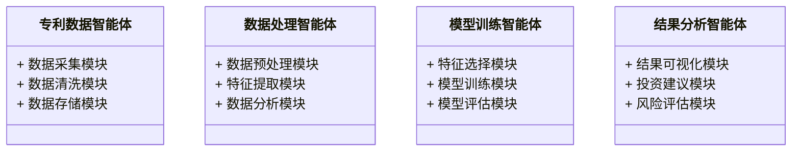
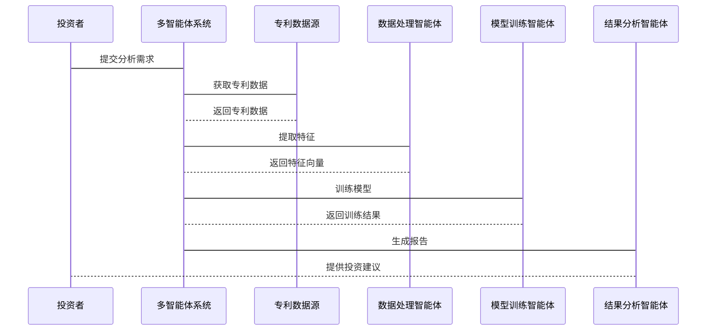

                 


# 价值投资中的AI驱动专利分析：多智能体系统的优势

> 关键词：价值投资、AI驱动、专利分析、多智能体系统、投资决策、技术评估、数据挖掘

> 摘要：本文探讨了在价值投资中如何利用AI驱动的多智能体系统进行专利分析。通过分析多智能体系统的协同优化能力，展示了其在专利数据分析中的优势，为投资者提供更精准的技术评估和投资决策支持。

---

# 第1章 价值投资与AI驱动专利分析概述

## 1.1 价值投资的核心概念

### 1.1.1 价值投资的定义与历史发展
价值投资是一种长期投资策略，强调以低于市场价买入具有内在价值的资产。该方法由本杰明·格雷厄姆和戴维·多德提出，其核心是寻找市场低估的公司，并长期持有。随着科技的进步，传统价值投资逐步融入人工智能技术，以提高分析效率和准确性。

### 1.1.2 专利分析在价值投资中的作用
专利是企业技术创新的核心体现，反映了企业的技术储备和竞争优势。通过专利分析，投资者可以评估企业的技术实力、市场布局和潜在风险。然而，专利数据复杂且数量庞大，传统人工分析效率低下，难以满足快速决策的需求。

### 1.1.3 AI驱动专利分析的优势与挑战
AI技术的引入，使专利分析从传统的人工分析转向自动化、智能化。AI能够快速处理海量专利数据，提取关键信息，发现潜在的技术趋势和竞争态势。然而，AI模型的准确性依赖于高质量的数据和算法设计，同时需要解决多智能体系统中的协同优化问题。

---

## 1.2 多智能体系统的基本概念

### 1.2.1 多智能体系统的定义
多智能体系统（Multi-Agent System, MAS）是由多个智能体组成的分布式系统，每个智能体都能独立执行任务，通过交互协作完成复杂目标。与单智能体系统相比，MAS具有更强的分布式计算能力和协同优化能力。

### 1.2.2 多智能体系统的特征
| 特征 | 描述 |
|------|------|
| 分布式 | 智能体独立运行，任务分解 |
| 协作性 | 智能体之间协同完成目标 |
| 反应性 | 能够实时感知环境变化 |
| 学习能力 | 支持在线学习和自适应优化 |

### 1.2.3 多智能体系统与传统单智能体系统的对比
通过对比分析，多智能体系统在任务分解、协作优化和适应性方面具有显著优势，特别适用于复杂场景下的专利分析任务。

---

# 第2章 多智能体系统在专利分析中的应用

## 2.1 多智能体系统的组成与功能

### 2.1.1 多智能体系统的组成结构


### 2.1.2 各智能体的功能与职责
- **专利数据智能体**：负责数据采集、清洗和预处理。
- **特征提取智能体**：提取专利文本中的关键词、分类信息。
- **模型训练智能体**：基于特征数据，训练分类模型。
- **结果分析智能体**：生成分析报告，提供投资建议。

### 2.1.3 智能体之间的协作机制
通过消息传递机制（Message Passing Interface, MPI）实现智能体间的协同，每个智能体根据任务分配接收数据，完成特定任务后返回结果。

---

## 2.2 多智能体系统的协同优化

### 2.2.1 协同优化的目标与策略
目标是通过多智能体协作，提高专利分析的准确性和效率。策略包括任务分解、负载均衡和动态调整。

### 2.2.2 智能体之间的信息共享与决策


### 2.2.3 协同优化的数学模型
通过马尔可夫决策过程（Markov Decision Process, MDP）建模，定义状态空间、动作空间和奖励函数。

---

## 2.3 多智能体系统在专利分析中的优势

### 2.3.1 提高分析效率
通过分布式计算和任务分解，显著提高专利分析的速度。

### 2.3.2 增强分析精度
多个智能体协作，从不同维度提取信息，提升分析结果的准确性。

### 2.3.3 适应复杂场景的能力
多智能体系统能够处理海量数据和复杂场景，满足价值投资中多样化的分析需求。

---

## 2.4 本章小结

---

# 第3章 价值投资中的专利分析框架

## 3.1 价值投资中的专利分析目标

### 3.1.1 识别高价值专利
通过分析专利的技术价值、市场价值和法律价值，识别具有投资潜力的专利。

### 3.1.2 分析专利布局
评估企业在技术研发和市场布局上的策略，判断其核心竞争力。

### 3.1.3 评估技术风险
通过专利分析，识别潜在的技术风险，如专利侵权风险和市场替代风险。

---

## 3.2 专利分析框架的设计原则

### 3.2.1 数据驱动
以专利数据为基础，结合企业财务数据和市场数据，构建多维度分析框架。

### 3.2.2 可视化
通过图表形式展示分析结果，帮助投资者直观理解技术趋势和竞争态势。

### 3.2.3 可扩展性
框架设计应具有灵活性，能够适应不同行业和不同规模企业的专利分析需求。

---

## 3.3 基于多智能体系统的专利分析框架

### 3.3.1 框架的整体结构


### 3.3.2 各模块的功能描述
- **投资者输入**：提供投资目标和分析需求。
- **多智能体系统**：分解任务，协调各智能体完成分析。
- **专利数据**：包括专利文本、专利申请信息等。
- **特征提取**：从专利数据中提取关键特征。
- **模型训练**：基于特征数据训练分类模型。
- **结果分析**：生成分析报告，提供投资建议。

---

## 3.4 本章小结

---

# 第4章 多智能体系统的算法原理

## 4.1 多智能体系统的算法概述

### 4.1.1 强化学习
通过强化学习算法，智能体能够在复杂环境中做出最优决策。

### 4.1.2 分布式计算
利用分布式计算技术，提高系统的计算能力和处理效率。

### 4.1.3 协作学习
多个智能体通过协作学习，共同优化分析结果。

---

## 4.2 多智能体系统的算法实现

### 4.2.1 算法流程


### 4.2.2 算法实现代码
```python
class Agent:
    def __init__(self, state_space, action_space):
        self.state_space = state_space
        self.action_space = action_space
        self.model = self.build_model()

    def build_model(self):
        # 构建模型
        pass

    def act(self, state):
        # 选择动作
        pass

    def learn(self, state, action, reward, next_state):
        # 更新模型
        pass
```

---

## 4.3 算法的数学模型

### 4.3.1 状态空间
$$ S = \{ s_1, s_2, ..., s_n \} $$

### 4.3.2 动作空间
$$ A = \{ a_1, a_2, ..., a_m \} $$

### 4.3.3 奖励函数
$$ R(s, a) = \sum_{i=1}^{k} w_i \cdot f_i(s, a) $$

---

## 4.4 本章小结

---

# 第5章 系统分析与架构设计方案

## 5.1 项目介绍

### 5.1.1 项目目标
构建一个基于多智能体系统的专利分析平台，支持价值投资中的技术评估和决策支持。

### 5.1.2 项目背景
随着科技竞争的加剧，企业技术实力的评估变得越来越重要。通过专利分析，投资者能够更准确地判断企业的技术优势和市场竞争力。

---

## 5.2 系统功能设计

### 5.2.1 领域模型


### 5.2.2 系统架构设计


---

## 5.3 系统接口设计

### 5.3.1 系统接口
- **输入接口**：接收投资者的分析需求和专利数据。
- **输出接口**：提供分析结果和投资建议。

---

## 5.4 系统交互流程

### 5.4.1 交互流程


---

## 5.5 本章小结

---

# 第6章 项目实战：基于多智能体系统的专利分析平台

## 6.1 环境安装

### 6.1.1 系统要求
- Python 3.8+
- TensorFlow 2.0+
- scikit-learn 0.24+

### 6.1.2 安装依赖
```bash
pip install numpy matplotlib scikit-learn tensorflow
```

---

## 6.2 核心实现

### 6.2.1 专利数据智能体
```python
class PatentDataAgent(Agent):
    def __init__(self):
        super().__init__(state_space, action_space)
        self.data_source = "patent_database"

    def collect_data(self):
        # 数据采集逻辑
        pass
```

### 6.2.2 特征提取智能体
```python
class FeatureExtractionAgent(Agent):
    def __init__(self):
        super().__init__(state_space, action_space)
        self.feature_extractor = PCA(n_components=10)
```

### 6.2.3 模型训练智能体
```python
class ModelTrainingAgent(Agent):
    def __init__(self):
        super().__init__(state_space, action_space)
        self.model = self.build_model()

    def build_model(self):
        model = Sequential()
        model.add(Dense(64, activation='relu'))
        model.add(Dense(1, activation='sigmoid'))
        model.compile(optimizer='adam', loss='binary_crossentropy')
        return model
```

---

## 6.3 项目总结

### 6.3.1 项目成果
构建了一个基于多智能体系统的专利分析平台，能够高效地进行专利数据分析和投资评估。

### 6.3.2 项目经验
- 多智能体系统的协同优化能力显著提高了分析效率。
- 系统架构设计需要充分考虑模块间的交互和数据流。

---

## 6.4 本章小结

---

# 第7章 总结与展望

## 7.1 总结
通过本文的探讨，我们展示了如何利用多智能体系统进行AI驱动的专利分析，为价值投资提供了新的思路和技术支持。

## 7.2 展望
未来，随着AI技术的不断发展，多智能体系统在专利分析中的应用将更加广泛，技术也将更加成熟。

---

# 参考文献
（此处列出相关文献和资料）

---

通过以上结构，我们能够系统地探讨价值投资中的AI驱动专利分析，并展示多智能体系统在其中的优势和应用。

