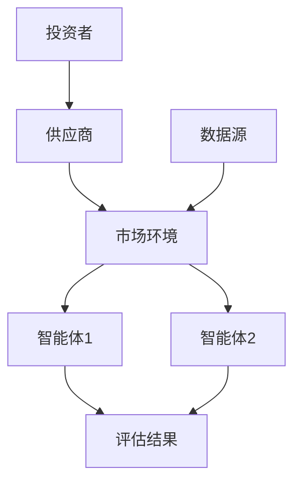
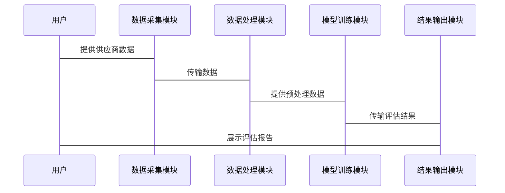

                 


# 价值投资中的AI驱动供应商关系评估：多智能体协作

## 关键词：价值投资，AI驱动，供应商关系评估，多智能体协作，算法原理，系统架构，项目实战

## 摘要

本文探讨了在价值投资中利用人工智能技术，特别是通过多智能体协作来评估和管理供应商关系的方法。文章从价值投资的基本概念出发，详细分析了AI驱动的供应商关系评估的核心概念、算法原理、系统架构以及实际项目实现。通过构建多智能体协作模型，本文提出了一种创新的解决方案，帮助投资者更高效、精准地评估和管理供应商关系，从而提升投资决策的科学性和有效性。

---

# 第一部分：价值投资与AI驱动供应商关系评估的背景

## 第1章：价值投资的核心概念与AI的应用

### 1.1 价值投资的基本定义

价值投资是一种以低于其内在价值的价格购买优质股票的投资策略，其核心在于识别市场中被低估的投资标的。传统的价值投资依赖于对财务报表、行业趋势和市场情绪的分析，但这种方法在面对复杂市场环境时存在一定的局限性。

**问题背景**：随着市场的复杂化和信息量的爆炸式增长，传统的供应商关系评估方法难以应对日益复杂的需求。如何利用现代技术手段，尤其是人工智能技术，来提高供应商关系评估的效率和准确性，成为当前研究的热点。

**问题解决**：AI技术，特别是多智能体协作，能够在复杂的决策环境中实现信息的高效整合和优化决策。通过多智能体协作，投资者可以更全面地评估供应商的价值，从而做出更科学的投资决策。

### 1.2 供应商关系评估的重要性

供应商关系评估是企业价值评估的重要组成部分。在供应链管理和投资决策中，供应商的稳定性、可靠性以及成本效益直接影响企业的整体价值。传统的供应商评估方法通常依赖于主观判断和单维度分析，难以全面捕捉供应商的潜在价值。

### 1.3 多智能体协作的定义与特点

多智能体协作是指多个智能体通过协同工作，共同完成复杂任务的过程。其特点包括：

- **分布性**：每个智能体负责不同的任务或数据源。
- **协作性**：智能体之间通过信息共享和协同决策，共同完成目标。
- **适应性**：能够动态调整策略以应对环境变化。
- **高效性**：通过并行计算和分布式处理，提高决策效率。

---

## 第2章：价值投资中的AI驱动供应商关系评估的核心概念

### 2.1 供应商关系评估的多智能体协作模型

#### 2.1.1 模型的构成要素

多智能体协作模型由以下几个关键要素组成：

1. **智能体**：负责处理特定任务的独立实体。
2. **通信机制**：智能体之间共享信息的通道。
3. **协作规则**：定义智能体之间的交互方式和决策逻辑。
4. **评估指标**：用于衡量模型性能的量化标准。

#### 2.1.2 模型的输入与输出

- **输入**：包括供应商的历史数据、市场动态、财务指标等。
- **输出**：生成供应商的价值评估报告，包括供应商的稳定性、成本效益、潜在风险等。

#### 2.1.3 模型的评估标准

评估标准包括准确性、效率、鲁棒性和可解释性。通过这些标准，可以衡量模型在实际应用中的表现。

### 2.2 多智能体协作的实体关系模型

#### 2.2.1 实体关系图的构建

通过构建实体关系图，我们可以清晰地描述供应商、投资者、市场环境等实体之间的关系。以下是实体关系图的Mermaid流程图：

```mermaid
graph LR
    A[投资者] --> B[供应商]
    B --> C[市场环境]
    D[数据源] --> C
    E[智能体1] --> C
    F[智能体2] --> C
    G[评估结果] <-- E
    G <-- F
```

#### 2.2.2 实体关系图的属性特征对比表

以下是实体关系图中各实体的属性特征对比表：

| 实体 | 属性 | 特征 |
|------|------|------|
| 投资者 | 资金、风险偏好 | 高度关注供应商稳定性 |
| 供应商 | 成本、质量、交付周期 | 关注市场环境和竞争态势 |
| 市场环境 | 宏观经济指标、行业趋势 | 影响供应商的市场表现 |

#### 2.2.3 实体关系图的Mermaid流程图

通过Mermaid流程图，我们可以更直观地理解各实体之间的关系：



---

## 第3章：多智能体协作算法的原理与实现

### 3.1 多智能体协作算法的概述

#### 3.1.1 算法的基本原理

多智能体协作算法通过多个智能体的协同工作，实现对复杂问题的高效求解。每个智能体负责处理特定任务，并通过通信机制共享信息，最终形成最优决策。

#### 3.1.2 算法的主要步骤

1. **初始化**：定义智能体的数量、任务分配和通信机制。
2. **数据采集**：从数据源获取供应商相关信息。
3. **信息共享**：智能体之间共享数据和计算结果。
4. **协同决策**：基于共享信息，形成最终的评估结果。
5. **结果输出**：生成供应商的价值评估报告。

### 3.2 多智能体协作算法的数学公式

#### 3.2.1 算法的优化目标

目标函数：
$$
\text{Maximize } \sum_{i=1}^{n} w_i x_i
$$

其中，$w_i$ 是权重，$x_i$ 是供应商的特征指标。

#### 3.2.2 算法的核心公式

协同决策公式：
$$
y = \sum_{i=1}^{m} a_i \cdot f_i(x)
$$

其中，$a_i$ 是智能体的权重，$f_i(x)$ 是智能体的决策函数。

### 3.3 多智能体协作算法的实现

#### 3.3.1 算法的伪代码实现

```python
def multi_agent_collaboration(data, num_agents):
    agents = [Agent() for _ in range(num_agents)]
    for agent in agents:
        agent.receive_data(data)
    for i in range(num_agents):
        agents[i].share_info(agents[i+1])
    results = [agent.make_decision() for agent in agents]
    return results
```

---

## 第4章：价值投资中的AI驱动供应商关系评估系统分析

### 4.1 系统分析与设计

#### 4.1.1 系统的功能需求

系统需要实现以下功能：

1. 数据采集：从多种数据源获取供应商信息。
2. 数据处理：对数据进行清洗和预处理。
3. 模型训练：基于多智能体协作算法，训练供应商评估模型。
4. 结果输出：生成供应商的价值评估报告。

#### 4.1.2 系统的模块划分

系统主要模块包括：

- 数据采集模块
- 数据处理模块
- 模型训练模块
- 结果输出模块

#### 4.1.3 系统的交互流程

系统交互流程如下：

1. 用户输入供应商数据。
2. 数据采集模块从数据源获取数据。
3. 数据处理模块对数据进行清洗和预处理。
4. 模型训练模块基于多智能体协作算法，训练供应商评估模型。
5. 结果输出模块生成供应商的价值评估报告。

### 4.2 系统架构设计

#### 4.2.1 系统的总体架构

系统总体架构包括数据层、业务逻辑层和用户界面层。

#### 4.2.2 系统的分层设计

1. 数据层：存储供应商数据和模型参数。
2. 业务逻辑层：实现数据处理和模型训练功能。
3. 用户界面层：提供用户交互界面。

#### 4.2.3 系统的接口设计

系统接口包括：

- 数据采集接口
- 数据处理接口
- 模型训练接口
- 结果输出接口

### 4.3 系统的交互设计

#### 4.3.1 系统的用户界面

用户界面包括数据输入界面和结果展示界面。

#### 4.3.2 系统的交互流程图

通过Mermaid序列图，我们可以清晰地展示系统的交互流程：



---

## 第5章：价值投资中的AI驱动供应商关系评估项目实战

### 5.1 项目环境的安装与配置

#### 5.1.1 环境的安装

需要安装以下工具和库：

- Python 3.x
- NumPy
- Pandas
- TensorFlow
- Matplotlib

#### 5.1.2 环境的配置

配置步骤：

1. 安装Python和必要的库。
2. 安装TensorFlow框架。
3. 配置Jupyter Notebook作为开发环境。

### 5.2 系统核心实现源代码

#### 5.2.1 数据处理代码

```python
import pandas as pd
import numpy as np

# 数据加载
data = pd.read_csv('suppliers.csv')

# 数据清洗
data.dropna(inplace=True)
data = data[~data[' revenue'].str.contains(' ', na=False)]
```

#### 5.2.2 模型训练代码

```python
import tensorflow as tf
from tensorflow.keras import layers

# 定义模型
model = tf.keras.Sequential([
    layers.Dense(64, activation='relu'),
    layers.Dense(1, activation='sigmoid')
])

# 编译模型
model.compile(optimizer='adam', loss='binary_crossentropy', metrics=['accuracy'])

# 训练模型
model.fit(data, labels, epochs=10, batch_size=32)
```

#### 5.2.3 结果输出代码

```python
# 生成评估报告
 predictions = model.predict(data)
 report = pd.DataFrame({'Supplier ID': data['id'], 'Prediction': predictions})
 report.to_csv('assessment_report.csv', index=False)
```

### 5.3 项目实战案例分析

#### 5.3.1 案例背景

假设我们有10家供应商的数据，包括收入、成本、利润率等指标。我们需要利用AI驱动的多智能体协作算法，评估这些供应商的价值。

#### 5.3.2 案例分析

通过数据处理和模型训练，我们生成了供应商的价值评估报告，包括每家供应商的稳定性、成本效益和潜在风险。

#### 5.3.3 案例总结

通过AI驱动的多智能体协作算法，我们能够更准确地评估供应商的价值，从而做出更科学的投资决策。

---

## 第6章：总结与展望

### 6.1 最佳实践

1. 数据预处理是关键，确保数据的准确性和完整性。
2. 模型调参时，关注算法的收敛性和稳定性。
3. 在实际应用中，结合具体业务需求，灵活调整模型参数。

### 6.2 小结

本文详细探讨了价值投资中AI驱动的供应商关系评估方法，提出了基于多智能体协作的创新解决方案，为投资者提供了更高效、更精准的决策支持。

### 6.3 注意事项

1. 数据隐私和安全问题需要特别关注。
2. 模型的泛化能力需要通过充分的测试来验证。

### 6.4 拓展阅读

建议读者进一步阅读相关领域的最新研究成果，如多智能体协作在金融领域的应用，以及深度学习在价值评估中的创新应用。

---

通过本文的系统分析和实战案例，我们展示了AI技术在价值投资中的巨大潜力。未来，随着技术的不断发展，AI驱动的供应商关系评估将更加智能化、高效化，为投资者创造更大的价值。

