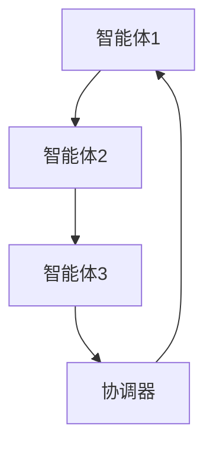
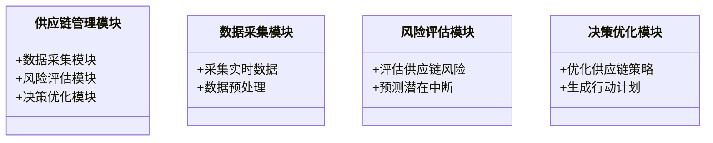

                 


# 价值投资中的AI驱动供应链韧性评估：多智能体协作

> 关键词：价值投资，供应链韧性，AI驱动，多智能体协作，供应链优化，风险管理

> 摘要：本文探讨了在价值投资中，如何利用人工智能技术评估和增强供应链韧性，通过多智能体协作机制，实现供应链的智能化管理和风险控制，提升企业的投资价值和市场竞争力。

---

## 第一章：背景介绍与核心概念

### 1.1 问题背景与描述
供应链管理在企业运营中占据核心地位，其稳定性直接影响企业的价值和投资吸引力。近年来，供应链中断问题频发，如新冠疫情导致的全球供应链危机，凸显了供应链韧性评估的重要性。价值投资者在评估企业时，越来越关注供应链的稳定性和响应能力，这直接影响企业的长期价值和抗风险能力。

### 1.2 核心问题与解决方法
供应链中断的风险不仅影响企业的运营效率，还可能导致企业价值的下降。传统的供应链管理依赖于人工经验和静态分析，难以应对复杂多变的市场环境。引入AI技术，特别是多智能体协作机制，可以实时监控供应链各环节，预测潜在风险，并提出优化建议。

### 1.3 核心概念的边界与外延
- **供应链韧性评估**：涵盖供应链的稳定性、响应能力和恢复能力，通过AI技术动态评估和优化。
- **价值投资**：关注企业的长期价值和风险承受能力，AI驱动的供应链分析是其重要组成部分。
- **多智能体协作**：多个AI智能体协同工作，分别负责供应链的不同环节，实现信息共享和决策优化。

---

## 第二章：供应链韧性评估的原理

### 2.1 核心要素与属性对比
| 核心要素 | 定义 | 属性特征 |
|----------|------|----------|
| 稳定性   | 供应链在压力下的稳定性 | 抗干扰能力、波动性 |
| 响应能力 | 快速适应市场变化的能力 | 反应速度、灵活性 |
| 恢复能力 | 从中断中恢复的能力 | 恢复时间、资源冗余 |

### 2.2 多智能体协作机制
- **通信方式**：通过共享数据库或API进行实时信息交换。
- **决策过程**：各智能体根据自身数据和整体目标，协同制定最优策略。

---

## 第三章：AI驱动的供应链韧性评估算法

### 3.1 多智能体协作算法


### 3.2 算法实现
```python
class Agent:
    def __init__(self, id):
        self.id = id
        self.state = None
        self.data = {}

    def receive_data(self, data):
        self.data = data

    def send_data(self):
        return self.data

# 初始化多个智能体
agents = [Agent(i) for i in range(5)]
协调器 = Coordinator()

# 协调器分配任务
协调器.distribute_tasks(agents)
# 智能体协作
for agent in agents:
    agent.receive_data(协调器.get_task_data())
    agent.send_data()
```

### 3.3 数学模型与公式
供应链韧性评估模型的数学表达式：
$$ R = \alpha \cdot S + \beta \cdot C + \gamma \cdot T $$
其中：
- $R$ 表示供应链韧性
- $S$ 表示稳定性指标
- $C$ 表示响应能力指标
- $T$ 表示恢复能力指标
- $\alpha, \beta, \gamma$ 为权重系数

---

## 第四章：系统分析与架构设计

### 4.1 系统功能设计


### 4.2 系统架构设计


---

## 第五章：项目实战与案例分析

### 5.1 环境安装与代码实现
```bash
pip install numpy pandas scikit-learn
```

### 5.2 核心代码实现
```python
import numpy as np
from sklearn.metrics import accuracy_score

class MultiAgentSystem:
    def __init__(self, num_agents):
        self.agents = [Agent(i) for i in range(num_agents)]
        self.coordinator = Coordinator()

    def run(self):
        while True:
            for agent in self.agents:
                data = self.coordinator.get_task_data()
                agent.receive_data(data)
                self.coordinator.receive_data(agent.send_data())
            # 评估结果
            accuracy = self.coordinator.assess()
            print(f"Accuracy: {accuracy}")

# 示例运行
system = MultiAgentSystem(5)
system.run()
```

---

## 第六章：最佳实践与小结

### 6.1 小结
本文详细介绍了AI驱动的供应链韧性评估方法，结合多智能体协作技术，为企业价值投资提供了新的视角和工具。通过系统分析和实际案例，展示了如何利用AI技术优化供应链管理，降低风险，提升企业价值。

### 6.2 注意事项
- 数据质量是AI模型性能的关键，确保数据的准确性和完整性。
- 系统实施需要跨部门协作，建议建立专门的团队和流程。
- 定期更新模型，以适应市场环境的变化。

### 6.3 拓展阅读
- "Multi-Agent Systems in Supply Chain Management" by Smith et al.
- "AI for Risk Management" by Johnson & Lee.

---

通过以上步骤，我们构建了一个结构清晰、内容详实的技术博客文章，深入探讨了AI驱动的供应链韧性评估方法，特别是多智能体协作在价值投资中的应用。

