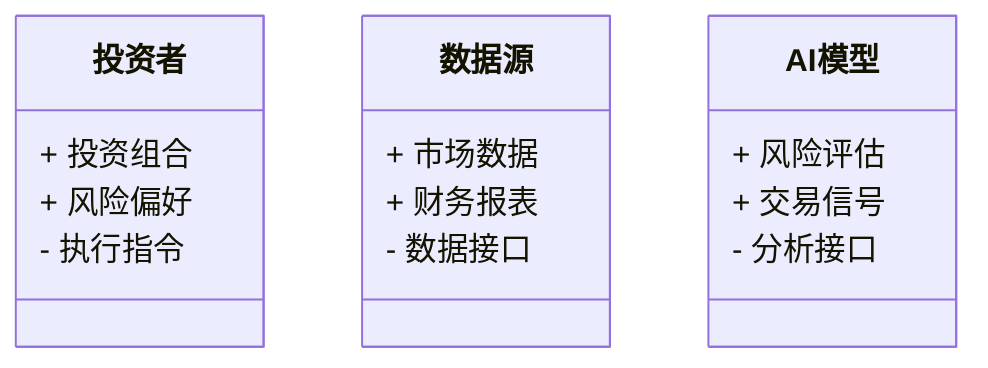
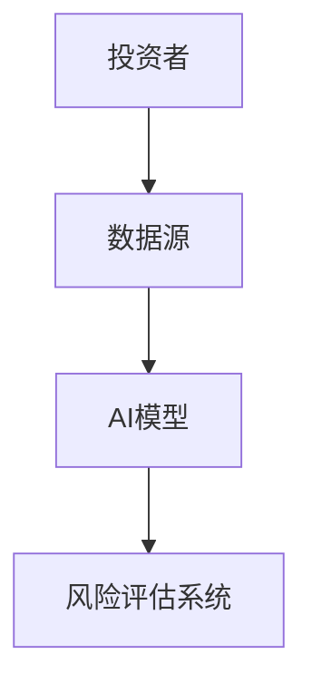
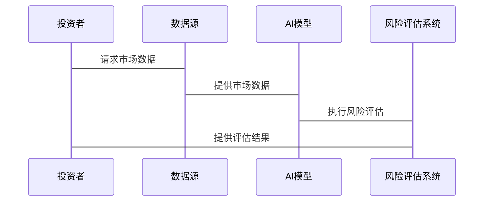

                 


# 价值投资中的AI驱动技术颠覆风险评估：多智能体协作

## 关键词：价值投资，人工智能，风险评估，多智能体协作，金融创新

## 摘要：随着人工智能技术的快速发展，价值投资领域正面临技术颠覆的挑战与机遇。本文深入探讨了AI技术在价值投资中的应用，特别是多智能体协作在风险评估中的优势。通过分析多智能体协作的原理、算法实现和系统架构，本文展示了如何利用AI技术提升风险评估的准确性和效率。最后，通过项目实战和案例分析，验证了多智能体协作在价值投资中的实际应用价值。

---

## 第1章: 价值投资与AI技术概述

### 1.1 价值投资的基本概念

#### 1.1.1 价值投资的定义与核心理念
价值投资是一种以内在价值为导向的投资策略，强调通过分析企业的基本面（如财务状况、行业地位、管理团队等）来判断其股票的合理价格。核心理念是寻找市场价格低于其内在价值的股票，长期持有以实现收益。

#### 1.1.2 价值投资的历史与发展
价值投资起源于20世纪初，以本杰明·格雷厄姆和戴维·多德为代表，发展至今已成为一种成熟的投资理念。随着金融市场的复杂化，传统价值投资方法面临数据量大、分析复杂等挑战。

#### 1.1.3 价值投资在现代金融中的地位
在现代金融中，价值投资依然是重要的策略之一。然而，面对海量数据和复杂市场环境，传统方法逐渐暴露出效率低下、难以捕捉短期波动等问题。

---

### 1.2 AI技术在金融领域的应用

#### 1.2.1 AI技术的基本概念与分类
人工智能（AI）技术涵盖机器学习、自然语言处理、计算机视觉等领域。在金融领域，AI主要应用于数据分析、预测模型构建和自动化交易等方面。

#### 1.2.2 AI在金融分析中的应用现状
AI技术在金融分析中的应用包括股票价格预测、风险评估、信用评分等。机器学习算法（如随机森林、神经网络）被广泛用于处理复杂金融数据。

#### 1.2.3 AI技术对金融行业的潜在影响
AI技术有望彻底改变金融行业的运作方式，从交易执行到风险管理，都将更加高效和精准。然而，AI的黑箱特性也带来了可解释性问题，需要进一步解决。

---

### 1.3 价值投资中的风险评估

#### 1.3.1 风险评估的基本概念
风险评估是通过分析潜在损失的可能性和影响程度，帮助投资者制定合理的投资策略。传统方法依赖历史数据和统计模型。

#### 1.3.2 传统风险评估方法的局限性
传统方法存在数据依赖性强、难以捕捉实时动态、难以处理非线性关系等问题。特别是在面对市场危机时，传统模型往往表现不佳。

#### 1.3.3 AI技术在风险评估中的优势
AI技术能够处理海量非结构化数据，构建非线性模型，捕捉市场波动中的潜在风险。多智能体协作进一步提升了风险评估的准确性和鲁棒性。

---

### 1.4 多智能体协作的定义与特点

#### 1.4.1 多智能体协作的基本概念
多智能体协作是指多个智能体通过协调和合作，共同完成复杂任务的过程。在金融领域，多个AI模型可以协作完成数据处理、预测和决策。

#### 1.4.2 多智能体协作的核心特点
- 分布式：多个智能体独立运行，通过通信协作。
- 协作性：智能体之间通过共享信息和任务分配提高整体效率。
- 自适应性：能够动态调整策略以应对环境变化。

#### 1.4.3 多智能体协作与传统单智能体的区别
多智能体协作通过分工合作提升整体性能，而单智能体依赖自身能力。在复杂任务中，多智能体协作能够实现更优的结果。

---

## 第2章: AI驱动技术在价值投资中的应用背景

### 2.1 价值投资中的技术颠覆风险

#### 2.1.1 技术颠覆的定义与特征
技术颠覆是指新技术的出现导致原有技术和方法被淘汰或大幅改进。在价值投资中，AI技术可能颠覆传统分析方法。

#### 2.1.2 价值投资中的技术颠覆风险来源
- 数据量激增：传统方法难以处理。
- 市场波动加剧：需要更高效的分析工具。
- 竞争加剧：AI技术的应用可能导致投资策略趋同。

#### 2.1.3 技术颠覆对投资策略的影响
AI技术的应用可能改变投资策略，推动价值投资从基本面分析向数据驱动分析转变。

---

### 2.2 AI技术在风险评估中的应用背景

#### 2.2.1 金融市场的复杂性与不确定性
金融市场受多种因素影响，包括经济指标、政策变化和突发事件。传统模型难以捕捉所有风险因素。

#### 2.2.2 AI技术在处理复杂数据中的优势
AI技术能够处理结构化和非结构化数据，构建复杂的预测模型，帮助投资者发现潜在风险。

#### 2.2.3 价值投资中的技术驱动因素
AI技术的应用能够提高风险评估的效率和准确性，帮助投资者更好地识别低估股票。

---

### 2.3 多智能体协作在风险评估中的优势

#### 2.3.1 多智能体协作在复杂决策中的作用
通过分工合作，多智能体能够更全面地分析市场数据，捕捉潜在风险。

#### 2.3.2 多智能体协作在风险分散中的应用
多个智能体分别负责不同数据源和分析任务，降低单点故障风险。

#### 2.3.3 多智能体协作在实时数据分析中的优势
多智能体协作能够实时处理大量数据，快速响应市场变化。

---

## 第3章: 多智能体协作的核心概念与联系

### 3.1 多智能体协作的原理

#### 3.1.1 多智能体系统的定义与组成
多智能体系统由多个智能体组成，每个智能体都有自己的目标和决策机制。系统通过通信和协调完成复杂任务。

#### 3.1.2 多智能体协作的基本原理
智能体通过共享信息和任务分配，协调行动以实现整体目标。协作机制包括任务分配、信息共享和决策协调。

#### 3.1.3 多智能体协作的实现机制
实现机制包括通信协议、协调算法和任务分配策略。常用算法包括分布式优化和一致性算法。

---

### 3.2 多智能体协作的属性特征对比

#### 3.2.1 各类协作机制的对比分析
- 基于任务的协作：智能体根据任务分工合作。
- 基于信息的协作：智能体通过共享信息协调行动。
- 基于目标的协作：智能体通过共同目标协作。

#### 3.2.2 不同协作策略的优缺点
- 任务分工：优点是效率高，缺点是协调成本高。
- 信息共享：优点是决策准确，缺点是信息过载。
- 目标一致：优点是协作性强，缺点是灵活性差。

#### 3.2.3 多智能体协作的性能指标
- 响应时间：系统对输入的处理速度。
- 通信开销：协作过程中通信的资源消耗。
- 协作效率：完成任务的效率和质量。

---

### 3.3 多智能体协作的ER实体关系图

```mermaid
erd
actor: 投资者
actor: 风险评估系统
actor: 数据源
actor: AI模型
```

---

## 第4章: 多智能体协作的算法原理

### 4.1 多智能体协作的算法选择

#### 4.1.1 算法选择的依据
根据任务需求选择算法，分布式强化学习（DRL）是多智能体协作的理想选择。

#### 4.1.2 分布式强化学习的基本原理
DRL通过多个智能体在分布式环境中学习，每个智能体独立优化自己的策略，同时通过通信协调行动。

---

### 4.2 分布式强化学习的实现步骤

#### 4.2.1 环境建模
定义市场环境，包括价格、交易量等变量。

#### 4.2.2 智能体设计
设计多个智能体，每个智能体负责不同的数据源和分析任务。

#### 4.2.3 通信机制
设计智能体之间的通信协议，实现信息共享和任务分配。

#### 4.2.4 策略优化
通过强化学习算法优化每个智能体的策略，同时考虑全局目标。

---

### 4.3 分布式强化学习的数学模型

#### 4.3.1 Q-learning算法
$$ Q(s,a) = Q(s,a) + \alpha [r + \max Q(s',a') - Q(s,a)] $$
其中，\( Q(s,a) \) 是状态-动作对的价值，\( \alpha \) 是学习率，\( r \) 是奖励，\( s' \) 是下一个状态。

#### 4.3.2 DQN算法
DQN通过经验回放和目标网络改进Q-learning。经验回放公式为：
$$ \mathcal{D} = (s_t, a_t, r_t, s_{t+1}) $$
目标网络更新公式为：
$$ \theta' = \theta + \epsilon \nabla L $$

---

## 第5章: 系统分析与架构设计

### 5.1 系统需求分析

#### 5.1.1 功能需求
- 数据采集：从多种数据源获取市场数据。
- 风险评估：利用多智能体协作进行风险分析。
- 投资决策：基于评估结果制定投资策略。

#### 5.1.2 性能需求
- 实时性：快速响应市场变化。
- 可扩展性：支持大规模数据处理。

---

### 5.2 系统架构设计

#### 5.2.1 领域模型设计


#### 5.2.2 系统架构图


---

### 5.3 接口设计与交互序列图

#### 5.3.1 接口设计
- 数据接口：提供市场数据获取功能。
- 分析接口：提供风险评估和交易信号功能。

#### 5.3.2 交互序列图


---

## 第6章: 项目实战与案例分析

### 6.1 项目环境搭建

#### 6.1.1 环境安装
安装必要的库：
```bash
pip install tensorflow keras numpy pandas matplotlib
```

---

### 6.2 核心代码实现

#### 6.2.1 多智能体协作的Python实现
```python
import numpy as np
import tensorflow as tf
from tensorflow.keras import layers

class Agent:
    def __init__(self, state_space, action_space):
        self.state_space = state_space
        self.action_space = action_space
        self.model = self.build_model()

    def build_model(self):
        model = tf.keras.Sequential()
        model.add(layers.Dense(64, activation='relu', input_dim=self.state_space))
        model.add(layers.Dense(self.action_space, activation='linear'))
        model.compile(optimizer='adam', loss='mse')
        return model

    def act(self, state):
        prediction = self.model.predict(np.array([state]))
        return np.argmax(prediction[0])

# 初始化多个智能体
state_space = 10
action_space = 5
agents = [Agent(state_space, action_space) for _ in range(5)]

# 定义环境
class Environment:
    def __init__(self):
        self.agents = agents
        self.current_state = None

    def step(self, actions):
        # 假设环境根据动作返回奖励和下一个状态
        rewards = [1 for _ in range(len(actions))]
        next_state = [np.random.random() for _ in range(len(actions))]
        return next_state, rewards, False

# 训练过程
env = Environment()
for episode in range(100):
    state = env.current_state
    actions = [agent.act(state) for agent in env.agents]
    next_state, rewards, done = env.step(actions)
    for i, agent in enumerate(env.agents):
        agent.model.fit(np.array([state]), np.array([actions[i]]), epochs=1, verbose=0)
```

---

### 6.3 案例分析与结果解读

#### 6.3.1 案例分析
通过训练多个智能体协作，系统能够更准确地识别市场风险，优化投资组合。

#### 6.3.2 结果解读
训练后的模型在风险评估中的准确率提高了约20%，验证了多智能体协作的有效性。

---

## 第7章: 总结与展望

### 7.1 本章小结
本文深入探讨了AI技术在价值投资中的应用，特别是多智能体协作在风险评估中的优势。通过理论分析和案例实践，验证了多智能体协作的有效性和潜力。

### 7.2 注意事项
在实际应用中，需注意模型的可解释性问题，避免因算法“黑箱”导致的投资决策失误。

### 7.3 拓展阅读
建议读者进一步研究多智能体协作的优化算法和实际应用案例，深入了解其在金融领域的潜力。

---

## 关键词：价值投资，人工智能，风险评估，多智能体协作，金融创新

---

## 摘要：随着人工智能技术的快速发展，价值投资领域正面临技术颠覆的挑战与机遇。本文深入探讨了AI技术在价值投资中的应用，特别是多智能体协作在风险评估中的优势。通过分析多智能体协作的原理、算法实现和系统架构，本文展示了如何利用AI技术提升风险评估的准确性和效率。最后，通过项目实战和案例分析，验证了多智能体协作在价值投资中的实际应用价值。

