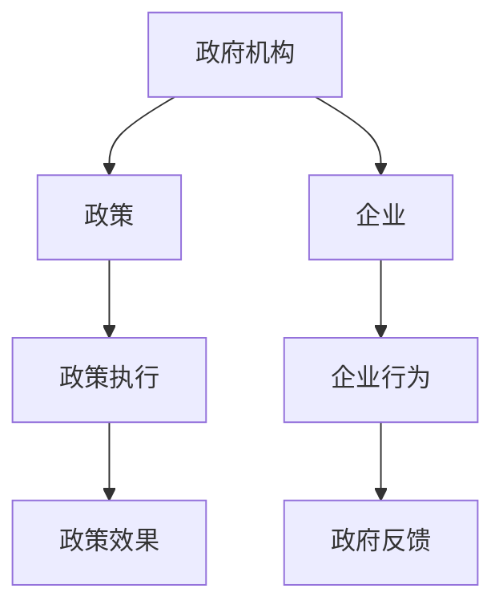
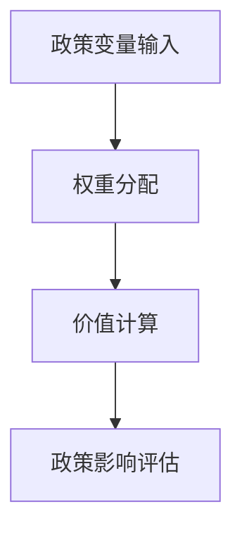

                 

# 价值投资中的AI驱动政府关系分析：多智能体系统

> 关键词：价值投资，AI驱动，政府关系分析，多智能体系统，复杂网络分析，博弈论，系统架构

> 摘要：本文探讨了价值投资与AI驱动政府关系分析的结合，重点分析了多智能体系统在其中的作用。通过构建数学模型和系统架构，展示了如何利用AI技术进行复杂关系分析，实现价值投资的优化决策。

---

# 第一部分: 价值投资与AI驱动政府关系分析的背景

## 第1章: 价值投资与AI驱动政府关系分析的背景

### 1.1 价值投资的核心概念

#### 1.1.1 价值投资的定义与特点
价值投资是一种以内在价值为核心的投资策略，强调通过分析企业的基本面（如财务状况、行业地位、竞争优势等）来判断其股票的合理价值。其特点是长期持有优质资产，追求长期稳定的收益。

#### 1.1.2 价值投资的基本原理
价值投资的基本原理包括：
1. 市场价格与内在价值的差异：市场价格围绕内在价值波动。
2. 安全边际：以低于内在价值的价格买入资产，以降低风险。
3. 长期视角：关注企业的长期盈利能力，而非短期价格波动。

#### 1.1.3 价值投资在现代金融中的地位
价值投资在现代金融中占据重要地位，尤其是在强调长期稳健回报的机构投资中。然而，随着市场的复杂化和信息的爆炸式增长，传统价值投资方法需要借助AI技术来提升效率和准确性。

---

### 1.2 政府关系分析的重要性

#### 1.2.1 政府关系在企业经营中的作用
政府关系是企业在经营过程中不可忽视的因素，直接影响企业的政策环境、市场准入和竞争优势。例如，政府的产业政策、税收政策、监管力度等都会对企业产生重大影响。

#### 1.2.2 政府政策对企业价值的影响
政府政策的变化可能直接影响企业的经营环境。例如，环保政策的收紧可能增加企业的成本，而税收优惠政策则可能提升企业的利润。因此，准确分析政府政策对企业的影响是价值投资的重要环节。

#### 1.2.3 政府关系分析的挑战与机遇
政府关系分析的挑战在于政策的复杂性和不确定性，而机遇在于通过AI技术可以捕捉到政策变化的潜在影响，为投资者提供更精准的决策支持。

---

### 1.3 AI技术在金融领域的应用

#### 1.3.1 AI在金融分析中的优势
AI技术在金融领域的优势包括：
1. 大数据分析能力：AI可以快速处理海量数据，发现数据中的隐藏规律。
2. 实时监控：AI可以实时跟踪市场动态和政策变化，提供及时的预警和建议。
3. 预测能力：通过机器学习模型，AI可以预测市场趋势和政策变化。

#### 1.3.2 AI驱动的政府关系分析的潜力
AI技术可以用于分析政府政策、监管动态和行业趋势，帮助投资者更好地理解政策对企业的影响。例如，通过自然语言处理（NLP）技术，AI可以从新闻、政策文件中提取关键词，分析政策倾向。

#### 1.3.3 多智能体系统在复杂关系分析中的应用
多智能体系统（Multi-Agent System, MAS）是一种由多个相互作用的智能体组成的系统，广泛应用于复杂决策问题。在政府关系分析中，多智能体系统可以模拟政府、企业、市场等多方利益相关者的互动，帮助投资者理解复杂的政策环境。

---

## 1.4 本章小结
本章介绍了价值投资的核心概念、政府关系分析的重要性以及AI技术在金融领域的应用。通过分析政府政策对企业价值的影响，我们看到了AI技术在政府关系分析中的潜力，特别是在多智能体系统的支持下，可以更准确地捕捉政策变化的潜在影响。

---

# 第二部分: 多智能体系统的理论基础

## 第2章: 多智能体系统概述

### 2.1 多智能体系统的定义与特点

#### 2.1.1 多智能体系统的定义
多智能体系统是由多个具有自主性、反应性和协作性的智能体组成的分布式系统，智能体之间通过通信和协作完成复杂的任务。

#### 2.1.2 多智能体系统的核心特点
1. 分布式：智能体独立决策，通过通信协作完成任务。
2. 反应性：智能体能够感知环境并实时调整行为。
3. 协作性：智能体之间通过协作提高整体系统的性能。

#### 2.1.3 多智能体系统与传统AI的区别
与传统AI不同，多智能体系统强调智能体之间的动态交互和协作，适用于复杂、动态的环境。

---

### 2.2 多智能体系统的组成与架构

#### 2.2.1 多智能体系统的组成要素
1. 智能体：具有感知、决策和行动能力的实体。
2. 环境：智能体所处的外部环境，包括物理环境和信息环境。
3. 通信机制：智能体之间交换信息的方式。
4. 协作机制：智能体之间协作完成任务的方式。

#### 2.2.2 多智能体系统的架构类型
1. 分层架构：将系统划分为多个层次，每个层次负责不同的功能。
2. 对等架构：所有智能体地位平等，通过协商完成任务。
3. 混合架构：结合分层和对等架构的特点。

#### 2.2.3 多智能体系统的通信机制
1. 通信协议：智能体之间通信的规则和格式。
2. 信息交换：智能体之间交换信息的方式，如消息传递、共享数据库等。

---

### 2.3 多智能体系统的应用领域

#### 2.3.1 多智能体系统在金融领域的应用
1. 金融市场的预测与交易：通过多智能体模拟市场参与者的互动，预测市场趋势。
2. 风险管理：通过多智能体系统实时监控市场风险，制定应对策略。

#### 2.3.2 多智能体系统在政府关系分析中的潜力
1. 政策模拟：通过多智能体系统模拟政府政策对企业的影响，帮助投资者做出决策。
2. 协作分析：分析政府、企业和市场的协作关系，预测政策变化对企业的影响。

#### 2.3.3 多智能体系统在复杂决策中的优势
1. 多智能体系统能够模拟复杂的决策过程，提供更准确的决策支持。
2. 通过协作和互动，多智能体系统能够捕捉到潜在的政策变化和市场趋势。

---

## 2.4 本章小结
本章介绍了多智能体系统的定义、组成和架构，以及其在金融和政府关系分析中的应用。通过分析多智能体系统的特性，我们看到了其在复杂决策问题中的优势，特别是在政府关系分析中，多智能体系统可以模拟多方利益相关者的互动，帮助投资者理解复杂的政策环境。

---

# 第三部分: 政府关系分析的AI驱动模型

## 第3章: 政府关系分析的核心概念与联系

### 3.1 政府关系分析的核心概念

#### 3.1.1 政府关系的定义与分类
政府关系是指企业与政府之间的互动关系，包括政策支持、税收优惠、监管合作等。政府关系可以分为直接关系和间接关系，直接关系指政府对企业经营的直接影响，间接关系指通过行业环境和市场趋势对企业的影响。

#### 3.1.2 政府关系分析的关键维度
1. 政策支持：政府对企业提供的政策支持，如税收优惠、补贴等。
2. 监管环境：政府对企业经营的监管力度和政策倾向。
3. 行业趋势：政府政策对企业所在行业的长期影响。

#### 3.1.3 政府关系分析的边界与外延
政府关系分析的边界包括政府政策、监管动态和行业趋势，外延则包括政策对企业财务状况、市场竞争力和长期价值的影响。

---

### 3.2 政府关系分析的核心要素

#### 3.2.1 政府政策的影响力
政府政策是影响企业价值的重要因素。例如，环保政策的收紧可能增加企业的成本，而税收优惠政策则可能提升企业的利润。

#### 3.2.2 政府机构的组织结构
政府机构的组织结构影响政策的制定和执行。例如，中央政府的政策可能与地方政府的政策存在差异，影响企业的经营环境。

#### 3.2.3 政府关系的动态变化
政府关系是动态变化的，政策的变化可能影响企业的经营环境。因此，政府关系分析需要实时跟踪政策变化，并及时调整分析模型。

---

### 3.3 政府关系分析的ER实体关系图

---

### 3.4 本章小结
本章介绍了政府关系分析的核心概念和关键要素，通过ER实体关系图展示了政府机构、政策、企业行为之间的关系。政府关系分析需要考虑政策的动态变化和多方面的影响，为价值投资提供更全面的决策支持。

---

## 第4章: 多智能体系统在政府关系分析中的算法原理

### 4.1 多智能体系统的算法原理

#### 4.1.1 多智能体系统的基本算法
1. 通信协议：智能体之间通过消息传递进行通信。
2. 协作机制：通过协商分配任务，实现协作。
3. 任务分配：基于智能体的能力和环境需求，动态分配任务。

#### 4.1.2 多智能体系统的通信协议
1. 消息传递：智能体通过发送消息进行通信。
2. 信息共享：智能体通过共享数据库或消息队列进行协作。

#### 4.1.3 多智能体系统的协同机制
1. 分层协作：通过分层架构实现任务的分解和协作。
2. 对等协作：智能体之间平等协作，通过协商完成任务。

---

### 4.2 政府关系分析的算法实现

#### 4.2.1 政府关系分析的数学模型
$$V = \sum_{i=1}^{n} w_i x_i$$
其中，$V$ 是企业价值，$w_i$ 是政策影响权重，$x_i$ 是政策变量。

#### 4.2.2 政府关系分析的算法流程

---

### 4.3 本章小结
本章介绍了多智能体系统在政府关系分析中的算法原理，通过数学模型和流程图展示了政策变量对

