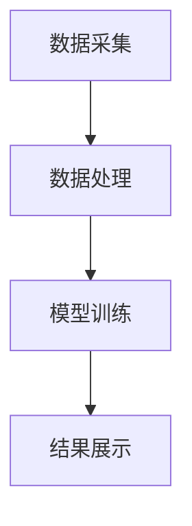

                 

# 《价值投资中的AI驱动政策影响分析：多智能体系统的优势》

---

## 关键词：
1. 价值投资  
2. AI驱动  
3. 政策影响分析  
4. 多智能体系统  
5. 投资策略优化  
6. 系统架构设计  

---

## 摘要：
本文深入探讨了在价值投资中，如何利用人工智能技术进行政策影响分析，并重点分析了多智能体系统在其中的独特优势。通过结合金融市场的复杂性与多智能体系统的协作特性，本文提出了基于AI的政策影响分析模型，并详细阐述了其在投资策略优化中的应用。文章从背景介绍、多智能体系统原理、政策影响分析方法、AI驱动模型构建、系统架构设计以及实际项目案例等方面展开，为读者提供了全面的技术分析和实践指导。

---

# 第1章: 背景介绍

## 1.1 价值投资与政策影响的关联性
### 1.1.1 价值投资的核心概念
价值投资是一种以基本面分析为基础的投资策略，强调通过分析企业的内在价值来确定其股票的合理价格。其核心在于寻找市场价格低于其内在价值的股票，长期持有以实现收益。

### 1.1.2 政策变化对市场的影响
政策的变化（如财政政策、货币政策、行业监管等）对金融市场有深远影响。例如，行业政策的变化可能会影响企业的盈利能力和市场地位，从而影响其股票价值。

### 1.1.3 AI技术在投资分析中的作用
AI技术通过大数据分析、模式识别和预测模型，能够帮助投资者更精准地识别市场趋势和政策影响，从而优化投资决策。

---

## 1.2 问题背景与研究意义
### 1.2.1 传统投资分析的局限性
传统价值投资依赖人工分析，存在效率低、主观性强、难以应对复杂政策变化等问题。

### 1.2.2 政策影响的复杂性
政策变化往往涉及多方面的因素，如宏观经济、行业监管等，传统方法难以全面捕捉和分析这些影响。

### 1.2.3 AI技术的优势与潜力
AI技术能够快速处理海量数据，识别复杂模式，并实时调整策略，为价值投资中的政策影响分析提供了新的可能性。

---

## 1.3 多智能体系统的核心概念
### 1.3.1 多智能体系统的定义
多智能体系统（Multi-Agent System, MAS）是由多个相互作用的智能体组成的系统，每个智能体能够独立感知环境、做出决策并执行动作。

### 1.3.2 多智能体系统的特征
- **自主性**：智能体能够自主决策。
- **反应性**：能够实时感知环境并做出反应。
- **协作性**：多个智能体可以协作完成复杂任务。
- **分布式**：智能体之间通过分布式通信进行协作。

### 1.3.3 多智能体系统在价值投资中的应用
多智能体系统可以用于分析市场中的多方利益相关者（如企业、投资者、政策制定者等）的行为，从而预测政策变化对市场的影响。

---

## 1.4 本章小结
本章介绍了价值投资与政策影响的关联性，分析了传统投资分析的局限性，探讨了AI技术在投资分析中的作用，并提出了多智能体系统在价值投资中的应用潜力。

---

# 第2章: 多智能体系统的原理与优势

## 2.1 多智能体系统的原理
### 2.1.1 多智能体系统的组成
多智能体系统由多个智能体、通信机制、协作协议和环境组成。

### 2.1.2 多智能体系统的通信机制
智能体之间通过消息传递进行通信，消息内容包括状态、动作和意图。

### 2.1.3 多智能体系统的协作机制
智能体通过协作协议（如合同网协议、协商协议等）实现任务分配和协同工作。

---

## 2.2 多智能体系统在价值投资中的应用
### 2.2.1 多智能体系统的投资策略
智能体可以分别负责不同的投资策略，如价值发现、风险评估、市场预测等。

### 2.2.2 多智能体系统的风险评估
通过多个智能体的协作，可以更全面地评估政策变化带来的风险。

### 2.2.3 多智能体系统的动态调整
智能体能够实时感知市场变化，快速调整投资策略。

---

## 2.3 多智能体系统的优势分析
### 2.3.1 高效性
多智能体系统能够同时处理多个任务，提高分析效率。

### 2.3.2 精准性
通过协作和分布式计算，多智能体系统能够更精准地预测市场变化。

### 2.3.3 灵活性
智能体可以根据环境变化快速调整策略，具有较强的适应性。

---

## 2.4 本章小结
本章详细介绍了多智能体系统的原理及其在价值投资中的应用，并分析了其优势。

---

# 第3章: 政策影响分析的方法

## 3.1 政策影响分析的基本方法
### 3.1.1 宏观政策分析
分析宏观经济政策（如货币政策、财政政策）对市场的整体影响。

### 3.1.2 行业政策分析
研究特定行业政策（如行业监管、税收政策）对企业的具体影响。

### 3.1.3 公司政策分析
评估公司层面的政策变化（如公司治理政策）对企业价值的影响。

---

## 3.2 基于AI的政策影响分析
### 3.2.1 数据收集与处理
收集政策相关数据（如政策文本、市场数据）并进行清洗和预处理。

### 3.2.2 模型构建与训练
使用机器学习模型（如LSTM、BERT）对政策文本进行情感分析和影响预测。

### 3.2.3 结果分析与优化
通过分析模型输出结果，优化模型参数以提高预测准确性。

---

## 3.3 多智能体系统的政策影响分析
### 3.3.1 系统架构设计
设计多智能体系统的架构，包括智能体分配、通信机制和协作协议。

### 3.3.2 系统功能实现
实现智能体的政策分析功能，包括政策解读、影响预测和策略调整。

### 3.3.3 系统性能评估
评估系统的性能指标（如响应时间、准确率）并进行优化。

---

## 3.4 本章小结
本章介绍了政策影响分析的基本方法，探讨了基于AI的政策影响分析，并分析了多智能体系统在政策影响分析中的应用。

---

# 第4章: AI驱动的政策影响分析模型

## 4.1 模型构建的基本原理
### 4.1.1 数据预处理
对政策文本和市场数据进行清洗、转换和标准化处理。

### 4.1.2 特征提取
提取政策文本中的关键词、情感倾向等特征，并进行向量化表示。

### 4.1.3 模型训练
使用深度学习模型（如BERT、LSTM）对特征进行训练，生成政策影响预测模型。

---

## 4.2 基于多智能体的分析模型
### 4.2.1 智能体角色分配
将多个智能体分配到不同的政策分析任务中，如政策解读、市场预测等。

### 4.2.2 智能体协作机制
设计智能体之间的协作协议，确保它们能够高效协作并共享信息。

### 4.2.3 模型优化与调参
通过调整模型参数和优化算法，提高模型的预测准确性和运行效率。

---

## 4.3 模型的验证与评估
### 4.3.1 评估指标
使用准确率、召回率、F1分数等指标评估模型的性能。

### 4.3.2 模型验证
通过历史数据验证模型的预测能力，并进行交叉验证。

### 4.3.3 模型优化
根据验证结果优化模型结构和参数，提高预测性能。

---

## 4.4 本章小结
本章详细介绍了AI驱动的政策影响分析模型的构建过程，并探讨了其在多智能体系统中的应用。

---

# 第5章: 系统架构与实现

## 5.1 系统架构设计
### 5.1.1 系统模块划分
将系统划分为数据采集模块、模型构建模块、结果展示模块等。

### 5.1.2 模块间关系
通过模块化设计，确保系统各部分能够高效协作。

### 5.1.3 系统流程图
使用Mermaid图展示系统的整体流程。

---

## 5.2 系统功能设计
### 5.2.1 数据采集模块
负责收集政策文本、市场数据等信息。

### 5.2.2 模型构建模块
实现政策影响分析模型的训练和优化。

### 5.2.3 结果展示模块
将模型输出结果以可视化形式展示给用户。

---

## 5.3 系统实现
### 5.3.1 环境搭建
安装必要的软件和库，如Python、TensorFlow、Keras等。

### 5.3.2 代码实现
编写数据处理、模型训练和结果展示的代码。

### 5.3.3 系统测试
通过测试数据验证系统的性能和准确性。

---

## 5.4 本章小结
本章详细介绍了系统的架构设计与实现过程，并展示了系统的整体流程。

---

# 第6章: 项目实战与案例分析

## 6.1 项目背景与目标
### 6.1.1 项目背景
假设我们有一个价值投资项目，需要分析政策变化对某行业的影响。

### 6.1.2 项目目标
通过多智能体系统实现政策影响分析，并优化投资策略。

---

## 6.2 项目实施
### 6.2.1 环境搭建
安装Python、TensorFlow、Keras等工具。

### 6.2.2 代码实现
编写数据处理、模型训练和结果展示的代码。

### 6.2.3 案例分析
以某行业为例，分析政策变化对企业的具体影响。

---

## 6.3 项目小结
通过实际案例分析，验证了多智能体系统在政策影响分析中的有效性，并展示了其在价值投资中的潜力。

---

# 7. 结论与展望

## 7.1 本文总结
本文深入探讨了价值投资中的政策影响分析，并提出了基于多智能体系统的解决方案，展示了其在投资策略优化中的优势。

## 7.2 未来展望
未来可以进一步研究多智能体系统在其他金融领域的应用，如风险管理、投资组合优化等。

---

## 参考文献
（此处列出相关文献和资料）

---

## 致谢
感谢在撰写本文过程中提供帮助的团队和朋友。

---

通过以上目录和内容，您可以逐步撰写完整的文章。每一章的内容都需要详细展开，包括具体的算法实现、数学公式和实际案例分析。希望这个大纲对您有所帮助！

