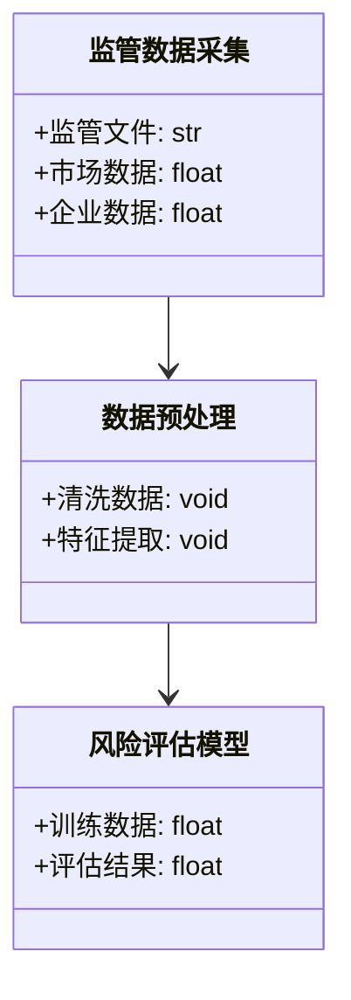
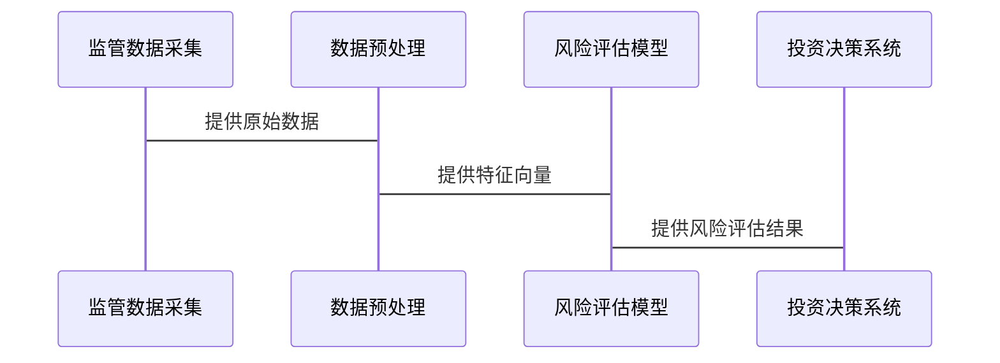

                 


# 价值投资中的AI驱动监管风险评估：多智能体协作模型

**关键词：** 价值投资、AI驱动、监管风险评估、多智能体协作模型、风险分析、金融风险管理、系统架构

**摘要：**  
本文探讨了在价值投资中利用人工智能技术进行监管风险评估的创新方法。通过构建多智能体协作模型，我们能够更高效、更准确地识别和评估监管风险，从而优化投资决策。文章详细分析了多智能体协作模型的核心原理、算法实现、系统架构，并通过实际案例展示了该模型在金融监管中的应用效果。最后，本文总结了该模型的优势，并提出了进一步优化的建议。

---

## 正文

### 第一部分：背景介绍

#### 第1章：监管风险评估的背景与重要性

##### 1.1 价值投资中的监管风险
###### 1.1.1 价值投资的基本概念
价值投资是一种基于对公司内在价值的深入分析，以低于其内在价值的价格买入股票的投资策略。其核心在于寻找市场中被低估的资产，并长期持有，等待其价值回归。  
**关键点：**  
- 价值投资强调基本面分析，关注企业的盈利能力、财务状况和行业地位。  
- 投资者需要识别那些具有持续竞争优势和良好治理结构的企业。  

###### 1.1.2 监管风险在价值投资中的作用
在价值投资中，监管风险是影响企业估值的重要因素之一。监管政策的变化可能直接影响企业的经营环境、盈利能力和资产价值。例如：  
- 行业政策的收紧可能导致企业的收入下降。  
- 监管罚款或法律诉讼可能增加企业的财务负担。  
- 监管框架的变化可能影响企业的业务模式和市场地位。  

###### 1.1.3 监管风险评估的必要性
准确评估监管风险是价值投资成功的关键。投资者需要通过分析监管政策、法律框架和行业法规，识别潜在的监管风险，并评估其对企业价值的影响。然而，传统的监管风险评估方法通常依赖人工分析，存在以下问题：  
- 数据量大、维度多，人工分析效率低。  
- 监管政策的变化具有不确定性，难以实时捕捉。  
- 需要整合来自不同来源的多维数据，传统的分析方法难以处理复杂的关联关系。  

##### 1.2 AI驱动监管风险评估的背景
###### 1.2.1 AI技术在金融领域的应用现状
人工智能技术（AI）在金融领域的应用日益广泛，尤其是在风险评估、交易策略和市场预测方面。AI技术通过处理大量非结构化数据，能够发现传统方法难以察觉的模式和趋势。  
**关键点：**  
- 自然语言处理（NLP）技术可以分析监管文件和新闻报道，提取潜在的监管风险信号。  
- 机器学习算法可以基于历史数据，预测监管政策的变化对市场的影响。  
- 大数据分析技术能够整合来自多个来源的数据，构建全面的监管风险评估模型。  

###### 1.2.2 监管风险评估的传统方法与局限性
传统的监管风险评估方法主要依赖人工分析和经验判断，存在以下局限性：  
- 数据处理效率低，难以应对海量数据的分析需求。  
- 评估结果主观性较强，难以量化监管风险的具体影响。  
- 无法实时捕捉监管政策的变化，导致评估结果滞后。  

###### 1.2.3 AI技术如何提升监管风险评估的效率
人工智能技术通过自动化数据处理和模型构建，显著提升了监管风险评估的效率和准确性。AI技术的优势在于：  
- 可以实时监控监管政策的变化，并快速生成风险评估结果。  
- 能够整合多维度数据，发现潜在的监管风险关联。  
- 可以通过机器学习算法，预测监管政策对市场和企业的潜在影响。  

---

### 第二部分：核心概念与联系

#### 第2章：多智能体协作模型的基本概念

##### 2.1 多智能体协作模型的定义
###### 2.1.1 多智能体系统的基本概念
多智能体系统（Multi-Agent System, MAS）是由多个智能体（Agent）组成的分布式系统。每个智能体都是一个能够感知环境、做出决策并采取行动的实体。  
**关键点：**  
- 智能体具有自主性、反应性和协作性。  
- 多智能体系统通过智能体之间的协作，实现复杂任务的分解与优化。  

###### 2.1.2 协作模型的定义与特点
协作模型是指智能体之间通过合作完成任务的方式。在监管风险评估中，协作模型可以将复杂的任务分解为多个子任务，由不同的智能体分别完成。  
**关键点：**  
- 协作模型强调智能体之间的信息共享和协同决策。  
- 每个智能体专注于特定的任务，提高了整体效率。  

###### 2.1.3 多智能体协作模型在金融领域的应用
在金融领域，多智能体协作模型可以应用于风险评估、交易策略和市场预测。通过协作模型，多个智能体可以分别负责数据采集、模型构建和风险评估，从而实现高效的任务处理。  

##### 2.2 多智能体协作模型的核心要素
###### 2.2.1 智能体的构成与功能
每个智能体都具有以下功能：  
- **感知环境：** 通过数据采集和信息处理，获取与任务相关的环境信息。  
- **决策制定：** 基于感知到的信息，做出最优决策。  
- **行动执行：** 根据决策结果，采取相应的行动。  

###### 2.2.2 协作机制的设计
协作机制是多智能体协作模型的核心。常见的协作机制包括：  
- **任务分解：** 将复杂任务分解为多个子任务，分配给不同的智能体完成。  
- **信息共享：** 智能体之间共享信息，确保决策的协同性。  
- **协调与同步：** 通过协调机制，确保智能体之间的行动同步。  

###### 2.2.3 模型的输入与输出
多智能体协作模型的输入包括：  
- 监管政策数据  
- 市场数据  
- 企业基本面数据  

模型的输出包括：  
- 监管风险评估结果  
- 投资建议  
- 风险预警信号  

#### 第3章：多智能体协作模型与监管风险评估的结合

##### 3.1 监管风险评估的复杂性
###### 3.1.1 监管风险的多维度性
监管风险涉及多个维度，包括：  
- 法律法规的合规性  
- 行业政策的变化  
- 监管机构的执法力度  

###### 3.1.2 不同利益相关者的需求
在监管风险评估中，不同利益相关者的需求需要被综合考虑：  
- 投资者需要评估监管风险对企业价值的影响。  
- 企业需要了解监管政策的变化对企业经营的影响。  
- 监管机构需要了解市场参与者的合规情况。  

###### 3.1.3 监管风险评估的动态性
监管政策的变化具有动态性，需要实时监控和评估。传统的静态评估方法难以满足动态变化的需求。  

##### 3.2 多智能体协作模型的优势
###### 3.2.1 分布式计算的优势
多智能体协作模型通过分布式计算，能够高效处理大规模数据，并快速生成评估结果。  

###### 3.2.2 多智能体协作的高效性
通过任务分解和协作机制，多智能体协作模型能够提高整体效率，降低单点故障风险。  

###### 3.2.3 模型的可扩展性与灵活性
多智能体协作模型具有良好的可扩展性，可以根据需求灵活调整智能体的数量和功能。  

---

### 第三部分：算法原理讲解

#### 第4章：监管风险评估中的关键问题

##### 4.1 监管风险评估中的关键问题
###### 4.1.1 数据来源的多样性
监管风险评估需要整合多种数据源，包括：  
- 监管文件和法规  
- 市场数据  
- 企业基本面数据  

###### 4.1.2 数据清洗与预处理
数据清洗与预处理是确保模型准确性的关键步骤。需要处理以下问题：  
- 数据缺失  
- 数据噪声  
- 数据冗余  

###### 4.1.3 数据特征提取
数据特征提取是将原始数据转化为模型所需的特征向量。常用的特征包括：  
- 监管政策的变化频率  
- 企业财务指标  
- 市场波动率  

#### 第5章：算法实现与数学模型

##### 5.1 算法实现
###### 5.1.1 数据预处理
```python
import pandas as pd
import numpy as np

# 示例数据预处理代码
data = pd.read_csv('监管数据.csv')
data.dropna(inplace=True)  # 删除缺失值
data = data[~data.duplicated()]  # 删除重复值
```

###### 5.1.2 特征提取
```python
from sklearn.feature_extraction.text import TfidfVectorizer

# 示例特征提取代码
vectorizer = TfidfVectorizer()
features = vectorizer.fit_transform(data['监管文件'])
```

###### 5.1.3 模型训练
```python
from sklearn.model_selection import train_test_split
from sklearn.linear_model import LogisticRegression

# 示例模型训练代码
X_train, X_test, y_train, y_test = train_test_split(features, data['风险等级'], test_size=0.2)
model = LogisticRegression()
model.fit(X_train, y_train)
```

##### 5.2 数学模型
###### 5.2.1 损失函数
$$
\text{损失函数} = \sum_{i=1}^{n} (y_i - \hat{y}_i)^2
$$

###### 5.2.2 优化目标
$$
\text{优化目标} = \min_{\theta} \sum_{i=1}^{n} (y_i - \theta x_i)^2
$$

---

### 第四部分：系统分析与架构设计

#### 第6章：系统分析与架构设计

##### 6.1 项目介绍
###### 6.1.1 项目背景
本项目旨在利用多智能体协作模型，构建一个高效的监管风险评估系统。  

##### 6.2 系统功能设计
###### 6.2.1 领域模型


##### 6.3 系统架构设计


##### 6.4 接口与交互设计
###### 6.4.1 接口设计


---

### 第五部分：项目实战

#### 第7章：项目实战

##### 7.1 环境安装
```bash
pip install pandas numpy scikit-learn
```

##### 7.2 核心代码实现
###### 7.2.1 监管数据采集
```python
import requests
from bs4 import BeautifulSoup

def fetch_regulatory_data(url):
    response = requests.get(url)
    soup = BeautifulSoup(response.text, 'html.parser')
    data = []
    # 示例代码，实际需要根据具体网页结构进行调整
    for text in soup.find_all('div', class_='regulatory-text'):
        data.append(text.get_text())
    return data
```

###### 7.2.2 数据预处理
```python
import pandas as pd
import numpy as np

def preprocess_data(data):
    df = pd.DataFrame(data)
    df = df.dropna()
    return df
```

###### 7.2.3 模型训练
```python
from sklearn.model_selection import train_test_split
from sklearn.linear_model import LogisticRegression

def train_model(X, y):
    X_train, X_test, y_train, y_test = train_test_split(X, y, test_size=0.2)
    model = LogisticRegression()
    model.fit(X_train, y_train)
    return model
```

##### 7.3 实际案例分析
###### 7.3.1 案例背景
假设我们正在评估一家科技公司的监管风险。  

###### 7.3.2 数据分析
通过模型分析，我们发现该公司的监管风险主要集中在以下几个方面：  
- 数据隐私合规性不足。  
- 行业政策的变化可能影响其市场地位。  

---

### 第六部分：最佳实践与总结

#### 第8章：最佳实践与总结

##### 8.1 最佳实践
###### 8.1.1 数据质量管理
- 确保数据的完整性和准确性。  
- 定期更新数据源。  

###### 8.1.2 模型优化
- 定期重新训练模型，确保其准确性。  
- 引入更多的数据维度，提高模型的预测能力。  

##### 8.2 小结
通过多智能体协作模型，我们可以高效、准确地评估监管风险，为价值投资提供科学依据。  

##### 8.3 注意事项
- 模型的准确性依赖于数据质量和算法设计。  
- 需要定期更新模型，以适应监管政策的变化。  

##### 8.4 拓展阅读
- 《金融风险管理》  
- 《人工智能在金融领域的应用》  
- 《多智能体协作系统的理论与实践》  

---

通过本文的分析，我们可以看到，AI驱动的多智能体协作模型为监管风险评估提供了全新的思路。该模型通过整合多维度数据，利用机器学习算法，能够高效识别和评估监管风险，为价值投资决策提供科学依据。未来，随着AI技术的不断发展，监管风险评估将更加智能化和精准化。

