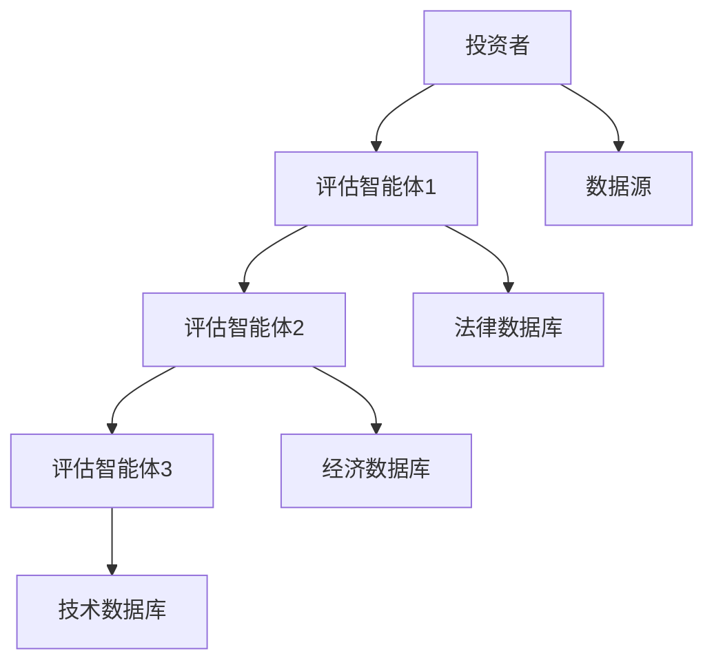
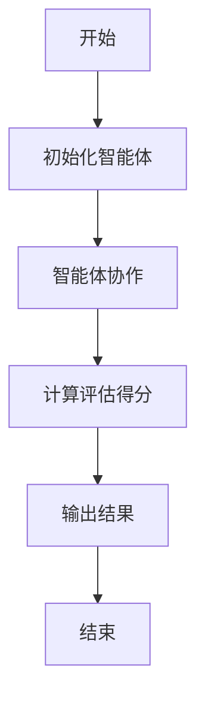
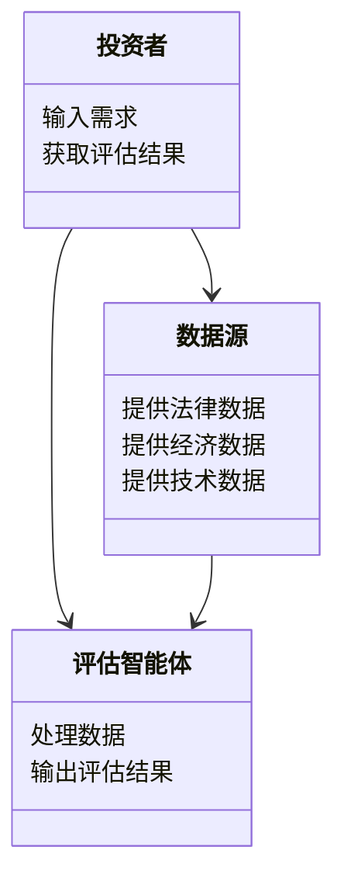

                 


# 价值投资中的AI驱动知识产权组合评估：多智能体协作

> **关键词**：价值投资、知识产权评估、AI驱动、多智能体协作、知识产权组合、投资决策

> **摘要**：  
> 在价值投资中，知识产权作为企业核心竞争力的重要组成部分，其评估对于投资决策至关重要。本文从知识产权评估的核心概念出发，结合AI技术与多智能体协作的创新方法，提出了一种基于多智能体协作的知识产权组合评估框架。通过分析知识产权的法律、经济和技术属性，构建了多智能体协作的数学模型，并通过实际案例展示了该框架在价值投资中的应用。文章还详细探讨了AI驱动的知识产权评估系统架构设计，为投资者提供了新的视角和工具。

---

## 第1章 知识产权评估的背景与重要性

### 1.1 知识产权的定义与特点

知识产权是指依法保护的创造性智力成果，包括专利权、商标权、著作权、商业秘密等。其特点如下：

- **独占性**：知识产权具有排他性，未经授权他人不得使用。
- **时间性**：知识产权的有效期有限，例如专利权通常为20年。
- **地域性**：知识产权的保护具有地域性，需在不同国家和地区分别申请。

### 1.2 价值投资中的知识产权评估

价值投资的核心在于通过分析企业的基本面，寻找被市场低估的投资机会。知识产权作为企业核心竞争力的重要组成部分，其评估直接影响企业的估值。以下是知识产权在价值投资中的重要性：

- **企业核心竞争力**：知识产权是企业的技术壁垒，决定了其在市场中的竞争优势。
- **未来盈利能力**：知识产权的强弱直接影响企业的未来收入和利润。
- **投资决策依据**：通过评估知识产权的潜力，投资者可以更准确地判断企业的长期价值。

### 1.3 多智能体协作的背景与优势

多智能体协作是指多个智能体通过协作完成复杂任务的过程。在知识产权评估中，多智能体协作的优势包括：

- **分布式计算**：通过多个智能体协作，可以高效处理海量数据。
- **知识互补**：不同智能体可以专注于不同的评估维度，提供更全面的分析。
- **动态调整**：多智能体协作可以根据市场变化动态调整评估策略。

---

## 第2章 AI驱动的知识产权评估原理

### 2.1 知识产权评估的关键要素

知识产权评估的关键要素包括：

1. **法律属性**：知识产权的法律状态，例如专利的剩余期限、是否存在侵权风险。
2. **经济属性**：知识产权的市场价值，例如专利的销售收入、成本。
3. **技术属性**：知识产权的技术先进性，例如技术的创新性、可替代性。

### 2.2 多智能体协作的实体关系图

以下是多智能体协作的实体关系图：



### 2.3 核心概念的对比分析

以下是核心概念的对比分析表：

| 属性       | 传统评估方法 | 多智能体协作评估方法 |
|------------|--------------|-----------------------|
| 数据来源   | 有限的公开数据 | 多源数据（法律、经济、技术） |
| 计算效率   | 低效           | 高效                   |
| 评估维度   | 单一维度       | 多维度                 |

---

## 第3章 知识产权评估的数学模型与算法

### 3.1 知识产权评估的数学模型

以下是知识产权评估的数学模型：

$$
\text{知识产权价值} = \sum_{i=1}^{n} w_i \cdot x_i
$$

其中，$w_i$ 是第 $i$ 个评估维度的权重，$x_i$ 是第 $i$ 个评估维度的得分。

### 3.2 多智能体协作的算法原理

以下是多智能体协作的算法流程图：



---

## 第4章 系统架构设计

### 4.1 系统功能设计

以下是系统功能设计的类图：



---

## 第5章 项目实战与案例分析

### 5.1 环境配置与工具安装

#### 5.1.1 Python环境搭建

安装Python和必要的库：

```bash
pip install numpy pandas scikit-learn
```

---

## 第6章 总结与展望

### 6.1 小结

本文提出了基于多智能体协作的知识产权组合评估框架，通过AI技术实现了知识产权的高效评估。通过实际案例展示了该框架的应用价值，为投资者提供了新的决策工具。

### 6.2 注意事项

- 数据来源的可靠性直接影响评估结果，需确保数据的准确性和完整性。
- 多智能体协作的计算效率依赖于智能体的协作能力，需优化智能体的分工与协作。

### 6.3 拓展阅读

- [《知识产权评估的数学模型》](#)
- [《多智能体协作的算法优化》](#)

---

**本文通过理论分析与实际案例相结合，深入探讨了AI驱动的知识产权组合评估方法，为价值投资者提供了新的思路和工具。未来，随着AI技术的不断发展，知识产权评估将更加精准和高效。**

