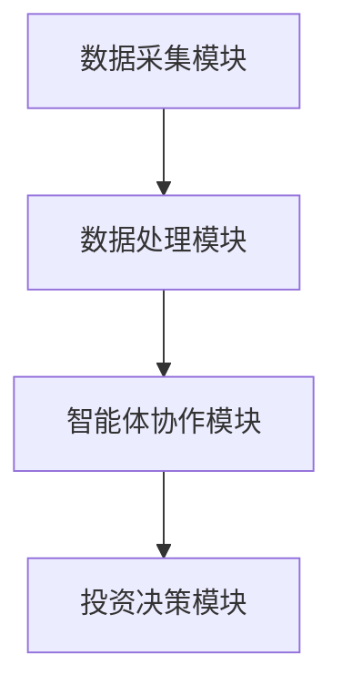
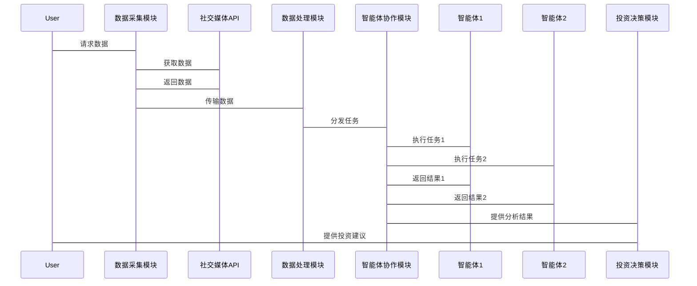

                 


# 价值投资中的AI驱动社交媒体影响力分析：多智能体系统

> 关键词：价值投资，社交媒体影响力分析，多智能体系统，AI驱动，投资决策

> 摘要：本文探讨了在价值投资中利用AI驱动的社交媒体影响力分析，通过多智能体系统的构建与实现，分析社交媒体数据对投资决策的影响。文章从核心概念、算法原理、系统架构到项目实战，全面阐述了如何利用多智能体系统进行社交媒体影响力分析，并将其应用于价值投资决策中。

---

## 第一部分：背景介绍与核心概念

### 第1章：价值投资与社交媒体影响力分析的背景

#### 1.1 价值投资的基本概念
##### 1.1.1 价值投资的定义与核心理念
价值投资是一种以公司基本面分析为基础的投资策略，强调以低于市场价的价值买入优质资产，长期持有，等待市场价回升。其核心理念在于寻找市场低估的公司，通过分析财务报表、行业地位、竞争优势等因素，评估其内在价值。

##### 1.1.2 社会媒体在价值投资中的作用
社交媒体的兴起为投资者提供了实时信息和市场情绪的窗口。通过社交媒体，投资者可以获取市场动态、行业趋势、公司新闻等信息，同时也能观察市场参与者的情绪变化。社交媒体数据的分析可以帮助投资者更全面地评估公司的价值。

##### 1.1.3 影响力分析在价值投资中的重要性
影响力分析是指通过对社交媒体上的用户行为、内容传播和网络结构进行分析，评估某个实体或个体在社交媒体上的影响力。在价值投资中，影响力分析可以帮助投资者识别市场趋势、发现潜在投资机会，并评估市场情绪对公司价值的影响。

#### 1.2 多智能体系统在社交媒体分析中的应用
##### 1.2.1 多智能体系统的定义与特点
多智能体系统是指由多个独立但协同工作的智能体组成的系统。每个智能体都有自己的目标、知识和行为规则，能够通过交互和协作完成复杂的任务。

##### 1.2.2 多智能体系统在社交媒体分析中的优势
多智能体系统能够同时处理海量社交媒体数据，通过分布式计算和协作学习，提高数据处理效率和准确性。此外，多智能体系统能够模拟市场参与者的行为，帮助投资者更好地理解市场动态。

##### 1.2.3 多智能体系统与价值投资的结合
通过多智能体系统，投资者可以实时分析社交媒体上的市场情绪，预测股价波动，评估公司的市场影响力。这种结合能够帮助投资者做出更科学的投资决策。

---

### 第2章：社交媒体影响力分析的核心概念

#### 2.1 社会媒体影响力分析的定义
社交媒体影响力分析是指通过对社交媒体上的数据进行分析，评估某个实体或个体在社交媒体上的影响力。影响力通常通过用户的关注数、转发量、点赞量、评论量等指标来衡量。

#### 2.2 多智能体系统的构成要素
##### 2.2.1 多智能体系统的组成
多智能体系统由多个智能体、通信机制、协作规则和任务目标组成。每个智能体负责特定的任务，通过通信机制进行信息交换，协作完成整体目标。

##### 2.2.2 每个智能体的功能与角色
智能体可以分为数据采集智能体、情感分析智能体、网络结构分析智能体等。每个智能体负责不同的任务，如数据采集、信息处理、结果分析等。

##### 2.2.3 智能体之间的交互关系
智能体之间通过通信机制进行交互，如共享数据、交换信息、协作决策等。交互关系的复杂性取决于任务的需求。

#### 2.3 社会媒体影响力分析的核心要素
##### 2.3.1 用户行为数据
用户行为数据包括用户的关注数、粉丝数、发布内容的频率、互动行为（如点赞、评论、转发）等。

##### 2.3.2 内容特征
内容特征包括文本内容的情感倾向、关键词提取、主题分类等。

##### 2.3.3 网络结构特征
网络结构特征包括社交网络的中心性、社区结构、影响力传播路径等。

---

### 第3章：社交媒体影响力分析与价值投资的关联

#### 3.1 社会媒体数据对价值投资的影响
##### 3.1.1 社会媒体数据如何反映市场情绪
通过分析社交媒体上的文本数据，可以提取市场情绪指标，如乐观、中性、悲观情绪的强度和分布。

##### 3.1.2 社会媒体数据如何预测股价波动
社交媒体上的高频交易信号可以通过算法分析，预测股价的短期波动。

##### 3.1.3 社会媒体影响力分析对投资决策的支持
通过分析公司或行业的社交媒体影响力，投资者可以评估其市场地位和品牌影响力，进而判断其内在价值。

---

## 第二部分：算法原理与系统架构

### 第4章：算法原理讲解

#### 4.1 影响力分析算法
##### 4.1.1 情感分析算法
情感分析算法用于识别社交媒体文本中的情感倾向。常用算法包括基于词典的方法、机器学习方法和深度学习方法。

##### 4.1.2 主题建模算法
主题建模算法（如LDA）用于识别社交媒体内容的主题分布，帮助投资者理解市场关注的热点。

##### 4.1.3 影响力传播算法
影响力传播算法用于模拟社交媒体上的影响力传播路径，识别关键意见领袖（KOL）。

#### 4.2 多智能体协作算法
##### 4.2.1 分布式计算算法
多智能体系统通过分布式计算算法实现任务的分配与协作。

##### 4.2.2 协作学习算法
协作学习算法用于多智能体系统中的知识共享与模型更新。

##### 4.2.3 联合决策算法
联合决策算法用于多智能体系统中的集体决策过程。

---

### 第5章：系统分析与架构设计方案

#### 5.1 问题场景介绍
##### 5.1.1 价值投资中的社交媒体数据需求
投资者需要实时获取社交媒体上的公司信息、市场情绪、行业趋势等数据。

##### 5.1.2 社会媒体影响力分析的系统需求
系统需要支持多智能体协作、分布式计算、实时数据分析等功能。

#### 5.2 系统功能设计
##### 5.2.1 数据采集模块
数据采集模块负责从社交媒体平台获取实时数据，包括文本、图片、视频等。

##### 5.2.2 数据处理模块
数据处理模块负责对采集的数据进行清洗、预处理和特征提取。

##### 5.2.3 智能体协作模块
智能体协作模块负责协调多个智能体的任务分配和信息交互。

##### 5.2.4 投资决策模块
投资决策模块基于分析结果，生成投资建议和决策信号。

#### 5.3 系统架构设计
##### 5.3.1 系统架构图


##### 5.3.2 系统交互序列图


---

## 第三部分：项目实战与总结

### 第6章：项目实战

#### 6.1 环境安装与配置
##### 6.1.1 安装Python和相关库
```bash
pip install numpy pandas scikit-learn networkx
```

##### 6.1.2 安装社交媒体API开发工具
安装Twitter API、爬虫工具等。

#### 6.2 系统核心实现
##### 6.2.1 数据预处理
```python
import pandas as pd

def preprocess(text):
    # 去除特殊字符
    cleaned = re.sub(r'[^a-zA-Z0-9]', ' ', text)
    # 转换为小写
    lower = cleaned.lower()
    return lower

data = pd.read_csv('tweets.csv')
data['processed_text'] = data['text'].apply(preprocess)
```

##### 6.2.2 特征提取与建模
```python
from sklearn.feature_extraction.text import TfidfVectorizer
from sklearn.naive_bayes import MultinomialNB

vectorizer = TfidfVectorizer(max_features=5000)
X = vectorizer.fit_transform(data['processed_text'])
y = data['sentiment']

model = MultinomialNB()
model.fit(X, y)
```

#### 6.3 实际案例分析
分析某公司的社交媒体数据，预测其股价走势。

#### 6.4 项目小结
总结项目实现的关键点，如数据处理、算法选择、系统架构设计等。

---

### 第7章：最佳实践与总结

#### 7.1 最佳实践
##### 7.1.1 数据质量的重要性
确保数据的准确性和完整性。

##### 7.1.2 模型的可解释性
选择可解释性强的算法，便于分析结果的解读。

##### 7.1.3 系统的可扩展性
设计模块化架构，便于后续功能的扩展。

#### 7.2 小结
总结全文，强调社交媒体影响力分析在价值投资中的重要性，以及多智能体系统的优势。

#### 7.3 注意事项
提醒读者在实际应用中注意数据隐私、模型鲁棒性等问题。

#### 7.4 拓展阅读
推荐相关领域的书籍和论文，供读者深入学习。

---

通过以上章节的详细分析，我们全面探讨了价值投资中AI驱动社交媒体影响力分析的多智能体系统的构建与应用。从理论到实践，从算法到系统，本文为投资者提供了一种全新的视角和工具，帮助他们在复杂多变的市场中做出更明智的投资决策。

