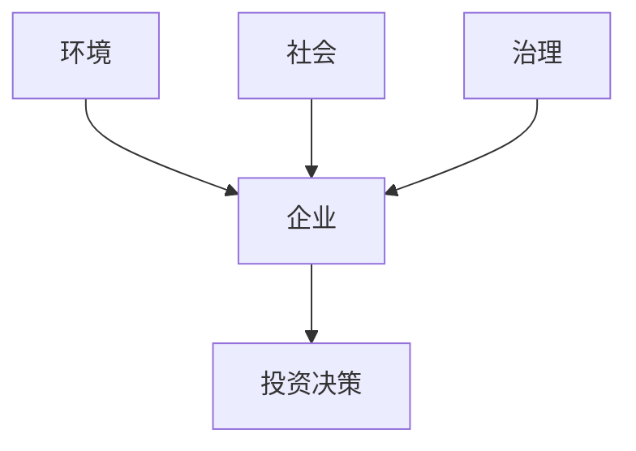
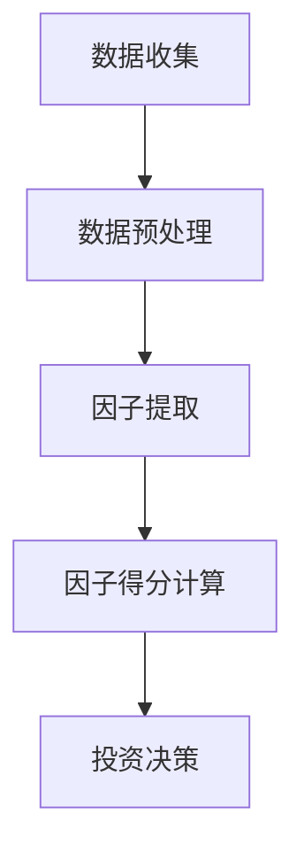
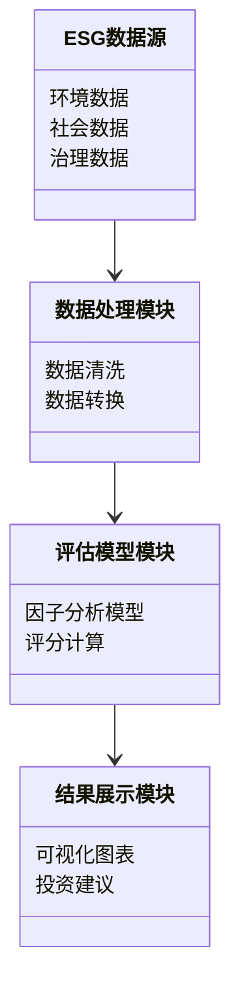
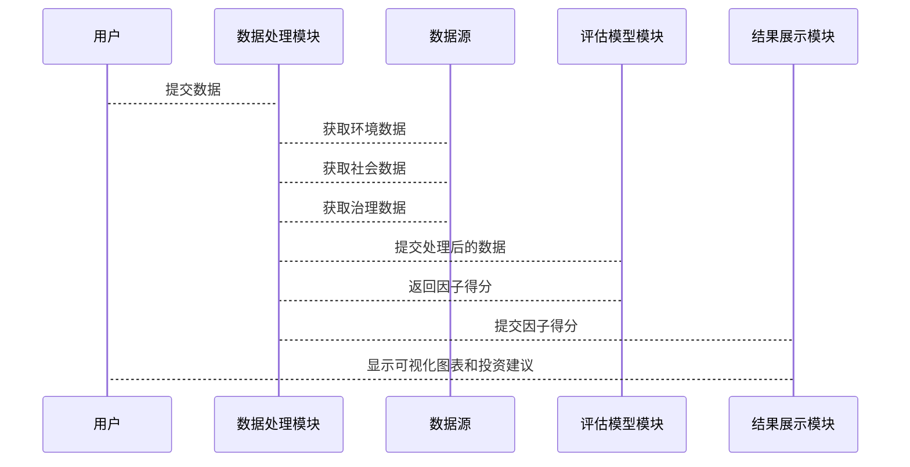

                 


# 价值投资中的ESG因素：可持续发展的重要性

## 关键词：
- 价值投资
- ESG因素
- 可持续发展
- 环境、社会、治理
- 投资决策

## 摘要：
本文探讨了ESG（环境、社会、治理）因素在价值投资中的重要性，分析了可持续发展对投资决策的影响。通过详细阐述ESG的核心概念、评估方法、系统设计以及实际案例，本文展示了如何将ESG因素整合到投资策略中，以实现长期价值增长。文章还讨论了ESG投资的未来趋势和最佳实践，为投资者提供了实用的指导。

---

# 第一部分：引言

## 第1章：ESG因素的背景与重要性

### 1.1 什么是ESG因素

#### 1.1.1 环境（Environmental）的定义与内涵
环境因素关注企业在运营过程中对环境的影响，包括碳排放、资源消耗、污染控制等方面。企业通过减少对环境的负面影响，可以提升其可持续发展能力。

#### 1.1.2 社会责任（Social）的定义与内涵
社会责任涉及企业在社会中的行为，包括员工权益、公平对待、社区贡献等方面。企业通过积极履行社会责任，可以增强社会形象和品牌价值。

#### 1.1.3 公司治理（Governance）的定义与内涵
公司治理关注企业的管理结构和决策过程，包括董事会结构、高管薪酬、内部控制等方面。良好的公司治理可以确保企业长期稳定发展。

### 1.2 ESG与传统投资的关系

#### 1.2.1 传统投资的局限性
传统投资主要关注财务指标，忽视了企业非财务因素对长期价值的影响。随着环境问题和社会问题的加剧，传统投资的局限性日益显现。

#### 1.2.2 ESG投资的优势与补充作用
ESG投资通过综合考虑环境、社会和治理因素，弥补了传统投资的不足。ESG投资不仅关注企业的盈利能力，还关注其可持续发展潜力。

### 1.3 ESG投资的重要性

#### 1.3.1 可持续发展的全球趋势
全球气候变化、社会不平等和公司治理问题日益严重，推动了ESG投资的兴起。投资者意识到，只有关注这些因素，才能实现长期可持续发展。

#### 1.3.2 投资者对ESG的关注与需求
越来越多的投资者关注ESG因素，希望在投资决策中考虑企业的社会责任和可持续发展潜力。ESG投资已成为全球投资的重要趋势。

#### 1.3.3 ESG对投资风险与收益的影响
ESG因素能够帮助投资者识别企业的潜在风险和机会。例如，环境问题可能导致企业的罚款和声誉损失，而良好的公司治理可以提升企业的长期盈利能力。

---

# 第二部分：ESG因素的核心概念与联系

## 第2章：ESG核心概念的原理

### 2.1 ESG核心概念的原理

#### 2.1.1 环境因素的量化与评估
环境因素可以通过量化企业的碳排放、能源消耗等指标来评估。例如，碳排放强度（单位产品碳排放量）可以衡量企业的环境表现。

#### 2.1.2 社会责任的指标与标准
社会责任可以通过员工满意度、社会公益支出等指标来衡量。例如，员工满意度高的企业通常具有更强的员工忠诚度和生产力。

#### 2.1.3 公司治理的结构与机制
公司治理的结构包括董事会结构、高管薪酬和内部控制机制。例如，独立董事占比高的企业通常具有更有效的监督机制。

### 2.2 ESG因素的属性特征对比

#### 2.2.1 环境、社会、治理三者的特征对比表格

| 特性         | 环境（Environmental） | 社会（Social） | 治理（Governance） |
|--------------|---------------------|---------------|-------------------|
| 关注点       | 环境影响             | 社会责任       | 公司管理结构     |
| 量化指标     | 碳排放、资源消耗     | 员工满意度     | 独立董事比例     |
| 影响因素     | 政策法规             | 社会舆论       | 法律法规         |

#### 2.2.2 三者之间的相互关系与影响
环境因素与社会因素相互关联，例如，企业的环保行为可以提升社会形象。治理因素对环境和社会因素具有调节作用，例如，良好的治理结构可以确保企业履行社会责任。

### 2.3 ESG因素的ER实体关系图



---

# 第三部分：ESG因素的算法原理

## 第3章：ESG评估的因子分析模型

### 3.1 ESG评估的因子分析模型

#### 3.1.1 因子分析模型的定义与原理
因子分析模型通过提取多个指标的公共因子，简化数据维度。例如，可以将多个环境指标提取为一个环境因子，多个社会指标提取为一个社会因子。

#### 3.1.2 Mermaid流程图展示因子分析的步骤



### 3.2 算法实现

#### 3.2.1 Python代码实现因子分析模型

```python
import pandas as pd
from factor_analyzer import FactorAnalyzer

# 假设我们有环境、社会和治理三个因素的数据
data = pd.DataFrame({
    '环境': [85, 70, 90],
    '社会': [75, 85, 65],
    '治理': [90, 80, 70]
})

# 初始化因子分析模型，提取2个因子
fa = FactorAnalyzer(n_factors=2, rotation='varimax')
fa.fit(data)

# 计算因子得分
factor_scores = pd.DataFrame(fa.transform(data))
print(factor_scores)
```

#### 3.2.2 代码解释与应用实例
上述代码使用了`factor_analyzer`库，通过因子分析模型提取了两个因子。环境、社会和治理三个指标的数据被转换为因子得分，用于后续的投资决策。

### 3.3 数学模型

#### 3.3.1 因子分析的数学模型
因子分析模型的数学表达式如下：

$$
X = A F + \epsilon
$$

其中，\(X\) 是观测变量，\(F\) 是因子，\(A\) 是因子载荷矩阵，\(\epsilon\) 是误差项。

---

# 第四部分：系统分析与架构设计

## 第4章：ESG评估系统的架构设计

### 4.1 系统功能设计

#### 4.1.1 领域模型Mermaid类图


### 4.2 系统架构设计

#### 4.2.1 Mermaid架构图
```mermaid
archimate
数据源 --> 数据处理 --> 评估模型 --> 结果展示
```

### 4.3 系统接口设计

#### 4.3.1 接口描述
- 数据源接口：提供环境、社会和治理数据。
- 数据处理接口：接收数据并进行清洗和转换。
- 评估模型接口：接收处理后的数据并计算因子得分。
- 结果展示接口：接收因子得分并生成可视化图表和投资建议。

### 4.4 系统交互设计

#### 4.4.1 Mermaid序列图


---

# 第五部分：项目实战

## 第5章：ESG评估的实战分析

### 5.1 项目背景

#### 5.1.1 项目介绍
本案例分析一家虚构的公司，评估其环境、社会和治理表现。

### 5.2 数据收集与处理

#### 5.2.1 数据来源
- 环境数据：碳排放量、能源消耗
- 社会数据：员工满意度、社区贡献
- 治理数据：董事会结构、高管薪酬

#### 5.2.2 数据清洗与转换
- 删除缺失值
- 标准化处理

### 5.3 评估模型实现

#### 5.3.1 因子分析模型实现
使用Python代码实现因子分析模型，计算环境、社会和治理因子得分。

### 5.4 案例分析与解读

#### 5.4.1 环境因素分析
该公司的环境因子得分为0.85，高于行业平均水平，说明其环境表现较好。

#### 5.4.2 社会因素分析
该公司的社会因子得分为0.75，略低于行业平均水平，说明其社会责任方面有待改进。

#### 5.4.3 治理因素分析
该公司的治理因子得分为0.90，远高于行业平均水平，说明其公司治理结构较为完善。

### 5.5 投资建议

#### 5.5.1 综合评估结果
该公司的ESG综合得分为0.85，高于行业平均水平，具有较高的投资价值。

#### 5.5.2 投资策略建议
建议投资者长期持有该公司的股票，同时关注其社会责任方面的改进。

---

# 第六部分：总结与展望

## 第6章：总结与展望

### 6.1 本章总结

#### 6.1.1 ESG投资的核心价值
ESG投资不仅关注企业的短期盈利能力，还关注其长期可持续发展潜力。通过综合考虑环境、社会和治理因素，投资者可以更好地识别企业的潜在风险和机会。

#### 6.1.2 ESG投资的未来趋势
随着全球气候变化和社会问题的加剧，ESG投资将成为未来投资的重要趋势。越来越多的投资者将关注企业的社会责任和可持续发展潜力。

### 6.2 展望

#### 6.2.1 技术进步对ESG投资的影响
人工智能和大数据技术的发展将为ESG投资提供更强大的支持。通过自动化数据收集和分析，投资者可以更高效地评估企业的ESG表现。

#### 6.2.2 ESG投资的全球化发展
随着全球化的推进，ESG投资将更加全球化。投资者将关注跨国企业的ESG表现，推动全球可持续发展。

### 6.3 最佳实践Tips

#### 6.3.1 投资者建议
- 关注企业的ESG评级，选择具有较高评级的企业进行投资。
- 了解企业的具体ESG表现，重点关注环境、社会和治理三个方面。
- 长期持有具有较高ESG表现的企业股票。

#### 6.3.2 注意事项
- ESG投资并非完全没有风险，仍需关注企业的财务状况。
- ESG评级仅供参考，需结合企业的具体情况进行分析。

#### 6.3.3 拓展阅读
- 阅读更多关于ESG投资的书籍和报告，了解全球ESG投资的趋势和发展。
- 关注国际组织和机构发布的ESG评级标准和指南。

---

通过本文的详细分析，我们可以看到，ESG因素在价值投资中的重要性日益凸显。通过综合考虑环境、社会和治理因素，投资者可以更好地识别企业的潜在风险和机会，实现长期可持续发展。未来，随着技术的进步和全球化的推进，ESG投资将变得更加重要，成为全球投资的重要趋势。

