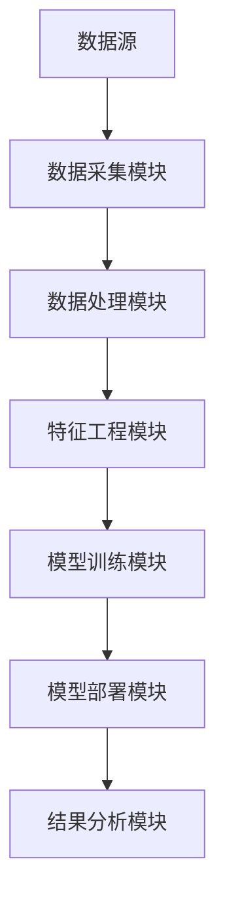
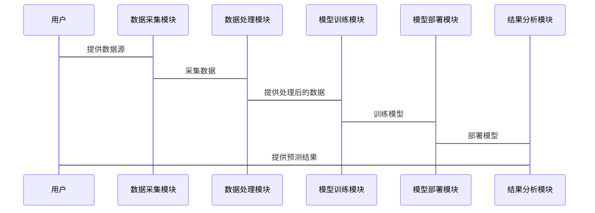

                 


# 《价值投资中的人工智能应用：提高效率与洞察》

## 关键词：价值投资，人工智能，机器学习，深度学习，金融分析，投资策略

## 摘要：人工智能技术在金融领域的应用日益广泛，特别是在价值投资领域，AI通过大数据分析、机器学习和深度学习等技术手段，显著提高了投资效率和决策的准确性。本文将从价值投资的基本原理出发，探讨人工智能技术的应用场景、实现方法以及实际案例，旨在为投资者和相关技术人士提供有价值的参考和启发。

---

# 第二部分: 人工智能技术基础

## 第3章: 人工智能技术基础

### # 3.1 机器学习基础

#### ## 3.1.1 机器学习的基本概念

##### ### 3.1.1.1 机器学习的定义

机器学习（Machine Learning）是一种人工智能技术，它通过数据训练模型，使其能够从数据中学习并做出预测或决策，而无需显式地编程。简单来说，机器学习的核心是通过数据找到模式，并利用这些模式进行预测或分类。

##### ### 3.1.1.2 机器学习的应用场景

在金融领域，机器学习广泛应用于以下几个方面：
- **股票价格预测**：通过历史数据预测未来的价格走势。
- **风险评估**：评估投资组合的风险。
- **欺诈检测**：识别金融交易中的欺诈行为。
- **客户画像**：通过客户行为数据构建客户画像。

##### ### 3.1.1.3 机器学习的核心概念

- **特征（Feature）**：输入数据的属性，例如股票的市盈率、市净率等。
- **标签（Label）**：目标输出，例如股票的涨跌情况。
- **模型（Model）**：根据特征预测标签的函数或算法。
- **训练（Training）**：使用大量数据调整模型参数的过程。
- **测试（Testing）**：评估模型在新数据上的表现。

##### ### 3.1.1.4 机器学习的优缺点

- **优点**：
  - 能够处理大量数据，发现人类难以察觉的模式。
  - 可以自动化决策，减少人为干扰。
- **缺点**：
  - 模型的解释性较差，难以理解其决策过程。
  - 对数据质量要求较高，数据偏差可能会影响结果。

#### ## 3.1.2 常见的机器学习算法

##### ### 3.1.2.1 线性回归（Linear Regression）

线性回归是一种简单而强大的回归算法，主要用于预测连续型变量。在金融领域，它常用于股票价格预测。

##### ### 3.1.2.2 支持向量机（Support Vector Machine, SVM）

SVM主要用于分类问题，例如将股票分为上涨或下跌两类。

##### ### 3.1.2.3 随机森林（Random Forest）

随机森林是一种基于决策树的集成学习算法，常用于分类和回归问题，具有较高的准确性和鲁棒性。

##### ### 3.1.2.4 K-近邻算法（K-Nearest Neighbors, KNN）

KNN算法用于分类和回归问题，基于距离最近的邻居进行预测。

##### ### 3.1.2.5 线性判别分析（Linear Discriminant Analysis, LDA）

LDA是一种经典的分类算法，主要用于二分类问题。

##### ### 3.1.2.6 神经网络（Neural Networks）

神经网络是一种模仿人脑结构和功能的算法，适用于复杂的非线性问题。

#### ## 3.1.3 机器学习在金融中的应用

##### ### 3.1.3.1 股票价格预测

通过历史数据训练模型，预测未来的价格走势。常用的算法包括线性回归、随机森林和神经网络等。

##### ### 3.1.3.2 风险评估

利用机器学习算法评估投资组合的风险，例如通过逻辑回归预测违约概率。

##### ### 3.1.3.3 欺诈检测

通过分析交易数据，识别异常交易行为，预防欺诈。

##### ### 3.1.3.4 客户画像

基于客户的交易数据和行为，构建客户画像，帮助制定个性化的投资策略。

---

### # 3.2 深度学习基础

#### ## 3.2.1 深度学习的基本概念

深度学习（Deep Learning）是机器学习的一种，通过多层神经网络模拟人脑的工作机制，能够处理复杂的非线性问题。与传统机器学习算法相比，深度学习能够自动提取特征，减少人工特征工程的需要。

#### ## 3.2.2 常见的深度学习算法

##### ### 3.2.2.1 卷积神经网络（Convolutional Neural Networks, CNN）

CNN主要用于图像识别和自然语言处理，但在金融领域的文本分析（如财务报表分析）中也有应用。

##### ### 3.2.2.2 循环神经网络（Recurrent Neural Networks, RNN）

RNN适用于时间序列数据的分析，常用于股票价格预测。

##### ### 3.2.2.3 长短期记忆网络（Long Short-Term Memory, LSTM）

LSTM是一种特殊的RNN，能够有效处理长期依赖关系，适用于金融时间序列预测。

##### ### 3.2.2.4 生成对抗网络（Generative Adversarial Networks, GAN）

GAN用于生成数据，例如生成模拟的市场数据进行回测。

#### ## 3.2.3 深度学习在金融中的应用

##### ### 3.2.3.1 股票价格预测

通过LSTM等模型分析时间序列数据，预测股票价格走势。

##### ### 3.2.3.2 财务报表分析

利用深度学习模型从财务报表中提取信息，评估公司财务状况。

##### ### 3.2.3.3 市场情绪分析

通过自然语言处理技术分析新闻、社交媒体等文本数据，评估市场情绪对股价的影响。

---

## 第4章: 人工智能算法实现

### # 4.1 算法实现概述

人工智能算法的实现通常包括数据预处理、模型训练和模型评估三个阶段。在价值投资中，算法的实现需要结合金融数据的特点，选择合适的算法和模型。

### # 4.2 算法实现的步骤

#### ## 4.2.1 数据预处理

##### ### 4.2.1.1 数据清洗

去除无效数据、处理缺失值、标准化或归一化数据。

##### ### 4.2.1.2 特征提取

从原始数据中提取对投资决策有影响的特征，例如市盈率、市净率、营收增长率等。

#### ## 4.2.2 模型训练

##### ### 4.2.2.1 选择算法

根据问题类型选择合适的算法，例如分类问题选择SVM或随机森林，回归问题选择线性回归或神经网络。

##### ### 4.2.2.2 模型训练

使用训练数据调整模型参数，使其能够准确预测目标变量。

##### ### 4.2.2.3 模型评估

通过测试数据评估模型的准确性和稳定性。

#### ## 4.2.3 模型优化

##### ### 4.2.3.1 参数调优

通过网格搜索等方法优化模型参数，提高模型性能。

##### ### 4.2.3.2 模型集成

通过集成学习方法（如投票法、加权法）提高模型的准确性和稳定性。

---

### # 4.3 常见算法的实现细节

#### ## 4.3.1 线性回归（Linear Regression）

##### ### 4.3.1.1 算法原理

线性回归通过最小化预测值和实际值之间的平方差之和，找到最佳拟合直线。

##### ### 4.3.1.2 数学公式

$$
\text{损失函数} = \sum_{i=1}^{n}(y_i - \hat{y_i})^2
$$

其中，$y_i$ 是实际值，$\hat{y_i}$ 是预测值。

##### ### 4.3.1.3 代码实现

```python
import numpy as np
from sklearn.linear_model import LinearRegression

# 假设X是特征矩阵，y是目标变量
model = LinearRegression()
model.fit(X, y)
```

#### ## 4.3.2 随机森林（Random Forest）

##### ### 4.3.2.1 算法原理

随机森林是一种集成学习算法，通过构建多棵决策树并进行投票或平均，提高模型的准确性和稳定性。

##### ### 4.3.2.2 数学公式

随机森林没有直接的数学公式，但其核心在于通过Bagging方法减少方差。

##### ### 4.3.2.3 代码实现

```python
from sklearn.ensemble import RandomForestRegressor

model = RandomForestRegressor(n_estimators=100, random_state=42)
model.fit(X, y)
```

#### ## 4.3.3 LSTM网络

##### ### 4.3.3.1 算法原理

LSTM通过门控机制（遗忘门、输入门、输出门）处理时间序列数据，能够有效捕捉长期依赖关系。

##### ### 4.3.3.2 数学公式

LSTM的核心运算包括遗忘门、输入门和输出门的计算，具体公式如下：

$$
f_t = \sigma(W_f \cdot [h_{t-1}, x_t] + b_f)
$$

$$
i_t = \sigma(W_i \cdot [h_{t-1}, x_t] + b_i)
$$

$$
o_t = \sigma(W_o \cdot [h_{t-1}, x_t] + b_o)
$$

$$
h_t = f_t \cdot h_{t-1} + i_t \cdot tanh(W_c \cdot [h_{t-1}, x_t] + b_c)
$$

##### ### 4.3.3.3 代码实现

```python
import tensorflow as tf
from tensorflow.keras.layers import LSTM, Dense

model = tf.keras.Sequential()
model.add(LSTM(64, input_shape=(timesteps, features)))
model.add(Dense(1))
model.compile(loss='mean_squared_error', optimizer='adam')
```

---

## 第5章: 系统架构与实现

### # 5.1 系统架构设计

#### ## 5.1.1 系统功能模块划分

##### ### 5.1.1.1 数据采集模块

负责从数据源（如数据库、API）获取金融数据。

##### ### 5.1.1.2 数据处理模块

对数据进行清洗、特征提取和数据增强。

##### ### 5.1.1.3 模型训练模块

选择合适的算法，训练模型并保存模型参数。

##### ### 5.1.1.4 模型部署模块

将训练好的模型部署到生产环境，用于实时预测和决策。

##### ### 5.1.1.5 结果分析模块

对模型的预测结果进行分析和可视化，评估模型的性能。

#### ## 5.1.2 系统架构设计

##### ### 5.1.2.1 数据层

- **数据源**：数据库、API接口等。
- **数据存储**：用于存储原始数据和处理后的数据。

##### ### 5.1.2.2 算法层

- **特征工程**：数据清洗、特征提取、数据标准化。
- **模型训练**：选择算法、训练模型、保存模型参数。

##### ### 5.1.2.3 策略层

- **策略选择**：根据市场情况选择合适的投资策略。
- **实时监控**：监控市场变化，及时调整投资组合。

##### ### 5.1.2.4 接口层

- **API接口**：提供给其他系统或前端调用。
- **数据接口**：与其他系统进行数据交互。

#### ## 5.1.3 系统架构图



---

### # 5.2 系统实现细节

#### ## 5.2.1 数据处理与特征工程

##### ### 5.2.1.1 数据清洗

- 处理缺失值：使用均值、中位数或插值方法填充缺失值。
- 处理异常值：通过Z-score或IQR方法检测并剔除异常值。

##### ### 5.2.1.2 特征提取

- 从财务数据中提取市盈率、市净率、营收增长率等指标。
- 从市场数据中提取成交量、波动率等指标。

##### ### 5.2.1.3 数据增强

- 数据归一化：将数据标准化到0-1范围。
- 数据分块：将数据分为训练集、验证集和测试集。

#### ## 5.2.2 模型训练与部署

##### ### 5.2.2.1 模型训练

- 使用训练数据训练模型，调整模型参数。
- 使用验证数据评估模型性能，防止过拟合。

##### ### 5.2.2.2 模型部署

- 将训练好的模型部署到生产环境，用于实时预测。
- 定期更新模型，适应市场变化。

#### ## 5.2.3 系统交互流程

##### ### 5.2.3.1 系统交互流程图



---

## 第6章: 项目实战与应用

### # 6.1 项目环境配置

#### ## 6.1.1 安装必要的库

- **Python**：3.6+
- **NumPy**：用于数组运算
- **Pandas**：用于数据处理
- **Scikit-learn**：用于机器学习算法
- **Keras/TensorFlow**：用于深度学习算法
- **Plotly**：用于数据可视化

#### ## 6.1.2 安装步骤

##### ### 6.1.2.1 使用pip安装

```bash
pip install numpy pandas scikit-learn keras tensorflow plotly
```

##### ### 6.1.2.2 验证安装

```bash
python -c "import numpy; print('NumPy version:', numpy.__version__)"
python -c "import pandas; print('Pandas version:', pandas.__version__)"
```

---

### # 6.2 核心代码实现

#### ## 6.2.1 数据获取与预处理

##### ### 6.2.1.1 数据获取

```python
import pandas as pd
import numpy as np
import requests
import json

# 示例：从API获取股票数据
def get_stock_data(symbol):
    url = f"https://api.example.com/stock/{symbol}"
    response = requests.get(url)
    data = json.loads(response.text)
    return pd.DataFrame(data)
```

##### ### 6.2.1.2 数据清洗

```python
def preprocess_data(df):
    # 处理缺失值
    df.dropna(inplace=True)
    # 标准化数据
    df = (df - df.mean()) / df.std()
    return df
```

#### ## 6.2.2 模型训练与评估

##### ### 6.2.2.1 训练模型

```python
from sklearn.ensemble import RandomForestRegressor
from sklearn.metrics import mean_squared_error

def train_model(X_train, y_train, X_test, y_test):
    model = RandomForestRegressor(n_estimators=100, random_state=42)
    model.fit(X_train, y_train)
    y_pred = model.predict(X_test)
    mse = mean_squared_error(y_test, y_pred)
    print(f"均方误差：{mse}")
    return model
```

##### ### 6.2.2.2 模型评估

```python
from sklearn.metrics import accuracy_score

def evaluate_model(y_true, y_pred):
    accuracy = accuracy_score(y_true, y_pred)
    print(f"准确率：{accuracy}")
```

#### ## 6.2.3 模型部署与应用

##### ### 6.2.3.1 部署模型

```python
import joblib

def save_model(model, filename):
    joblib.dump(model, filename)

def load_model(filename):
    return joblib.load(filename)
```

##### ### 6.2.3.2 实时预测

```python
def predict_price(model, new_data):
    prediction = model.predict(new_data)
    print(f"预测价格：{prediction[0]}")
```

---

## 第7章: 总结与展望

### # 7.1 总结

人工智能技术在价值投资中的应用已经取得了显著的成果，通过机器学习和深度学习算法，投资者能够更高效地进行数据处理、模型训练和决策制定。本文从价值投资的基本原理出发，详细探讨了人工智能技术的应用场景、实现方法和实际案例，为投资者和相关技术人士提供了宝贵的参考。

### # 7.2 展望

随着人工智能技术的不断发展，未来在价值投资中的应用将更加广泛和深入。以下是一些可能的发展方向：

#### ## 7.2.1 多模态数据融合

通过结合文本、图像等多种数据源，提高模型的准确性和鲁棒性。

#### ## 7.2.2 自适应模型

开发能够自适应市场变化的模型，减少人为干预，提高模型的实时性和准确性。

#### ## 7.2.3 可解释性增强

提高模型的可解释性，帮助投资者更好地理解和信任AI的决策。

#### ## 7.2.4 集成学习优化

通过集成学习方法，进一步提高模型的准确性和稳定性。

---

## 参考文献

1. 《机器学习实战》
2. 《深度学习》
3. 《金融时间序列分析》
4. 相关学术论文和研究报告

---

**注意事项**：

- **数据安全**：在实际应用中，需要注意数据的隐私和安全，确保数据不会被泄露或滥用。
- **模型解释性**：虽然机器学习和深度学习能够提高预测的准确性，但模型的解释性较差，可能影响投资者的决策信心。
- **市场变化**：市场环境和政策的变化可能会影响模型的性能，需要定期更新和优化模型。

---

**最佳实践 Tips**：

- **数据多样性**：尽可能收集多样化的数据，包括财务数据、市场数据、新闻数据等，提高模型的泛化能力。
- **模型组合**：结合多种算法，构建多模型集成的系统，提高预测的稳定性和准确性。
- **实时监控**：建立实时监控机制，及时发现和处理模型的异常情况，确保系统的稳定运行。

---

通过本文的详细讲解，读者可以全面了解人工智能在价值投资中的应用，掌握相关的技术和方法，为实际投资决策提供有力支持。

