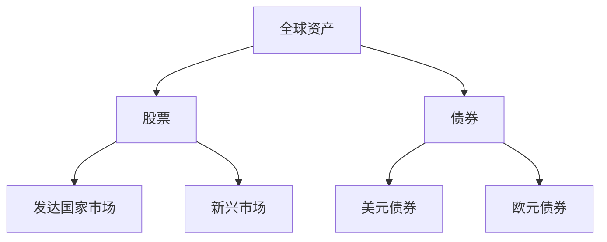
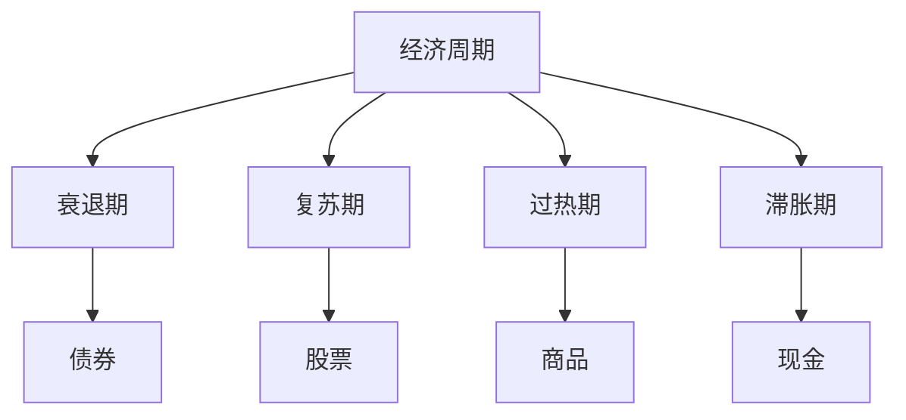
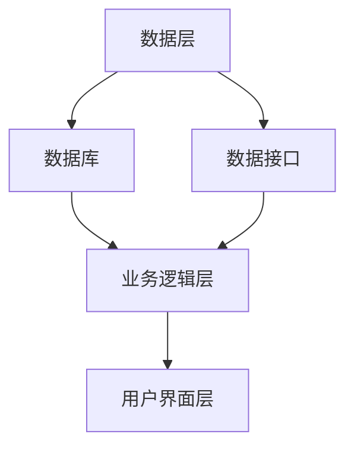
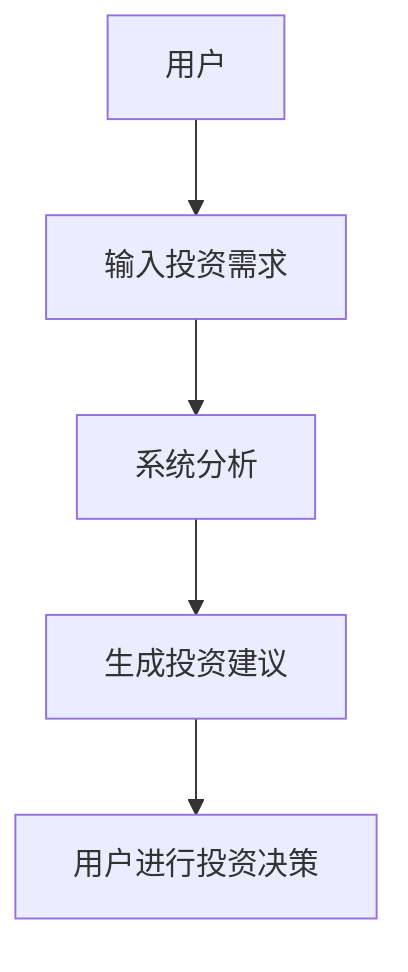

                 


# 价值投资中的全球视野：跨境投资的机遇与挑战

> **关键词**：价值投资、全球视野、跨境投资、风险管理、资产配置、宏观经济、金融市场  
>
> **摘要**：本文探讨了在价值投资中如何从全球视野出发，分析跨境投资的机遇与挑战。通过分析全球市场的宏观经济环境、区域市场特点、行业竞争优势，结合资产配置和风险管理策略，提出了一套系统化的跨境投资分析框架。文章结合实际案例，深入探讨了如何在全球化背景下构建稳健的投资组合，并提出了具体的实施步骤和最佳实践建议。

---

## 第一章: 价值投资的全球视野概述

### 1.1 价值投资的基本概念

#### 1.1.1 价值投资的定义与核心理念
- 价值投资是一种以内在价值为导向的投资策略，强调购买被市场低估的资产。
- 核心理念：寻找价格低于内在价值的资产，长期持有，等待市场重新认识其价值。

#### 1.1.2 全球化视角下的价值投资
- 传统价值投资主要关注本地市场，但全球化背景下，企业跨国运营、全球产业链分工使得投资标的的全球性增强。
- 跨境投资不仅是寻找单一市场的低估值资产，更需要考虑全球资产配置和分散风险。

#### 1.1.3 跨境投资的定义与特点
- 跨境投资：投资者跨越国界，投资于不同国家或地区的资产。
- 特点：市场相关性低、风险分散、收益来源多元化。

**图1.1：全球资产配置的示意图**



### 1.2 全球市场的经济与金融环境

#### 1.2.1 全球经济的基本结构
- 全球经济由主要经济体（美国、欧盟、中国等）和新兴市场（印度、巴西等）组成。
- 经济周期波动对全球市场的影响：例如，美联储加息对全球流动性的影响。

#### 1.2.2 主要经济体的经济特征
- 美国：全球最大的经济体，美联储政策对全球市场影响深远。
- 欧盟：一体化程度高，受欧洲央行货币政策影响。
- 中国：世界第二大经济体，受国内政策和外部环境双重影响。

#### 1.2.3 全球金融市场的主要参与者
- 投资者：机构投资者和个人投资者。
- 中介机构：证券交易所、银行、资产管理公司。
- 监管机构：各国证监会、国际证监会组织。

### 1.3 跨境投资的机遇与挑战

#### 1.3.1 跨境投资的主要机会
- 多元化收益：不同市场资产价格波动的相关性较低，分散风险。
- 发掘低估值市场：新兴市场可能存在低估的优质资产。
- 利用汇率波动：通过套期保值或选择性配置实现收益增强。

#### 1.3.2 跨境投资的主要挑战
- 汇率风险：汇率波动可能影响投资收益。
- 政治风险：地缘政治冲突、政策变化可能影响资产价格。
- 市场流动性风险：新兴市场流动性可能较差，影响资产变现。

#### 1.3.3 跨境投资的风险管理
- 汇率对冲：通过金融衍生工具（如远期外汇合约）进行对冲。
- 分散投资：通过多元化配置降低单一市场的风险。
- 持续监控：定期评估投资组合，调整头寸。

### 1.4 价值投资的全球化策略

#### 1.4.1 全球化视角下的投资策略
- 识别全球范围内的竞争优势：寻找具有全球定价权的企业。
- 评估全球经济周期：根据经济周期调整资产配置。

#### 1.4.2 跨境投资中的资产配置
- 股票、债券、外汇等资产的配置比例。
- 根据全球经济形势动态调整。

#### 1.4.3 跨境投资的长期视角
- 长期投资：避免短期波动干扰，关注企业长期价值。
- 价值发现：在全球范围内寻找被低估的资产。

## 第二章: 全球市场分析框架

### 2.1 宏观经济分析

#### 2.1.1 经济周期分析
- 经济周期分为衰退、复苏、过热、滞胀四个阶段。
- 不同阶段的投资策略：衰退期适合债券，过热期适合股票。

#### 2.1.2 利率与汇率的影响
- 利率上升：债券价格下跌，股票估值可能受压。
- 汇率波动：直接影响外币资产的价值。

#### 2.1.3 通货膨胀与货币政策
- 通货膨胀上升：可能推高股价和债券收益率。
- 货币政策变化：央行加息或降息对市场的影响。

**图2.1：经济周期对资产价格的影响**



### 2.2 区域市场分析

#### 2.2.1 美国市场分析
- 美国市场特点：流动性高、市场成熟、企业创新能力强。
- 主要行业：科技、金融、消费等。

#### 2.2.2 欧洲市场分析
- 欧洲市场特点：一体化程度高、监管严格、企业偏向稳健。
- 主要行业：制造业、金融、能源等。

#### 2.2.3 亚洲市场分析
- 亚洲市场特点：增长速度快、新兴市场多、企业成本优势明显。
- 主要行业：科技、消费、制造等。

### 2.3 行业分析与竞争优势

#### 2.3.1 行业生命周期分析
- 行业生命周期分为导入期、成长期、成熟期、衰退期。
- 不同阶段的投资策略：成长期适合股票，衰退期适合债券。

#### 2.3.2 企业的竞争优势分析
- 核心竞争力：成本优势、技术创新、品牌优势等。
- 投资价值：ROE（净资产收益率）高、现金流稳定、分红率合理。

#### 2.3.3 行业估值与投资机会
- 市盈率（P/E）：低于行业平均水平的公司可能被低估。
- 市净率（P/B）：低于行业平均水平的公司可能被低估。

### 2.4 投资组合的构建与优化

#### 2.4.1 资产配置的基本原则
- 分散投资：避免过度集中于某一资产或市场。
- 风险与收益匹配：根据风险承受能力调整资产配置。

#### 2.4.2 投资组合的风险管理
- 定期再平衡：根据市场变化调整资产配置。
- 风险对冲：使用衍生工具降低非系统性风险。

#### 2.4.3 资产配置的动态调整
- 根据市场变化动态调整：例如，当新兴市场表现不佳时，增加对发达市场的配置。

## 第三章: 跨境投资中的风险管理

### 3.1 財務風險管理

#### 3.1.1 汇率风险的分析
- 汇率波动对资产价值的影响：例如，美元升值可能降低外币资产的价值。
- 汇率预测的困难性：汇率受多种因素影响，难以准确预测。

#### 3.1.2 汇率风险管理策略
- 套期保值：使用远期外汇合约锁定汇率。
- 分散配置：投资不同货币资产，降低汇率风险。

#### 3.1.3 汇率波动的数学模型
- 外汇市场的波动可以用几何布朗运动模型描述：

$$
dX = \mu dt + \sigma dW
$$

其中，$\mu$ 是汇率的期望回报率，$\sigma$ 是波动率，$dW$ 是标准正态分布的随机变量。

#### 3.1.4 汇率风险的案例分析
- 案例：某投资者在2020年投资欧元区股票，同时购买了欧元对美元的看跌期权，以对冲欧元贬值风险。

### 3.2 利率风险的管理

#### 3.2.1 利率波动的影响
- 利率上升会导致债券价格下跌，股票估值可能受压。

#### 3.2.2 利率风险管理策略
- 选择短期债券：降低利率风险。
- 利用债券收益率曲线：投资于收益率曲线陡峭部分的债券。

#### 3.2.3 利率波动的数学模型
- 利率波动可以用 Vasicek 模型描述：

$$
dr = \alpha (\beta - r) dt + \sigma dW
$$

其中，$\alpha$ 是均值回归速度，$\beta$ 是长期利率水平，$\sigma$ 是波动率。

### 3.3 政治风险的管理

#### 3.3.1 政治风险的来源
- 政策变化：例如税收政策、外汇管制等。
- 地缘政治冲突：例如贸易摩擦、战争等。

#### 3.3.2 政治风险管理策略
- 投资多元化：分散投资于不同国家或地区。
- 监测政治风险：定期评估投资地区的政治稳定性。

### 3.4 市场风险的管理

#### 3.4.1 市场波动的影响
- 市场波动可能导致资产价格大幅波动。

#### 3.4.2 市场风险管理策略
- 使用止损订单：设定止损点以限制损失。
- 分散投资：降低市场风险。

#### 3.4.3 市场波动的数学模型
- 股票价格波动可以用几何布朗运动模型描述：

$$
dS = \mu S dt + \sigma S dW
$$

其中，$S$ 是股票价格，$\mu$ 是期望回报率，$\sigma$ 是波动率，$dW$ 是标准正态分布的随机变量。

### 3.5 风险管理的系统设计

#### 3.5.1 风险监控系统
- 实时监控：监测市场波动、政策变化等。
- 风险报告：定期生成风险报告，评估投资组合的风险敞口。

#### 3.5.2 风险对冲系统
- 使用金融衍生工具：例如期权、期货等进行对冲。
- 多策略对冲：结合多种对冲工具降低风险。

#### 3.5.3 风险管理系统架构
- 数据采集：实时采集市场数据、政策信息等。
- 风险评估：使用数学模型评估风险。
- 对冲执行：根据评估结果执行对冲操作。

### 3.6 风险管理的实战应用

#### 3.6.1 环境安装
- 数据源：使用金融数据供应商（如 Bloomberg、Reuters）。
- 工具：使用 Python 的 pandas 和 numpy 进行数据分析，使用 matplotlib 进行可视化。

#### 3.6.2 风险管理代码实现
```python
import pandas as pd
import numpy as np

# 假设我们有汇率数据和资产回报数据
exchange_rates = pd.read_csv('exchange_rates.csv')
returns = pd.read_csv('asset_returns.csv')

# 计算汇率波动率
def calculate_volatility(data, window=20):
    return data.rolling(window).std()

exchange_volatility = calculate_volatility(exchange_rates['EURUSD'])
```

#### 3.6.3 案例分析
- 案例：2020年新冠疫情对全球市场的冲击，投资者如何通过多元化配置和对冲工具降低风险。

### 3.7 风险管理的小结

#### 3.7.1 最佳实践
- 定期评估投资组合的风险敞口。
- 使用多种对冲工具降低风险。
- 监测市场动态，及时调整风险管理策略。

#### 3.7.2 注意事项
- 风险管理需要动态调整，不能一成不变。
- 对冲工具可能存在成本，需综合考虑收益与成本。

#### 3.7.3 拓展阅读
- 阅读关于VaR（在险价值）和CVaR（条件在险价值）的文献，进一步了解风险管理的方法。

---

## 第四章: 跨境投资的系统架构设计

### 4.1 系统设计背景

#### 4.1.1 问题场景介绍
- 投资者需要在全球范围内进行资产配置，面临复杂的市场环境和多样的风险因素。
- 需要一个系统化的解决方案，帮助投资者进行科学的投资决策。

#### 4.1.2 项目介绍
- 开发一个支持跨境投资的分析系统，提供数据采集、分析、风险评估和投资建议功能。

### 4.2 系统功能设计

#### 4.2.1 数据采集模块
- 数据源：全球金融市场数据，包括股票价格、债券收益率、汇率等。
- 数据接口：与金融数据供应商对接，获取实时数据。

#### 4.2.2 数据分析模块
- 市场分析：使用宏观经济指标、行业分析工具进行市场评估。
- 企业分析：分析企业的财务指标、竞争优势等。

#### 4.2.3 风险评估模块
- 计算投资组合的波动率、VaR等风险指标。
- 生成风险报告，评估投资组合的风险敞口。

#### 4.2.4 投资建议模块
- 根据市场分析和风险评估结果，生成投资建议。
- 提供资产配置方案，优化投资组合。

### 4.3 系统架构设计

#### 4.3.1 系统架构图
- 使用分层架构，包括数据层、业务逻辑层和用户界面层。

**图4.1：系统架构图**



#### 4.3.2 系统接口设计
- 数据接口：与金融数据供应商对接，获取实时数据。
- 用户接口：提供友好的用户界面，方便投资者使用。

#### 4.3.3 系统交互流程
- 用户输入投资需求。
- 系统分析市场数据，生成投资建议。
- 用户根据建议进行投资决策。

**图4.2：系统交互流程图**



### 4.4 系统实现

#### 4.4.1 环境安装
- 安装 Python、Pandas、NumPy 等工具。
- 安装金融数据接口，例如使用 Bloomberg API。

#### 4.4.2 核心代码实现
```python
import pandas as pd
import numpy as np
import requests

# 数据接口示例
def get_data(ticker):
    response = requests.get(f'https://api.example.com/{ticker}')
    return pd.DataFrame(response.json())

# 数据分析示例
def calculate VaR(returns, confidence_level=95%):
    return np.percentile(returns, 1 - confidence_level/100)
```

### 4.5 系统小结

#### 4.5.1 项目总结
- 成功开发了一个支持跨境投资的分析系统，帮助投资者进行科学的投资决策。

#### 4.5.2 最佳实践
- 定期更新数据和模型，保持系统的先进性。
- 提供用户友好的界面，方便投资者使用。

#### 4.5.3 拓展建议
- 进一步优化系统，增加更多的功能，例如智能投顾、实时监控等。

---

## 第五章: 项目实战

### 5.1 环境安装

#### 5.1.1 安装 Python 和相关库
- 使用 Anaconda 安装 Python 和相关库（Pandas、NumPy、Matplotlib 等）。

#### 5.1.2 安装金融数据接口
- 安装 Bloomberg API 或其他金融数据接口。

### 5.2 核心代码实现

#### 5.2.1 数据采集代码
```python
import pandas as pd
import numpy as np
import requests

def get_data(ticker):
    response = requests.get(f'https://api.example.com/{ticker}')
    return pd.DataFrame(response.json())
```

#### 5.2.2 数据分析代码
```python
def calculate_return(data, window=20):
    return data['close'].pct_change().rolling(window).mean()

returns = get_data('AAPL').close.pct_change()
mean_return = calculate_return(data, 20)
```

#### 5.2.3 风险评估代码
```python
def calculate VaR(returns, confidence_level=95%):
    return np.percentile(returns, 1 - confidence_level/100)

VaR = calculate VaR(returns)
```

### 5.3 实际案例分析

#### 5.3.1 案例背景
- 投资者计划投资于新兴市场的科技公司，需要评估汇率风险和市场风险。

#### 5.3.2 数据分析
- 收集目标公司的财务数据和市场数据。
- 计算公司的估值指标（市盈率、市净率等）。

#### 5.3.3 投资决策
- 根据分析结果，决定是否投资该公司。

### 5.4 项目小结

#### 5.4.1 项目总结
- 成功完成了一个跨境投资项目的分析，验证了系统设计的有效性。

#### 5.4.2 最佳实践
- 在实际投资中，需要结合市场实际情况，动态调整投资策略。

#### 5.4.3 注意事项
- 数据来源的可靠性直接影响分析结果，需选择可靠的金融数据供应商。

---

## 第六章: 总结与展望

### 6.1 总结

#### 6.1.1 核心内容回顾
- 价值投资中的全球视野：分析全球市场，寻找低估值资产。
- 跨境投资的机遇与挑战：多元化收益与汇率、政治风险。

#### 6.1.2 系统设计与实现
- 开发了一个支持跨境投资的分析系统，帮助投资者进行科学决策。

### 6.2 未来展望

#### 6.2.1 技术发展
- 人工智能和大数据技术在投资分析中的应用将更加广泛。
- 区块链技术可能改变金融交易和结算方式。

#### 6.2.2 市场变化
- 全球化将进一步深化，新兴市场的重要性将增加。
- 可持续投资和ESG（环境、社会、治理）因素将越来越重要。

#### 6.2.3 投资者教育
- 需要提高投资者的全球视野和风险管理能力。
- 加强对新兴市场的研究和分析。

---

## 第七章: 结语

### 7.1 价值投资中的全球视野的重要性

#### 7.1.1 全球化背景下的投资机遇
- 跨境投资提供了多元化收益的可能性。
- 全球产业链分工为投资者提供了更多的投资机会。

#### 7.1.2 风险管理的重要性
- 跨境投资中的汇率、政治等风险需要通过系统化的方法进行管理。

### 7.2 未来投资策略的建议

#### 7.2.1 加强对新兴市场的研究
- 新兴市场增长潜力大，存在低估值投资机会。
- 需要关注新兴市场的政策和经济环境。

#### 7.2.2 利用技术手段提高投资效率
- 人工智能和大数据技术可以提高投资分析的效率和准确性。
- 区块链技术可能改变金融交易的方式。

#### 7.2.3 注重风险管理
- 建立全面的风险管理体系，包括汇率风险、市场风险、政治风险等。
- 使用金融衍生工具进行风险对冲。

### 7.3 结语

- 价值投资中的全球视野是应对全球化挑战和抓住全球化机遇的关键。
- 通过系统化的分析和风险管理，投资者可以在跨境投资中实现稳健的收益。
- 随着技术的进步和市场的变化，未来投资策略需要不断创新和调整，以适应新的环境和挑战。

