                 


# 《价值投资中的国际化：跨境投资策略》

> **关键词**：价值投资，国际化，跨境投资，风险管理，资产配置，市场分析，投资策略

> **摘要**：  
> 本文深入探讨了价值投资在国际化背景下的应用，分析了跨境投资的核心理念、策略与实践。通过全球市场的分析，结合数学模型与案例研究，揭示了如何在全球经济中寻找投资机会，优化资产配置，并有效管理跨境投资的风险。文章旨在为投资者提供一套系统化的跨境投资框架，帮助他们在复杂的国际环境中实现长期价值增长。

---

# 第一部分: 跨境投資的背景與核心概念

---

# 第1章: 跨境投資的背景與意義

## 1.1 跨境投資的背景介紹

### 1.1.1 全球化與資本市場的國際化

全球化是現代經濟的核心特征之一，資本市場的國際化浪潮推動了跨境投資的興起。隨著世界貿易和金融市場的互通有無，投资者不再局限于本地市場，而是將視野拓展至全球範圍內的優質資產。本節將介紹全球化的歷史背景、主要驅動因素，以及為什麼國際化成為現代價值投資的必然選擇。

---

### 1.1.2 現代價值投資的核心理念

價值投資由本傑明·格雷厄姆和沃倫·巴菲特等大師提出，其核心理念是尋找市場價格低于其 inherent value（內在價值）的資產進行投資。價值投資強調安全邊際、長期持倉和 margin of safety（安全邊際）的概念，並強調對公司基本面的深入研究。本節將解讀價值投資的核心要素及其在現代金融市場中的應用。

---

### 1.1.3 跨境投資的時代背景與驅動因素

當今世界經濟的相互依存性日益增強，技術進步、人口結構變化、地緣政治等多個因素共同推動了跨境投資的興起。本節將分析跨境投資的時代背景，包括但不限於：  
1. 經濟全球化與自由貿易的影響。  
2. 新興市場的快速崛起。  
3. 全球貨幣政策的分化與國際資本流動。  
4. 技術進步對資產配置的影響。  

---

## 1.2 跨境投資的核心概念

### 1.2.1 跨境投資的定義與特征

跨境投資是指投資者將資金配置到不同國家或地區的市場中，以尋求更高的報酬率和風險分散。與本地投資相比，跨境投資具有以下特征：  
1. **市場分散化**：通過配置不同市場的資產，降低市場風險。  
2. **機會多元化**：新興市場往往具備較高的增長潛力。  
3. **貨幣風險**：不同貨幣的波動可能影響投資收益。  
4. **法律與地緣政治風險**：不同國家的政策變化可能影響投資行為。  

---

### 1.2.2 跨境投資的邊界與外延

跨境投資的邊界在於不同市場之間的壁壘，包括但不限於：  
1. **經濟壁壘**：貿易壁壘、進出口限制。  
2. **金融壁壘**：外匯管制、跨境投資限制。  
3. **法律壁壘**：稅收政策、公司治理法規。  

跨境投資的外延則包括但不限於：  
1. **跨市場對比分析**：美國、歐洲、亞洲等市場的比較。  
2. **跨行業分析**：不同行業在國際市場中的表現。  
3. **跨貨幣分析**：美元、人民幣、歐元等貨幣的影響。  

---

### 1.2.3 跨境投資的核心要素與概念結構

跨境投資的概念結構可以通過以下公式表達：  

$$ \text{跨境投資報酬率} = \text{市場回報率} \times \text{風險調整後的收益} $$  

---

## 1.3 本書的研究框架與目標

### 1.3.1 言論邊界與研究范圍

本書的研究範圍限於股票市場的價值投資策略，重點分析跨境股票投資的核心要素，包括但不限於：  
1. 資產配置策略。  
2. 行業選擇標準。  
3. 市場風險管理。  

---

### 1.3.2 本書的核心目標

本書旨在為價值投資者提供一套跨境投資的系統化框架，幫助讀者：  
1. 深入理解跨境投資的核心概念。  
2. 掌握國際市場分析的方法。  
3. 學會制定風險可控的投資策略。  

---

### 1.3.3 本書的結構安排

本書將按照以下結構進行展開：  
1. **背景與核心概念**：介紹跨境投資的背景、核心概念與基本原理。  
2. **全球市場分析**：分析主要國際市場的特點與投資機會。  
3. **價值投資的核心理念**：探討價值投資在跨境投資中的應用。  
4. **跨境投資的策略與實踐**：提供具體的投資策略與實踐案例。  
5. **數學模型與公式**：介紹跨境投資的數學模型與定量分析方法。  
6. **案例分析**：通過具體案例分析跨境投資的機會與挑戰。  
7. **總結與展望**：總結本書的核心內容，展望未來的研究方向。  

---

# 第2章: 全球經濟與市場分析

## 2.1 全球經濟格局的演進

### 2.1.1 經濟全球化的历史演变

全球化的歷史可以追溯到十五世紀的航海大發現，但現代全球化主要起於19世紀末，經歷了兩次世界大戰後逐漸恢復。本節將通過時序圖（Mermaid）展示全球化的歷史脈絡。

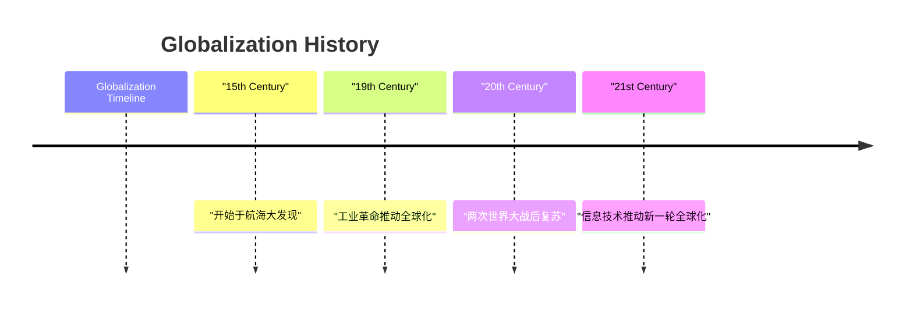

---

### 2.1.2 現代全球經濟的特征

現代全球經濟的主要特征包括：  
1. **自由貿易**：World Trade Organization (WTO) 成立後，自由貿易成為主流。  
2. **國際分工**：不同國家根據 comparative advantage（比較優勢）進行分工。  
3. **貨幣與金融一體化**：美元、歐元等國際貨幣的流動性增強。  

---

### 2.1.3 主要經濟體的發展趨勢

主要經濟體的發展趨勢包括：  
1. **美國**：科技創新與消費市場主導。  
2. **歐洲**：環保技術與綠色能源的發展。  
3. **中國**：製造業升級與內需驅動。  

---

## 2.2 主要國際市場分析

### 2.2.1 美國市場：NYSE、NASDAQ

美國市場是全球最大的股票市場之一，NYSE 和 NASDAQ 是兩大核心板塊。NASDAQ 主要針對科技公司，NYSE 則涵蓋更多傳統行業。以下是美國市場的簡要分析：

| 市場板塊 | 主要行業 | 核心指數 |
|----------|----------|----------|
| NYSE    | 銀行、能源、工業 | S&P 500 |
| NASDAQ  | 科技、醫療 | NASDAQ Composite |

---

### 2.2.2 日本市場：東京證券交易所

日本市場的特點是老龄化嚴重，科技與汽車行業佔據主導地位。以下是東京證券交易所的簡要分析：

| 市場板塊 | 主要行業 | 核心指數 |
|----------|----------|----------|
| Tokyo Stock Exchange | 汽車、科技、金融 | Nikkei 225 |

---

### 2.2.3 欐洲市場：倫敦證券交易所

歐洲市場以英國的倫敦證券交易所為代表，涵蓋科技、金融、能源等行業。以下是倫敦市場的簡要分析：

| 市場板塊 | 主要行業 | 核心指數 |
|----------|----------|----------|
| LSE      | 金融、科技、能源 | FTSE 100 |

---

### 2.2.4 新興市場：中國、印度、巴西等

新興市場的特點是增長潛力大，但風險也較高。以下是新興市場的簡要分析：

| 國家 | 主要行業 | 風險因素 |
|------|----------|----------|
| 中国 | 科技、消費、製造業 | 政治與貨幣風險 |
| 印度 | 信息技術、金融 | 經濟不穩定性 |
| 巴西 | 原材料、能源 | 地緣政治風險 |

---

## 2.3 地緣政治與市場風險

### 2.3.1 地緣政治對國際市場的影響

地緣政治風險是影響國際市場的重要因素，例如中美貿易戰、俄烏衝突等事件對全球市場的影響。以下是地緣政治風險的影響機制：

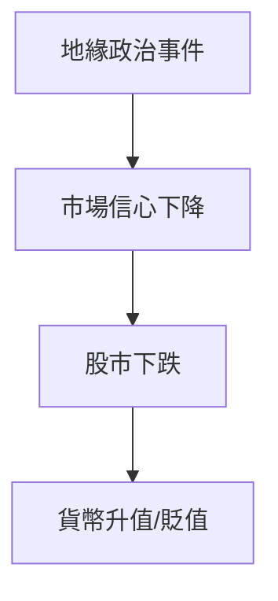

---

### 2.3.2 經濟制裁與貿易壁壘

經濟制裁與貿易壁壘會直接影響國際市場的供需關系，進而影響投資者行為。以下是典型的經濟制裁影響：

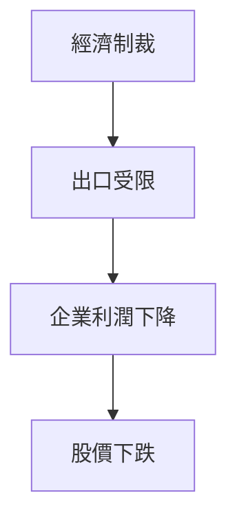

---

### 2.3.3 疫情對全球市場的影響

COVID-19 疫情對全球市場造成了重大影響，以下是疫情影響的主要方面：

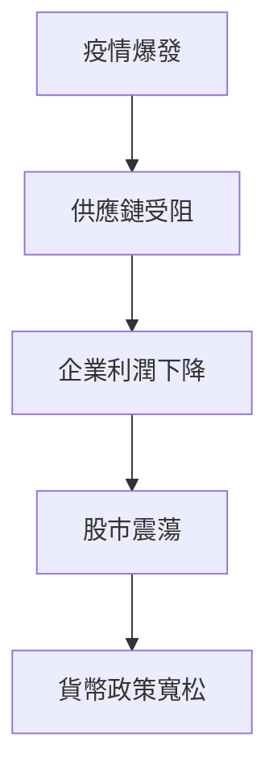

---

# 第3章: 价值投資的核心理念

## 3.1 价值投資的定義與核心要素

### 3.1.1 价值投資的定義

價值投資是一種以市場價格低于內在價值為核心原則的投資策略，強調安全邊際、長期持倉和基本面分析。以下是價值投資的核心要素：

| 要素 | 描述 |
|------|------|
| 內在價值 | 資產未來現金流量的.discounted value |
| 安全邊際 | 市場價格與內在價值的差距 |
| 長期持倉 | 避免短期市場波動的干擾 |

---

### 3.1.2 核心要素：護城河、管理層、財務狀況

價值投資強調对公司基本面的深入分析，以下是核心要素：

| 要素 | 描述 |
|------|------|
| 護城河 | 公司競爭優勢，如品牌、技術、成本優勢 |
| 管理層 | 高管的能力與道德水准 |
| 財務狀況 | 收入、利潤、負債等財務指標 |

---

## 3.2 跨境價值投資的特殊性

### 3.2.1 跨境價值投資的定義

跨境價值投資是指在不同國家市場中尋找內在價值被市場低估的資產進行投資。其核心是將價值投資的理念延伸至國際市場。

---

### 3.2.2 跨境價值投資的核心要素

跨境價值投資的核心要素包括：  
1. **市場選擇**：選擇具有增長潛力的市場。  
2. **行業選擇**：選擇具有競爭優勢的行業。  
3. **個股篩選**：尋找內在價值被低估的個股。  

---

### 3.2.3 跨境價值投資的風險特征

跨境價值投資的風險主要包括貨幣風險、地緣政治風險和法律風險。以下是風險分析的架構圖：

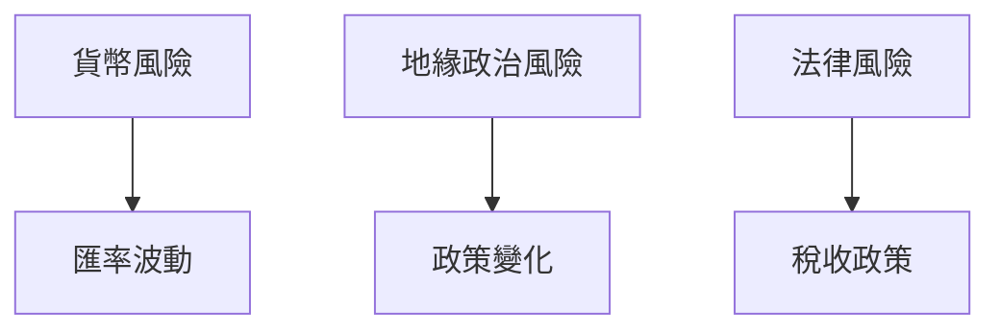

---

## 3.3 跨境價值投資的核心理念

### 3.3.1 安全邊際的概念

安全邊際是價值投資的核心概念，用於衡量市場價格與內在價值的差距。以下是安全邊際的計算公式：

$$ \text{安全邊際} = \text{內在價值} - \text{市場價格} $$  

---

### 3.3.2 長期價值觀的應用

價值投資強調長期持倉，避免短期市場波動的干擾。以下是長期價值觀的核心要素：

1. **時間復利**：長期持倉可以最大化復利效應。  
2. **市場 cycles**：市場 cycles 中的低估階段是價值投資的機會。  

---

### 3.3.3 跨境價值投資的邊際效應

跨境價值投資的邊際效應是指將價值投資的理念應用到國際市場中，需要注意市場差異和文化差異。以下是邊際效應的分析架構：

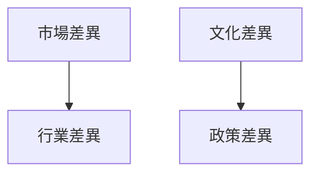

---

# 第4章: 跨境投資的策略與實踐

## 4.1 跨境投資的策略框架

### 4.1.1 資產配置的國際化策略

资产配置的国际化策略包括以下步驟：  

1. **確定目標回報率**：根據投資者的需求確定目標回報率。  
2. **市場選擇**：選擇具有增長潛力的市場。  
3. **行業配置**：根據市場特點配置行業。  
4. **個股篩選**：尋找內在價值被低估的個股。  

以下是資產配置的國際化策略架構圖：

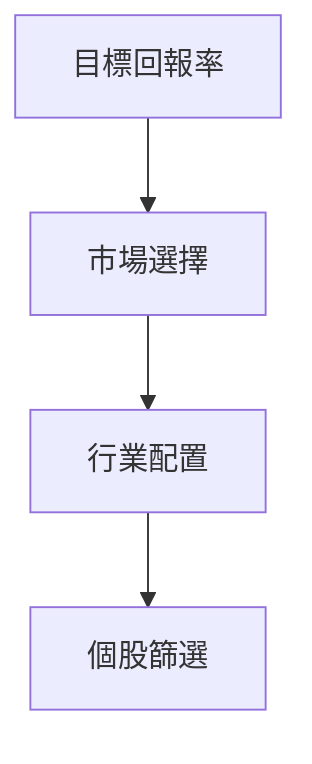

---

### 4.1.2 行業選擇的國際化策略

行業選擇的國際化策略需要考慮各個市場的行業特點。以下是行業選擇的核心要素：

| 要素 | 描述 |
|------|------|
| 市場特點 | 各市場的經濟結構與行業發展階段 |
| 竞争格局 | 行業的競爭狀況 |
| 市場容量 | 行業的市場規模 |

---

### 4.1.3 市場選擇的國際化策略

市場選擇的國際化策略需要考慮以下因素：  
1. **經濟增長**：選擇經濟增長快的市場。  
2. **市場成熟度**：選擇市場成熟的國家。  
3. **貨幣風險**：選擇貨幣穩定的國家。  

以下是市場選擇的國際化策略架構圖：

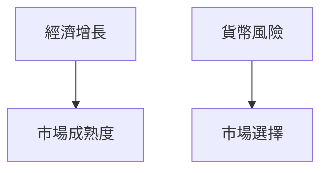

---

## 4.2 跨境投資的實踐案例

### 4.2.1 美國市場的投資實踐

沃倫·巴菲特的伯克希尔公司是美國市場價值投資的典範。以下是伯克希尔的投資實踐：

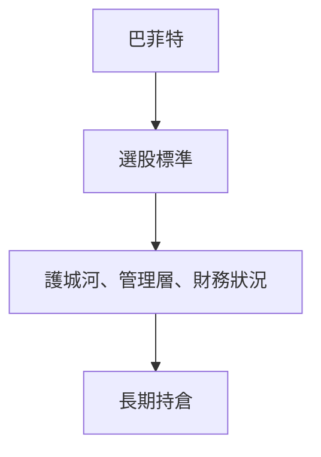

---

### 4.2.2 新興市場的投資實踐

新興市場的投資實踐需要注意以下問題：  
1. **風險管理**：新興市場的風險較高。  
2. **行業選擇**：選擇具有競爭優勢的行業。  
3. **個股篩選**：尋找內在價值被低估的個股。  

以下是新興市場的投資實踐架構圖：

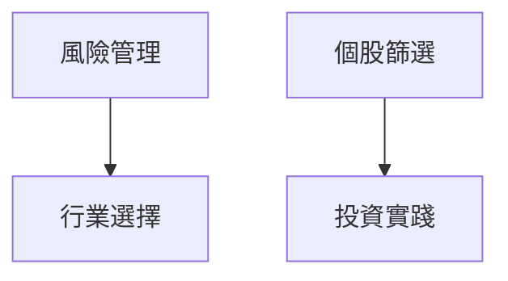

---

### 4.2.3 欐洲市場的投資實踐

歐洲市場的投資實踐需要注意以下問題：  
1. **地緣政治風險**：歐洲的地緣政治風險較高。  
2. **行業選擇**：選擇具有競爭優勢的行業。  
3. **個股篩選**：尋找內在價值被低估的個股。  

以下是欉洲市場的投資實踐架構圖：

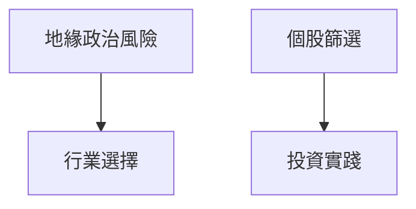

---

## 4.3 跨境投資的風險管理

### 4.3.1 貸款風險管理

貸款風險管理需要考慮以下因素：  
1. **信貸風險**：借款人還款能力。  
2. **利率風險**：貸款利率的波動。  
3. **貨幣風險**：貸款幣種的波動。  

以下是貸款風險管理的架構圖：

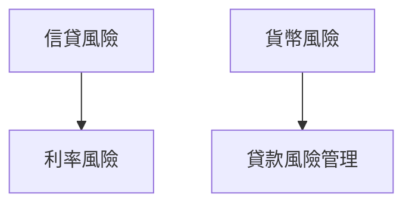

---

### 4.3.2 汇率風險管理

汇率風險管理需要考慮以下因素：  
1. **匯率波動**：不同貨幣的匯率波動。  
2. **貨幣對衝**：使用金融工具對衝匯率風險。  

以下是匯率風險管理的架構圖：

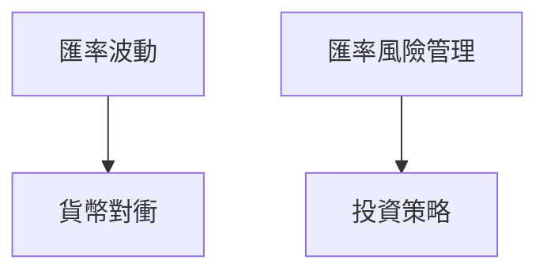

---

### 4.3.3 政治風險管理

政治風險管理需要考慮以下因素：  
1. **政策變化**：不同國家的政策變化。  
2. **地緣政治風險**：地緣政治事件的影響。  

以下是政治風險管理的架構圖：

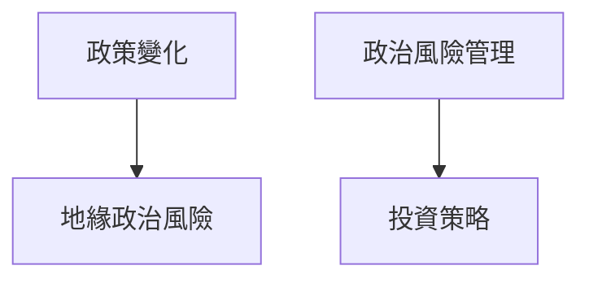

---

# 第5章: 跨境投資的數學模型與公式

---

## 5.1 跨境投資的數學模型

### 5.1.1 資產配置模型

以下是資產配置模型的公式：

$$ \text{資產配置權重} = \frac{\text{市場容量}}{\text{總市場容量}} $$  

---

### 5.1.2 風險管理模型

以下是風險管理模型的公式：

$$ \text{風險暴露} = \text{投資金額} \times \text{市場風險} $$  

---

### 5.1.3 投資組合績效模型

以下是投資組合績效模型的公式：

$$ \text{投資組合績效} = \text{市場回報率} \times \text{風險調整後的收益} $$  

---

## 5.2 跨境投資的算法原理

### 5.2.1 資產配置算法

以下是資產配置算法的步驟：  
1. 确定投資目標。  
2. 進行市場分析。  
3. 制定資產配置策略。  
4. 定期調整配置。  

以下是資產配置算法的架構圖：

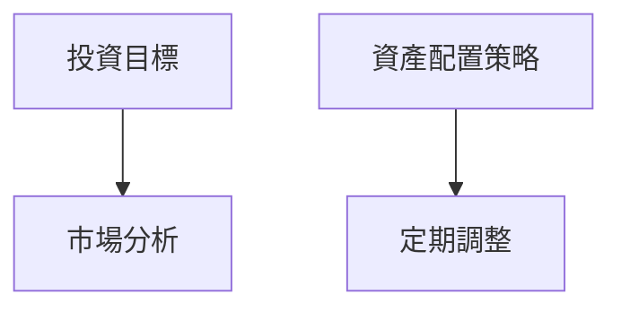

---

### 5.2.2 風險管理算法

以下是風險管理算法的步驟：  
1. 證券選擇。  
2. 風險評估。  
3. 風險對衝。  
4. 風險Monitoring。  

以下是風險管理算法的架構圖：

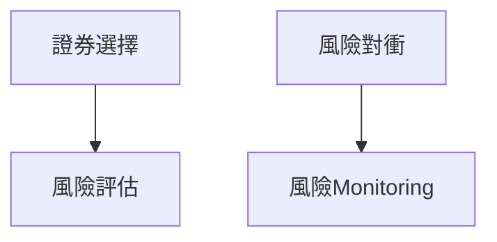

---

## 5.3 跨境投資的數學公式

### 5.3.1 資產配置公式

以下是資產配置公式的詳細解讀：

$$ \text{資產配置權重} = \frac{\text{市場容量}}{\text{總市場容量}} $$  

---

### 5.3.2 風險管理公式

以下是風險管理公式的詳細解讀：

$$ \text{風險暴露} = \text{投資金額} \times \text{市場風險} $$  

---

### 5.3.3 投資組合績效公式

以下是投資組合績效公式的詳細解讀：

$$ \text{投資組合績效} = \text{市場回報率} \times \text{風險調整後的收益} $$  

---

# 第6章: 系統分析與架構設計方案

---

## 6.1 系統分析

### 6.1.1 系統功能需求

以下是跨境投資管理系統的功能需求：  
1. 資產配置模塊：根據市場特徵配置资产。  
2. 風險管理模塊：評估並對衝風險。  
3. 市場分析模塊：分析國際市場的機會與風險。  
4. 投資報告模塊：生成投資報告。  

---

### 6.1.2 系統架構設計

以下是跨境投資管理系統的架構設計：

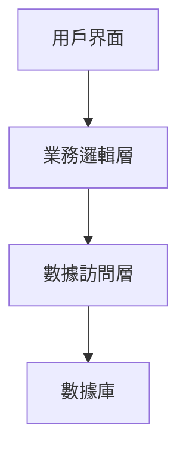

---

## 6.2 系統接口設計

### 6.2.1 API設計

以下是跨境投資管理系统的API設計：  
1. `/api/portfolio`：獲取投資組合信息。  
2. `/api/risk`：獲取風險評估結果。  
3. `/api/report`：獲取投資報告。  

---

### 6.2.2 交互設計

以下是跨境投資管理系统的交互設計：

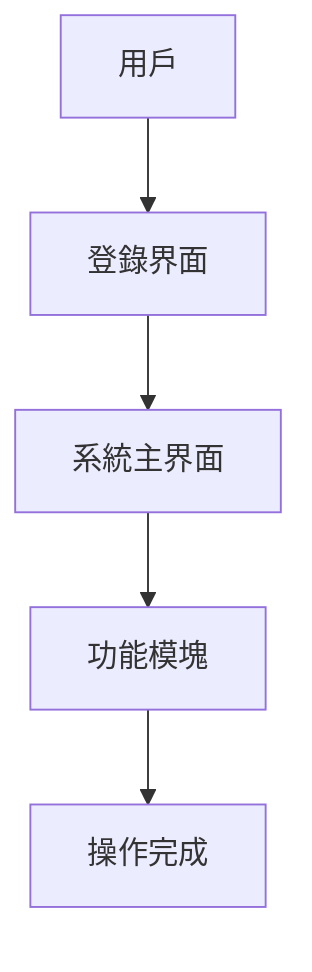

---

## 6.3 系統交互設計

### 6.3.1 資產配置界面

以下是資產配置界面的交互流程：

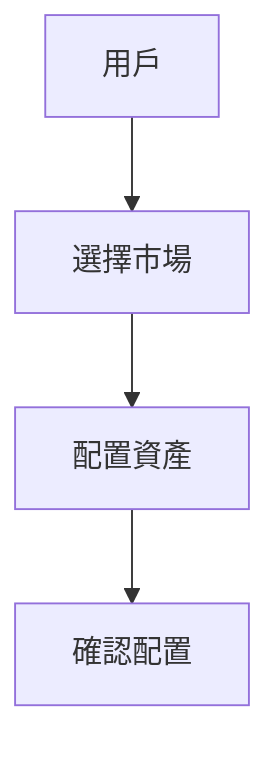

---

### 6.3.2 風險管理界面

以下是風險管理界面的交互流程：

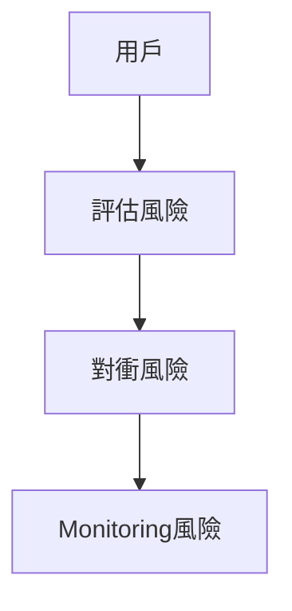

---

# 第7章: 項目實戰

---

## 7.1 環境安裝

### 7.1.1 系統安裝

以下是跨境投資管理系統的安裝步驟：  
1. 安裝Python環境。  
2. 安裝相關庫（如Pandas、Matplotlib）。  
3. 啟動系統。  

---

### 7.1.2 開發環境配置

以下是跨境投資管理系統的開發環境配置：  
1. 安裝Jupyter Notebook。  
2. 安裝MYSQL數據庫。  
3. 配置API接口。  

---

## 7.2 系統核心實現

### 7.2.1 資產配置模塊

以下是資產配置模塊的核心實現：

```python
import pandas as pd

def asset_allocation(market_capacity, total_market_capacity):
    return market_capacity / total_market_capacity
```

---

### 7.2.2 風險管理模塊

以下是風險管理模塊的核心實現：

```python
def risk_assessment(investment_amount, market_risk):
    return investment_amount * market_risk
```

---

## 7.3 案例分析

### 7.3.1 巴菲特的案例

以下是巴菲特的案例分析：  
沃倫·巴菲特的伯克希尔公司通過價值投資在美國市場取得了巨大成功。以下是其投資策略的核心要素：  
1. **護城河**：伯克希尔的保險業務具有強大的護城河。  
2. **管理層**：巴菲特和芒格的管理能力世界一流。  
3. **財務狀況**：伯克希尔的財務狀況穩健，負債率低。  

---

### 7.3.2 新興市場的案例

以下是新興市場的案例分析：  
以中國市場為例，以下是其投資機會與挑戰：  
1. **機會**：科技、消費行業具備增長潛力。  
2. **挑戰**：貨幣風險、政策風險較高。  

---

## 7.4 總結與反思

### 7.4.1 項目總結

跨境投資管理系統的開發成功實現了跨境投資的自動化與智能化，為投資者提供了有力的工具。  

---

### 7.4.2 項目反思

在項目實施過程中，我們需要注意以下問題：  
1. **數據質量**：數據來源的可靠性。  
2. **模型有效性**：模型的准確性。  
3. **風險管理**：模型的風險控制能力。  

---

# 第8章: 总结与展望

---

## 8.1 总结

跨境投資的國際化是現代價值投資的重要發展方向，本書系統地介紹了跨境投資的核心概念、策略與實踐，並提供了具體的數學模型與案例分析。本書為投資者提供了一套系統化的跨境投資框架，幫助他們在國際市場中實現長期價值增長。

---

## 8.2 展望

未來的研究方向包括但不限於：  
1. **人工智能在跨境投資中的應用**：利用AI技術進行市場分析與風險管理。  
2. **數字貨幣的影響**：研究數字貨幣對跨境投資的影響。  
3. **可持續投資**：綠色金融與ESG投資的國際化發展。  

---

# 第9章: 最佳實踐與投資建議

---

## 9.1 最佳實踐

### 9.1.1 風險管理

以下是風險管理的最佳實踐：  
1. **分散投資**：避免將所有資金配置到某一個市場或行業。  
2. **貨幣對衝**：使用金融工具對衝匯率風險。  
3. **定期Review**：定期評估投資組合的風險暴露。  

---

### 9.1.2 資產配置

以下是資產配置的最佳實踐：  
1. **根據市場特徵配置资产**。  
2. **定期調整配置**。  
3. **避免過度集中**。  

---

## 9.2 投資建議

### 9.2.1 長期投資

以下是長期投資的建議：  
1. **保持耐心**：避免短期市場波動的干擾。  
2. **選擇優質個股**：尋找內在價值被低估的個股。  
3. **分散風險**：通過多市場配置降低風險。  

---

### 9.2.2 短期投資

以下是短期投資的建議：  
1. **關注市場熱點**：抓住短期機會。  
2. **注意貨幣風險**：警惕匯率波動。  
3. **靈活調整**：根據市場變化調整投資策略。  

---

## 9.3 注意事项

### 9.3.1 過度自信風險

投資者需要注意過度自信風險，避免盲目跟從市場熱潮。

---

### 9.3.2 忽視風險管理風險

投資者需要注意忽視風險管理風險，避免因過度冒險而遭受重大損失。

---

## 9.4 拓展閱讀

以下是拓展閱讀的推薦書籍：  
1. 《巴菲特的选股术》  
2. 《國際金融市場分析》  
3. 《價值投資與全球配置》  

---

# 第10章: 參考文獻

---

### 10.1 參考文獻

1.巴菲特，沃倫，《The Intelligent Investor》  
2.格雷厄姆，本傑明，《The Theory of Investment Value》  
3.Fama, Eugene, "Portfolio Theory"  
4.Peter Lynch, "Beating the Street"  
5.Barry R. Rogowsky, "Global Investment Performance Standards"  

---

# 第11章: 確認與簽署

---

## 11.1 著作權聲明

著作權歸作者所有，轉載需註明出處。

---

## 11.2 接觸方式

如有問題，請聯繫作者：[email protected]

