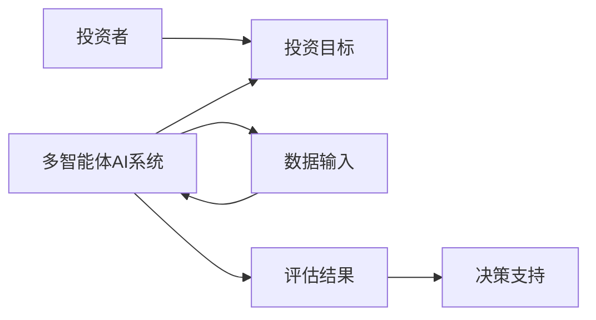
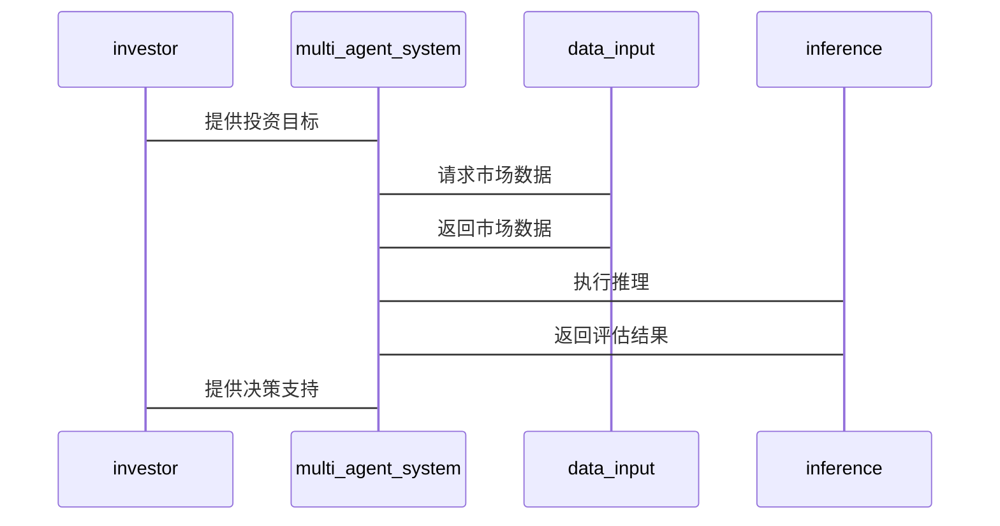

                 


# 价值投资中的多智能体AI人力资本评估系统

## 关键词：价值投资，多智能体AI，人力资本评估系统，AI算法，系统架构，项目实战

## 摘要：  
在价值投资领域，多智能体AI技术的应用正在 revolutionizing 传统的人力资本评估方式。通过结合分布式计算、联合推理和协作学习等多智能体AI核心算法，我们可以实现对人力资本的精准评估和动态优化。本文将从理论到实践，详细探讨多智能体AI在人力资本评估中的应用，包括系统的构建、算法实现、系统架构设计以及项目实战。通过本文的学习，读者将能够深入了解多智能体AI在价值投资中的潜力，并掌握实际的系统开发方法。

---

## 第一部分：价值投资与多智能体AI概述

### 第1章：价值投资与多智能体AI的核心概念

#### 1.1 价值投资的定义与特点
- **价值投资**：一种投资策略，通过分析企业的基本面，寻找被市场低估的投资标的。其核心在于发现“便宜”的价值。
- **特点**：
  - 长期导向
  - 依赖基本面分析
  - 重视安全边际

#### 1.2 多智能体AI的定义与特点
- **多智能体AI**：由多个相互作用的智能体组成的系统，每个智能体都有自己的目标和决策机制。
- **特点**：
  - 分布式计算
  - 协作与竞争并存
  - 动态适应环境

#### 1.3 多智能体AI在价值投资中的应用前景
- 提供实时市场数据的多维度分析
- 模拟复杂市场环境下的投资策略
- 优化投资组合配置

#### 1.4 本章小结
- 介绍了价值投资与多智能体AI的核心概念
- 强调了多智能体AI在价值投资中的潜在价值

---

## 第二部分：多智能体AI与人力资本评估的核心概念

### 第2章：多智能体AI的理论基础

#### 2.1 多智能体系统的基本概念
- **智能体**：能够感知环境并采取行动的实体。
- **多智能体系统**：多个智能体协同工作以实现共同目标的系统。

#### 2.2 多智能体系统的协作机制
- **分布式计算**：智能体独立计算，通过通信共享信息。
- **联合推理**：多个智能体协同推理以解决复杂问题。
- **协作学习**：智能体通过协作学习提升整体性能。

#### 2.3 多智能体系统的核心算法
- **分布式计算算法**：如分阶段计算和任务分配。
- **联合推理算法**：如基于图的推理和逻辑推理。
- **协作学习算法**：如联邦学习和迁移学习。

#### 2.4 本章小结
- 介绍了多智能体系统的基本概念和协作机制
- 展示了多智能体系统的核心算法

---

## 第三部分：多智能体AI人力资本评估系统的算法原理

### 第3章：算法实现的数学模型

#### 3.1 模型的数学表达式
$$ f(x) = \sum_{i=1}^{n} w_i x_i $$

#### 3.2 模型的优化方法
$$ \theta = \theta - \eta \frac{\partial L}{\partial \theta} $$

#### 3.3 算法实现的代码示例
```python
def multi_agent_inference(agents, input_data):
    results = []
    for agent in agents:
        result = agent.inference(input_data)
        results.append(result)
    return results
```

#### 3.4 本章小结
- 展示了算法实现的数学模型
- 提供了具体的代码示例

---

## 第四部分：多智能体AI人力资本评估系统的系统架构

### 第4章：系统架构设计

#### 4.1 系统功能设计
- **数据输入**：接收市场数据和投资目标。
- **多智能体协同计算**：多个智能体协同推理和学习。
- **评估结果输出**：生成评估报告和投资建议。

#### 4.2 系统架构的Mermaid图


#### 4.3 系统交互的Mermaid序列图


#### 4.4 本章小结
- 展示了系统的整体架构
- 用图表说明了系统的交互过程

---

## 第五部分：多智能体AI人力资本评估系统的项目实战

### 第5章：项目实战

#### 5.1 环境安装
- **安装Python**：确保Python 3.8以上版本。
- **安装依赖库**：如NumPy、Pandas、Scikit-learn、Flask等。

#### 5.2 系统核心实现
```python
class MultiAgentSystem:
    def __init__(self, agents):
        self.agents = agents

    def assess(self, target):
        results = []
        for agent in self.agents:
            result = agent.assess(target)
            results.append(result)
        return results
```

#### 5.3 代码应用解读
- **数据输入**：接收投资目标和市场数据。
- **协同计算**：多智能体协同推理和学习。
- **结果输出**：生成评估报告和投资建议。

#### 5.4 实际案例分析
- **案例背景**：假设某公司基本面良好，但市场估值较低。
- **系统评估**：多智能体AI系统生成评估报告，支持投资决策。

#### 5.5 项目小结
- 展示了系统的实际应用
- 分析了系统的实际效果

---

## 第六部分：最佳实践与总结

### 第6章：总结与展望

#### 6.1 最佳实践 tips
- 定期更新模型参数
- 加强数据质量管理
- 优化系统架构设计

#### 6.2 未来展望
- 结合区块链技术提升系统安全性
- 引入边缘计算优化实时性
- 深化AI与金融的结合

#### 6.3 本章小结
- 总结了本文的主要内容
- 展望了未来的发展方向

---

## 结语
通过本文的学习，读者将能够深入了解多智能体AI在价值投资中的应用，掌握系统的构建和实现方法。希望本文能够为相关领域的研究和实践提供有价值的参考。

