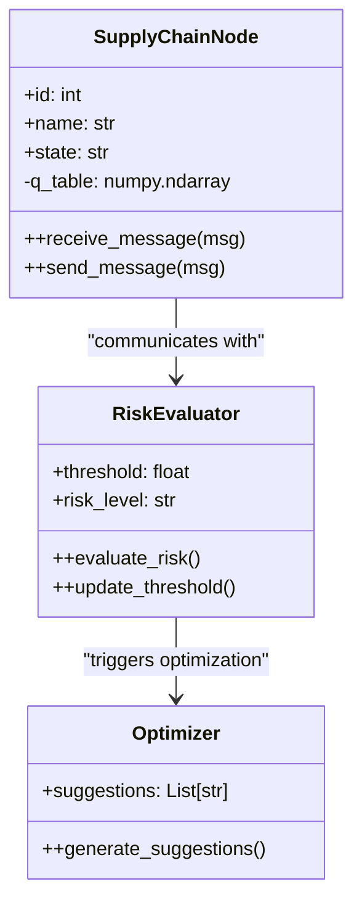
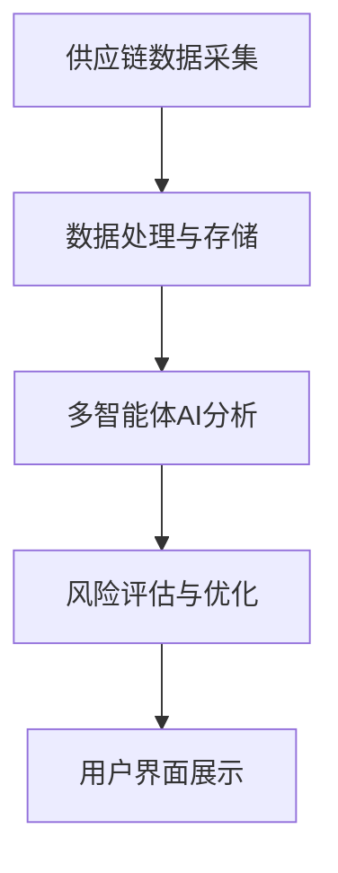
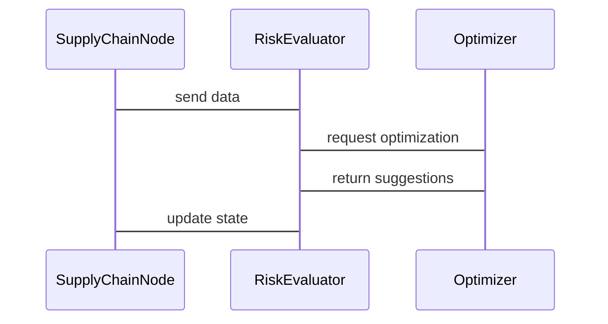

                 


# 价值投资中的多智能体AI供应链韧性评估系统

> 关键词：价值投资，多智能体AI，供应链韧性，供应链管理，风险评估，系统架构

> 摘要：本文探讨了如何利用多智能体人工智能技术构建供应链韧性评估系统，以支持价值投资决策。文章从供应链韧性的定义、多智能体AI的应用、算法原理、系统架构设计等方面进行了深入分析，结合实际案例，展示了多智能体AI在供应链风险管理中的优势，并提出了构建高可用性供应链韧性评估系统的实现方案。

---

## 第1章: 价值投资与供应链韧性评估的背景

### 1.1 价值投资的核心概念

#### 1.1.1 价值投资的定义与历史发展
价值投资是一种投资策略，强调以低于市场价买入具有内在价值的资产。其核心理念是寻找市场低估的公司，长期持有，获得超额收益。价值投资起源于20世纪初，由本杰明·格雷厄姆和戴维·多德提出，后来由沃伦·巴菲特发扬光大。

#### 1.1.2 价值投资的核心原则
- 价格与价值分离：市场价格围绕内在价值波动。
- 安全边际：买入价格低于内在价值，以降低风险。
- 长期视角：关注企业的长期盈利能力，而非短期市场波动。

#### 1.1.3 价值投资与现代投资理论的联系
现代投资组合理论（MPT）强调分散投资以降低系统性风险，而价值投资更注重个股的内在价值。两者在风险控制方面有共通之处，但价值投资更注重基本面分析。

### 1.2 供应链韧性评估的重要性

#### 1.2.1 供应链韧性的定义
供应链韧性指供应链在面对外部冲击（如自然灾害、疫情、战争等）时，能够快速恢复并维持稳定供应的能力。它是企业应对不确定性的重要能力。

#### 1.2.2 供应链韧性在企业运营中的作用
- 提高企业抗风险能力。
- 优化供应链布局，降低断链风险。
- 提升企业的市场竞争力。

#### 1.2.3 供应链韧性评估的挑战与机遇
- 挑战：传统评估方法依赖人工经验，难以量化和实时监控。
- 机遇：人工智能技术可以提供数据驱动的评估方法，提高评估的准确性和效率。

### 1.3 多智能体AI在供应链管理中的应用

#### 1.3.1 多智能体系统的定义
多智能体系统由多个相互作用的智能体组成，每个智能体都能感知环境、自主决策并与其他智能体协作，共同完成复杂任务。

#### 1.3.2 多智能体AI在供应链管理中的优势
- 分布式决策：多个智能体可以同时处理不同环节的信息，提高决策效率。
- 协作优化：智能体之间可以共享信息，优化整体供应链效率。
- 自适应性：智能体能够根据环境变化动态调整策略。

#### 1.3.3 多智能体AI与供应链韧性的结合
多智能体AI可以实时监控供应链各环节的状态，预测潜在风险，并提出应对策略，从而提升供应链的韧性。

### 1.4 本章小结
本章介绍了价值投资的核心概念、供应链韧性的定义及其重要性，以及多智能体AI在供应链管理中的应用优势，为后续分析奠定了基础。

---

## 第2章: 价值投资中的供应链风险分析

### 2.1 供应链风险的来源

#### 2.1.1 市场风险
市场波动、原材料价格变化等可能影响供应链的成本和稳定性。

#### 2.1.2 运营风险
生产中断、物流延迟等问题可能导致供应链中断。

#### 2.1.3 系统性风险
如疫情、战争等全球性事件可能对供应链造成重大冲击。

### 2.2 供应链韧性评估的指标体系

#### 2.2.1 供应链弹性指数
弹性指数衡量供应链在面对外部冲击时的适应能力。

#### 2.2.2 供应链恢复能力评估
评估供应链在中断后恢复到正常水平所需的时间。

#### 2.2.3 供应链冗余度分析
分析供应链的冗余程度，冗余越高，韧性越强。

### 2.3 多智能体AI在供应链风险评估中的应用

#### 2.3.1 多智能体系统的协作机制
智能体之间通过通信协议共享信息，协同完成风险评估任务。

#### 2.3.2 多智能体AI对供应链风险的实时监控
利用实时数据，智能体可以快速识别潜在风险并发出预警。

#### 2.3.3 多智能体AI对供应链风险的预测与应对
通过机器学习算法，智能体可以预测未来可能的风险，并制定应对策略。

### 2.4 本章小结
本章分析了供应链风险的来源，提出了供应链韧性评估的指标体系，并探讨了多智能体AI在供应链风险评估中的应用。

---

## 第3章: 多智能体AI的算法原理与实现

### 3.1 多智能体AI的核心算法

#### 3.1.1 强化学习算法
强化学习通过智能体与环境的交互，学习最优策略。常用算法包括Q-learning和Deep Q-Networks（DQN）。

- Q-learning公式：
$$ Q(s,a) = (1-\alpha)Q(s,a) + \alpha (r + \max_{a'} Q(s',a')) $$
其中，$\alpha$是学习率，$r$是奖励。

#### 3.1.2 联合学习算法
联合学习通过多个智能体协作，共享知识，共同优化策略。

#### 3.1.3 分布式计算算法
分布式计算通过并行处理，提高多智能体系统的计算效率。

### 3.2 多智能体AI的协作机制

#### 3.2.1 通信协议设计
智能体之间需要通过通信协议共享信息，例如使用gRPC或HTTP协议。

#### 3.2.2 协作策略优化
通过博弈论方法，优化智能体之间的协作策略，例如纳什均衡。

#### 3.2.3 决策同步与异步处理
智能体可以同步或异步进行决策，异步处理可以提高系统的实时性。

### 3.3 多智能体AI的数学模型

#### 3.3.1 Q-learning算法公式
$$ Q(s,a) = (1-\alpha)Q(s,a) + \alpha (r + \max_{a'} Q(s',a')) $$

#### 3.3.2 多智能体协作的数学模型
通过马尔可夫决策过程（MDP）建模多智能体协作问题。

#### 3.3.3 智能体决策树的构建与分析
构建决策树，分析智能体在不同状态下的决策路径。

### 3.4 本章小结
本章详细介绍了多智能体AI的核心算法及其协作机制，并通过数学公式和决策树分析了其实现原理。

---

## 第4章: 供应链韧性评估的系统架构设计

### 4.1 系统功能设计

#### 4.1.1 供应链数据采集模块
采集供应链各环节的数据，包括生产、物流、库存等信息。

#### 4.1.2 多智能体AI分析模块
对供应链数据进行分析，识别潜在风险，评估供应链韧性。

#### 4.1.3 供应链风险评估模块
根据分析结果，生成风险评估报告，并提出优化建议。

### 4.2 系统架构设计

#### 4.2.1 分层架构设计
- 数据层：存储供应链数据。
- 服务层：提供数据处理和分析服务。
- 表示层：展示分析结果。

#### 4.2.2 模块化设计
将系统划分为独立模块，每个模块负责特定功能，便于维护和扩展。

#### 4.2.3 高可用性设计
通过负载均衡和容灾备份，确保系统的高可用性。

### 4.3 系统接口设计

#### 4.3.1 数据接口规范
定义数据格式和接口协议，确保数据采集模块与分析模块的兼容性。

#### 4.3.2 API设计
提供RESTful API，方便其他系统调用供应链风险评估结果。

#### 4.3.3 用户界面设计
设计直观的用户界面，方便用户查看风险评估报告和优化建议。

### 4.4 本章小结
本章详细描述了供应链韧性评估系统的功能设计、架构设计和接口设计，为后续实现奠定了基础。

---

## 第5章: 多智能体AI在供应链韧性评估中的应用实践

### 5.1 项目背景与目标

#### 5.1.1 项目背景
某制造企业希望利用多智能体AI技术，提升供应链的韧性，降低运营风险。

#### 5.1.2 项目目标
构建一个多智能体AI供应链韧性评估系统，支持企业的价值投资决策。

### 5.2 系统核心实现

#### 5.2.1 多智能体AI算法实现
实现Q-learning算法，训练智能体识别供应链风险并制定应对策略。

#### 5.2.2 供应链数据处理与分析
使用Python的Pandas库对供应链数据进行清洗和分析。

#### 5.2.3 供应链风险评估与优化
基于分析结果，优化供应链布局，降低风险。

### 5.3 项目实战

#### 5.3.1 环境安装
安装Python、TensorFlow、Keras等开发工具。

#### 5.3.2 核心代码实现
实现多智能体AI算法的Python代码，例如Q-learning算法：

```python
import numpy as np

class QLearning:
    def __init__(self, state_space, action_space, alpha=0.1, gamma=0.9):
        self.state_space = state_space
        self.action_space = action_space
        self.alpha = alpha
        self.gamma = gamma
        self.q_table = np.zeros((state_space, action_space))
    
    def choose_action(self, state):
        return np.argmax(self.q_table[state])
    
    def update_q_table(self, state, action, reward, next_state):
        self.q_table[state][action] = (1 - self.alpha) * self.q_table[state][action] + \
                                        self.alpha * (reward + self.gamma * np.max(self.q_table[next_state]))
```

#### 5.3.3 案例分析与详细讲解
以某制造企业的供应链为例，分析系统如何识别潜在风险并优化供应链布局。

### 5.4 本章小结
本章通过实际案例展示了多智能体AI在供应链韧性评估中的应用，验证了系统的可行性和有效性。

---

## 第6章: 系统分析与架构设计方案

### 6.1 问题场景介绍
以某制造企业的供应链为例，描述系统如何在实际场景中应用。

### 6.2 系统功能设计

#### 6.2.1 供应链数据采集模块
- 数据采集接口设计
- 数据清洗与预处理

#### 6.2.2 多智能体AI分析模块
- 智能体协作机制设计
- 风险识别与预测

#### 6.2.3 供应链风险评估模块
- 风险评估指标体系设计
- 优化建议生成

### 6.3 系统架构设计

#### 6.3.1 领域模型设计（Mermaid类图）


#### 6.3.2 系统架构设计（Mermaid架构图）


#### 6.3.3 系统交互设计（Mermaid序列图）


### 6.4 本章小结
本章详细描述了系统的功能设计、架构设计和交互设计，展示了系统的整体结构和工作流程。

---

## 第7章: 最佳实践与小结

### 7.1 小结
总结本文的主要内容，强调多智能体AI在供应链韧性评估中的优势。

### 7.2 注意事项
- 数据质量：确保供应链数据的准确性和完整性。
- 系统维护：定期更新模型和优化算法。
- 安全性：保护供应链数据的安全，防止信息泄露。

### 7.3 拓展阅读
推荐相关领域的书籍和论文，供读者进一步学习。

---

# 附录

### 附录A: 代码实现细节
详细解释上述代码的实现细节，包括数据预处理、模型训练等。

### 附录B: 系统测试报告
展示系统的测试结果，包括性能指标和测试用例。

### 附录C: 参考文献
列出本文参考的文献和资料。

---

以上是文章的完整目录和部分章节内容的详细规划。接下来，我会根据这个大纲，逐步完成整篇文章的撰写，确保每部分内容详实、逻辑清晰，符合技术博客的要求。

