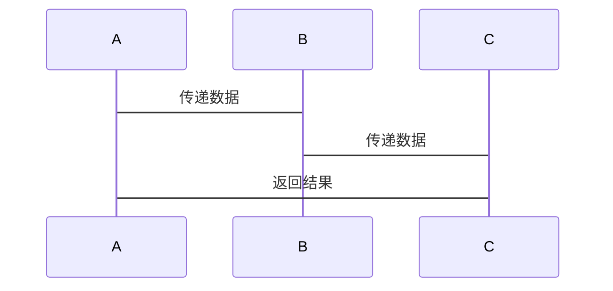

                 


# 《价值投资中的多智能体AI创新评估系统》

## 关键词：
价值投资、多智能体AI、创新评估、机器学习、投资策略、系统架构、数学模型

## 摘要：
本文探讨了如何利用多智能体人工智能技术构建创新的金融价值评估系统。通过结合价值投资的核心理念与多智能体AI的协同优势，提出了一种基于多智能体协同学习的创新性金融评估方法。该系统通过构建多智能体协同网络，实现对金融资产的深度分析与动态评估，从而为投资者提供更精准、更高效的决策支持。文章详细分析了系统的数学模型、算法原理、架构设计以及实际应用场景，为价值投资领域的人工智能创新提供了新的思路和方法。

---

# 第一部分: 价值投资中的多智能体AI创新评估系统概述

## 第1章: 背景介绍与问题背景

### 1.1 价值投资与创新评估的背景
#### 1.1.1 价值投资的基本概念
价值投资是一种以基本面分析为基础的投资策略，通过分析企业的财务状况、行业地位、竞争优势等因素，寻找被市场低估的投资标的。传统价值投资依赖于分析师的主观判断和经验，存在效率低、人为误差大等问题。

#### 1.1.2 创新评估在投资中的重要性
随着金融市场的复杂化和数据化的趋势，传统的价值评估方法逐渐暴露出效率低下、信息处理能力有限等缺陷。创新评估方法，尤其是基于人工智能的评估方法，能够显著提高评估的效率和准确性。

#### 1.1.3 多智能体AI在投资评估中的应用潜力
多智能体AI通过多个智能体的协同工作，能够从多个维度、多个角度对金融资产进行分析和评估。这种分布式、协作式的评估方式，能够更好地捕捉市场的动态变化，提高评估的准确性和全面性。

### 1.2 问题描述与目标
#### 1.2.1 当前价值投资中的主要问题
- 数据量大、维度多，传统方法难以高效处理。
- 市场动态变化快，需要实时或高频的评估能力。
- 传统评估方法依赖人工经验，存在主观性和不一致性。

#### 1.2.2 引入多智能体AI的目标
- 提高金融资产评估的效率和准确性。
- 实现多维度、多角度的深度分析。
- 提供实时或高频的动态评估能力。

#### 1.2.3 系统的边界与外延
系统主要针对金融资产的价值评估，边界包括：
- 数据来源：企业财务数据、市场数据、行业数据等。
- 评估范围：股票、基金、债券等金融资产。
- 输出结果：价值评分、风险评估、投资建议等。

系统外延包括：
- 与其他金融系统的集成，如交易系统、投资组合管理系统等。
- 对市场的实时监控与预警。

### 1.3 核心概念与系统组成
#### 1.3.1 多智能体AI的基本概念
多智能体AI是指由多个具有独立决策能力的智能体组成的系统，这些智能体通过协同工作，共同完成复杂任务。每个智能体都有自己的目标、知识和行为规则。

#### 1.3.2 价值评估的核心要素
价值评估的核心要素包括：
- 财务指标：如市盈率、市净率、ROE等。
- 市场趋势：如行业趋势、宏观经济指标等。
- 风险因素：如行业风险、公司风险等。

#### 1.3.3 系统组成与功能模块
系统由以下几个功能模块组成：
- 数据采集与预处理模块。
- 多智能体协同评估模块。
- 评估结果输出与分析模块。
- 系统监控与优化模块。

---

## 第2章: 多智能体AI与价值投资的核心概念

### 2.1 多智能体AI的原理与特点
#### 2.1.1 多智能体AI的定义
多智能体AI是指由多个智能体组成的系统，每个智能体都具有一定的自主性、反应性和协作能力。

#### 2.1.2 多智能体AI的核心属性
- 分布式计算：任务分解到多个智能体。
- 协作性：智能体之间通过协作完成任务。
- 自适应性：能够根据环境变化调整策略。

#### 2.1.3 多智能体AI与传统AI的区别
- 多智能体AI强调协作和分布，而传统AI强调集中和单一。
- 多智能体AI能够处理复杂任务，而传统AI适合简单任务。

### 2.2 价值投资中的关键因素
#### 2.2.1 财务指标分析
财务指标是价值投资的重要依据，包括盈利能力、成长能力、偿债能力等。

#### 2.2.2 市场趋势预测
市场趋势预测是价值投资的重要组成部分，包括宏观经济指标、行业趋势等。

#### 2.2.3 风险评估与管理
风险评估是价值投资不可忽视的一部分，包括市场风险、流动性风险等。

### 2.3 多智能体AI与价值投资的结合
#### 2.3.1 多智能体AI在价值评估中的作用
- 多智能体AI能够从多个维度对金融资产进行分析。
- 多智能体AI能够实时跟踪市场变化，提供动态评估。

#### 2.3.2 价值投资中的多智能体协同机制
- 多智能体协同机制包括任务分配、信息共享、决策协同等。
- 协同机制能够提高评估的准确性和效率。

#### 2.3.3 系统的创新性与实用性
- 系统创新性体现在多智能体协同、动态评估等方面。
- 系统实用性体现在能够提高投资效率、降低投资风险等方面。

---

## 第3章: 多智能体AI创新评估系统的数学模型与算法原理

### 3.1 系统的数学模型
#### 3.1.1 价值评估函数的构建
价值评估函数是系统的核心，由多个指标构成，如：
$$ V = \alpha_1 \cdot F + \alpha_2 \cdot M + \alpha_3 \cdot R $$
其中，\( F \) 表示财务指标，\( M \) 表示市场指标，\( R \) 表示风险指标，\( \alpha \) 表示权重。

#### 3.1.2 多智能体协同的数学表达
多智能体协同可以通过以下公式表示：
$$ S_i = \sum_{j=1}^{n} w_{ij} \cdot A_j $$
其中，\( S_i \) 表示智能体 \( i \) 的评估结果，\( A_j \) 表示其他智能体的评估结果，\( w_{ij} \) 表示权重。

#### 3.1.3 系统优化的目标函数
目标函数为：
$$ \min_{\theta} \sum_{i=1}^{m} (y_i - f_\theta(x_i))^2 $$
其中，\( \theta \) 表示模型参数，\( x_i \) 表示输入数据，\( y_i \) 表示目标输出。

### 3.2 算法原理与流程
#### 3.2.1 多智能体协同学习的算法流程
1. 初始化：设置智能体的初始参数。
2. 数据采集：采集金融资产的相关数据。
3. 评估：每个智能体对资产进行评估。
4. 协作：智能体之间共享信息，协同调整评估结果。
5. 输出：输出最终的评估结果。

#### 3.2.2 系统的训练与推理过程
训练过程包括：
- 数据预处理。
- 模型训练。
- 模型优化。

推理过程包括：
- 数据输入。
- 智能体协同评估。
- 结果输出。

#### 3.2.3 算法的收敛性与稳定性分析
- 收敛性：算法需要在有限步内收敛到最优解。
- 稳定性：算法在面对噪声和不确定性时需要保持稳定。

### 3.3 算法实现与代码示例
#### 3.3.1 环境安装与配置
需要安装以下库：
- Python 3.8+
- TensorFlow 2.0+
- scikit-learn
- Mermaid

#### 3.3.2 系统核心代码实现
```python
import tensorflow as tf
from sklearn.metrics import accuracy_score
import numpy as np

class Agent:
    def __init__(self, input_dim, output_dim):
        self.model = self.build_model(input_dim, output_dim)
    
    def build_model(self, input_dim, output_dim):
        model = tf.keras.Sequential([
            tf.keras.layers.Dense(64, activation='relu', input_dim=input_dim),
            tf.keras.layers.Dense(output_dim, activation='linear')
        ])
        model.compile(optimizer='adam', loss='mse')
        return model
    
    def train(self, x, y):
        self.model.fit(x, y, epochs=100, batch_size=32)
    
    def predict(self, x):
        return self.model.predict(x)
```

#### 3.3.3 代码的功能解读与分析
- `Agent` 类表示一个智能体，包含模型构建、训练和预测方法。
- 模型为一个简单的神经网络，输入为金融资产的特征，输出为评估结果。
- 训练过程采用均方误差作为损失函数，Adam优化器。

---

## 第4章: 系统分析与架构设计方案

### 4.1 系统功能设计
#### 4.1.1 系统的功能模块划分
- 数据采集模块：采集金融资产的财务数据、市场数据等。
- 多智能体评估模块：多个智能体协同完成资产评估。
- 结果输出模块：输出评估结果，包括价值评分、投资建议等。

#### 4.1.2 每个模块的功能描述
- 数据采集模块：从数据库或API获取数据。
- 多智能体评估模块：每个智能体负责不同的评估任务，协同完成最终评估。
- 结果输出模块：将评估结果以可视化或文本形式输出。

#### 4.1.3 系统的输入输出设计
输入包括：
- 金融资产的财务数据。
- 市场数据。

输出包括：
- 价值评分。
- 投资建议。

### 4.2 系统架构设计
#### 4.2.1 系统的分层架构
系统采用分层架构，包括：
- 数据层：数据存储和管理。
- 智能体层：多个智能体协同工作。
- 应用层：用户交互和结果展示。

#### 4.2.2 模块之间的交互关系
智能体之间通过共享层进行信息交互，数据层为整个系统提供数据支持。

#### 4.2.3 系统的可扩展性设计
系统支持新增智能体和数据源的扩展，能够适应不同的应用场景。

### 4.3 系统接口设计
#### 4.3.1 系统接口设计
系统提供以下接口：
- 数据接口：用于数据的输入和输出。
- 智能体接口：用于智能体之间的通信和协作。

#### 4.3.2 系统交互的Mermaid序列图


---

## 第5章: 项目实战

### 5.1 环境安装与配置
需要安装以下环境：
- Python 3.8+
- TensorFlow 2.0+
- scikit-learn
- Mermaid

### 5.2 系统核心实现
#### 5.2.1 核心代码实现
```python
class MultiAgentSystem:
    def __init__(self, num_agents):
        self.agents = [Agent(input_dim, output_dim) for _ in range(num_agents)]
    
    def train(self, x, y):
        for agent in self.agents:
            agent.train(x, y)
    
    def predict(self, x):
        results = []
        for agent in self.agents:
            results.append(agent.predict(x))
        return np.mean(results, axis=0)
```

#### 5.2.2 代码的功能解读与分析
- `MultiAgentSystem` 类管理多个智能体，每个智能体负责不同的评估任务。
- 训练过程中，每个智能体都对数据进行训练。
- 预测过程中，多个智能体协同完成评估任务，最终结果为各智能体输出的平均值。

### 5.3 实际案例分析
#### 5.3.1 案例背景
以某股票为例，分析其价值评估过程。

#### 5.3.2 数据分析与模型训练
1. 数据采集：获取该股票的财务数据和市场数据。
2. 数据预处理：清洗数据，提取特征。
3. 模型训练：训练多智能体系统。

#### 5.3.3 模型评估与结果分析
- 训练好的系统能够对股票进行价值评估，输出价值评分和投资建议。

### 5.4 项目小结
通过实战，验证了多智能体AI在价值投资中的应用潜力，系统能够高效、准确地完成价值评估任务。

---

## 第6章: 最佳实践与小结

### 6.1 小结
本文详细介绍了多智能体AI在价值投资中的创新应用，提出了基于多智能体协同学习的金融评估系统。系统通过多个智能体的协同工作，能够从多个维度、多个角度对金融资产进行深度分析和动态评估。

### 6.2 注意事项
- 数据质量对系统性能有重要影响，需要确保数据的准确性和完整性。
- 系统的可解释性需要进一步提高，以便投资者更好地理解和信任系统。

### 6.3 拓展阅读
- 多智能体AI在金融领域的其他应用。
- 基于深度学习的金融模型研究。

---

## 结语
通过本文的探讨，我们可以看到，多智能体AI在价值投资中的应用前景广阔，能够显著提升金融评估的效率和准确性。未来，随着人工智能技术的不断发展，多智能体AI在金融领域的应用将更加深入和多样化。

