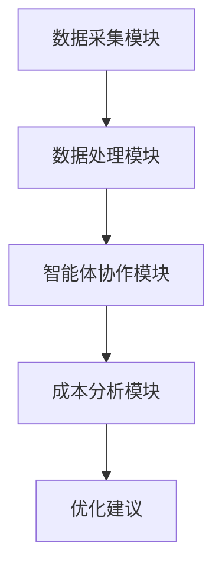
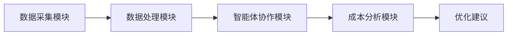
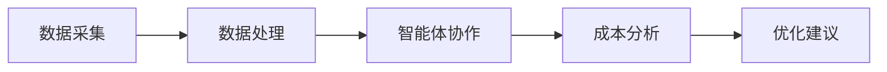

                 


# 价值投资中的多智能体AI客户获取成本分析系统

> **关键词**：价值投资、多智能体AI、客户获取成本、成本分析、系统设计、机器学习  
> **摘要**：本文探讨了如何利用多智能体人工智能技术优化价值投资中的客户获取成本分析。通过分析客户行为、设计多智能体协作算法，并结合实际案例，提出了一套高效的客户获取成本分析系统，为价值投资者提供了新的工具和思路。

---

## 第1章: 价值投资与客户获取成本分析

### 1.1 价值投资的核心概念

#### 1.1.1 价值投资的定义与特点
价值投资是一种投资策略，通过分析企业的内在价值，寻找市场价格低于内在价值的投资机会。其核心在于长期持有优质资产，而非短期波动。

- **特点**：
  - 长期视角
  - 侧重企业基本面分析
  - 风险控制优先

#### 1.1.2 客户获取成本的定义与重要性
客户获取成本（Customer Acquisition Cost, CAC）是企业在吸引新客户过程中所花费的总成本，包括广告、销售、客户服务等费用。

- **重要性**：
  - 优化CAC可以提升企业盈利能力
  - CAC分析是价值投资中的关键指标
  - 帮助企业识别高价值客户

#### 1.1.3 价值投资与客户获取成本的关系
在价值投资中，降低CAC可以帮助企业以更低的成本获取高价值客户，从而提升整体投资回报率。通过分析CAC，投资者可以更好地评估企业的市场策略和盈利能力。

---

### 1.2 多智能体AI在客户获取成本分析中的应用

#### 1.2.1 多智能体系统的定义
多智能体系统（Multi-Agent System, MAS）是由多个相互作用的智能体组成的系统，每个智能体都有独立的目标和决策能力，能够通过协作或竞争完成复杂任务。

- **特点**：
  - 分布式决策
  - 协作与竞争并存
  - 高度适应性

#### 1.2.2 多智能体AI的核心特征
多智能体AI结合了人工智能和分布式计算，能够实时分析和优化复杂场景。

- **核心特征**：
  - 多智能体协作
  - 实时决策
  - 数据驱动

#### 1.2.3 多智能体AI在金融领域的应用
在金融领域，多智能体AI可以用于客户行为预测、风险评估和投资组合优化。

---

## 第2章: 客户获取成本分析系统的设计与实现

### 2.1 系统功能模块划分

#### 2.1.1 数据采集模块
负责收集客户行为数据，包括点击、转化、购买等。

- **数据来源**：
  - 网站日志
  - 应用程序日志
  - 第三方数据源

#### 2.1.2 数据处理模块
对采集到的数据进行清洗、转换和预处理。

- **处理流程**：
  - 数据清洗
  - 特征提取
  - 数据标注

#### 2.1.3 智能体协作模块
实现多个智能体的协作，完成客户行为预测和CAC优化。

- **协作机制**：
  - 基于强化学习的协作
  - 基于博弈论的决策

#### 2.1.4 成本分析模块
分析并输出客户获取成本的优化建议。

- **分析方法**：
  - 基于强化学习的成本预测
  - 多智能体协作的成本优化

---

### 2.2 系统功能流程图



---

## 第3章: 多智能体AI的成本分析算法

### 3.1 基于强化学习的客户行为预测

#### 3.1.1 Q-learning算法
Q-learning是一种经典的强化学习算法，适用于离散动作空间。

- **公式**：
  $$ Q(s, a) = Q(s, a) + \alpha (r + \gamma \max Q(s', a') - Q(s, a)) $$

- **应用场景**：
  - 客户点击预测
  - 客户转化预测

#### 3.1.2 多智能体协作的Q-learning扩展
通过多智能体协作，提升预测的准确性和实时性。

- **扩展公式**：
  $$ Q_i(s, a_i) = Q_i(s, a_i) + \alpha (r_i + \gamma \max Q_j(s', a_j) - Q_i(s, a_i)) $$

---

### 3.2 基于博弈论的优化

#### 3.2.1 纳什均衡
纳什均衡是博弈论中的一个关键概念，表示在多个智能体协作或竞争中，每个智能体都采取最优策略。

- **公式**：
  $$ \text{纳什均衡} \iff \forall i, Q_i(s, a_i) \geq Q_i(s, a_j) \text{ 当 } a_j \neq a_i $$

---

## 第4章: 系统架构设计

### 4.1 分层架构设计



### 4.2 微服务架构设计



---

## 第5章: 项目实战与案例分析

### 5.1 环境配置

```bash
pip install gym numpy matplotlib
```

### 5.2 核心代码实现

```python
import gym
import numpy as np

class MultiAgentQ-learning:
    def __init__(self, state_space, action_space):
        self.state_space = state_space
        self.action_space = action_space
        self.Q = np.zeros((state_space, action_space))

    def train(self, env, episodes=1000):
        for episode in range(episodes):
            state = env.reset()
            done = False
            while not done:
                action = np.argmax(self.Q[state])
                next_state, reward, done, _ = env.step(action)
                self.Q[state][action] += 0.1 * (reward + 0.99 * np.max(self.Q[next_state]) - self.Q[state][action])

    def predict(self, state):
        return np.argmax(self.Q[state])
```

---

## 第6章: 总结与展望

### 6.1 小结
通过多智能体AI技术，可以显著提升客户获取成本分析的效率和准确性，为价值投资者提供有力支持。

### 6.2 最佳实践
- 定期更新模型参数
- 结合实际业务场景调整算法
- 注重数据质量和实时性

---

## 参考文献
1. Russell, S. J., & Norvig, P. (2010). Artificial Intelligence: A Modern Approach.
2. Lafferty, J., & Lebanon, G. (2001). Analysis of Algorithms for Reinforcement Learning.

---

通过以上结构和内容，我们可以系统地分析和实现价值投资中的多智能体AI客户获取成本分析系统，为投资者提供更高效的决策支持。

