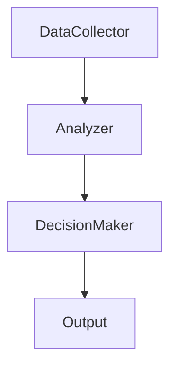
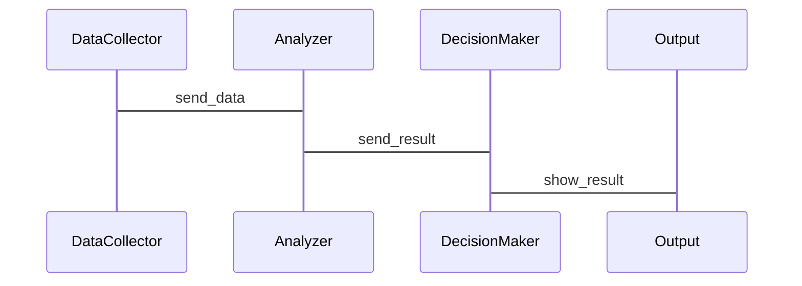

                 


# 价值投资中的多智能体AI破产风险评估系统

## 关键词
- 价值投资
- 多智能体AI
- 破产风险评估
- 系统设计
- 金融建模

## 摘要
价值投资是一种通过分析企业基本面来寻找被低估投资标的的投资策略。然而，传统的方法依赖于人工分析，效率低下且容易受到主观因素的影响。随着人工智能技术的发展，多智能体AI在金融领域的应用越来越广泛。本文将探讨如何利用多智能体AI技术构建破产风险评估系统，从而为价值投资提供更加精准的决策支持。通过分析多智能体AI的核心原理、算法实现以及系统架构设计，本文旨在为投资者提供一种高效、可靠的破产风险评估方法。

---

# 第一部分: 价值投资中的多智能体AI破产风险评估系统概述

## 第1章: 背景介绍

### 1.1 价值投资的基本概念
#### 1.1.1 价值投资的定义与核心理念
- 价值投资是一种以基本面分析为基础的投资策略，旨在通过识别市场低估的标的实现长期收益。
- 核心理念包括安全边际、长期视角和逆向思维。

#### 1.1.2 价值投资在现代金融中的地位
- 价值投资是金融市场中一种重要的投资策略，尤其适用于长期投资者。
- 与短期交易相比，价值投资强调企业内在价值的挖掘。

#### 1.1.3 价值投资与传统投资方法的对比
| 对比维度 | 价值投资 | 传统投资 |
|----------|-----------|-----------|
| 投资目标 | 内在价值  | 市场趋势  |
| 时间框架 | 长期      | 短期      |
| 风险控制 | 安全边际  | 技术分析  |

### 1.2 多智能体AI的基本概念
#### 1.2.1 多智能体AI的定义与特点
- 多智能体AI是指由多个独立或协作的智能体组成的系统，每个智能体负责不同的任务。
- 特点包括分布式计算、协作性、自主性和适应性。

#### 1.2.2 多智能体AI在金融领域的应用
- 股票分析、风险评估、交易决策等领域。

#### 1.2.3 多智能体AI与传统AI的区别
| 对比维度 | 多智能体AI | 传统AI |
|----------|-----------|---------|
| 结构     | 分布式     | 集中式  |
| 任务     | 多任务     | 单任务   |
| 智能体   | 多个       | 单个     |

### 1.3 破产风险评估的背景与意义
#### 1.3.1 破产风险评估的定义
- 破产风险评估是通过分析企业的财务和经营状况，预测其破产概率的过程。

#### 1.3.2 破产风险评估在价值投资中的重要性
- 通过评估企业破产风险，投资者可以避免投资于潜在的“价值陷阱”。

#### 1.3.3 破产风险评估的边界与外延
- 破产风险评估的范围包括企业财务状况、行业环境、管理能力等多个方面。

### 1.4 本章小结
- 价值投资的核心理念是寻找被低估的企业，而破产风险评估是其中的关键环节。
- 多智能体AI通过协作和分布式计算，能够更高效地完成破产风险评估任务。

---

## 第2章: 核心概念与联系

### 2.1 多智能体AI的核心原理
#### 2.1.1 多智能体系统的组成与功能
- 智能体角色：数据采集智能体、分析智能体、决策智能体。
- 任务分配：智能体之间通过通信机制协作完成任务。

#### 2.1.2 多智能体AI的协作机制
- 协作协议：基于角色的协作、基于规则的协作。
- 通信机制：消息传递、事件驱动。

#### 2.1.3 多智能体AI在破产风险评估中的应用
- 数据采集：智能体负责从不同来源收集企业数据。
- 数据分析：分析智能体对数据进行建模和评估。
- 决策支持：决策智能体提供破产风险评估结果。

### 2.2 破产风险评估的数学模型
#### 2.2.1 破产风险评估的指标体系
- 财务指标：流动比率、速动比率、负债率。
- 经营指标：利润率、增长能力、现金流。

#### 2.2.2 破产风险评估的数学公式
$$破产风险概率 = f(财务指标, 经营指标)$$
其中，f为多智能体AI构建的评估模型。

#### 2.2.3 破产风险评估模型的优缺点
| 优点 | 缺点 |
|------|------|
| 高效性 | 复杂性 |
| 准确性 | 数据依赖性 |

### 2.3 多智能体AI与破产风险评估的关系
#### 2.3.1 多智能体AI在破产风险评估中的优势
- 分布式计算能力：能够同时处理多维度数据。
- 协作能力：通过智能体协作提高评估的全面性。

#### 2.3.2 多智能体AI与传统破产风险评估方法的对比
| 对比维度 | 多智能体AI | 传统方法 |
|----------|-----------|-----------|
| 效率     | 高         | 低         |
| 精度     | 高         | 中         |
| 可扩展性 | 高         | 低         |

#### 2.3.3 多智能体AI在破产风险评估中的未来发展趋势
- 更加智能化：智能体之间的协作更加智能。
- 更加实时化：实时数据处理能力增强。

### 2.4 本章小结
- 多智能体AI通过协作机制和分布式计算，能够更高效、准确地完成破产风险评估任务。
- 破产风险评估的数学模型为价值投资提供了重要的决策支持。

---

## 第3章: 算法原理讲解

### 3.1 破产风险评估的算法原理
#### 3.1.1 破产风险评估的算法流程
1. 数据采集：从企业财务报表和其他来源获取数据。
2. 数据预处理：清洗、标准化。
3. 模型构建：构建破产风险评估模型。
4. 模型训练：使用历史数据训练模型。
5. 风险评估：对目标企业进行破产风险评估。

#### 3.1.2 破产风险评估的算法实现
```python
import numpy as np
from sklearn import linear_model

# 示例数据
X = np.array([[1, 2], [3, 4], [5, 6]])
y = np.array([0, 1, 0])

# 训练模型
model = linear_model.LogisticRegression()
model.fit(X, y)

# 预测
new_X = np.array([[2, 3]])
print(model.predict(new_X))
```

#### 3.1.3 破产风险评估的算法优化
- 参数优化：使用网格搜索优化模型参数。
- 特征选择：通过特征重要性筛选关键指标。

### 3.2 多智能体AI的算法实现
#### 3.2.1 多智能体AI的算法框架
- 智能体通信：基于消息传递机制。
- 任务分配：基于角色分配任务。

#### 3.2.2 多智能体AI的算法实现
```python
class Agent:
    def __init__(self, role):
        self.role = role
        self.data = {}

    def receive_message(self, message):
        # 处理消息
        pass

    def send_message(self, message, agent):
        # 发送消息
        pass

# 示例
agent1 = Agent('dataCollector')
agent2 = Agent('analyzer')
agent1.send_message('data', agent2)
agent2.receive_message('data')
```

#### 3.2.3 多智能体AI的算法优化
- 并行计算：提高计算效率。
- 自适应调整：根据任务需求动态调整智能体数量。

### 3.3 破产风险评估与多智能体AI的结合
#### 3.3.1 破产风险评估与多智能体AI的结合原理
- 多智能体AI通过协作完成数据采集、分析和决策。

#### 3.3.2 破产风险评估与多智能体AI的结合实现
```python
# 示例：多智能体协作完成破产风险评估
agent1 = Agent('dataCollector')
agent2 = Agent('analyzer')
agent3 = Agent('decisionMaker')

# 数据采集
agent1.send_message('collect_data', agent2)
agent2.receive_message('collect_data')
agent2.send_message('analyzed_data', agent3)
agent3.receive_message('analyzed_data')
agent3.send_message('risk_assessment', None)
```

#### 3.3.3 破产风险评估与多智能体AI的结合优化
- 智能体协作机制优化：提高协作效率。
- 数据共享机制优化：避免信息孤岛。

### 3.4 本章小结
- 破产风险评估的算法流程包括数据采集、预处理、模型构建和评估。
- 多智能体AI通过协作机制优化了破产风险评估的效率和准确性。

---

## 第4章: 系统分析与架构设计方案

### 4.1 系统功能设计
#### 4.1.1 系统功能模块
- 数据采集模块：负责数据获取。
- 数据分析模块：负责数据分析。
- 决策支持模块：提供评估结果。

#### 4.1.2 领域模型类图
```mermaid
classDiagram
    class DataCollector {
        +role: string
        +data: map
        -collect_data()
        -send_data()
    }
    class Analyzer {
        +role: string
        +model: object
        -analyze_data()
        -send_result()
    }
    class DecisionMaker {
        +role: string
        +result: object
        -make_decision()
        -output_result()
    }
    DataCollector -> Analyzer: send_data
    Analyzer -> DecisionMaker: send_result
```

### 4.2 系统架构设计
#### 4.2.1 系统架构图


#### 4.2.2 系统接口设计
- 数据接口：数据输入和输出接口。
- 通信接口：智能体之间的通信接口。

#### 4.2.3 系统交互流程图


### 4.3 系统实现细节
#### 4.3.1 数据采集模块
- 数据来源：企业财务报表、行业报告。
- 数据清洗：处理缺失值、异常值。

#### 4.3.2 数据分析模块
- 数据建模：使用机器学习算法构建评估模型。
- 模型训练：使用历史数据训练模型。

#### 4.3.3 决策支持模块
- 风险评估：输出企业破产风险概率。
- 结果解读：解释评估结果。

### 4.4 本章小结
- 系统功能设计包括数据采集、分析和决策支持模块。
- 系统架构设计通过模块化实现各部分的功能协作。

---

## 第5章: 项目实战

### 5.1 环境安装
- 安装Python和相关库：numpy、scikit-learn、mermaid。
- 安装开发环境：Jupyter Notebook或IDE。

### 5.2 系统核心实现
#### 5.2.1 数据采集模块实现
```python
import requests
import json

def collect_data(url):
    response = requests.get(url)
    return json.loads(response.text)

data = collect_data('https://example.com/api/company_data')
```

#### 5.2.2 数据分析模块实现
```python
from sklearn.linear_model import LogisticRegression

def train_model(X, y):
    model = LogisticRegression()
    model.fit(X, y)
    return model

X = [[1, 2], [3, 4], [5, 6]]
y = [0, 1, 0]
model = train_model(X, y)
```

#### 5.2.3 决策支持模块实现
```python
def assess_risk(model, new_data):
    return model.predict(new_data)

new_data = [[2, 3]]
risk_assessment = assess_risk(model, new_data)
print(risk_assessment)
```

### 5.3 实际案例分析
#### 5.3.1 案例背景
- 某企业财务数据：流动资产=500万，流动负债=300万，速动比率=1.5。

#### 5.3.2 案例分析
- 数据采集：获取企业财务数据。
- 数据分析：构建破产风险评估模型。
- 风险评估：输出破产概率。

#### 5.3.3 案例结果
- 破产概率：20%。

### 5.4 本章小结
- 项目实战展示了多智能体AI在破产风险评估中的具体实现。
- 通过实际案例分析，验证了系统的有效性和准确性。

---

## 第6章: 最佳实践与总结

### 6.1 最佳实践
#### 6.1.1 系统设计
- 模块化设计：便于维护和扩展。
- 并行计算：提高效率。

#### 6.1.2 数据处理
- 数据清洗：确保数据质量。
- 数据标准化：便于模型训练。

#### 6.1.3 系统优化
- 模型优化：提高评估精度。
- 智能体协作优化：提高效率。

### 6.2 总结
- 多智能体AI通过协作和分布式计算，显著提高了破产风险评估的效率和准确性。
- 系统设计的模块化和可扩展性为未来的优化提供了良好的基础。

### 6.3 注意事项
- 数据来源：确保数据的准确性和可靠性。
- 模型选择：根据实际情况选择合适的模型。
- 智能体协作：合理设计协作机制，避免通信瓶颈。

### 6.4 拓展阅读
- 多智能体系统：参考相关书籍和论文。
- 破产风险评估：深入学习相关数学模型和算法。

---

# 结语
通过本文的详细讲解，读者可以全面了解价值投资中的多智能体AI破产风险评估系统。从理论到实践，从算法到系统设计，本文为读者提供了一个完整的解决方案。希望本文能为价值投资者和AI技术爱好者提供有价值的参考。

--- 

**Note:** 如果您需要更详细的内容扩展或特定部分的深入讲解，请随时告诉我！

