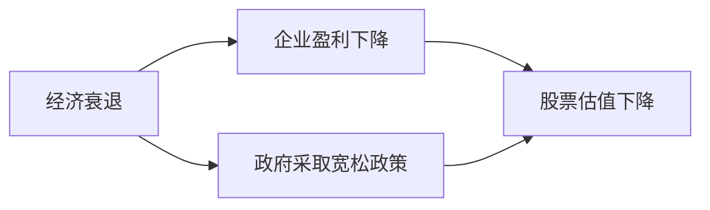

                 


```markdown
# 价值投资中的宏观经济因素：大局观的重要性

## 关键词
价值投资, 宏观经济因素, 经济周期, 资产定价, 投资策略

## 摘要
本文系统地探讨了宏观经济因素在价值投资中的重要性，分析了主要宏观经济指标如GDP、利率、通货膨胀等对投资决策的影响。通过构建宏观经济分析模型，本文提出了在不同经济周期下的投资策略，并结合实际案例分析，帮助投资者更好地理解如何将宏观经济因素纳入投资决策过程，以实现长期稳健的收益。

---

## 第一部分: 价值投资中的宏观经济因素概述

### 第1章: 宏观经济因素与价值投资基础

#### 1.1 宏观经济因素的定义与分类
- **1.1.1 宏观经济的基本概念**
  - 宏观经济是研究整体经济系统的行为，包括GDP、失业率、通货膨胀率等核心指标。
  - 宏观经济因素对市场整体走势和资产价格有重要影响。

- **1.1.2 宏观经济因素在价值投资中的作用**
  - 宏观经济因素帮助投资者识别市场的整体风险和机会。
  - 通过分析宏观经济环境，投资者可以更好地判断资产的内在价值。

- **1.1.3 宏观经济分析的核心要素**
  - 经济周期：衰退、复苏、过热、滞胀。
  - 货币政策：利率、货币供应量。
  - 财政政策：政府支出、税收。
  - 通货膨胀：对资产价格的影响。

#### 1.2 价值投资的基本原理
- **1.2.1 价值投资的定义与特点**
  - 价值投资是一种长期投资策略，强调购买被市场低估的资产。
  - 核心理念是寻找具有持续竞争优势和良好治理的企业。

- **1.2.2 价值投资的核心理念**
  - 资产的内在价值是其未来现金流的现值。
  - 宏观经济因素影响企业的盈利能力和资产的流动性。

- **1.2.3 宏观经济与价值投资的关联性**
  - 宏观经济环境决定了市场的整体估值水平。
  - 宏观经济因素影响企业的经营环境和盈利能力。

#### 1.3 宏观经济因素对投资决策的影响
- **1.3.1 宏观经济环境对市场的影响**
  - 经济衰退可能导致市场估值下降，提供投资机会。
  - 经济过热可能导致资产泡沫，增加投资风险。

- **1.3.2 宏观经济指标与资产价格的关系**
  - 利率上升可能导致债券价格上涨，股票价格下跌。
  - 通货膨胀可能导致股票和房地产价格上涨。

- **1.3.3 宏观经济风险与投资组合的构建**
  - 通过分散投资可以降低宏观经济波动带来的风险。
  - 宏观经济分析帮助投资者选择具有抗周期性的行业。

---

## 第二部分: 主要宏观经济指标与价值投资

### 第2章: GDP与经济周期

#### 2.1 GDP的定义与计算方法
- GDP是衡量一个国家或地区经济活动的重要指标。
- GDP = 消费 + 投资 + 政府支出 + 净出口。

#### 2.2 经济周期的阶段划分
- 经济周期分为衰退、复苏、过热和滞胀四个阶段。
- 在衰退阶段，企业盈利能力下降，股票估值可能被低估。

#### 2.3 GDP对投资决策的影响
- 在经济复苏阶段，企业盈利改善，股票价格上涨。
- 在经济过热阶段，央行可能加息，导致债券价格下跌。

### 第3章: 利率与货币政策

#### 3.1 利率的定义与分类
- 利率是资金的时间价值，分为短期和长期利率。
- 利率影响借贷成本和企业的融资成本。

#### 3.2 货币政策对市场的影响
- 央行通过调整利率和货币供应量影响市场流动性。
- 利率下降通常会导致债券价格上涨，股票估值上升。

#### 3.3 利率变化对股票估值的影响
- 利率下降通常会降低折现率，提高股票估值。
- 利率上升会增加企业的融资成本，可能抑制利润增长。

### 第4章: 通货膨胀与通货紧缩

#### 4.1 通货膨胀的定义与衡量指标
- 通货膨胀是指物价水平持续上涨。
- 衡量指标包括CPI和PPI。

#### 4.2 通货紧缩的定义与特征
- 通货紧缩是指物价水平持续下降。
- 特征包括需求不足和企业盈利能力下降。

#### 4.3 通货膨胀对资产价格的影响
- 通货膨胀可能导致股票和房地产价格上涨。
- 通货紧缩可能导致资产价格下降，企业盈利能力减弱。

---

## 第三部分: 宏观经济分析方法与工具

### 第5章: 宏观经济分析的核心方法

#### 5.1 宏观经济模型的构建
- 宏观经济模型包括IS-LM模型和AD-AS模型。
- IS-LM模型描述了利率和产出之间的关系。

#### 5.2 数据分析方法
- 使用时间序列分析对宏观经济指标进行预测。
- 通过回归分析研究宏观经济指标之间的关系。

#### 5.3 宏观经济预测的常见工具
- 使用计量经济学模型进行预测。
- 结合专家意见和市场情绪进行综合判断。

### 第6章: 宏观经济指标的量化分析

#### 6.1 指标间的相关性分析
- 使用相关系数衡量宏观经济指标之间的关系。
- 正相关：GDP增长与企业盈利增长。
- 负相关：利率上升与债券价格上涨。

#### 6.2 时间序列分析方法
- 使用ARIMA模型对宏观经济指标进行预测。
- 通过分解时间序列识别趋势和周期性变化。

#### 6.3 统计模型的应用
- 使用多元回归模型分析多个宏观经济指标对资产价格的影响。
- 通过主成分分析降低数据维度。

### 第7章: 宏观经济数据的获取与处理

#### 7.1 数据来源与获取方法
- 数据来源包括政府统计机构和金融数据提供商。
- 使用API接口获取实时宏观经济数据。

#### 7.2 数据清洗与预处理
- 去除异常值和填补缺失值。
- 标准化数据以便进行比较分析。

#### 7.3 数据可视化工具的使用
- 使用Matplotlib和Seaborn绘制经济指标的趋势图。
- 使用Tableau进行交互式数据可视化。

---

## 第四部分: 经济周期与投资策略

### 第8章: 不同经济周期下的投资策略

#### 8.1 经济衰退期的投资策略
- 选择具有防御性的行业，如公用事业和医疗保健。
- 降低股票配置，增加债券和现金资产。

#### 8.2 经济复苏期的投资策略
- 逐步增加股票配置，特别是周期性行业。
- 选择低估值的股票进行投资。

#### 8.3 经济过热期的投资策略
- 减少股票配置，增加债券和现金资产。
- 关注具有抗周期性的行业。

#### 8.4 经济滞胀期的投资策略
- 增加房地产和商品投资。
- 选择具有高分红收益的股票。

### 第9章: 经济周期与行业选择

#### 9.1 行业周期性与宏观经济的关系
- 周期性行业：如制造业和建筑业。
- 防御性行业：如公用事业和医疗保健。

#### 9.2 不同经济周期下的行业表现
- 经济衰退期：防御性行业表现较好。
- 经济复苏期：周期性行业表现较好。
- 经济过热期：金融和科技行业表现较好。

### 第10章: 宏观经济因素与资产定价

#### 10.1 宏观经济因素对资产定价的影响
- 利率影响债券价格和股票估值。
- 通货膨胀影响商品价格和股票收益。

#### 10.2 资产定价模型
- CAPM模型考虑了宏观经济因素对企业价值的影响。
- Fama三因素模型将市场风险、小盘股风险和动量风险作为解释变量。

---

## 总结

通过分析宏观经济因素对价值投资的影响，投资者可以更好地理解市场的整体风险和机会。在实际投资中，建议结合宏观经济分析和基本面分析，制定合理的投资策略。同时，定期更新宏观经济模型和关注经济数据变化，可以帮助投资者在复杂多变的市场环境中保持稳健的投资回报。

---

## 参考文献
1. Graham, Benjamin. *The Intelligent Investor*.
2. Fama, Eugene. "The Relation of the Stock Price to a Valuation Model When Prices Are Not a martingale." *Journal of Business*.
3. Shiller, Robert. *Irrational Exuberance*.
4. Federal Reserve Economic Research.
5. World Bank Development Indicators.

---

## 附录

### 附录A: 宏观经济指标计算公式
- GDP = 消费 + 投资 + 政府支出 + 净出口
- 失业率 = (失业人口 / 劳动力人口) × 100%
- 通货膨胀率 = ((CPI当前 - CPI基期) / CPI基期) × 100%

### 附录B: 宏观经济模型示意图


### 附录C: 资产定价模型代码示例
```python
import pandas as pd
import numpy as np
from sklearn.linear_model import LinearRegression

# 数据准备
data = pd.DataFrame({
    'GDP': [5, 6, 7, 8, 9],
    'Interest_Rate': [2, 3, 4, 5, 6],
    'Stock_Price': [100, 90, 80, 70, 60]
})

# 模型训练
model = LinearRegression()
model.fit(data[['GDP', 'Interest_Rate']], data['Stock_Price'])

# 预测
new_data = pd.DataFrame({
    'GDP': [10],
    'Interest_Rate': [7]
})
predicted_price = model.predict(new_data)
print(predicted_price)
```

---

## 作者简介

作者是[您的姓名]，一位在人工智能、编程和金融领域拥有深厚背景的专家。通过结合技术与金融，致力于为读者提供独特的见解和实用的分析工具。

--- 

**本文内容基于多年的研究和实践经验编写，旨在为价值投资者提供宏观经济视角的深度分析。**

