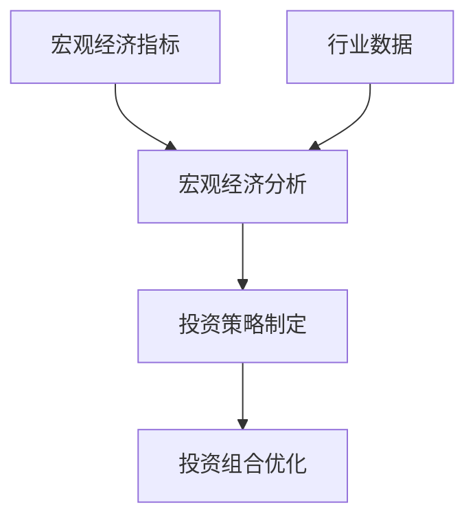

                 

# 《价值投资中的宏观经济考量：全局视野》

## 关键词：价值投资，宏观经济，经济周期，资产定价，投资策略

## 摘要：本文探讨了宏观经济因素如何影响价值投资，分析了经济周期、通货膨胀、利率等宏观经济指标对资产定价和投资决策的影响。通过构建宏观经济驱动的价值投资框架，结合实际案例，帮助投资者更好地理解宏观经济与投资之间的关系，制定更有效的投资策略。

---

## 第一部分：价值投资与宏观经济概述

### 第1章：价值投资与宏观经济概述

#### 1.1 价值投资的核心概念

##### 1.1.1 价值投资的定义与特点

价值投资是一种以基本面分析为基础的投资策略，强调购买那些市场价格低于其内在价值的资产。其核心理念是寻找市场先生的短期情绪波动带来的价格低估机会，通过长期持有优质资产来实现财富增值。

**特点：**
- 长期导向：关注长期价值，而非短期价格波动。
- 基本面分析：深入分析公司的财务状况、行业地位和竞争优势。
- 安全边际：购买价格低于内在价值，以降低风险。

##### 1.1.2 宏观经济对价值投资的影响

宏观经济环境是影响资产价格的重要因素。经济周期、通货膨胀、利率政策等宏观经济指标会直接影响市场的供需关系和资产的内在价值。例如，低利率环境可能推高债券和股票的价格，而高通货膨胀可能侵蚀资产的实际回报。

##### 1.1.3 价值投资与宏观经济的关系

价值投资与宏观经济密切相关。宏观经济状况决定了市场的整体表现和资产的相对价值。投资者需要结合宏观经济分析，判断经济周期所处的阶段，从而调整投资策略。例如，在衰退期，防御性行业可能表现更好；在扩张期，周期性行业可能更具投资价值。

---

#### 1.2 宏观经济的基本概念

##### 1.2.1 宏观经济的定义与范围

宏观经济研究整体经济系统，包括GDP、失业率、通货膨胀、货币政策等指标。这些指标反映了经济的健康状况和未来走势，对投资决策有重要影响。

##### 1.2.2 宏观经济指标的分类与作用

- **总量指标：** GDP、失业率、通胀率等，反映整体经济状况。
- **价格指标：** 消费者价格指数（CPI）、生产者价格指数（PPI），衡量通货膨胀。
- **货币政策指标：** 利率、货币供应量，影响市场流动性。

##### 1.2.3 宏观经济与投资决策的关系

宏观经济状况直接影响市场的资金供需和资产价格。例如，央行的降息政策会降低融资成本，刺激投资需求，推高资产价格。

---

## 第二部分：宏观经济分析与资产定价

### 第2章：宏观经济指标与投资决策

#### 2.1 主要宏观经济指标分析

##### 2.1.1 国内生产总值（GDP）

GDP是衡量经济规模和增长的重要指标。GDP增长表明经济活跃，可能推动股市上涨；反之，GDP萎缩可能引发市场下跌。

##### 2.1.2 通货膨胀与通货紧缩

通货膨胀会侵蚀固定收益资产的实际回报，可能导致央行加息，进而影响股市和债市。通货紧缩则可能引发企业盈利下降，拖累股价。

##### 2.1.3 利率与货币政策

利率是影响资产定价的关键因素。低利率环境下，债券收益率下降，资金可能转向股票等风险资产；高利率环境下，债券收益率上升，可能分流股市资金。

##### 2.1.4 外汇与国际经济环境

汇率波动影响出口型企业盈利能力和国际竞争力。例如，本币贬值可能提升出口企业竞争力，但可能增加进口成本。

---

#### 2.2 宏观经济指标对投资的影响

##### 2.2.1 经济周期与资产价格波动

经济周期分为衰退、复苏、扩张和衰退四个阶段。在衰退期，债券和黄金可能表现较好；在扩张期，股票和房地产可能表现较好。

##### 2.2.2 利率变动对股票和债券的影响

- 利率上升：债券价格下跌，股票估值可能受到压制。
- 利率下降：债券价格上涨，股票估值可能提升。

##### 2.2.3 通货膨胀对资产配置的影响

高通胀环境下，实际利率下降，可能导致债券价格下跌，股票可能表现较好，但需关注企业的盈利能力和抗通胀能力。

---

### 第3章：宏观经济环境与资产定价

#### 3.1 资产定价模型与宏观经济

##### 3.1.1 资本资产定价模型（CAPM）

CAPM模型用于估计资产的预期收益率，考虑了系统性风险和非系统性风险。宏观经济因素如GDP增长率、通胀率和利率等会影响系统性风险，从而影响资产的预期收益。

公式：
$$
E(R_i) = R_f + \beta_i (E(R_m) - R_f)
$$

其中，$R_f$是无风险利率，$\beta_i$是资产的贝塔系数，$E(R_m)$是市场预期收益率。

##### 3.1.2 风险溢价与宏观经济因素

风险溢价反映了投资者对承担风险的补偿。宏观经济因素如经济不确定性、通货膨胀和利率波动会影响风险溢价，从而影响资产定价。

##### 3.1.3 市场风险与宏观经济环境

市场风险是资产价格波动的系统性风险，宏观经济环境如经济衰退和金融危机会显著增加市场风险。

---

#### 3.2 宏观经济因素对资产价格的影响

##### 3.2.1 经济周期与资产价格波动

经济周期的不同阶段会影响资产价格。例如，在经济衰退期，股票和房地产价格可能下跌；在经济扩张期，这些资产价格可能上涨。

##### 3.2.2 政策变化对市场的影响

货币政策和财政政策的变化会影响市场流动性、企业盈利能力和资产估值。例如，央行的量化宽松政策可能推高资产价格。

##### 3.2.3 国际经济环境对国内资产的影响

全球经济一体化使得国内资产价格受国际经济环境影响。例如，国际贸易摩擦可能影响出口型企业业绩，进而影响股价。

---

## 第三部分：宏观经济驱动的价值投资框架

### 第4章：构建宏观经济驱动的价值投资框架

#### 4.1 宏观经济驱动的价值投资框架

##### 4.1.1 市场周期分析

分析经济周期所处阶段，判断市场整体走势。例如，在经济衰退期，寻找防御性行业；在经济扩张期，寻找周期性行业。

##### 4.1.2 行业选择策略

根据宏观经济环境选择具有竞争优势的行业。例如，在低利率环境下，金融行业可能表现较好；在高通胀环境下，能源行业可能表现较好。

---

## 第四部分：项目实战

### 第5章：基于宏观经济的行业分析与投资策略

#### 5.1 项目背景与目标

本项目旨在通过宏观经济分析，制定行业投资策略，帮助投资者在不同经济环境下优化资产配置。

#### 5.2 系统架构设计

##### 5.2.1 系统功能设计

- 数据采集：收集宏观经济指标和行业数据。
- 宏观经济分析：分析经济周期和行业趋势。
- 投资策略制定：根据分析结果制定投资策略。

##### 5.2.2 系统架构图

#### 5.3 实际案例分析

##### 5.3.1 案例背景

假设当前经济处于衰退期，通胀率低，利率下降。此时，债券价格可能下跌，股票可能因低利率环境而估值上升。

##### 5.3.2 分析过程

- 经济周期：衰退期，债券和黄金可能表现较好。
- 行业选择：防御性行业如公用事业和医疗保健可能表现较好。

##### 5.3.3 结果展示

通过分析，建议投资者在衰退期增加债券和防御性行业的配置。

---

## 第五部分：结论与展望

### 第6章：总结与展望

#### 6.1 总结

本文探讨了宏观经济因素对价值投资的影响，构建了宏观经济驱动的价值投资框架，并通过实际案例展示了其应用。宏观经济分析是价值投资的重要组成部分，帮助投资者在不同经济环境下制定更有效的投资策略。

#### 6.2 展望

未来研究可以进一步探讨更多宏观经济指标对投资的影响，结合人工智能和大数据技术，提高宏观经济分析的准确性和效率。

---

## 结语

价值投资中的宏观经济考量需要投资者具备全局视野，关注经济周期、通货膨胀、利率等宏观经济指标的变化，结合基本面分析，制定科学的投资策略。通过本文的分析，读者可以更好地理解宏观经济与投资之间的关系，提升投资决策的科学性和有效性。

---

## 最佳实践 Tips

- **宏观经济分析**：定期关注宏观经济指标，如GDP、通胀率和利率，了解经济周期所处阶段。
- **资产配置**：根据宏观经济环境调整资产配置，平衡风险和收益。
- **行业选择**：选择与经济周期和宏观经济指标相匹配的行业，寻找具有竞争优势的企业。
- **风险管理**：设定止损点，控制投资风险，避免过度集中投资。

---

## 参考文献

1. Graham, B. (1949). *The Intelligent Investor*.
2. Fama, E. F. (1970). *Efficient Capital Markets: A Review of Theory and Empirical Studies*.
3. Sharpe, W. F. (1964). *The CAPM: Theory and Evidence*.

---

通过以上结构和内容，本文系统地探讨了价值投资中的宏观经济考量，为投资者提供了理论支持和实践指导。希望读者能够结合宏观经济分析，制定更有效的投资策略，实现长期稳健的投资回报。

