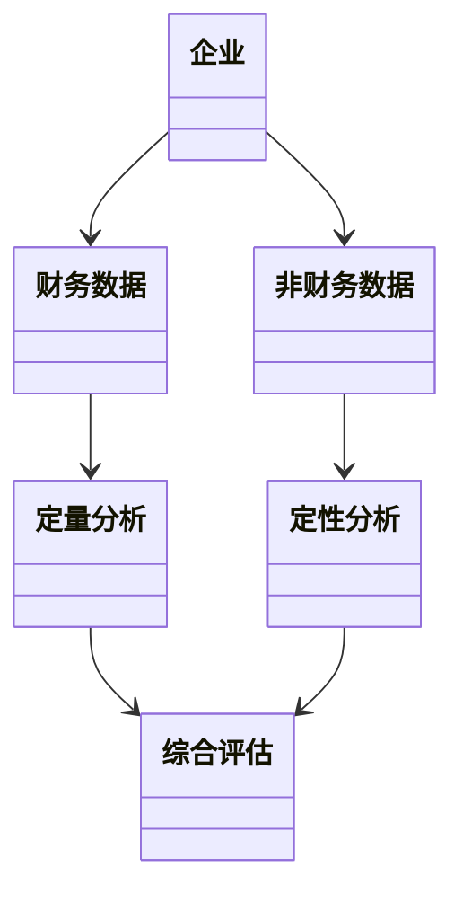
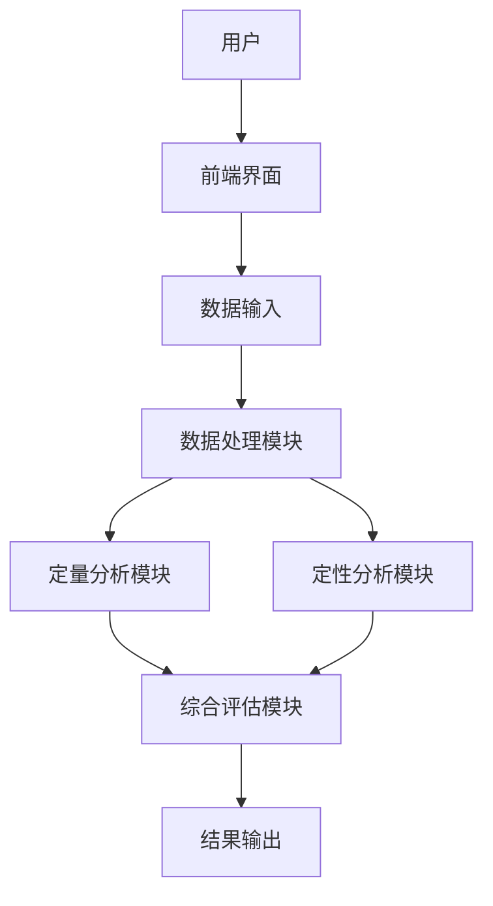
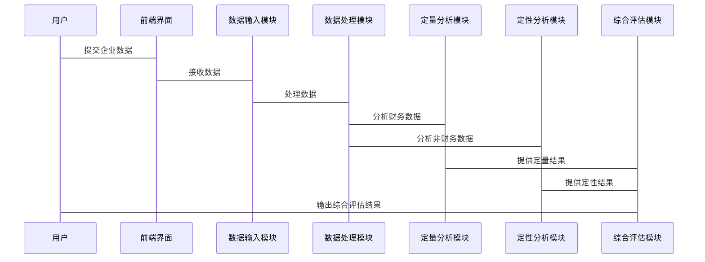

                 


# 价值投资中的定量vs定性分析：平衡的艺术

## 关键词：价值投资、定量分析、定性分析、投资决策、平衡艺术

## 摘要：  
价值投资是一种以基本面分析为核心的投资策略，旨在通过深入分析企业的内在价值来做出投资决策。在价值投资中，定量分析和定性分析是两种主要的分析方法，它们各有优缺点。定量分析通过数学模型和数据指标提供客观的评估，而定性分析则通过对企业基本面、行业环境和管理层等因素的深入研究，揭示企业的内在价值和潜在风险。本文将探讨如何在价值投资中平衡定量分析和定性分析，以实现更精准的投资决策。

---

## 第1章：价值投资的背景与核心概念

### 1.1 价值投资的定义与起源  
价值投资是一种以低于公平价值的价格买入优质股票的投资策略。它起源于20世纪初，由本杰明·格雷厄姆和戴维·多德提出，其核心理念是寻找市场低估的股票并长期持有。  

### 1.2 定量分析的定义与特点  
定量分析是一种基于数学模型和数据指标的投资分析方法。它通过统计分析、回归分析等工具，量化企业的财务状况、市场表现和行业趋势。  

### 1.3 定性分析的定义与特点  
定性分析是一种基于非量化因素的分析方法，关注企业的商业模式、竞争优势、管理层能力和行业环境等因素。它强调对企业的内在价值和长期发展潜力的理解。  

### 1.4 定量分析与定性分析的对比  

| **对比维度** | **定量分析** | **定性分析** |
|--------------|---------------|---------------|
| 分析方法     | 数学模型、数据指标 | 文本分析、行业研究 |
| 优缺点       | 客观、高效，但可能忽视企业内在逻辑 | 主观性较强，但能揭示企业核心竞争力 |
| 适用场景     | 短期趋势预测、量化筛选 | 长期投资决策、企业深度分析 |

---

## 第2章：定量分析的核心模型与工具

### 2.1 常见的定量分析模型  
定量分析模型主要包括以下几种：  
- **市盈率（P/E）模型**：用于评估股票的相对估值。  
- **市净率（P/B）模型**：用于评估股票相对于其账面价值的估值。  
- **股息率模型**：用于评估股票的分红能力。  
- **预测现金流模型**：用于评估企业的未来盈利能力。  

### 2.2 定量分析的数学基础  

#### 2.2.1 回归分析  
回归分析是一种统计方法，用于研究变量之间的关系。例如，可以通过回归分析预测企业的销售额与广告支出之间的关系。  

**数学公式**：  
$$ y = \beta_0 + \beta_1x + \epsilon $$  
其中，$y$ 是因变量，$x$ 是自变量，$\beta_0$ 和 $\beta_1$ 是回归系数，$\epsilon$ 是误差项。  

#### 2.2.2 时间序列分析  
时间序列分析用于研究数据随时间的变化趋势。例如，可以通过时间序列分析预测股票价格的未来走势。  

**数学公式**：  
$$ y_t = \alpha + \beta t + \gamma y_{t-1} + \epsilon_t $$  

#### 2.2.3 风险评估模型  
风险评估模型用于衡量投资组合的风险。常见的模型包括夏普比率和波动率。  

**夏普比率公式**：  
$$ \text{夏普比率} = \frac{E[r_p - r_f]}{\sigma_p} $$  
其中，$E[r_p - r_f]$ 是投资组合的超额收益期望值，$\sigma_p$ 是投资组合的波动率。  

### 2.3 定量分析的工具与平台  

- **Excel**：用于基本的财务数据分析和图表绘制。  
- **Python**：通过Pandas和NumPy库进行高级数据分析。  
- **R语言**：用于统计分析和数据可视化。  

---

## 第3章：定性分析的核心要素与方法

### 3.1 企业基本面分析  

#### 3.1.1 企业财务报表分析  
财务报表分析是定性分析的重要组成部分，主要包括资产负债表、利润表和现金流量表的分析。  

- **资产负债表**：用于评估企业的资产、负债和所有者权益。  
- **利润表**：用于评估企业的收入、成本和利润。  
- **现金流量表**：用于评估企业的现金流情况。  

#### 3.1.2 企业竞争优势分析  
竞争优势分析旨在识别企业在行业中的竞争优势，包括成本优势、技术优势和品牌优势等。  

#### 3.1.3 企业管理层分析  
管理层分析是定性分析的重要部分，重点关注管理层的背景、能力和决策风格。  

### 3.2 行业分析与宏观经济分析  

#### 3.2.1 行业生命周期分析  
行业生命周期分析用于评估行业所处的发展阶段，包括导入期、成长期、成熟期和衰退期。  

#### 3.2.2 宏观经济环境对投资的影响  
宏观经济环境包括GDP、通货膨胀率、利率等，这些因素都会影响企业的经营和投资决策。  

#### 3.2.3 政策环境对投资的影响  
政策环境包括税收政策、行业监管政策等，这些政策的变化会直接影响企业的经营和投资价值。  

---

## 第4章：定量分析与定性分析的结合

### 4.1 混合模型的构建  

#### 4.1.1 混合模型的定义  
混合模型是一种结合定量和定性分析的模型，旨在利用两种方法的优势，提高投资决策的准确性和全面性。  

#### 4.1.2 混合模型的实现步骤  

1. **数据收集**：收集企业的财务数据和非财务数据。  
2. **数据清洗**：对数据进行预处理，确保数据的准确性和完整性。  
3. **定量分析**：通过回归分析、时间序列分析等方法进行定量评估。  
4. **定性分析**：通过财务报表分析、竞争优势分析等方法进行定性评估。  
5. **综合评估**：将定量和定性分析的结果结合起来，得出最终的投资建议。  

### 4.2 案例分析  

#### 4.2.1 案例背景  
假设我们要评估一家科技公司的投资价值。  

#### 4.2.2 定量分析  
- 计算该公司的市盈率（P/E）：$$ P/E = \frac{\text{股价}}{\text{每股收益}} $$  
- 计算该公司的市净率（P/B）：$$ P/B = \frac{\text{股价}}{\text{每股净资产}} $$  

#### 4.2.3 定性分析  
- 分析公司的财务报表，评估其盈利能力、资产质量和偿债能力。  
- 分析公司的竞争优势，包括技术创新、市场占有率和品牌影响力。  
- 评估公司管理层的能力和决策风格。  

#### 4.2.4 综合评估  
结合定量和定性分析的结果，得出最终的投资建议。  

---

## 第5章：系统分析与架构设计

### 5.1 问题场景介绍  
为了实现定量和定性分析的结合，我们需要构建一个综合分析系统。  

### 5.2 项目介绍  
- **项目名称**：价值投资分析系统  
- **项目目标**：通过结合定量和定性分析，实现对企业的综合评估。  

### 5.3 系统功能设计  

#### 5.3.1 领域模型设计  



### 5.4 系统架构设计  



### 5.5 接口设计  

#### 5.5.1 定量分析模块接口  
- 输入：企业的财务数据  
- 输出：定量分析结果  

#### 5.5.2 定性分析模块接口  
- 输入：企业的非财务数据  
- 输出：定性分析结果  

#### 5.5.3 综合评估模块接口  
- 输入：定量分析结果和定性分析结果  
- 输出：综合评估结果  

### 5.6 交互流程图  



---

## 第6章：项目实战

### 6.1 环境安装  

#### 6.1.1 安装Python  
- 使用Anaconda安装Python 3.8及以上版本。  

#### 6.1.2 安装依赖库  
```bash
pip install pandas numpy matplotlib
```

### 6.2 系统核心实现源代码  

#### 6.2.1 数据处理模块  

```python
import pandas as pd

def process_data(data):
    data['净利润率'] = data['净利润'] / data['收入']
    data['ROE'] = data['净利润'] / data['所有者权益']
    return data
```

#### 6.2.2 定量分析模块  

```python
import numpy as np

def calculate_pe(data):
    pe = data['股价'] / data['每股收益']
    return pe
```

#### 6.2.3 定性分析模块  

```python
def analyze_management(management_report):
    score = 0
    if '优秀' in management_report:
        score += 2
    if '良好' in management_report:
        score += 1
    return score
```

### 6.3 代码应用解读与分析  
通过上述代码，我们可以实现对企业数据的处理、定量分析和定性分析。数据处理模块用于计算企业的财务指标，定量分析模块用于计算市盈率等指标，定性分析模块用于评估企业管理层的能力。  

### 6.4 案例分析  
以某科技公司为例，通过上述代码进行数据处理和分析，得出综合评估结果。  

### 6.5 项目小结  
通过本项目的实战，我们可以看到定量分析和定性分析的结合能够显著提高投资决策的准确性和全面性。  

---

## 第7章：总结与展望

### 7.1 小结  
在价值投资中，定量分析和定性分析各有优缺点。通过结合两者，我们可以实现对企业的全面评估，提高投资决策的准确性。  

### 7.2 最佳实践 tips  
- 在实际投资中，建议根据具体情况灵活调整定量和定性分析的比例。  
- 定期回顾和优化分析模型，以适应市场变化。  

### 7.3 注意事项  
- 定量分析的结果需要结合定性分析进行解读，避免单一依赖定量指标。  
- 定性分析需要依赖经验和行业知识，因此投资者需要不断提升自身的专业知识。  

### 7.4 拓展阅读  
- 格雷厄姆的《 Intelligent Investor》  
- 《Quantitative Equity Portfolio Management》  

---

通过本文的探讨，我们希望读者能够更好地理解定量分析和定性分析的结合，并在实际投资中灵活运用这两种方法，实现更精准的投资决策。

