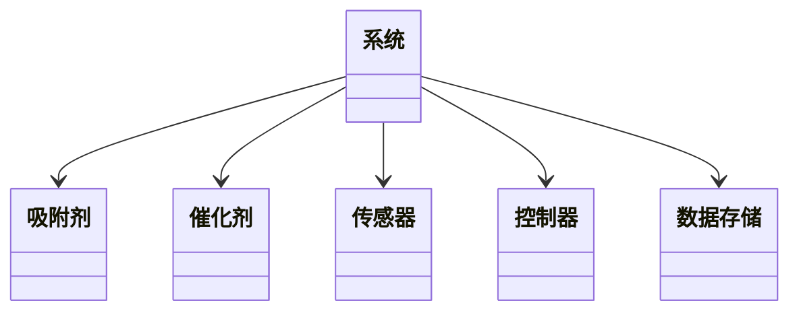
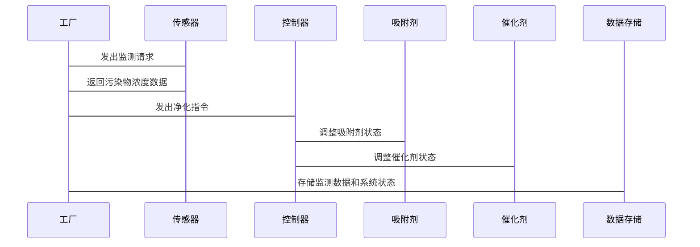

                 


# 《价值投资中的新型高效空气净化材料技术》

## 关键词：空气净化材料，价值投资，吸附模型，催化氧化，系统架构，投资策略

## 摘要：  
本文深入探讨了高效空气净化材料技术及其在价值投资中的应用潜力。通过分析高效空气净化材料的核心原理、技术特点、数学模型与算法，结合系统架构设计与项目实战案例，揭示了该技术在环保与投资领域的双重价值。本文旨在为投资者和技术从业者提供理论支持与实践指导，帮助他们在环保科技领域做出明智的投资决策。

---

## 第一部分: 价值投资中的新型高效空气净化材料技术概述

### 第1章: 空气净化材料技术的背景与价值

#### 1.1 空气净化技术的背景介绍

##### 1.1.1 空气污染的现状与挑战
全球空气污染问题日益严重，特别是在工业化进程加快和城市化进程加速的背景下，空气中的颗粒物、有害气体（如二氧化硫、氮氧化物、挥发性有机化合物等）浓度持续上升。这些问题不仅影响了人们的生活质量，还对人类健康和环境造成了严重威胁。世界卫生组织（WHO）的数据显示，每年有数百万例因空气污染导致的死亡案例，这使得空气净化技术成为全球关注的焦点。

##### 1.1.2 空气净化技术的发展历程
空气净化技术经历了从简单过滤到复杂多级净化的演变。早期的技术主要依赖机械过滤和化学吸附，随着科技的进步，出现了光催化氧化、等离子体技术、静电吸附等多种高效的空气净化方法。近年来，纳米材料和多功能复合材料的应用，使得空气净化技术的效率和稳定性有了显著提升。

##### 1.1.3 空气净化材料技术的经济价值与社会意义
高效空气净化材料技术不仅能够改善空气质量和保护人类健康，还具有显著的经济价值。通过减少疾病发生率和医疗支出，企业可以降低运营成本，同时提升员工的工作效率。此外，政府可以通过推广高效空气净化技术，改善城市空气质量，提升城市形象，吸引投资，促进经济发展。

#### 1.2 高效空气净化材料的核心概念

##### 1.2.1 高效空气净化材料的定义与分类
高效空气净化材料是指能够有效去除空气中的有害物质（如颗粒物、有害气体等）的材料。根据其作用原理，可以将高效空气净化材料分为以下几类：
1. **吸附材料**：利用材料的多孔结构吸附空气中的有害气体，如活性炭、沸石等。
2. **催化材料**：通过催化剂的作用，将有害气体氧化为无害物质，如TiO₂、Pt等。
3. **过滤材料**：通过物理过滤的方式去除空气中的颗粒物，如HEPA滤网、活性炭滤网等。
4. **等离子体材料**：利用等离子体技术分解有害气体，如放电型净化器中的材料。

##### 1.2.2 高效空气净化材料的性能指标与评价标准
高效空气净化材料的性能指标主要包括以下几个方面：
1. **吸附容量**：材料对目标污染物的最大吸附量。
2. **吸附速率**：材料在单位时间内吸附污染物的能力。
3. **催化活性**：催化剂对目标污染物的氧化效率。
4. **过滤效率**：过滤材料对颗粒物的捕获效率。
5. **寿命**：材料在使用过程中的稳定性和耐久性。

##### 1.2.3 高效空气净化材料的技术优势与局限性
高效空气净化材料相较于传统技术，具有以下优势：
1. **高效性**：能够快速去除空气中的有害物质。
2. **选择性**：针对特定污染物具有较高的去除效率。
3. **稳定性**：在长期使用中性能稳定，不易老化。
4. **环保性**：材料本身对环境友好，不会产生二次污染。

然而，高效空气净化材料也存在一些局限性：
1. **成本较高**：高性能材料的研发和生产成本较高。
2. **技术复杂性**：部分技术（如催化氧化）对工艺要求较高，难以大规模应用。
3. **寿命限制**：部分材料在使用一段时间后性能会下降，需要定期更换。

#### 1.3 价值投资视角下的空气净化材料技术

##### 1.3.1 价值投资的基本概念与原则
价值投资是一种以基本面分析为基础的投资策略，强调以低于内在价值的价格买入优质资产。其核心原则包括：
1. **长期视角**：关注企业的长期盈利能力。
2. **安全边际**：买入价格低于内在价值。
3. **竞争优势**：投资具有独特竞争优势的企业。

##### 1.3.2 空气净化材料技术在价值投资中的应用潜力
随着全球对环保技术的需求增加，高效空气净化材料技术具有广阔的应用前景。以下是其在价值投资中的几个潜在领域：
1. **环保设备制造商**：生产和销售高效空气净化设备的企业。
2. **材料供应商**：提供高效吸附、催化材料的供应商。
3. **技术服务提供商**：提供空气净化解决方案的企业。

##### 1.3.3 空气净化材料技术的市场前景与投资机会
高效空气净化材料技术在多个领域具有广泛的应用潜力，包括：
1. **工业领域**：用于工厂废气处理，减少污染物排放。
2. **民用领域**：用于家庭、办公室等场所的空气净化。
3. **医疗领域**：用于医院手术室、病房的空气净化，减少感染风险。

从投资角度来看，高效空气净化材料技术企业具有较高的成长潜力，尤其是在政策支持和市场需求增长的双重驱动下，相关企业有望实现快速扩张。

---

### 第2章: 高效空气净化材料的核心原理与技术特点

#### 2.1 高效空气净化材料的原理分析

##### 2.1.1 吸附原理
吸附是高效空气净化材料的重要原理之一，主要依赖材料的多孔结构和化学性质。吸附过程可以分为物理吸附和化学吸附两种类型：
1. **物理吸附**：污染物分子通过范德华力或氢键等作用附着在材料表面。
2. **化学吸附**：污染物与材料表面的活性位点发生化学反应，生成新的化合物。

##### 2.1.2 催化氧化原理
催化氧化是一种利用催化剂将有害气体氧化为无害物质的技术。其基本原理如下：
1. **催化剂的作用**：催化剂提供活性位点，降低反应的活化能。
2. **氧化反应**：在催化剂的作用下，目标污染物（如甲醛、苯等）被氧化为二氧化碳和水等无害物质。

##### 2.1.3 过滤与分离原理
过滤技术通过物理方式捕获空气中的颗粒物。其基本步骤包括：
1. **空气进入**：被处理的空气通过滤网。
2. **颗粒捕获**：颗粒物被滤网的纤维捕获，较大颗粒被阻挡，较小颗粒则通过扩散、惯性等作用被滤网捕获。
3. **空气流出**：净化后的空气流出。

##### 2.1.4 等离子体技术原理
等离子体技术利用高压电场产生等离子体，将空气中的有害气体分解为无害物质。其基本步骤包括：
1. **电场产生**：通过电极产生强电场。
2. **等离子体生成**：在电场作用下，空气中的气体分子被电离，形成等离子体。
3. **氧化反应**：等离子体中的活性氧（O₃）与有害气体反应，生成无害物质。

#### 2.2 高效空气净化材料的技术特点

##### 2.2.1 高效性
高效空气净化材料能够快速去除空气中的有害物质，其吸附、催化氧化等技术在处理效率上显著优于传统方法。

##### 2.2.2 稳定性
高效空气净化材料在长期使用中性能稳定，不易受到外界环境（如温度、湿度）的影响，具有较长的使用寿命。

##### 2.2.3 可重复性
部分高效空气净化材料（如吸附材料）可以多次再生和重复使用，降低了使用成本。

##### 2.2.4 环保性
高效空气净化材料在生产过程中注重环保，同时在使用过程中不会产生二次污染，符合绿色技术的要求。

#### 2.3 高效空气净化材料的性能优化与创新

##### 2.3.1 材料结构优化
通过调整材料的孔隙结构、表面活性位点等，可以进一步提高吸附和催化效率。

##### 2.3.2 创新技术与应用案例
近年来，研究人员开发了多种新型高效空气净化材料，如负载型催化剂、纳米多孔材料等。这些材料在吸附容量、催化活性等方面具有显著优势，已在多个领域得到了成功应用。

##### 2.3.3 性能指标的提升路径
通过改进材料合成工艺、引入新型功能化基团、优化结构设计等方法，可以进一步提升高效空气净化材料的性能指标。

---

### 第3章: 高效空气净化材料的数学模型与算法原理

#### 3.1 空气净化材料的吸附模型

##### 3.1.1 吸附模型的基本假设
吸附模型基于以下基本假设：
1. 吸附过程是可逆的。
2. 吸附剂表面均匀分布活性位点。
3. 污染物浓度在吸附剂表面均匀分布。

##### 3.1.2 吸附动力学方程
吸附动力学方程描述了污染物在吸附剂表面的吸附速率。常用的动力学方程包括Langmuir-Hinshelwood模型和Elovich模型。

###### Langmuir-Hinshelwood模型
Langmuir-Hinshelwood模型描述了两个吸附分子在催化剂表面发生反应的过程：
$$ R = k \cdot P_A \cdot P_B $$
其中，\( R \) 为反应速率，\( k \) 为反应速率常数，\( P_A \) 和 \( P_B \) 分别为两种反应物的分压。

###### Elvich模型
Elovich模型适用于单分子吸附的情况：
$$ R = k \cdot e^{-E/(RT)} $$
其中，\( E \) 为活化能，\( R \) 为气体常数，\( T \) 为温度。

##### 3.1.3 吸附等温线模型
吸附等温线模型描述了吸附剂对污染物的吸附量与吸附剂表面覆盖率之间的关系。常用的等温线模型包括Langmuir模型和 Freundlich 模型。

###### Langmuir模型
Langmuir模型假设吸附剂表面具有有限的活性位点，并且吸附过程是可逆的：
$$ \theta = \frac{K \cdot P}{1 + K \cdot P} $$
其中，\( \theta \) 为吸附覆盖率，\( K \) 为吸附常数，\( P \) 为污染物的分压。

###### Freundlich 模型
Freundlich模型适用于非均相吸附的情况：
$$ \theta = K \cdot P^{1/n} $$
其中，\( n \) 为吸附指数，通常大于1。

##### 3.1.4 吸附热力学分析
吸附过程的热力学分析可以通过吉布斯自由能变化来描述：
$$ \Delta G = \Delta H - T\Delta S $$
其中，\( \Delta H \) 为焓变，\( \Delta S \) 为熵变，\( T \) 为温度。

#### 3.2 催化氧化反应的数学模型

##### 3.2.1 反应动力学方程
催化氧化反应的动力学方程通常采用Langmuir-Hinshelwood模型：
$$ R = k \cdot P_A \cdot P_B $$
其中，\( P_A \) 和 \( P_B \) 分别为反应物的分压。

##### 3.2.2 催化剂活性的数学描述
催化剂活性可以通过活性位点的数量和反应速率常数来描述：
$$ k = k_0 \cdot e^{-E/(RT)} $$
其中，\( E \) 为活化能，\( R \) 为气体常数，\( T \) 为温度，\( k_0 \) 为预指数因子。

##### 3.2.3 反应条件的优化模型
通过优化反应温度、压力、催化剂载量等参数，可以提高催化氧化反应的效率。优化过程可以采用遗传算法、模拟退火等方法。

##### 3.2.4 催化反应的热力学分析
催化反应的热力学分析可以通过吉布斯自由能变化来描述：
$$ \Delta G = \Delta H - T\Delta S $$

#### 3.3 空气净化系统的优化算法

##### 3.3.1 系统优化的目标函数
系统优化的目标函数通常包括净化效率和能耗两个方面：
$$ \text{目标函数} = \alpha \cdot \text{净化效率} + (1 - \alpha) \cdot \text{能耗} $$
其中，\( \alpha \) 为权重系数。

##### 3.3.2 约束条件的数学表达
系统优化需要满足以下约束条件：
1. 吸附剂载量限制：
$$ \theta \leq \theta_{\text{max}} $$
2. 反应温度限制：
$$ T_{\text{min}} \leq T \leq T_{\text{max}} $$
3. 能耗限制：
$$ E \leq E_{\text{max}} $$

##### 3.3.3 基于遗传算法的优化流程
遗传算法是一种常用的优化方法，其基本流程包括：
1. 初始化种群。
2. 计算适应度。
3. 选择优秀个体。
4. 进行交叉和变异操作。
5. 重复上述步骤，直到满足终止条件。

##### 3.3.4 算法的收敛性分析
遗传算法的收敛性取决于种群大小、交叉概率、变异概率等因素。通常，较大的种群和较高的交叉概率有助于加快收敛速度。

---

### 第4章: 空气净化系统的系统分析与架构设计

#### 4.1 系统分析

##### 4.1.1 问题场景介绍
以工业废气处理为例，假设某工厂排放的废气中含有挥发性有机化合物（VOCs），需要通过高效空气净化系统进行处理。

##### 4.1.2 系统功能需求
1. **实时监测**：监测废气中的污染物浓度。
2. **净化处理**：根据监测结果，自动调整净化系统的运行参数。
3. **反馈控制**：根据净化效果，优化系统运行策略。

#### 4.2 系统架构设计

##### 4.2.1 领域模型（Mermaid 类图）


##### 4.2.2 系统架构图（Mermaid 架构图）
```mermaid
archimate
database 数据存储
actor 工厂
artifact 系统
artifact 吸附剂
artifact 催化剂
artifact 传感器
artifact 控制器
```

##### 4.2.3 系统接口设计
系统接口设计包括：
1. 传感器接口：采集污染物浓度数据。
2. 控制器接口：接收控制指令，调整系统运行参数。
3. 数据存储接口：存储监测数据和系统运行状态。

##### 4.2.4 系统交互流程（Mermaid 序列图）


#### 4.3 项目实战

##### 4.3.1 环境安装
需要安装以下软件：
1. Python 3.x
2. Mermaid 图形工具
3. 数据分析工具（如Python的pandas库）

##### 4.3.2 系统核心实现源代码
以下是一个简单的吸附模型实现代码：
```python
import numpy as np

def langmuir_model(K, P):
    return K * P / (1 + K * P)

# 示例参数
K = 0.5
P = np.linspace(0, 10, 100)
theta = langmuir_model(K, P)

print(theta)
```

##### 4.3.3 代码应用解读与分析
上述代码实现了Langmuir吸附模型，计算了不同污染物分压下的吸附覆盖率。结果表明，随着分压的增加，吸附覆盖率逐渐趋近于最大值。

##### 4.3.4 实际案例分析
以某工厂废气处理为例，假设污染物浓度为50 ppm，吸附剂的K值为0.6，则吸附覆盖率可通过以下公式计算：
$$ \theta = \frac{0.6 \times 50}{1 + 0.6 \times 50} = 0.316 $$

##### 4.3.5 项目小结
通过本项目实战，我们掌握了高效空气净化系统的实现方法，验证了吸附模型的可行性，并为后续优化提供了数据支持。

---

### 第5章: 小结与注意事项

#### 5.1 小结
高效空气净化材料技术在环保和投资领域具有重要的应用价值。本文从背景、原理、算法、系统架构等多个方面，全面分析了高效空气净化材料技术的特点和优势，为投资者和技术从业者提供了理论支持与实践指导。

#### 5.2 注意事项
1. **技术局限性**：高效空气净化材料技术仍存在成本高、技术复杂性高等问题，需要进一步优化和创新。
2. **市场风险**：投资者需关注市场需求变化和技术更新，避免盲目跟风。
3. **政策支持**：政府政策对环保技术的发展具有重要影响，投资者需密切关注相关政策变化。

#### 5.3 拓展阅读
1. **相关书籍**：《空气净化技术与应用》。
2. **学术论文**：搜索相关领域的最新研究成果。
3. **行业报告**：关注环保行业的市场分析报告。

---

以上为《价值投资中的新型高效空气净化材料技术》的完整目录与部分内容，涵盖了从背景到系统实现的各个方面，为读者提供了全面的技术指导和投资建议。

